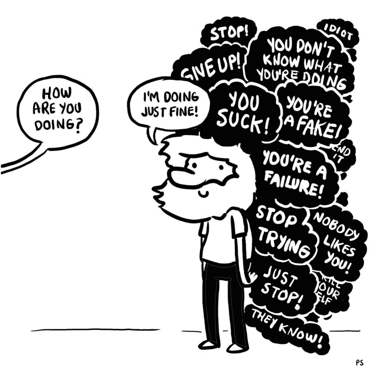
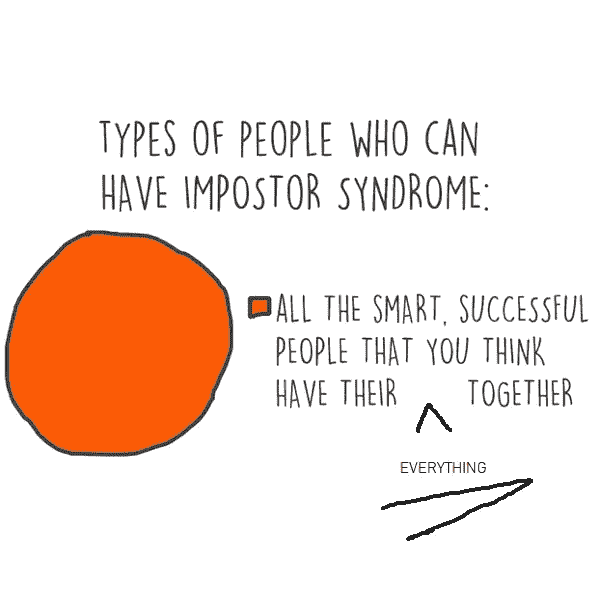

# 以下是冒名顶替综合症如何终结你作为数据科学家的职业生涯

> 原文：<https://medium.datadriveninvestor.com/heres-how-imposter-syndrome-can-end-your-career-as-a-data-scientist-75e240f26238?source=collection_archive---------7----------------------->

## 以下是克服它的方法。

[Source: Pablo Stanley](https://twitter.com/pablostanley/status/1052652598254129153)

冒名顶替并不局限于特定的职业道路，也不局限于特定的经验水平。冒名顶替综合征不知道性别，年龄，或起源。它所知道的就是阻碍你到达你应得的地方，破坏你应得的成长。在数据科学这样一个广泛的多学科领域，怀疑自己的技能和能力可能会在所有这些“完美数据科学家的理想技能”的广泛列表中找到自己的内心

这些持续的内在的自我破坏行为在短期和长期都在破坏你的职业生涯，这是多么的危险:

# 阻止你学习。

根据你是哪种类型的冒名顶替者，有害的内部言论会不断削弱你的自我形象。它阻止你继续前进。如果你会失败，为什么还要学习新技能呢？不，不要寻求帮助，你会看起来“不那么博学”！或者，你的作品永远不够好。不管你的情况是什么，重复它会导致你更加不相信自己，最终停止你的学习曲线。

> “我需要学习 Scala、Java、Python、R、C++、…”

不要失去你的焦点；所有这些都只是工具。知道所有这些可能很棒，但掌握其中一个并有效地使用它最终会让你有更好的结果。

> 好了，现在我选了 X！我如何确定我的掌握水平是否“足够好”

什么是“足够好”？是你的速度，有据可查的干净代码，还是有效的产品？不管是什么，记录你的过程。即使你随机编写的小代码也应该被记录下来。所有这些都会显示你的进步，并最终指出你的优势和劣势。数据科学也可以应用到你的生活中！

> 我有 Y 年的经验，我应该知道这些！！

你这几年的经历太棒了。但是地球上没有一个人是无所不知的。拥有它，不要假装自己是**一切**的专家。什么都不知道，意味着总有改进和提高技能的空间。这不是很好吗？

# 分享你的作品！

“不要这样做！外面有那么多专家。你的手艺就是不够好”。对判断的恐惧以及别人会如何评价你和你的工作可能会成为一股**强大的**力量将你引向 ***你不想成为*** *的地方。*反馈对改进至关重要，应仔细整合到您的工作中。

> 没人喜欢怎么办？

他们可能不喜欢，但他们会给你原因。这些是你通向更好版本的大门。如果你仔细研究这么多成功人士以前的工作，你会发现这并没有什么神奇之处。他们成功是因为他们没有放弃他们的成功；他们不断尝试，最终得到了回报。

现在，让我问你。如果他们喜欢呢？只有一个办法知道，分享你的作品。继续前进。

不要用几个赞和分享来衡量自己作品的好坏。仔细选择你的度量标准。指标不仅仅适用于你的模型。

# 不要交际。

对于一个冒名顶替者来说，寻求帮助或只是处理一个关于专业领域特定话题的讨论可能会令人害怕。因此，这阻止了他接触他的同龄人和导师。事实证明，人际关系对任何类型的职业道路都至关重要，就像任何其他技能一样，它需要实践。

好的想法如果不被分享就不会有力量。

而且，如果保守秘密，你认为是“坏”的想法也不会得到改善。

> 那么，如何才能做到呢？

小迭代。尝试与第一个人交往，建立良好的关系。这会增强你的信心。然后，试着去接触另一个人。一个又一个。

事实是每个人都可能是骗子，但程度因人而异。要克服它，你需要意识到它，并且知道有这种感觉是正常的。

**上述情况对某些人来说可能很平常，对其他人来说可能很极端。展示它们是为了告诉人们，有这样的感觉是正常的，也是为了安慰那些害怕在这个领域采取进一步行动的数据科学家们。