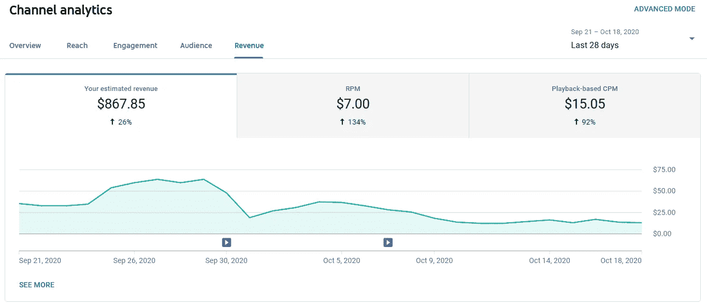
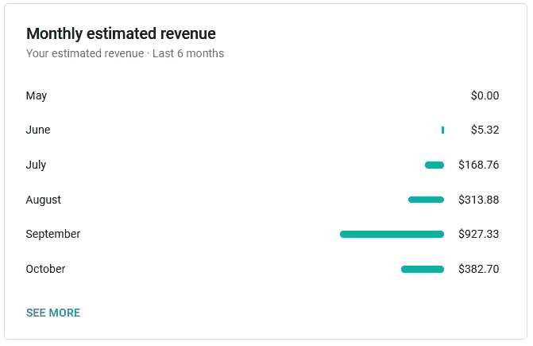

# 这是 7，000 名 YouTube 用户每月给你带来的收入

> 原文：<https://medium.datadriveninvestor.com/heres-how-much-7-000-youtube-subscribers-makes-me-every-month-472599ac2750?source=collection_archive---------2----------------------->

## 这是我最常被问到的问题，以下是答案。

Adam J Bell on YouTube

**在**这个点 **t** 我可能已经在 YouTube 上看了超过 50 个不同的“*我挣多少钱*主题视频。第一，因为知道你最喜欢的创作者赚了多少钱很有趣，第二，这让你问自己是否有能力做同样的事情。我想我也不是唯一对这个话题感兴趣的人。这种优步生活是很多人梦寐以求的，或者至少看一两次。谁不想在成为自己的老板、对产品有创造力、获得社交媒体关注等等的同时赚很多钱呢？

随着我的频道刚刚超过 7000 名订户和 60 万次观看，我已经开始从中赚了不少钱。这让我开始思考，为了让我能够舒适地辞掉工作，我的渠道实际上应该有多大。所以我算了一下，在这篇文章中，我将分享我目前通过 YouTube 广告赚了多少钱，以及我要做得更好才能让这成为我的全职工作！

## 是什么决定了我的收入？

谈到在 YouTube 上赚钱，首先要提到的一件事是，每个频道都会赚到**不同**的钱。影响一个创作者收入的主要因素是他们获得了多少浏览量，然而还有其他几个重要因素。其中一些可能是一个频道在一个有 100k 浏览量的视频上赚*5000 美元，而另一个频道在一个有相同浏览量的视频*上只赚*500 美元的原因。不去深究为什么会这样，*简而言之*就是这样；公司付钱给 YouTube 在创作者的视频上显示广告。他们还将决定他们愿意花多少钱在上述视频上推广他们的产品或服务。从统计学上来说，财经频道的观众比观看游戏视频的观众拥有更多的钱。因此，公司愿意花更多的钱在更有钱的人面前做广告是有道理的，因为他们更有可能花钱。这就是为什么金融或商业领域的创造者往往比其他领域的人赚得更多。*

我每周都会收到一些评论，询问 T21 在 YouTube 上的收入情况。有趣的是，我在现实生活中被问及这个问题的次数甚至更多。因为认识一个“*YouTube*”或在 YouTube 上赚钱的人并不常见。为什么这么多人问这个问题是有道理的。因为我是一个喜欢谈论金钱和金融的人，所以我会毫不犹豫地分享我的数字！这正是我们现在要讨论的。

## 我现在到底挣了多少钱

既然我们已经知道了决定创造者收入的因素，让我们来看看我每个月的收入。正如你在下面的截图中看到的，在过去的**28 天**里，我的渠道已经产生了**867.85 美元。**

My Last 28 Days of Earnings

## 我的月收入

因为我在 7 个月前左右才在**开始这个 YouTube 频道，这些结果确实让我喜笑颜开，尽管它甚至不够支付我的房租。在下面的下一张截图中，你会看到我过去 6 个月的“ *YouTube Money* ”的样子。正如我们在 5 月份看到的，我在 YouTube 上实际上还没有赚钱，所以我没有赚到钱。在六月，除了我实现了货币化并赚了一大笔钱之外，并没有太大的不同。这张截屏是在十月中旬拍摄的，这是我的第一个千美元月， **$1013.35** 。**

Screenshot taken on October 17th

## 我一生的收入

有些人可能想知道这个频道在过去的 7 个月里给了我多少，以及我投入了多少时间。下面是我一生的收入:2230.11 美元。

My Channel’s Lifetime Earnings

在几个月前赚了 **$0** 之后，我再次高兴地看到这个数字，但这也解释了为什么大多数人建议**而不是**仅仅为了钱去创办 YouTube。毫无疑问，我工作的时间比我得到的回报要多。如果我算一下，我很可能从这个频道及其视频中每小时赚 3 美元。但随着时间的推移，我会继续从以前创作的视频中赚钱，我每小时 3 美元的收入会变得更大！

我在过去的 7 个月里一直在创作视频，直到最近我才能够赚到一些像样的钱。这真的是一件你必须投入工作而不被许诺结果的事情。但是让人们继续前进的是它所具有的整体潜力。谁知道从现在起的 6 个月内我会赚多少钱…事实上你们可能会，因为我很可能会再写一篇文章！

## 我需要做得多好才能让这成为我的全职工作？

最近我的视频被观看了大约 13 万次，月收入 1000 美元，我需要翻 4 倍才能获得可观的收入(每年 4.8 万)。这意味着，如果我每月能产生 52 万次浏览，我每月能赚 4000 美元左右。

如前所述，不同的渠道赚取不同的钱，但你现在应该知道有 7000 名订户的渠道一般每月赚多少钱。你也会知道一个频道要有多大/需要多少浏览量才能让创作者有一份体面的/全职的收入。

我最后要说的是，YouTubers 越大，他们的收入就越多样化。大多数时候，YouTuber 的广告收入只是他们总收入的一小部分(20%左右)。对于像我这样的小创作者来说，广告将是我们第一次的主要收入来源。

YouTube 可能是一个艰难的游戏，但它肯定有可能赢得大奖！