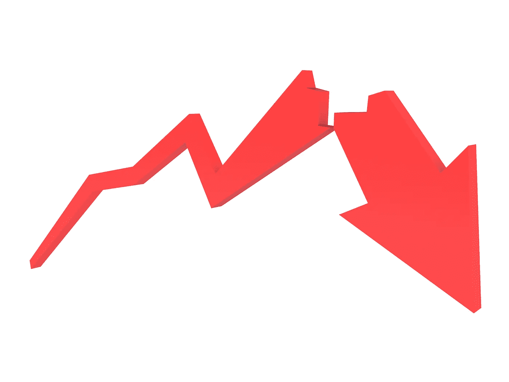

# 这是市场崩溃的真正危险…

> 原文：<https://medium.datadriveninvestor.com/heres-the-real-danger-of-the-market-crash-f95ff6ec5fcc?source=collection_archive---------27----------------------->

奇怪的是，每 10 年都会发生同样的事情——然而，人们仍然没有做好准备。

## 我们知道经济衰退即将来临

现在令人惊讶的是**而不是**我们已经开始进入衰退。每个人都知道它要来了。

这就是为什么沃伦·巴菲特决定在 2019 年将 1280 亿美元的现金返还给伯克希尔·哈撒韦公司。像他这样的专家知道市场的上涨将会结束。

## 没人预料到滞胀

然而*令人惊讶的是，我们已经进入了一个滞胀的时代。*

人们有钱消费——但他们没有。

因此，唐纳德·特朗普(Donald Trump)给大公司大幅减税的策略不会有所帮助。

但可悲的是，特朗普似乎并不知道这一点。相反，他似乎对分发钱更感兴趣。

但是钱不是问题。而是人们害怕冠状病毒。

## 令人悲伤的事实

对此没有任何快速解决办法。上一次这样的事情发生还是在吉米·卡特时代。他帮助提振经济的唯一方法是引发衰退，迫使价格回落，这样人们就会再次开始消费。

冠状病毒让很多人害怕。缓解人们恐惧的最快方法是让制药公司尝试击败病毒。

 [## 算法交易的机器学习|数据驱动的投资者

### 当你的一个朋友在脸书上传你的新海滩照，平台建议给你的脸加上标签，这是…

www.datadriveninvestor.com](https://www.datadriveninvestor.com/2019/01/30/machine-learning-for-stock-market-investing/) 

不管怎样，如果你有闲钱，并希望在未来几年获得丰厚回报，现在是投资的好时机。

顺便说一下，这并不是真正的财务建议。只是一种看法。