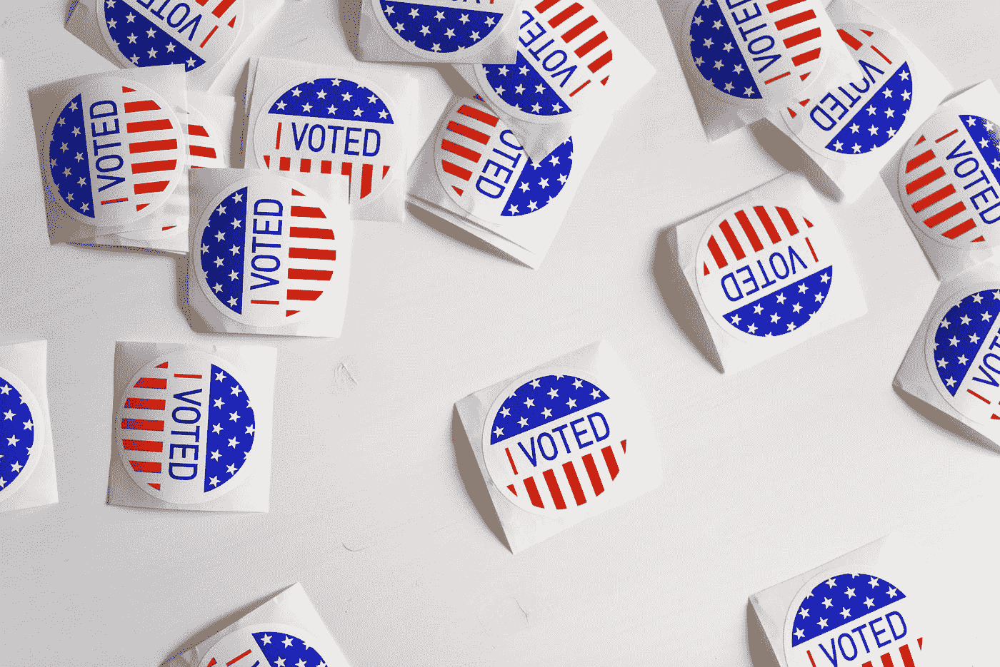

# 以下是你应该在 2020 年投票给民主党的真正原因

> 原文：<https://medium.datadriveninvestor.com/heres-the-real-reason-why-you-should-vote-democrat-in-2020-f28218aef944?source=collection_archive---------2----------------------->

## 不仅仅是特朗普

Photo by [Element5 Digital](https://unsplash.com/@element5digital?utm_source=medium&utm_medium=referral) on [Unsplash](https://unsplash.com?utm_source=medium&utm_medium=referral)

2020 年的选举肯定会是历史上最接近和最关键的选举之一。

首先，我们的国家比以往任何时候都更加分裂。两党制给我们带来的动荡比我们预想的要多。

我们在制衡中挣扎。尽管他以共和党人的身份参选，但我们的总统甚至没有获得党内大多数人的支持，他的保守主义超越了任何两党界限。另一方面，我们的立法部门也一分为二——众议院是民主党占多数，而参议院倾向于共和党。

但是这里有一个我们没有想到的:最高法院。

 [## 全民或跨州的国营保险私人医疗保险:经济学…

### 我们目前生活在一个所有非医疗行业都痴迷于…

www.datadriveninvestor.com](https://www.datadriveninvestor.com/2020/05/21/state-run-insurance-for-all-or-across-the-state-lines-private-healthcare-coverage-economics-politics-social-mix-up/) 

# 最高法院正是我们应该在 11 月投票给民主党的原因。

因为事情是这样的:最高法院已经倾向于保守。唐纳德·特朗普(Donald Trump)已经在总统任期内利用了在最高法院再任命两名保守派法官的能力，这意味着最高法院危险地倾向于保守派。一般来说，最高法院有九名大法官的整个想法是至少有一张摇摆票，以平衡对法律的评估和解释。

然而，还有一个难题:正如你们许多人可能知道的那样，鲁斯·巴德·金斯伯格大法官目前已经 87 岁了。自 1993 年以来，她一直是最高法院的民主党成员。如果我们失去她，我们就失去了最高法院的任何平衡，因为唐纳德·特朗普将不可避免地任命另一位保守派。事实上，他已经起草了一份可能被任命的名单，其中一人是特德·克鲁兹(前 2016 年总统候选人)。克鲁兹此前曾公开反对堕胎和女性医疗保健，并指出即使在强奸或乱伦的情况下，女性也应该被迫怀孕。

那么，为什么这意味着我们需要投票给民主党呢？

嗯，金斯伯格，尤其是她与癌症频繁而艰难的斗争，正变得令人恐惧地接近退休(对她来说，本质上就是死亡——我敢说)。只要她身体允许，她就完全致力于服务，所以除了死亡之外，她不太可能会从法院辞职。然而，我们如履薄冰。即使在 2016 年，我们也怀疑金斯伯格能否度过特朗普的四年总统任期。现在，她几乎不可能撑过接下来的四年，所以我们来到这里:

# 投票给拜登将使我们能够恢复斯科茨的一些平衡，从而恢复政府其他部门的平衡。

即使我们对投票给拜登不感到兴奋，也许我们也不会认为这是我们热情地投票给他。也许我们把它看作是我们热情地投票保留金斯堡。并在她最终不得不离职时任命一位全面、平衡、民主的法官。

基本上，给拜登投票不仅仅是给民主党投票。这也是对谁将取代金斯伯格的投票。

那么，我们为什么要关心谁取代金斯伯格呢？

嗯，首先，正如我前面提到的，有一个倾向保守的法院确实会影响我们政府的平衡。如果没有至少一张决定性的投票，我们很难公平地评估法律并对其进行整体评价。如果法院倾向于这样或那样的方式，我们注定多数人总是赢，在这种情况下，这不是我们想要的结果。

此外，我国政府最重要的原则之一是政教分离。由于法院倾向于保守，我们变得非常接近违反这一原则。例如，在诸如 LGBTQ 人群是否有权结婚等激烈辩论的话题中，保守主义者经常将宗教作为反对这种权利的理由。堕胎和获得避孕药具和/或全面的性教育的权利也是如此。归根结底，除了《圣经》有争议地禁止结婚这一事实之外，LGBTQ 人群没有任何理由不应该有结婚的权利。然而，考虑到教会和国家的分离，我们使用圣经作为法律辩护的任何形式都是不道德的。

从更广泛的角度来看，人民的权利普遍受到威胁。当妇女受到堕胎禁令的威胁时，她们的权利就岌岌可危，尤其是那些没有对强奸或乱伦做出例外的堕胎禁令。当性行为活跃的人被拒绝获得足够的或负担得起的避孕药具时，他们的权利就受到威胁。当在美国学校提供全面的预防性教育被认为是违宪时，年轻人的权利和未来就岌岌可危了。当国家试图取消 LGBTQ 人群的结婚权，或者坚持企业和公司有权歧视他们的性取向或性别时，他们的权利就岌岌可危。当 BIPOC 人在没有歧视性做法的情况下被雇用的权利受到批评和推翻时，他们的权利就岌岌可危了。

政治中最大的分歧之一是人们对政府职能的看法。政府的存在是为了帮助保护人民，即使有时个人权利和意见被牺牲？还是说政府的存在主要是为了保护这些权利，即使随之而来的是歧视和压迫？传统上，民主党认同前者，很难让我们所有人都站在一边并达成一致。

然而，底线是我们需要平衡。不管是哪一个党派，我们都应该有一个政府，在这个政府中，我们可以感到自己得到了公平的代表；一个我们相信不会腐败的政府，一个能够合法评估和解释法律，并尽最大努力保护公民的政府。

我们已经看到了太多的腐败，我们再也承受不起了。

是我们投票给民主党的时候了。不是为了拜登。

但是为了我们的权利和理智。

以及有一天我们可能会再次团结起来。

**进入专家视图—** [**订阅 DDI 英特尔**](https://datadriveninvestor.com/ddi-intel)