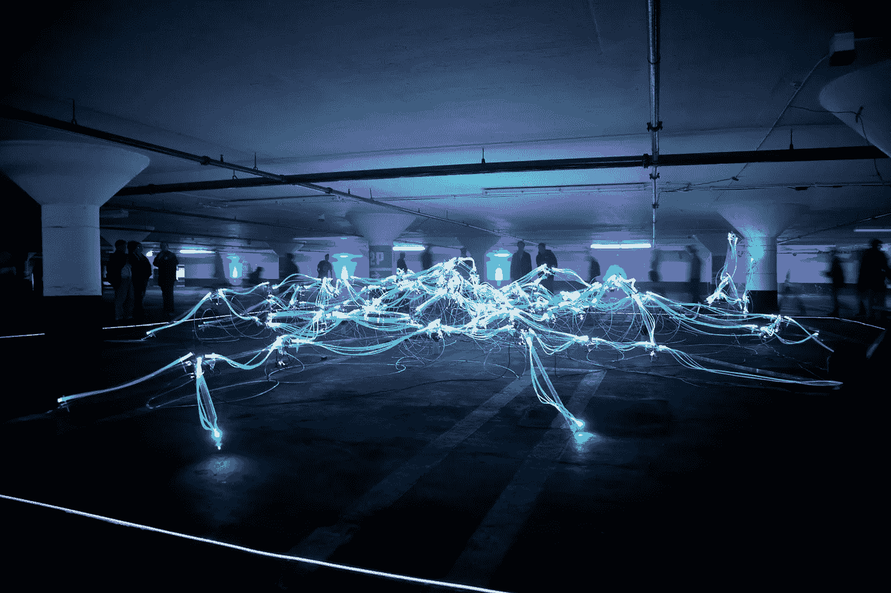

# 为数字化世界干杯

> 原文：<https://medium.datadriveninvestor.com/heres-to-a-digitized-world-be85619a574a?source=collection_archive---------23----------------------->

Photo by [Marius Masalar](https://unsplash.com/@marius?utm_source=unsplash&utm_medium=referral&utm_content=creditCopyText) on [Unsplash](https://unsplash.com/s/photos/digital?utm_source=unsplash&utm_medium=referral&utm_content=creditCopyText)

现在，我们历史上的这一时刻是为我们正在快速转变的数字化世界闪耀光芒并做好准备的最佳时刻。这是一个常见的主题，最近我采访的全球风险投资公司进一步强调了这一点。我们打开了潘多拉魔盒，开启了全球风险投资、交通运输、超本地化供应链和新旅游业的加速发展。这是一个不能错过的机会。

 [## 关于数字化转型的 8 个问题投资者应该从每位首席执行官那里得到答案|数据…

### 几乎没有什么比做生意更令人兴奋的了。最吸引人的方面之一当然是投资于年轻的…

www.datadriveninvestor.com](https://www.datadriveninvestor.com/2020/07/06/8-questions-about-the-digital-transformation-investors-should-get-answers-from-every-ceo/) 

## 快速外卖:

*   **业务的数字化**在过去的六个月中已经大大加快，这一趋势我们将在 2020 年继续见证。对于许多企业来说，这将是决定性的一年，要么走向数字化，要么永远被甩在后面，就像西尔斯、柯达和百视达一样，再也没有恢复过来。
*   过去的商业模式通常不包括技术，而是后来考虑的附加成本项目。展望未来，**的商业模式**将需要采取技术优先的方式。在快速发展的世界中，传统的交通行业是这种转变或发现新商业模式的一个例子，即购物送货而不是拼车。
*   我们看到**隐私第一**在所有建筑开发中的重要性越来越大——随着全球和本地法规的不断实施，投资者也注意到了这一点。进入分散身份或 D.I.D .的新兴类别。在 2020 年之交，我们开始看到这个术语的出现，并继续发展，它将不仅在我们的日常社会生活中的应用中发挥基础性作用。
*   技术带给人们的速度比前几十年更快。这让我们认识到技术服务用户的转变，而不是用户急于获得最新的技术。除此之外，随着人工智能和数据智能在未来几年的改善，这种情况只会加剧。

## 我今天的嘉宾包括:

*   [**大卫·布隆伯格**](https://www.linkedin.com/in/ACoAAAAAPBoBJDoVQjEmb3uAPV6dm90pI6OAEkU) ，布隆伯格资本[的管理合伙人](https://medium.com/u/c34c1e08e4d2?source=post_page-----be85619a574a--------------------------------)
*   [**苔丝·侯**](https://www.linkedin.com/in/ACoAABKnmZEBfALRvnA7qwlgeC25jLKtNXJvxTg) ，苔丝风险投资公司的创始人
*   [**帕特里克·希恩**](https://www.linkedin.com/in/ACoAAAACmbkB4-sF3zl0XWVXKIW_vgeVWqkgJyU) ，管理合伙人&ETF Partners 创始人
*   [**菲利克斯·马戈**](https://www.linkedin.com/in/ACoAAB0D02oBgvd-XjeBD38sDEqxwhXPjfX-qJA) ，Dash NEXT 的联合创始人

*每天收听*[***VCTV***](https://exchange.latoken.com/events/)*新一集，了解全球投资和技术趋势。下次见！*

📣*想要了解区块链、DApps、DeFi 和 FinTech 行业的所有头条新闻、投资、深度研究和最新动态吗？* [***订阅***](https://www.topionetworks.com/newsletters) *并关注我的* [***推特***](https://twitter.com/kyleellicott) *获取每周更新和更多！*

**访问专家视图—** [**订阅 DDI 英特尔**](https://datadriveninvestor.com/ddi-intel)