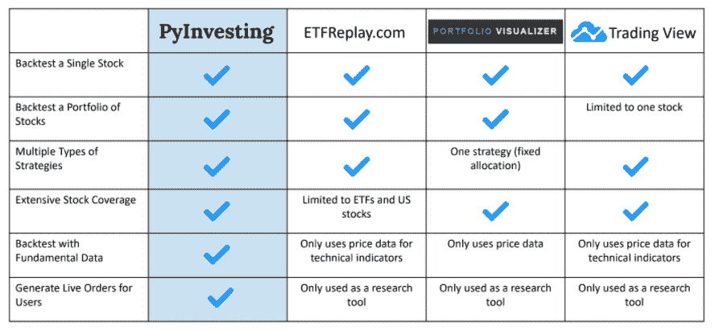

# 这就是为什么每个投资者都应该回测他们的投资策略

> 原文：<https://medium.datadriveninvestor.com/heres-why-every-investor-should-backtest-their-investment-strategy-64a4ce7b01c1?source=collection_archive---------10----------------------->

unsplash.com

# 什么是回溯测试？

回溯测试是使用历史价格模拟投资策略的过程，以测试该策略在过去的表现。

# 为什么回溯测试很重要？

回溯测试允许投资者分析投资策略的历史行为，并确定该策略的盈利能力。如果回溯测试的结果显示一个策略有高回报和低风险，投资者将有更大的信心继续使用这个策略。主要观点是，任何在过去表现良好的投资策略都有可能在未来表现良好。相反，如果某项投资策略的回溯测试显示表现不佳，则该策略应该被拒绝，因为如果它在过去表现不佳，那么它在未来也不太可能表现良好。

 [## 2020 年最佳短期投资选择精选资源|数据驱动型投资者

### 投资是增加你净财富的一个好方法。如果你通过遵循一个严格的…

www.datadriveninvestor.com](https://www.datadriveninvestor.com/2020/03/28/handpicked-resources-for-the-best-short-term-investment-options-of-2020/) 

回溯测试还有助于投资者理解他们的策略在不同历史关键时期的表现，如全球金融危机和新冠肺炎公共卫生危机。他们将知道在这些黑天鹅事件中他们会损失多少钱。对于年纪较大的投资者来说，承担太多风险可能意味着大大推迟你的退休时间。对于靠保证金(借来的钱)投资的年轻投资者来说，大量提款可能意味着接到股票经纪人可怕的追加保证金通知。通过回溯测试我们的投资策略，我们能够准确地知道在这些困难时期我们会损失多少钱，因此我们能够在实际开始投资之前确定我们能够承担多大的风险。

# 什么样的投资策略可以回测？

任何可以表达为一组规则的策略都可以进行回溯测试。例如，价值投资者可能对每年选择 10 只市盈率最低的股票的策略感兴趣。同样，依赖技术分析的投资者可能会在快速移动平均线越过慢速移动平均线时买入股票。这些策略都遵循一套一致的规则，可以使用历史数据进行模拟。基于规则的投资的优势在于它消除了情绪。每一个买卖股票的决定都是完全基于逻辑的。这可以防止投资者犯行为错误，如因害怕错过机会而恐慌性抛售或买入。

# 我们如何创建一个现实的回溯测试？

由于回溯测试的目的是找出一个投资策略的有效性，因此确保我们的回溯测试尽可能真实是很重要的。这防止我们创建在纸上看起来很有吸引力，但在现场交易中表现很差的回溯测试。有几种方法可以实现更真实的回溯测试。

## 1.选择一个至少包含 100 只股票的大型投资领域

一个大的宇宙将允许你的策略从各种各样的股票中进行选择。这很重要，因为它允许我们测试策略是否能够从一大篮子股票中挑选出胜出的股票。一个伟大的战略将能够区分赢家和输家。然而，如果我们将投资领域限制在少数股票上，那么可供策略选择的股票就不多了。这让我们很难确认一个策略是否有效，因为当可供选择的股票很少时，好的和差的策略都可能选择相同的股票。

## 2.在你的投资组合中至少包括 20 只股票

在你的投资组合中拥有 20 只同等权重的股票将会降低你投资组合的集中风险。这意味着没有一只股票会对你的投资组合的表现产生巨大的影响，这使得我们可以减少你的策略碰巧幸运地选择了一只获胜股票的机会。例如，如果我们的策略只选择特斯拉，并且是 100%投资，那么它在过去几个月里会获得巨大回报。然而，我不认为这种策略有效，因为它完全可以随机选择另一只股票。对于一个策略来说，挑选 20 只成功的股票比挑选一只成功的股票要难得多。通过确保我们的策略持有多样化的投资组合，我们可以确认该策略能够始终如一地挑选多只获胜股票。

## 3.选择足够长的回溯测试期

理想情况下，你的回溯测试期至少应该是 15 年。这让我们可以观察该策略在多种经济体制下的表现。例如，通过纳入 12 年前发生的 2008 年金融危机，我们可以了解我们的战略在危机中会损失多少钱。这使我们能够管理投资组合的风险。对于即将退休的老年投资者来说，这意味着决定他们应该在市场上投资多少钱，这样即使危机发生，他们也有足够的现金储蓄按计划退休。对于利用杠杆进行投资的年轻投资者来说，这可能意味着他们要明白，在危机期间，他们能够承受多少损失，而不会受到追加保证金通知的影响。

## 4.包括交易成本

回溯测试应该包括你的经纪人的交易成本。每当投资者买卖股票时，他们都会产生支付给经纪人的交易费用。随着时间的推移，随着交易数量的增加，你的交易成本也会增加，这将对你的策略回报产生重大影响。此外，高换手率和大量交易的策略会比低换手率的策略产生更高的交易成本。因此，包含交易成本是很重要的，这样我们就能对我们的策略在实时交易中能赚多少钱有一个现实的想法。

# 我们如何创建回溯测试？

虽然回溯测试需要大量的计算，但我们可以使用多个网站来轻松创建回溯测试，而无需编写任何代码。这些平台包括[https://www.portfoliovisualizer.com/](https://www.portfoliovisualizer.com/)、【https://www.etfreplay.com/】T2、[https://www.tradingview.com/](https://www.tradingview.com/)和[https://pyinvesting.com/](https://pyinvesting.com/)。在下表中，我比较了不同的回溯测试平台，并权衡了利弊。

pyinvesting.com

为了能够回溯测试不同股票的投资组合，除了 TradingView 之外的所有平台都提供了这一功能。TradingView 更多地用于回溯测试单只股票，不允许用户分析包含多只股票的投资组合的表现。

就允许用户回溯测试不同种类的策略而言，Portfolio Visualizer 是唯一缺乏选项的平台。它们只允许用户运行分配回溯测试，用户必须指定投资组合中每只股票的权重。所有其他平台都允许用户从多种类型的回溯测试中进行选择，如相对强度和移动平均回溯测试。

关于股票覆盖范围，除了 ETF Replay 仅限于 ETF 和少数美国股票之外，所有平台都覆盖了多个交易所。如果你投资于新加坡市场，不幸的是这个平台不会很有帮助，因为它不包括新加坡股票。

在不同的平台中，只有 PyInvesting 提供基本面数据，如市盈率、自由现金流、股本回报率、利润增长等。这些基本数据来自该公司 15 年前的财务报表。对于依赖基本面数据的投资者来说，这是目前唯一一个允许你不用写一行代码就能用基本面数据创建回溯测试的平台。上述所有其他回测平台仅提供基于价格或交易量数据的技术指标，不适合大多数长期投资者。

最后，只有 PyInvesting 允许用户进行回溯测试，并在云上创建他们自己的个人机器人顾问。该网站将向用户发送电子邮件，以更新他们的实时头寸和订单，他们可以在自己的个人账户上交易。

# 最后的想法

每个投资者都应该对他们的投资策略进行回溯测试，因为这可以让他们分析他们投资策略的历史行为，并确定其有效性。回溯测试还有助于投资者了解他们的策略在不同关键历史时期的表现，从而帮助他们管理风险。最后，回溯测试允许投资者遵循一套逻辑规则，从图片中去除情绪，帮助他们做出数据驱动的决策。

**进入专家视角—** [**订阅 DDI 英特尔**](https://datadriveninvestor.com/ddi-intel)