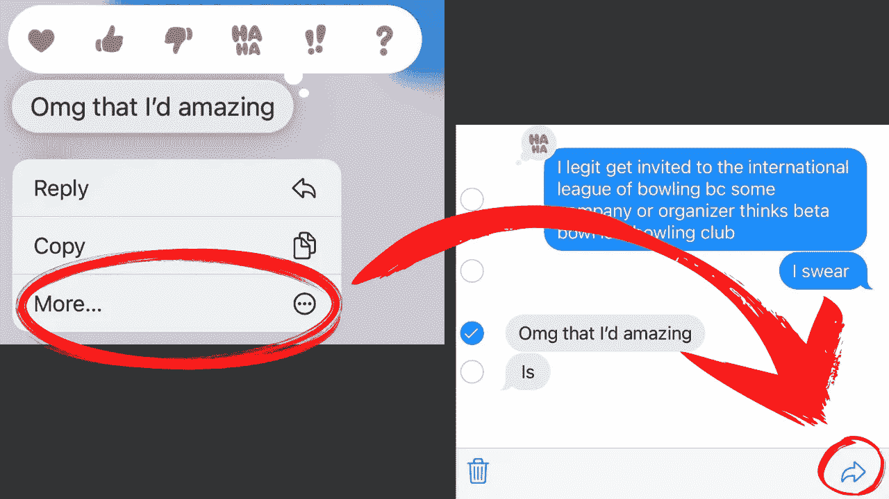
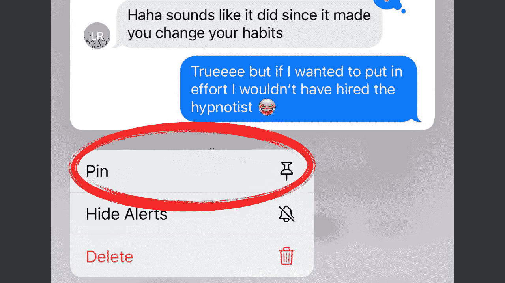

# 这就是为什么我的 iPhone 上一直有 69 条以上的未读短信

> 原文：<https://medium.datadriveninvestor.com/heres-why-i-have-69-unread-text-messages-on-my-iphone-at-all-times-c12242979665?source=collection_archive---------1----------------------->

## 这是我们都迫切需要的一个工具(对某些人来说，它将改善你的文本响应时间，对其他人来说，它将大大减少)。

Photo by [Denis Cherkashin](https://unsplash.com/@denic?utm_source=medium&utm_medium=referral) on [Unsplash](https://unsplash.com?utm_source=medium&utm_medium=referral)

我不是最坚持发短信的人，我会第一个承认这一点。我群发短信。有些日子(取决于时间、我的日程安排和电话那头的人)，我会立即回短信，回答问题，并为另一个几分钟(甚至一个小时)的友好来回做准备。

有些日子，我甚至不会看一个人的短信。我会把它留在我的队列中，让未读消息的数量(我的眼睛实际上还没有读过)堆积起来，接近三位数的区域(100+)。

总有一天，我会最终鼓起力量、时间和勇气，费力地看完几条仍未阅读(字面上看不见)的短信，然后发送一连串的回复。不是一个，两个，或者三个。大概五个，六个，或者十个。有些长，有些短。可能是图片，可能是 gif，可能是链接。这要看情况。这有点像短信回复“dump ”,某人只是发送了他们在过去几天、几周或几个月一直憋在心里的所有东西，而你被留在那里艰难地通过它，并决定哪些部分(如果有的话)值得回应。我知道这很烦人，我也尽量不跟大家这样，但时不时的，这是我的应对策略……提前道歉。

现在，如果你想知道为什么我不总是选择策略一来更快地回复别人，把那些短信从我的盘子里拿走，并且(最重要的是)解决任何时间敏感的问题或请求，以确保我不会错过任何事情或耽误别人…这是因为我不能。当我打开一个未读的文本时，我不可能知道我将要走进什么。我是说，有时候我可以。有时候，信息的小预览部分足以让我知道这将是一个快速、有趣、简单的回复，而其他人则清楚地表明会涉及到思考(所以最好等到以后，当我有足够的时间和脑力投入时)。

但这正是短信的问题所在。一旦你看到他们，你就不能无视他们。你不能像在电子邮件上那样，勾选“标记为未读”的小方框，然后再返回给他们。

## 你已经读了这篇文章，你可以现在回复或者永远忘记回复(抱歉莎伦阿姨！).这是唯一的选择。或者是？

这正是我所想的。你看，我主要像大多数人一样使用我的短信应用程序，我想。与朋友和家人进行更琐碎的交谈…也许偶尔会有团队成员发来与业务相关的短信(但最好没有；电子邮件更好)。

我想我会解决一点我的问题，至少对于重要的短信，通过在一个完全不同的短信应用程序和提供商上获得一个单独的电子邮件号码…我这样做了，但不幸的是，同样的问题发生了。

“标记为未读”功能未能出现。

这不是一个新现象，也不是我现在对短信应用程序的不满。多年来我一直有这种感觉；随着我的联系人、团队通讯和短信越来越多，这变得越来越令人沮丧，问题也越来越多。

我真的是唯一一个觉得需要在短信应用中设置“标记为未读”或“标记为以后”按钮的人吗？

不要误解我，发短信不是我唯一的，甚至不是我主要的交流方式。我花在电子邮件、其他信使和实际电话上的时间比发短信的时间多得多，尤其是在商务场合。

然而，这只会加剧问题，因为它将等待列表中不断增加的短信目录移到了我的待办事项列表中更低的位置，到了我日常优先事项的最底部。这就是文本不被阅读的方式(字面意思，看不见；就像我不知道你问我什么，因为我故意不点击它)几天，有时几周，有时更糟。

## 那么，解决方案(或替代方案)是什么……它有多糟糕？

首先，我通常假设技术比我聪明一点，所以十有八九，我开始假设用户错误是我的问题的根本原因。不幸的是，我的进一步挖掘发现，我不是第一个渴望这样一个功能的人，我甚至不是互联网上唯一一个表达这种渴望和沮丧的人。

所以也许不仅仅是“用户失误”。

好吧，这是我从兔子洞里挖出来的:对于“标记为未读”的失败，有一些“解决方案”或替代选项…但你可能不会喜欢你会发现什么。

快速的谷歌搜索会发现多个论坛，从 [Reddit 线程](https://www.reddit.com/r/ios/comments/iwij7s/did_apple_really_implement_pinning_but_not_mark/)到[苹果堆栈交换](https://apple.stackexchange.com/questions/377417/single-gesture-to-mark-a-message-as-read-unread-in-ios-13)到 [Quora 问题](https://www.quora.com/How-do-I-mark-an-iPhone-text-unread)，甚至还有提供像这样非常[低效、不方便的解决方法的博客(可行，但可能比它的价值更麻烦)](https://smallbusiness.chron.com/mark-message-unread-iphone-73144.html)。

可悲的是，大多数博客和论坛——即使是声称能够解决这个令人困惑的难题和重大技术低效问题的技术博客和论坛(如果我自己这么说的话)——也没有提供一个好的或可行的替代方案。但也许这不是他们的错…也许这只是苹果希望我们等待的事情，所以他们有一个很好的理由向我们追加销售新的 iPhone，这可能是第一个引入“标记为未读”短信的开创性想法…但我认为他们可以提出比这更具创新性的东西，至少可以证明新产品的发布？

无论如何，这里有一个[的例子，许多看似技术性的博客建议了一个不那么方便(或者完全有效)的解决方法](https://www.tenorshare.com/iphone-tips/how-to-mark-messages-as-unread-on-iphone.html):

1.  按住特定的文本消息(不是整个对话)并选择“更多”选项
2.  单击右下角的小“前进”箭头
3.  将消息“转发”(换句话说，重新发送给自己)到自己的号码。*最辉煌的时刻？*
4.  万岁，现在是未读！

Screenshots from the author’s (my) personal text conversation. Used with permission from the conversation participant. The image was edited (to add the arrow and circles) in Canva by the author.

真的吗？是啊，现在它是未读的，但它是谁的呢？你*(我，我自己；【从我到我)*。我怎样才能记住它是什么时候发出的，或者回复给谁呢？另外，我想回到的各种对话的所有个人“转发”不会都转到同一个对话线程(我自己对我自己)吗？

我认为这里的结果甚至更糟，因为现在我不得不筛选从我到我的无休止的聊天信息，并试图记住谁是谁，什么，什么时候…老实说，这看起来比我们最初解决的问题更混乱。我想我可能会放弃这个，除非它只是为了一个奇怪的消息或重要的对话……但它肯定不是我心目中的长期、可持续或可扩展的解决方案。

从好的方面来看，苹果似乎已经决定向我们妥协，为整个对话提供“Pin”功能。

您可以通过按住对话线程并选择新“锁定”选项，将 convo“锁定”到文本的顶部。

The image is a screenshot taken from the author’s (my) personal text messages, with permission from the conversation participant. The image was edited (to add the red oval) in Canva by the author.

但真的，你能做的就这么多？如果我们已经有了“Pin ”,那么我们至少已经完成了“标记为未读”区域的 75%——完成剩下的 25%真的有那么麻烦吗？

## 不要误解我——还有其他选择。

我们可以完全放弃内置的 iPhone 短信应用程序，使用另一个专门推销其“标记为未读”功能的应用程序。可能是一个类似 Signal 的[，它允许在 Android 和 iPhone 设备上使用这个功能](https://www.businessinsider.com/how-to-mark-as-unread-on-signal)。但这也意味着重新开始…听起来很不方便，甚至更令人头疼。这是一个很好的选择，但也是一种痛苦。

转换成本相当高(从时间和便利性的角度来看，如果你所有的朋友或联系人都必须注册，还要在另一个应用上注册……)。至少，你可能会丢失与这些联系人的所有信息历史记录(它可能不会从 iMessage 应用程序转移到新的应用程序)，所以它基本上是从零开始，不会解决当前你有 100 多条未读信息的问题。

在我们大多数人已经使用的内置短信应用程序中实现想要的“标记为未读”功能会更快更容易。

对于一些有抱负、热爱文字、技术天才的企业家来说，这可能是一个绝妙的新创业想法。也许他需要创建一个应用程序，可以与每个短信提供商集成，以实现“标记为未读”或“标记为以后”的功能…这将是很好的。呼吁所有有抱负的科技企业家，请开始行动！我将是你的 beta 测试者，你的焦点小组成员，你忠实的小白鼠！求你了。

然而，也许这比看起来更难……或者也许上升的持久性并不存在，因为大多数有能力创建该应用程序的技术企业家也认为，苹果只需发布几个 iOS 版本，就可以提供自己的功能，并使那个辉煌的应用程序想法完全过时。

有可能。事实上，也许这已经发生了。

## 这个小引擎(几乎可以)——我指的是应用开发者…

事实上，我的研究显示，一些技术天才应用程序开发人员几乎回应了我们的祈祷…几乎。

至少根据[的博客](https://www.idownloadblog.com/2020/05/13/messageunread/)，开发者 Greg0109 提供了一个应用程序的免费下载，可以做到这一点，同时无缝集成到 iPhone 的内置文本信使应用程序中。

我想相信格雷格 0109。不幸的是，当我试图测试他的解决方案时，我遇到了两个问题:

1.  他的应用本来只能在越狱的 iOS 13 设备上运行…所以现在我必须越狱我的手机？
2.  在深入研究整个越狱问题之前，我去访问了 [Greg0109 的测试库](https://greg0109.yourepo.com/pack/messageunread)(该应用程序据说可以免费下载)，令人难过的是，我面对的是一个巨大的 404 错误通知，上面写着“该回购不存在或已被删除”。

但是为什么，Greg0109，为什么？为什么不做一个我们可以在非越狱设备上使用的版本？为什么不为少数拥有已越狱 iOS 13 的幸运儿恢复回购呢？

## 即将出现的潜在解决方案…下一次 iOS 更新会有答案吗？第一轮:苹果 vs Greg0109

我从未见过 Greg0109，所以我说不出确切的原因，但有可能是一些关于 iOS 14 更新的谣言让他放弃了这个项目(或者至少阻止了他为非越狱设备提供版本)。

根据 MacRumors 上的一篇帖子，未来版本的 iOS 14 可能会有答案

> “‌iOS 14‌…that…got 的早期版本泄露给了开发者社区，他们发现代码中隐藏了许多新功能。苹果正致力于允许你将信息标记为未读，类似于电子邮件。有时候有一段文字，你只是想以后再看。”[—MAC rumors 2020 年 6 月 13 日发布](https://www.macrumors.com/guide/ios-14-leaked-feature-mark-as-unread-in-messages/)

会不会是即将到来的[版本 iOS 14.5](https://www.gottabemobile.com/ios-14-release-date/) 更新，目前正在测试中，可能会在未来几周内发布(面向更广泛的公众)？

只有时间会证明一切，但如果没有，我很想听听 Greg0109 目前正在做什么…如果你正在偷偷阅读这篇 Greg0109，请务必联系我们。