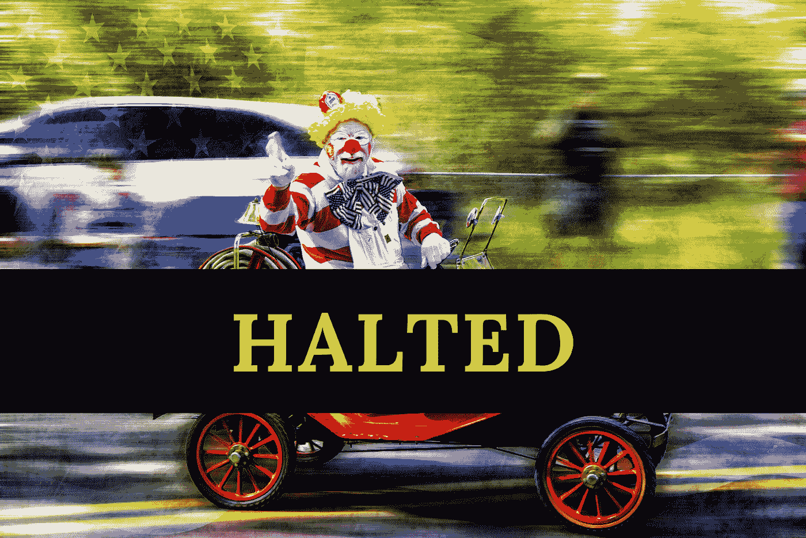

# 证交会叫停赫兹出售无价值股票

> 原文：<https://medium.datadriveninvestor.com/hertzs-sale-of-worthless-shares-halted-by-the-sec-fda74bf115ec?source=collection_archive---------7----------------------->

## 至少是大部分。

就在我们讨论几天前的时，现已破产的汽车租赁公司 Hertz 最近正在谈判出售价值约 10 亿美元的新股票(但最终毫无价值)。幸运的是，该公司醒悟过来，出于对道德风险的担忧，停止了整件事…

**开玩笑的**。赫兹将报价减半，声明他们将只出售[5 亿美元](https://www.zerohedge.com/markets/bankrupt-hertz-kills-plan-sell-500-million-worthless-stock-following-sec-review)的(最终毫无价值)股票。然而，权力的殿堂里似乎还留有一丝理智，因为[SEC 已经介入](https://www.reuters.com/article/us-hertz-glo-hldg-debt-sec/hertz-suspends-share-sale-after-us-sec-raises-objections-idUSKBN23O2MR)说他们对公司向散户投资者出售破产股票(或者更准确地说:倾销破产股票)的计划有意见和[担忧](https://www.thestreet.com/investing/hertz-500-million-stock-sale-draws-comments-from-sec)。一般的新手交易者很可能不明白这些工具从根本上来说毫无价值。

证券交易委员会主席杰伊·克莱顿(Jay Clayton)表示，包括赫兹在内的大多数公司都暂停任何预期的股票销售，直到卖家能够回应委员会的评论。在大多数情况下，当证交会通知一家公司，他们对其披露的信息发表了评论，这意味着有些事情很可能违反了该委员会关于资产出售的既定规则和法规。该公司在提交给美国证券交易委员会的文件中发表了以下声明:

> “虽然我们无法预测我们的普通股在计划下将如何处理，但我们预计普通股股东将不会通过任何计划获得复苏，除非更优先的债权和权益的持有人，如有担保和无担保债务(目前正以显著的折价交易)，得到全额支付，这将需要业务状况显著、快速和目前意想不到的改善，以达到新冠肺炎前或接近新冠肺炎前的水平。”

赫兹的负责人在这里基本上是说，公司明白，在更高级债务完成之前，购买普通股的散户投资者实际上没有办法获得任何好处。他们找到实际价值回报的唯一方法是，如果该公司首先为其优先债务提供便利(这是我们在上一节中[谈到的)。很明显，该公司认为在发行更多普通股之前，他们无法清偿优先债务。谢天谢地，在他们解决 SEC 关于这个问题的评论之前，他们也不能继续出售。](https://medium.com/datadriveninvestor/robinhood-retail-traders-are-getting-shafted-29bab6887f0c)

请记住，一些高级债务持有人购买了信用违约互换(CDS)，我们在上一篇文章中对此进行了探讨。那些在宣布违约后[收到支付款](https://news.bloomberglaw.com/bankruptcy-law/cds-panel-triggers-payout-on-523-million-of-hertz-credit-swaps)的公司最终没有损失；毕竟，CDS 是公司债券保险。这些投资者在违约时获得了本金加上他们累积的利息(减去 CDS 的成本)。这一明智之举是更有经验的投资者(理解为:机构)如何长期击败散户的又一例证。当然，散户投资者可以在短期内获得可观的回报，如果他们及早买入一家破产公司的股票，并设法卖给一个[更大的傻瓜](https://www.investopedia.com/terms/g/greaterfooltheory.asp)。但这种情况意味着，由于缺乏对他们交易的工具的了解和劣质的基本面，他们更有可能失去一切。话虽如此，当美联储继续支持僵尸公司和估值悬而未决的企业资产时，谁能责怪这些新手呢？美联储[刚刚宣布](https://markets.businessinsider.com/news/stocks/federal-reserve-begins-individual-corporate-bond-purchases-secondary-market-relief-2020-6-1029309910#:~:text=The%20Federal%20Reserve%20announced%20Monday%20it%20will%20begin%20buying%20individual,alleviating%20intense%20credit%2Dmarket%20pressures.&text=The%20portfolio%20will%20complement%20purchases,the%20SMCCF%20since%20May%2012.)他们将购买 2500 亿美元的[公司债券](https://www.marketplace.org/2020/06/16/the-fed-starts-buying-corporate-bonds/)。潘趣酒碗又一次被装满了！时间会证明赫兹的宿醉有多严重。

*想看更多这样的内容？查看* [*数据驱动型投资人*](https://www.datadriveninvestor.com/) *。*