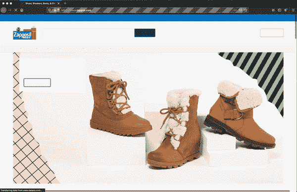
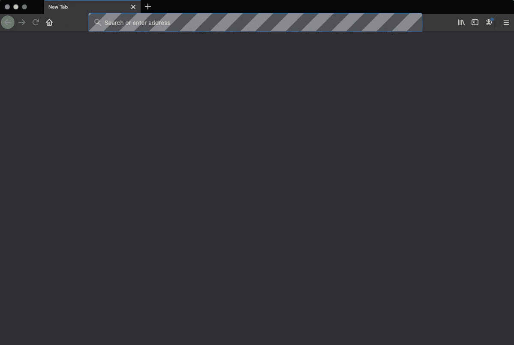
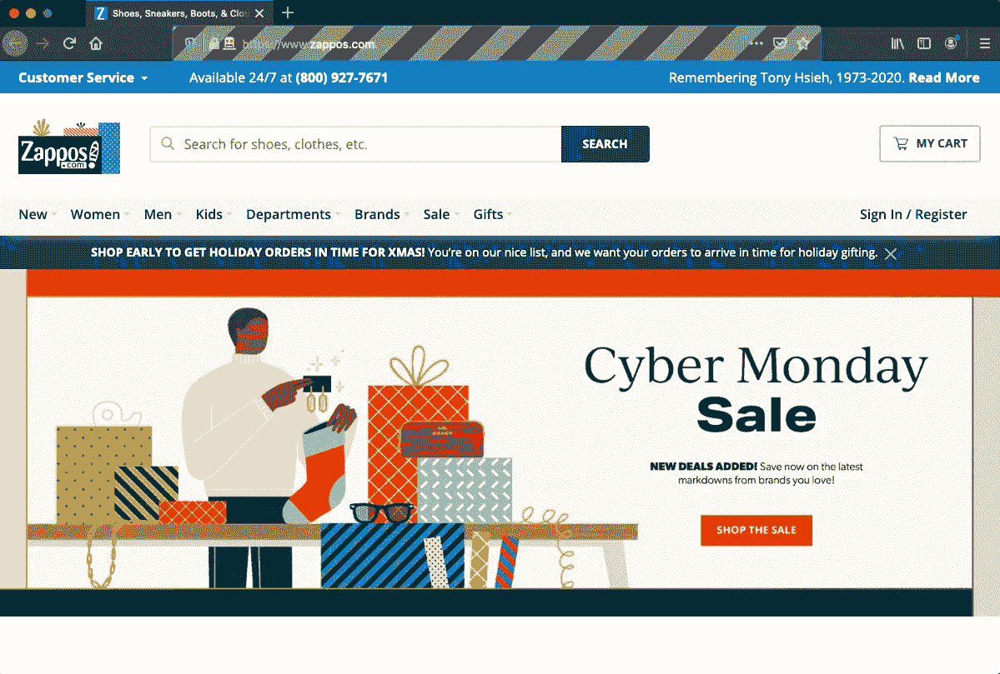
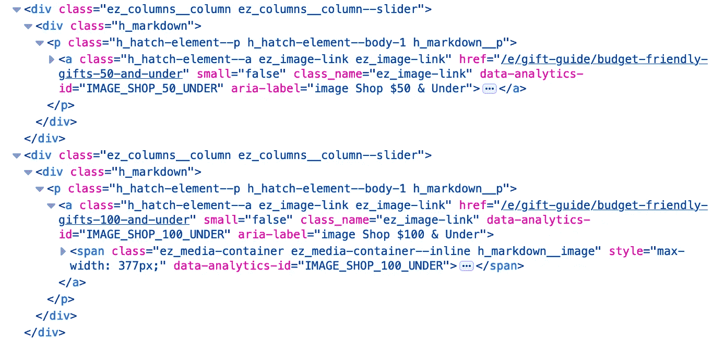
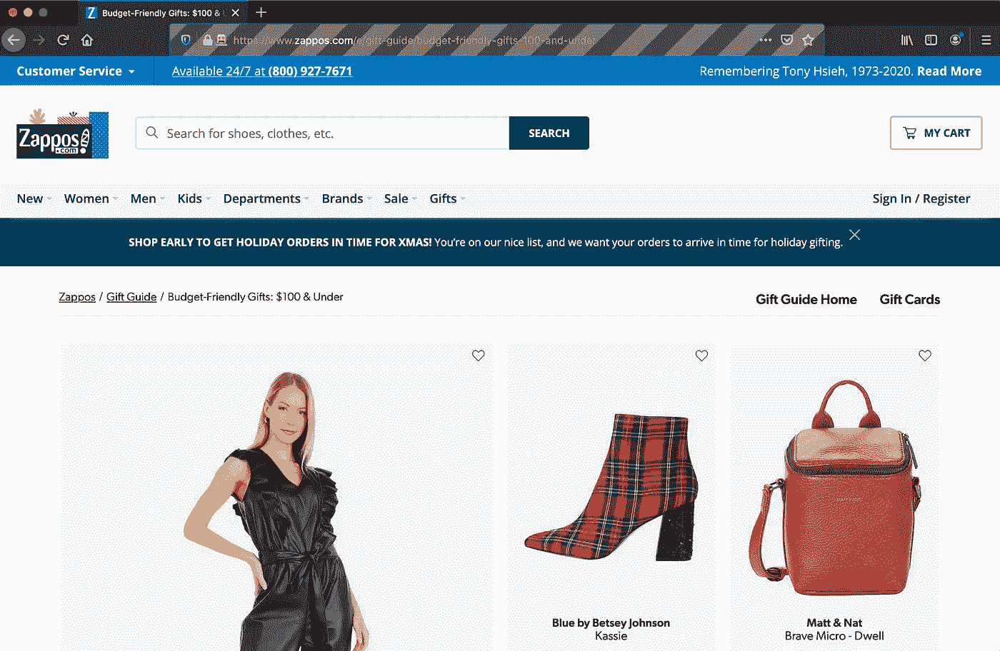
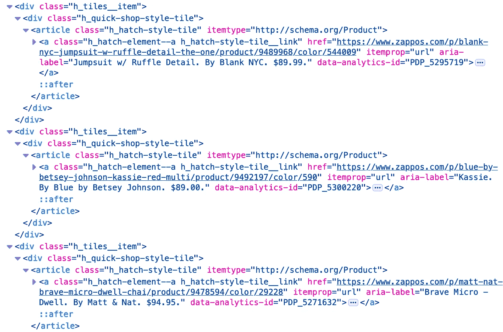
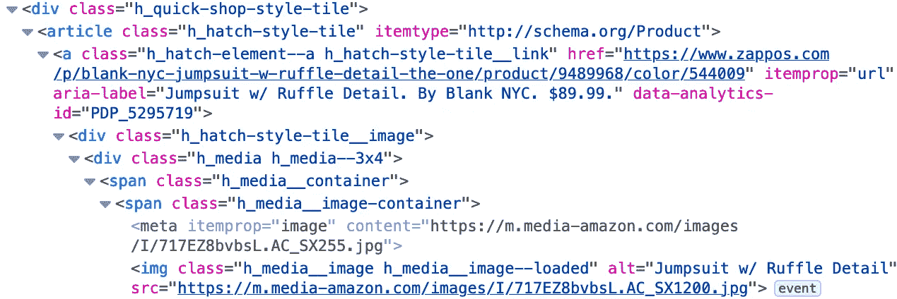
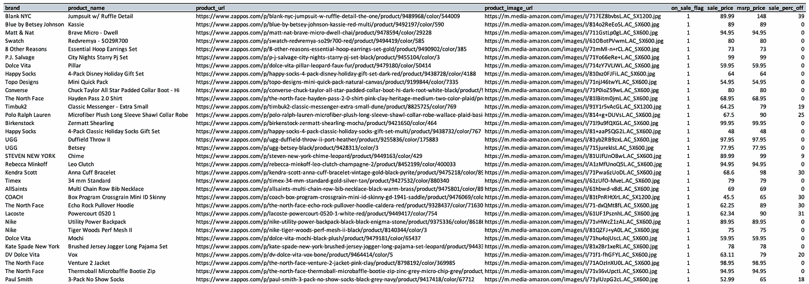

# “嘿硒，刮我一张购物清单”

> 原文：<https://medium.datadriveninvestor.com/hey-selenium-scrape-me-a-shopping-list-bde9628e1536?source=collection_archive---------8----------------------->

## 一个有趣而简单的使用 python 的 web 抓取示例



我最近在做一个项目，涉及到从网站上收集一些数据。我是刮擦的新手。幸运的是，python 使用一个名为 [Selenium](https://pypi.org/project/selenium/) 的库使得基本的 web 抓取变得非常简单。我将使用 Selenium 完成一个非常简单的项目，导航 [Zappos](https://www.zappos.com/) 网站，并为自己创建一个假日购物清单。我将一步一步地展示 python 代码和检查网站元素，同时展示 Selenium 中的一些有用的功能，这些功能可以让您立即启动并运行自己的 web 抓取项目。

## 硒简介

在进入“有趣的东西”之前，让我们快速介绍一下什么是 Selenium。根据 PyPI 页面，Selenium 是一个包*“用于自动化来自 Python 的 web 浏览器交互”。*几乎所有你可以像人一样做的事情(浏览、搜索、滚动、点击、登录等)，你都可以使用 Selenium 库编写一个 python 脚本来完成这些任务。下面是我们将要经历的一个刮擦项目的基本步骤:

1.  打开 web 浏览器
2.  转到所需网页
3.  执行所需的操作
4.  从呈现的网页中抓取信息

正如你所看到的，尽管只提到了 4 个步骤，但这可能包括在到达所需网页之前在网站内的大量导航。这里是 Git repo 的[链接，包含所有的分步代码和最终的 CSV 文件，如果你想继续或者直接跳到前面。现在，让我们跳进项目，开始刮！](https://github.com/aviolante/web_scrape_shopping_list)

## 假日购物清单项目 *ct*

*1。打开网络浏览器*

第一步，导入 selenium web driver，打开一个空白浏览器或“艺术画布”。我发现火狐作为一个浏览器更容易使用。我们将打开并调用我们的新浏览器`driver`,这样我们就可以通过这个驱动程序对象继续“驱动”或操纵浏览器。图 1 展示了令人兴奋的新打开的 Firefox 浏览器窗口。

```
from selenium import webdriver# open blank browser
driver = webdriver.Firefox()
```



Figure 1 - Empty Firefox web browser

*2。转到所需网页*

下一步是去你想要的网页。我将导航到零售网站 [Zappos](https://www.zappos.com/) 。完全公开，我曾经在 Zappos 工作，但我仍然是一个超级粉丝。随着你做越来越多的网页抓取，你会很快发现，仅仅因为一个网站看起来漂亮并不意味着它编码良好。这导致了所有网站都是独一无二的，所以一个项目可能不会完全翻译成另一个。

下面你会看到指定的网页，`url`，然后我们使用步骤 1 中的驱动程序对象来打开想要的网页。恭喜你。通过 python，你只需打开一个新的 Firefox 浏览器，并将该浏览器指向一个特定的 URL。

```
# navigate to a url
url = 'https://www.zappos.com/'
driver.get(url)
```



Figure 2 - Navigate to web page

*3。执行所需的操作*

现在是大部分工作的时候了，我们将通过具体的动作遍历整个网站。对于这个简单的项目，我们将执行对“*节日礼物*的搜索，单击按钮进入所需的网页，并从该页面抓取信息以创建我们的购物清单。

在开始这些操作之前，我首先想讨论一下我们将在这个项目中使用的主要函数。我们将使用`find_element_by_xpath()`。术语 XPath 指的是 XML 路径，它帮助您查看网页的 HTML 结构来查找元素。我发现这个功能是在网页上找到想要的元素的最可靠的方法。当使用 XPath 时，你会注意到我们将使用一个相对路径，这意味着我们从 HTML 结构中间的某个地方开始。我不打算深入研究 HTML / CSS，但我想向您展示它的样子，以便您可以将 HTML 和 python 代码联系起来。你很快就会明白我的意思。让我们看看它是如何工作！

让我们看看图 2 中的搜索栏和搜索按钮。当您在浏览器中右键单击并执行“inspect element”时，您将看到 HTML(图 3)。有一种`div class`叫做“ef”。在这个 div 中有一个名为“ff”的`form class`和一个名为“searchAll”的`id`的`input`。这个类内还有一个`button`，带`type`名为“submit”。使用 XPath，我们可以定位所有这些不同的元素，并与它们进行交互，或者如您稍后将看到的那样，从中提取信息。


Figure 3 - Inspect element HTML Code for search bar and button

如果您检查了`form class`“ff”上的元素，并右键单击→复制→ XPath，您会看到类似这样的内容。这是完整的 XPath，不是相对路径，所以我们不需要它。

```
/html/body/div[1]/div[1]/header/div[3]/div/div[1]/form
```

函数`find_element_by_xpath()`使用相对 XPath。当您查看图 3 及其相关代码时，会觉得更有意义。就操作而言，我们想要做的是在搜索栏中插入一些文本，然后单击搜索按钮。够简单了吧？我们开始吧！

下面的代码找到搜索栏，清除所有默认文本，然后输入搜索词“ *holiday gifts* ”。请注意我们是如何使用图 3 中的 HTML 函数`find_element_by_xpath()`找到搜索栏元素的。XPath 就是这样工作的！在浏览器中检查 HTML，找到你想要的元素，并使用`find_element_by_xpath()`指向给定路径的特定元素。

```
# find search bar, clear, and enter search text for item
search_bar = driver.find_element_by_xpath("
   //form[@class='ff']
   //input[@id='searchAll']")
search_bar.clear()
search_bar.send_keys('holiday gifts')
```

现在，您应该看到浏览器中的搜索栏包含了新的搜索词，但是我们仍然需要实际单击 search 按钮。再次使用 XPath，找到 click 按钮，我们已经在图 3 中这样做了，然后我们简单地`.click()`按钮来执行动作。

```
# find and click 'search' button
search_btn = driver.find_element_by_xpath("
   //form[@class='ff']
   //button[@type='submit']")
search_btn.click()
```

现在，您应该会看到下面的页面(图 4)


Figure 4 - After searching “holiday gifts” from Zappos home page

至此，您已经了解了使用 selenium 浏览网站的足够知识！我将使用我们已经学到的知识，单击图 4 中下方的“ *$100 &”方块。*

特别是对于这个网页，图 4 中的所有 6 个小块都在 div 中，都在精确名称的 div 中。有时候，如果你在寻找一个特定的元素，这可能是一个问题。在下面的图 5 中，您可以看到下的图块 1- " *$50 &，以及*下的图块 2 - " *$100 &具有相同的`div`、`p`和`a`类名称。然而，`a`类中也有类似`id`、`aria-label`等属性。独一无二的。我将使用`aria-label`并在我的`find_element_by_xpath()`函数中使用一种“and”子句来指向特定的元素。*



Figure 5 - Same HTML for 2 clickable tiles

下面是查找并点击下的瓷砖“ *$100 &”的代码。一旦找到我们想要的元素，我们就使用上面的`.click()`函数。这里要注意的一件事是，当我搜索`a[@class='hatch-element...'`时，我没有像在其他代码块中那样有`//`的延续。相反，我加上`[@aria-label='image shop $100 & Under']`。这意味着寻找提到的特定类和属性。*

```
gifts_under_100 = driver.find_element_by_xpath("
   //div[@class='h_markdown']
   //p[@class='h_hatch-element--p h_hatch-element--body-1 h_markdown__p']
   //a[@class='h_hatch-element--a ez_image-link ez_image-link'][@aria-label='image Shop $100 & Under']")

gifts_under_100.click()
```

您现在应该在一个搜索结果页面上，如图 6 所示。这是我想开始抓取的网页，也就是我的购物清单。



Figure 6 - Product result page for “$100 & Under” Tile

*4。从渲染的网页中抓取信息*

从这个搜索结果页面中，我们需要遍历所有的产品，并收集诸如名称、品牌、价格、图片、产品 url 等信息。这个特定的页面不会加载产品，直到您滚动它们，这引入了另一个常见的问题。

像脸书这样的网站，在他们的 feed 里，有这个“无限滚动”的功能。幸运的是，我们的产品页面不是无限的，但是我们确实需要我们的驱动程序来滚动以呈现产品。请记住，如果它不渲染，那么它不能被发现和刮。

对于这个特殊的页面，直接滚动到底部并不能呈现中间的所有内容，所以我需要编写一个简单的循环来逐节滚动我们的驱动程序。下面的代码按照指定的像素部分大小滚动。

```
# step scroll to bottom by pixel size to load all images
for i in range(35):
       driver.execute_script("window.scrollBy(0, 900)")
       time.sleep(1)
```

您可能需要将第一个代码块中的像素滚动从 900 调整为适合您的浏览器窗口的任何值。我还使用了`time.sleep()`功能，在进入下一部分之前“暂停”1 秒钟，让产品完全加载。我在我的循环中使用了 35 次迭代，但是你可以将它设置得更高而没有任何问题，即使你在指定的范围限制之前达到了底部。

[](https://www.datadriveninvestor.com/2020/12/01/how-to-build-a-twitter-scraping-app-with-python/) [## 如何用 Python |数据驱动投资者构建 Twitter 抓取应用

### 每秒发出约 6000 条推文，每天发布 5 亿条推文，普通人甚至不能…

www.datadriveninvestor.com](https://www.datadriveninvestor.com/2020/12/01/how-to-build-a-twitter-scraping-app-with-python/) 

你现在应该在你的结果页的底部。让我们检查并找到所有需要的产品元素。这就是重名实际上对我们有利的地方。每个单独的产品块都有相同的`div`、`article`和`a`类名(图 7)。然而，在每个`a`类中，在`label`属性中有唯一且有价值的信息。在这里，我们可以看到产品名称、品牌和价格。此外，在`href`属性中，我们可以找到产品 URL。这就是我们要刮的！



Figure 7 - Duplicate HTML tag names across different products

```
# get all product info: brand, product name, price, and product url
product_info = driver.find_elements_by_xpath("
   //div[@class='h_quick-shop-style-tile']
   //article[@class='h_hatch-style-tile']
   //a[@class='h_hatch-element--a h_hatch-style-tile__link']")
```

让我们在 HTML 中找到所有产品通用的标签。从上面的代码中，Selenium 将返回一个名为`product_info`的元素列表。到目前为止，我们返回的所有对象都只是我们与之交互的单个唯一项目(单击、添加文本等)。).然而，由于我们传递给驱动程序的 XPath 存在多次，在结果页面中每个产品一次，我们将收到返回的元素列表。确切地说，`len(product_info)`将是 190 个元素，看起来是这样的:

```
[<selenium.webdriver.firefox.webelement.FirefoxWebElement (session="f0d90584-efa8-3e4d-b44a-3c6b3ba88e23", element="34c2a959-f3ff-a042-ad7c-909aad9b7438")>, <selenium.webdriver.firefox.webelement.FirefoxWebElement (session="f0d90584-efa8-3e4d-b44a-3c6b3ba88e23", element="2e0b1bcb-9f69-0c43-a281-8a0281059bcc")>...]
```

这并没有真正给我们提供有用的信息。我们需要遍历这个元素列表来提取信息。我将创建 2 个列表:1 个用于产品描述信息(价格、品牌和名称)，1 个用于产品 URL。

```
product_desc = []
product_urls = []

for info in product_info:
    product_desc.append(info.text.split('\n'))
    product_urls.append(info.get_attribute("href"))
```

对于产品描述，我将从我们的列表(`product_info`)中的每个项目(`info`)中提取所有的`text`。我在这里使用了`split`函数在每个换行符处进行分割，作为分隔符。新的列表`product_desc`将是这样的:

```
[['Blank NYC', 'Jumpsuit w/ Ruffle Detail', '$89.99MSRP $148.00'],['Blue by Betsey Johnson', 'Kassie', '$89.00'], ['Matt & Nat', 'Brave Micro - Dwell', '$94.95'], ['Swatch', 'Redvremya - SO29R700', '$80.00'],...]]
```

看起来相当不错！你可以看到，由于 Zappos 的统一命名惯例，它遵循了品牌、产品名称和价格的模式。我们有一点混乱的价格特点，但可以清理。

要获取产品 URL，我们只需使用`get_attribute()`函数并查找所有`href`项目。让我们来看看这个列表:

```
['[https://www.zappos.com/p/blank-nyc-jumpsuit-w-ruffle-detail-the-one/product/9489968/color/544009'](https://www.zappos.com/p/blank-nyc-jumpsuit-w-ruffle-detail-the-one/product/9489968/color/544009'), '[https://www.zappos.com/p/blue-by-betsey-johnson-kassie-red-multi/product/9492197/color/590'](https://www.zappos.com/p/blue-by-betsey-johnson-kassie-red-multi/product/9492197/color/590'), '[https://www.zappos.com/p/matt-nat-brave-micro-dwell-chai/product/9478594/color/29228'](https://www.zappos.com/p/matt-nat-brave-micro-dwell-chai/product/9478594/color/29228'),...]
```

看起来棒极了！我仔细检查了两者都是相同长度的 190 个元素，所以我们在一个好的轨道上！

现在，我想获得所有的图片网址，这样我就可以查看产品。这看起来与上面的代码非常相似。我们必须在 XPath 中深入一点才能找到图片项，但是现在我们知道我们要找的是什么，这并不困难。下面的图 8 显示了我们将要抓取的图片`src`和`alt`属性的 HTML。您可以从图 8 和代码块中看到我们是如何沿着这条路走下去的。



Figure 8 - Inspected image element to show path

```
# get product image url and name
product_image = driver.find_elements_by_xpath("
   //div[@class='h_quick-shop-style-tile']
   //article[@class='h_hatch-style-tile']
   //a[@class='h_hatch-element--a h_hatch-style-tile__link']
   //div[@class='h_hatch-style-tile__image']
   //div[@class='h_media h_media--3x4']
   //span[@class='h_media__container']
   //span[@class='h_media__image-container']  
   //img[@class='h_media__image h_media__image--loaded']")
```

一旦我们的列表(`product_image`)完成，我们再次在一个循环中使用`get_attribute()`函数来获取产品图片 URL(`src`)和产品名称(`alt`)。

```
product_image_url = []
product_image_alt = []

for image in product_image:
    product_image_url.append(image.get_attribute("src"))
    product_image_alt.append(image.get_attribute("alt"))
```

`alt`标签与上面的产品名称完全匹配，因此不需要这些信息。也许，在一个更复杂的项目中，你可以用它来连接数据。

```
# image urls
[‘[https://m.media-amazon.com/images/I/717EZ8bvbsL.AC_SX1200.jpg'](https://m.media-amazon.com/images/I/717EZ8bvbsL.AC_SX1200.jpg'),
 ‘[https://m.media-amazon.com/images/I/814o2ReEo5L.AC_SX600.jpg'](https://m.media-amazon.com/images/I/814o2ReEo5L.AC_SX600.jpg'),
 ‘[https://m.media-amazon.com/images/I/711GstLp0gL.AC_SX600.jpg'](https://m.media-amazon.com/images/I/711GstLp0gL.AC_SX600.jpg'),...]# image alt tags
['Jumpsuit w/ Ruffle Detail', 'Kassie', 'Brave Micro - Dwell',...]
```

## 最终购物清单

现在我们有了几个列表，我们实际上可以很容易地将这些数据连接在一起。因为所有的产品信息都是按照相同的顺序和页码收集的，所以很容易按照正确的顺序添加。我已经在 [Git repo](https://github.com/aviolante/web_scrape_shopping_list) 中添加了所有这些额外的步骤，但简而言之，我创建了一个 pandas dataframe，清理了列，并添加了我认为有助于快速排序和过滤购物清单的列。

你可以看到下面的最终 CSV 快照，我只是“美化”了一下。我们有品牌，产品名称，产品网址，图像网址，如果它的销售，销售价格，建议零售价，销售折扣的标志。现在，你已经准备好拿着这张购物清单，按照你想要的方式过滤/排序，完成你的假日购物！



Figure 9 - The final shopping list

## 奖励:等待

关于“等待”，我想补充最后一点。在抓取网页时，你将会处理网页和页面元素的加载时间。通常，您会遇到需要等待或暂停以完全加载这些特定元素的情况。您将在某个时候收到关于元素未被找到的错误。根据我的经验，这很大程度上是由于元素没有被及时加载。您可以使用基本的 python [异常处理](https://docs.python.org/3/tutorial/errors.html)和使用 [Selenium 的等待功能](https://selenium-python.readthedocs.io/waits.html)来克服这些障碍。很容易将它合并到您的代码中。对于这个项目，我采用了懒惰的快捷方式，即使用`time` python 库，并在两个动作之间进行几秒钟的`time.sleep()`调用。这对于较小的学习项目是可行的，但是由于使用`time.sleep()`时没有任何条件，所以扩展性不好。查看上面的两个链接。他们应该会为你解决很多未来的头痛问题！

## 结论

这就是我们简单的刮擦项目！在这个项目中，我们成功地使用 python 库 Selenium 打开浏览器、访问网页、浏览网页，并为购物清单收集所需的信息。最重要的是，我们了解了 Selenium 的几个核心功能和能力，您可以轻松地将它们扩展到更大的项目中。检查给定 web 页面中的元素，然后使用 XPath 找到这些元素实际上已经成功了一半，所以您应该为下一个项目做好准备。

我们在这个项目中非常幸运，数据非常清晰。这主要是由于 Zappos 网站标签，但也是我们项目的简单性。希望你觉得这很有趣，也很有帮助。

刮的开心，逛的开心！

## 参考

1.  [硒的非官方文献](https://selenium-python.readthedocs.io/)。这是一个伟大的资源！
2.  [GitHub Repo](https://github.com/aviolante/web_scrape_shopping_list) 带所有分步代码和 CSV 文件。
3.  [硒等待](https://selenium-python.readthedocs.io/waits.html)和 Python [异常处理](https://docs.python.org/3/tutorial/errors.html)文档

## 获得专家观点— [订阅 DDI 英特尔](https://datadriveninvestor.com/ddi-intel)