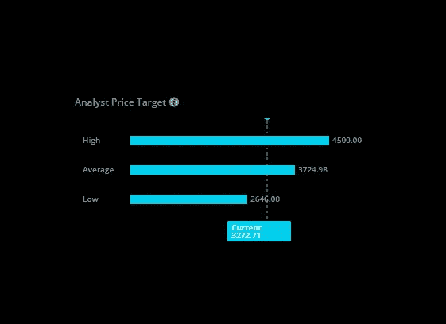
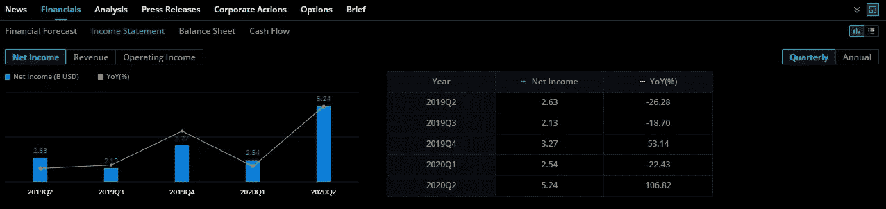
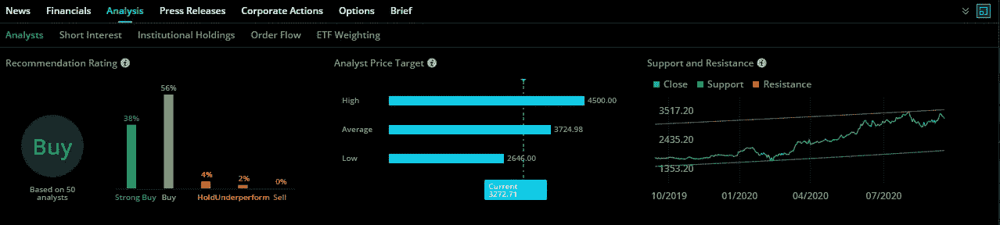
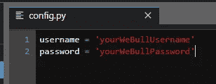
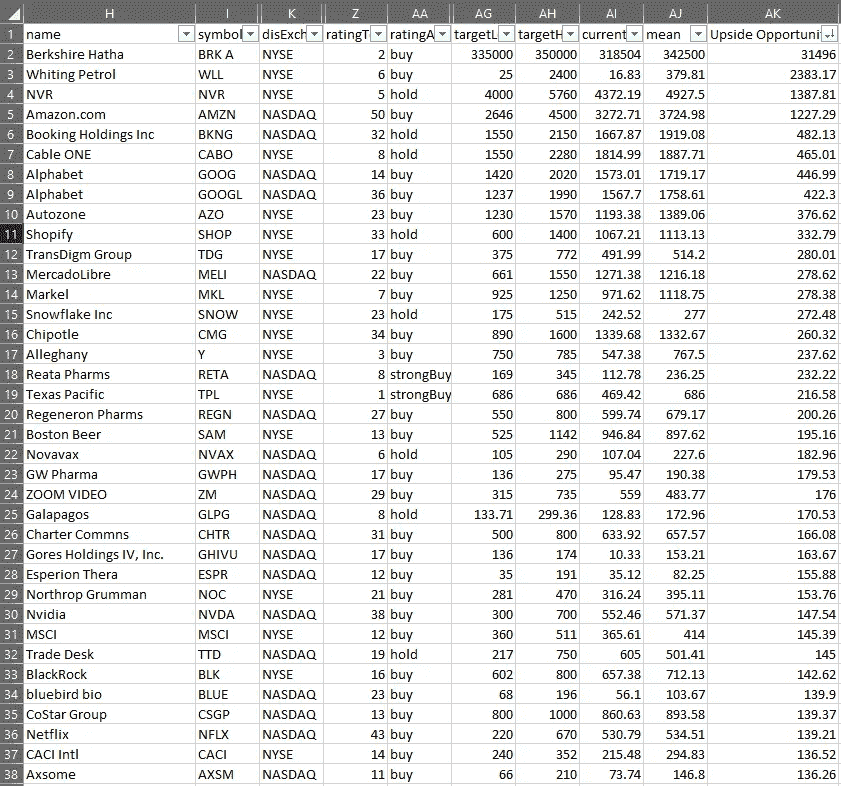

# 寻找价值股的系统方法

> 原文：<https://medium.datadriveninvestor.com/hey-trade-analyst-what-stock-should-i-buy-f3aca4a01c1f?source=collection_archive---------0----------------------->

## 如何通过 Python 利用 WeBull API 中的免费分析师数据？只需 5 个步骤，在不到一小时的时间内获得 6000 只股票的快照。



Analyst Price Target for AMZN from WeBull — 10/17/2020

有无数的选择可以用来交易、分析和学习股票。Robinhood 是更受欢迎的平台之一，在股票交易方面，它消除了许多准入门槛。然而，在过去的几个月里，我慢慢变得更喜欢 T2·韦伯而不是罗宾汉。我的推理是基于 WeBull 收集和组织的大量数据。这款手机应用简洁易用。此外，他们还有一个非常强大的基于网络的版本。有人可能会说，Robinhood 让不做研究就投资变得太容易了，而 WeBull 优化了这两者。

## WeBull 及其数据简介

我想展示几个数据点，我个人认为这些数据点对“散户投资者”很有帮助，也很有力量。我将强调 Robinhood 应用程序中没有的独特数据点。我将在 AMZN(亚马逊)寻找。



New Income data from WeBull for Amazon — as of 10/17/2020

WeBull 提供的财务选项卡令人难以置信。他们以一种非常有效的方式对数据进行划分，并提供可视化的方式来理解趋势。在投资前了解一家公司的损益表、资产负债表和现金流是一项很好的实践。一个似乎被很多“散户”随着 Robinhood 的浪潮而错过的。



Analyst data from WeBull for Amazon — as of 10/17/2020

分析选项卡是我个人最喜欢的。这里有如此多的数据，出于本文的目的，我将主要关注分析师价格目标部分。价格传播知识和信息。50 位分析师估算了亚马逊的价格高低，以今天为基准。这是风险分析中高侧、低侧的一个很好的例子。该分析师标签显示，亚马逊在当前市场中被低估，大多数分析师认为亚马逊值得买入。

当涉及到投资和模型创建时，有许多方法可以利用这些数据。然而，WeBull 只按股票提供这些数据——这意味着，你必须点击每只股票才能看到分析师的目标价格。WeBull 大约有 6000 只股票，没有人会那样做。

这就是金融分析+计算能力可以让普通“散户”做到的地方。

在本文的其余部分，我将一步一步地介绍如何获取 WeBull 中每只股票的分析数据。* *注意:有些股票在分析选项卡中没有任何数据。

## 1.开一个 WeBull 账户

为了访问 WeBull API，您必须创建一个 WeBull 帐户。下面是开始使用的邀请。

[https://act.webull.com/mo/KAEFwHigiRTe/i3i/inviteUs/](https://act.webull.com/mo/KAEFwHigiRTe/i3i/inviteUs/)

如果你存入 100 美元或更多，这个链接还会给你 3 个月的 2 级数据(在这里了解更多)和 2 支免费股票。

[](https://www.datadriveninvestor.com/2020/07/07/introduction-to-time-series-forecasting-of-stock-prices-with-python/) [## 用 Python |数据驱动投资者进行股票价格时间序列预测简介

### 在这个简单的教程中，我们将看看如何将时间序列模型应用于股票价格。更具体地说，一个…

www.datadriveninvestor.com](https://www.datadriveninvestor.com/2020/07/07/introduction-to-time-series-forecasting-of-stock-prices-with-python/) 

## 2.Pip 安装几个软件包

```
pip install pandas
pip install numpy
pip install webull
pip install progressbar
```

在这个例子中，我们将使用熊猫、numpy 和进度条。webull 包来自下面的 Github repo。

【https://github.com/tedchou12/webull 

* *请在使用包装前阅读免责声明。

## 3.创建 config.py 文件



simple config.py file

## 4.编写 python 脚本从 WeBull 中提取数据

github gist with webull script to pull analysis data from WeBull

## 5.摆弄数据，看看贸易分析师会告诉你什么。



Excel spreadsheet that filters and sorts the data based on the upside opportunity.

这只是查看 WeBull 中可用数据的一种方式。我希望您能通过这篇文章来发现和构建这些数据。如果你有任何有创意的想法，并想通过它们进行交流，请告诉我。

## 结论

现在是成为“散户投资者”的大好时机，因为数据变得越来越容易获取，计算能力也变得唾手可得。唯一需要的是一个有创造力和决心的头脑。我希望你喜欢这篇文章，并迫不及待地想让你收获学习和建设的好处。

*   ** *所有投资都涉及风险和证券的过往表现，或者金融产品不保证未来的结果或回报。当你投资证券或其他金融产品时，总有赔钱的可能。*

## 访问专家视图— [订阅 DDI 英特尔](https://datadriveninvestor.com/ddi-intel)