# 18 个隐藏含义的日常标识

> 原文：<https://medium.datadriveninvestor.com/hidden-meanings-in-everyday-logos-1f1173e8d9b7?source=collection_archive---------4----------------------->

每天，我们都会遇到许多标识。这些是他们的象征和品牌。我们很难意识到隐藏的含义。

下面是其中的一些，我个人觉得很有意思。确保你不会像我以前的文章一样略读。如果你不理解一个标志的隐含意义，再看一遍这个标志，试着分析它

## 1.亚马孙

Photo by [Christian Wiediger](https://unsplash.com/@christianw?utm_source=medium&utm_medium=referral) on [Unsplash](https://unsplash.com?utm_source=medium&utm_medium=referral)

微笑的箭头从 A 指向 Z，这意味着所有存在的产品都可以在亚马逊上买到。

## 2.巴斯金·罗宾斯

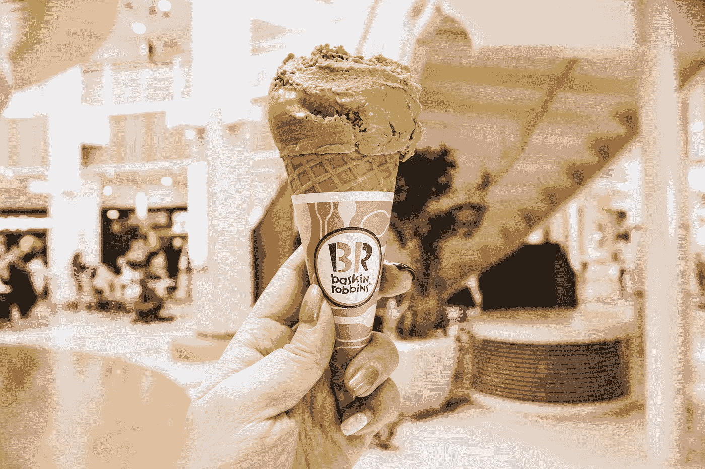

Photo by [Crystal Jo](https://unsplash.com/@crystalsjo?utm_source=medium&utm_medium=referral) on [Unsplash](https://unsplash.com?utm_source=medium&utm_medium=referral)

观察隐藏在这里的数字 31。该公司以其 31 种口味的冰淇淋而闻名。所以他们的顾客可以在每个月的每一天享受不同口味的冰淇淋。

## 3.搜索

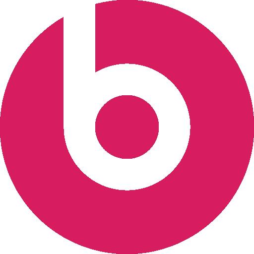

[Beats Logo Icon](https://iconscout.com/icons/beats) by [Pixel Icons](https://iconscout.com/contributors/pixel-icons)

这代表一个人在听节拍上的音乐。

## 4.脸谱网

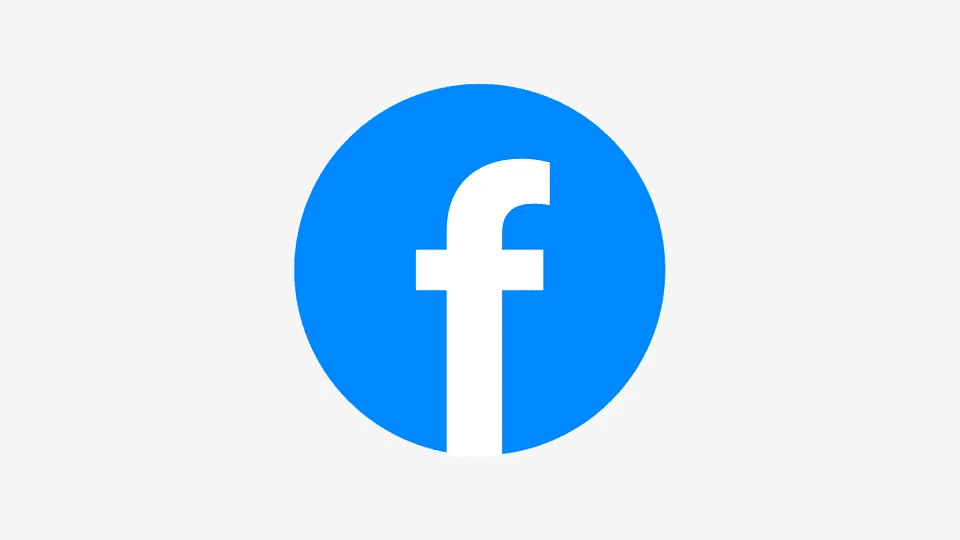

我不知道这是真的还是假的，但这很有意义。这个标志看起来像一个低头使用手机的人。

马克·扎克伯格是红绿色盲。他能看到的最好的颜色是蓝色。这可能是脸书标志为蓝色的原因。

蓝色也让应用程序看起来更加安全可靠。

## 5.联邦快递:

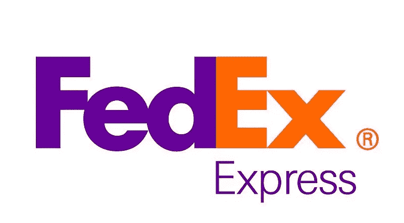

Bəhram Camalov, CC BY-SA 4.0 <[https://creativecommons.org/licenses/by-sa/4.0](https://creativecommons.org/licenses/by-sa/4.0)>, via Wikimedia Commons

E 和 X 之间的箭头象征着他们传递的速度。

## 6.一级方程式

> 由于版权问题，无法将图片放在这里。在互联网上查找徽标。

标志中的数字 1 在哪里？它就在 F 后面的空白处。

## 7.吉列公司

Picture obtained from [Open Beauty Facts](https://world-fr.openbeautyfacts.org/produit/7702018366200/fusion-proglide-gillette) under Creative Commons License

他们精雕细琢的刀片非常精确地切断了前两个字母。

## 8.现代公司

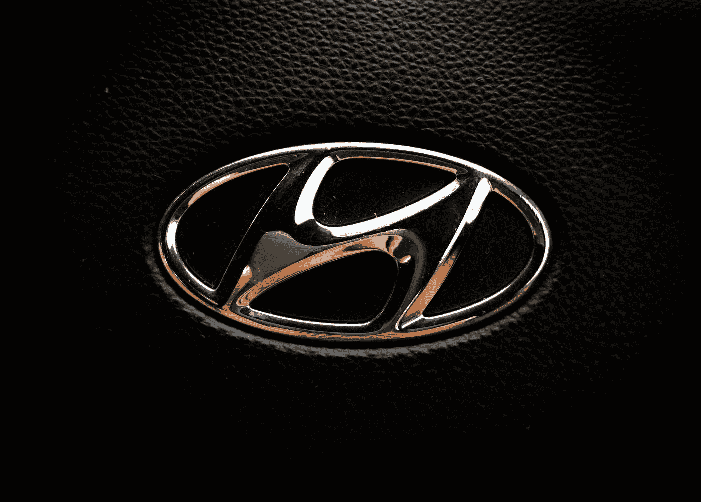

Photo by [The Punisher](https://unsplash.com/@named_aashutosh?utm_source=medium&utm_medium=referral) on [Unsplash](https://unsplash.com?utm_source=medium&utm_medium=referral)

它不仅仅是一个斜体的“H”。这代表了他们对客户的大力支持。剪影里的两个人，一个是他们的客户代表，一个是满意的客户。

## 9.好时之吻:

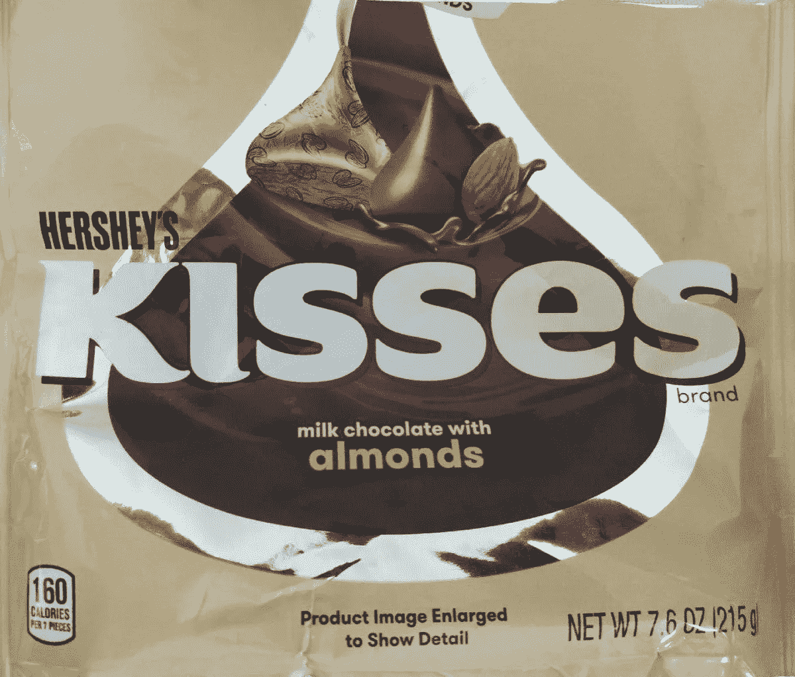

Image obtained from [Open Food Facts](https://world.openfoodfacts.org/product/0034000134861/kisses-milk-chocolate-with-almonds-hershey-s) under Creative Commons License

如果你不知道接吻是什么样子，顺时针旋转 90 度。在前两个字母之间，有一个吻在等着你。

## 10.苹果

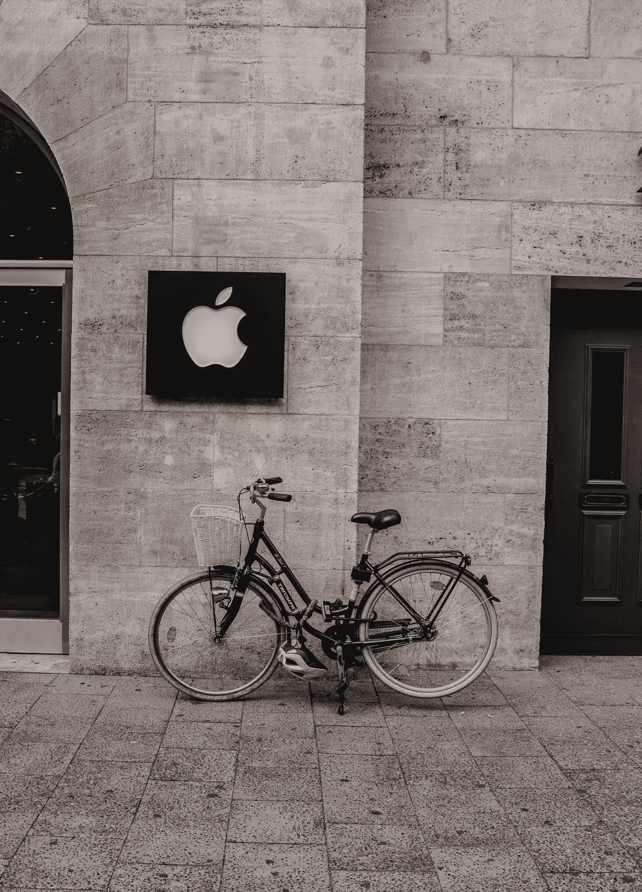

Photo by [Alisina Elyasi](https://unsplash.com/@aseelyasi?utm_source=medium&utm_medium=referral) on [Unsplash](https://unsplash.com?utm_source=medium&utm_medium=referral)

有人拿走了苹果上的一个字节。

iPhone 这个名字最早属于思科。苹果未经思科许可使用了它。思科不得不起诉苹果商标侵权。然而，他们达成了共识，他们都可以使用这个名字。

思科也有一款 iPhone，但是很旧，没有苹果的好。所以除非你去寻找，否则你找不到它。

## 11.LG——生活很美好

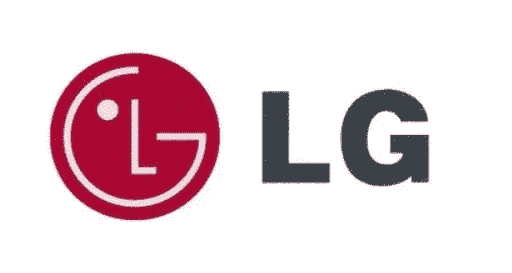

Source: [Pixy](https://pixy.org/766519/)

**小心思:**很好的 logo。

**普通人:**那是一个微笑的男人。l 代表他的鼻子。

伟大的头脑:将 L 向上移动一点。看起来像吃豆人！

## 12.万事达卡:

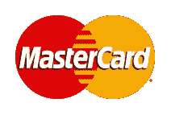

Rubenmachucagutierrez, CC BY-SA 4.0 <[https://creativecommons.org/licenses/by-sa/4.0](https://creativecommons.org/licenses/by-sa/4.0)>, via Wikimedia Commons

这里使用了一种有趣的颜色心理学。然而，还有一件更有趣的事情隐藏着。

红色、橙色和黄色的第一个字母代表罗伊。巧合的是，瑞塔·罗伊夫人是万事达卡基金会的首席执行官兼总裁。这纯属巧合。

## 13.奥林匹克:

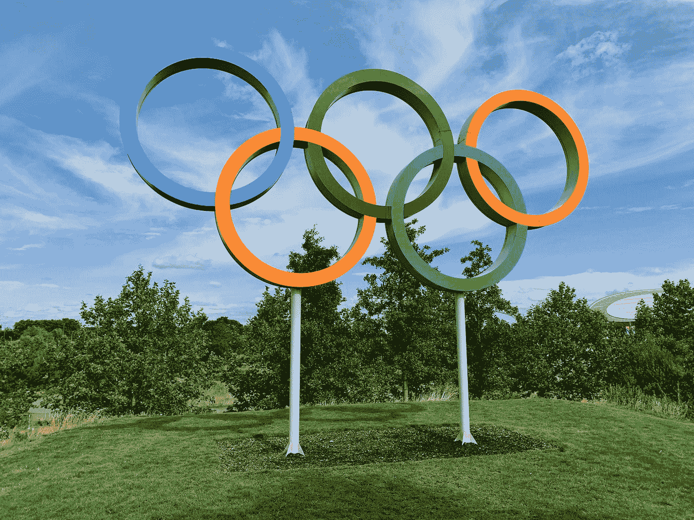

Photo by [Kyle Dias](https://unsplash.com/@kfdias?utm_source=medium&utm_medium=referral) on [Unsplash](https://unsplash.com?utm_source=medium&utm_medium=referral)

五环代表参与其中的五大洲。

标志中的五种颜色和白色背景可以组成世界上每一面国旗的颜色。

美国被认为是一个单一的大陆，而南极洲并没有举办奥运会。

## 14.地铁:

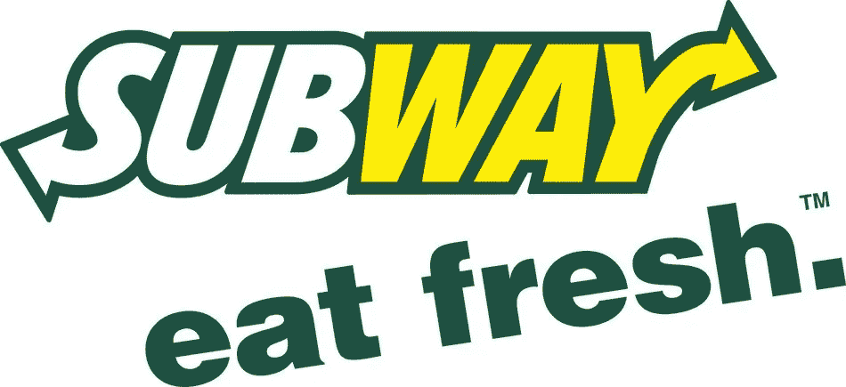

Source: [Pixy](https://pixy.org/572269/)

极端字母处指向左右的箭头代表赛百味的出入口，表示途中可以享受美食。

## 15.丰田:

Photo by [Chandler Cruttenden](https://unsplash.com/@chanphoto?utm_source=medium&utm_medium=referral) on [Unsplash](https://unsplash.com?utm_source=medium&utm_medium=referral)

丰田首先是一家织机公司。这就是为什么这个标志看起来像针里的一根线。

你可以找到隐藏在标志中的所有丰田字母！

## 16.VAIO

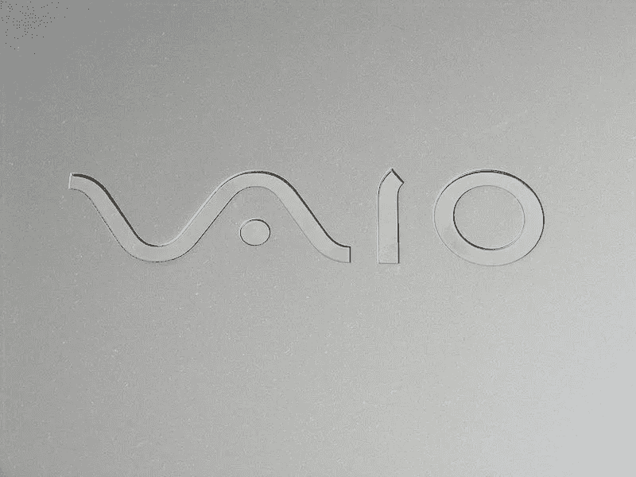

[https://www.flickr.com/photos/orsorama/](https://www.flickr.com/photos/orsorama/), CC BY-SA 2.0 <[https://creativecommons.org/licenses/by-sa/2.0](https://creativecommons.org/licenses/by-sa/2.0)>, via Wikimedia Commons

VA 代表模拟通信中使用的正弦波。在数字通信中，IO 代表 1 和 0。

## 17.沃达丰

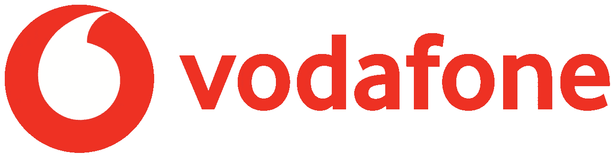

[Andrew McMason](https://commons.wikimedia.org/wiki/File:Logonewvodafone.png), [CC BY-SA 4.0](https://creativecommons.org/licenses/by-sa/4.0), via Wikimedia Commons

沃达丰代表语音、数据和电话。这个标志代表一个倒置的逗号，放在对话的两边，代表无休止的讲话。

## 18.小米:

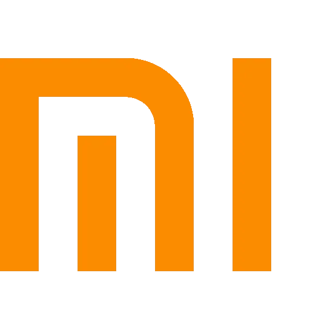

[Xiaomi Logo Icon](https://iconscout.com/icons/xiaomi) by [Pixel Icons](https://iconscout.com/contributors/pixel-icons)

米官方代表**移动互联网**和**碟中谍**。

但是我可以大胆的说 MI 的意思是**中产阶级 iPhone** :-)

我还研究了很多标志，但是这些标志是众所周知的，它们隐藏的含义非常有趣。

 [## 不见面就做交易？风投和企业家的 5 个指南|数据驱动…

### 自从 covid 六个月前登陆美国以来，全球的风险投资家和企业家都不得不适应新的现实…

www.datadriveninvestor.com](https://www.datadriveninvestor.com/2020/09/20/doing-deals-without-meeting-in-person-5-guidelines-for-vcs-and-entrepreneurs/) 

感谢阅读！

*(未注明出处的图片为其官方 logos。)*

## 访问专家视图— [订阅 DDI 英特尔](https://datadriveninvestor.com/ddi-intel)