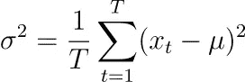
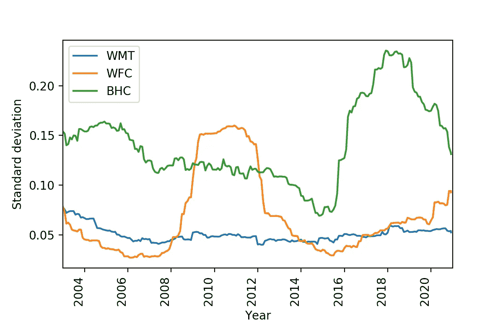
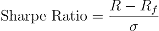
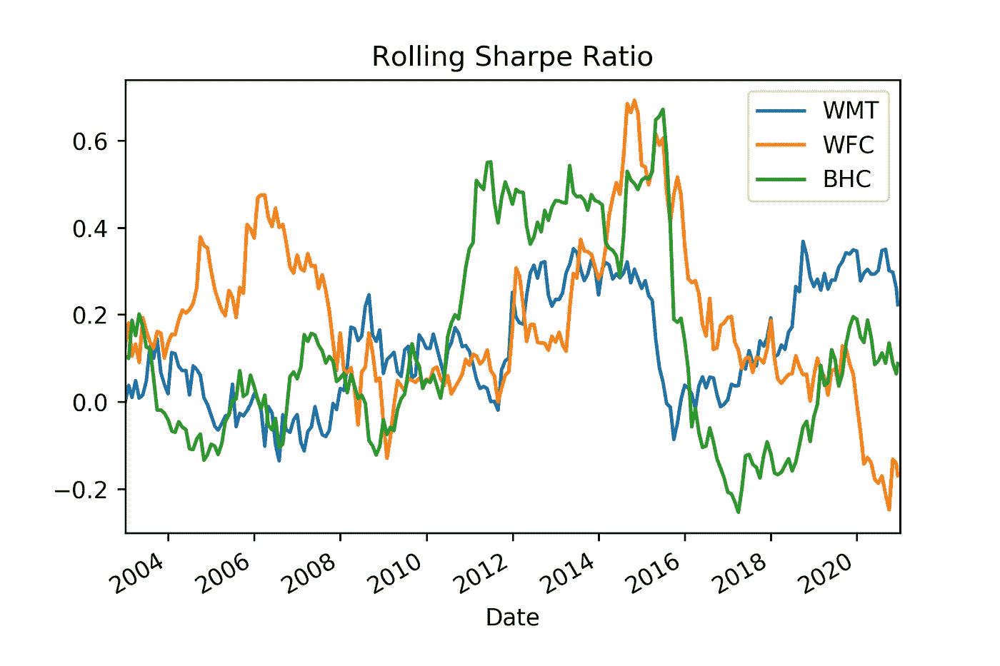
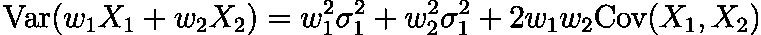
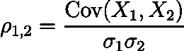
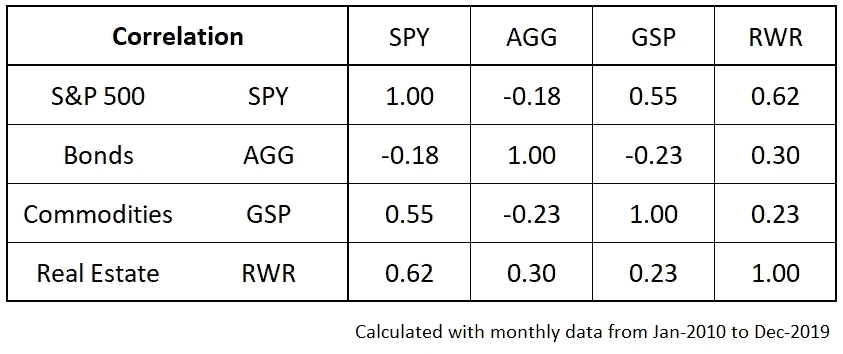
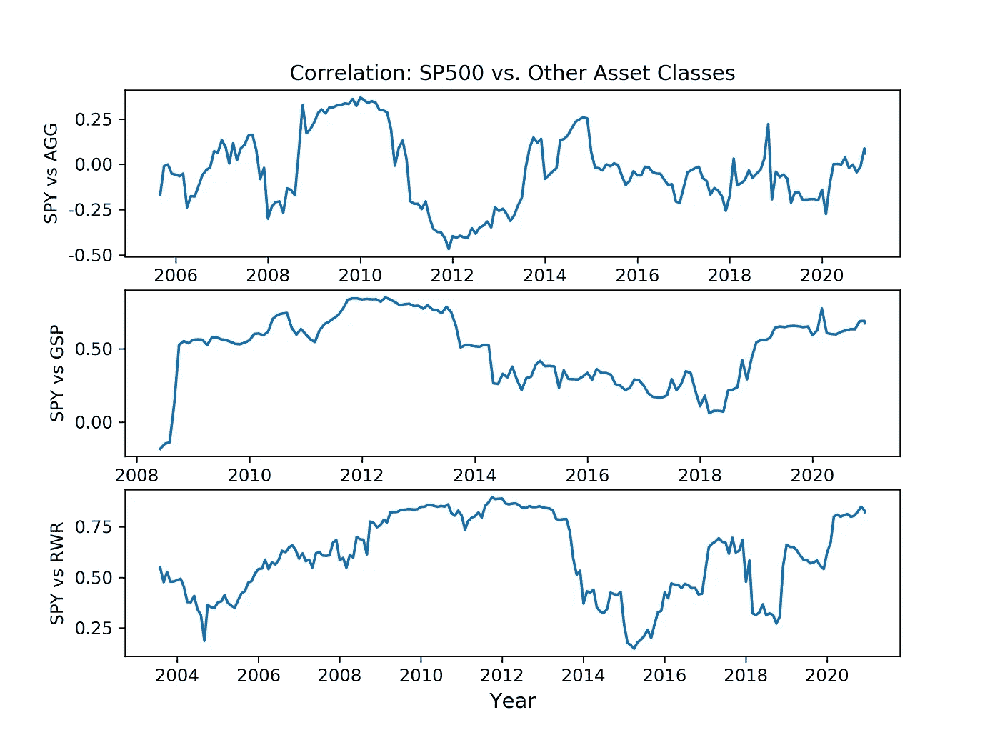
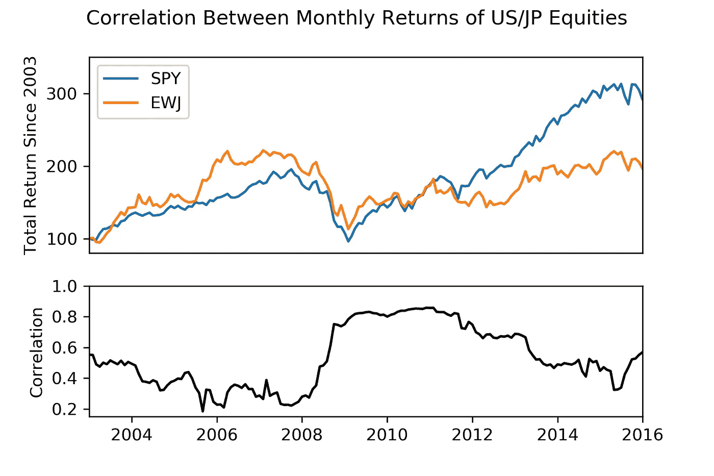
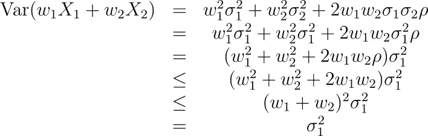

# 隐藏的风险:普通统计工具在金融应用中有缺陷吗？

> 原文：<https://medium.datadriveninvestor.com/hidden-risk-are-common-statistical-tools-defective-for-financial-applications-572521f6842d?source=collection_archive---------14----------------------->

## 波动性和相关性的普通衡量标准可能非常不稳定和误导，大大低估了投资的真实风险。

投资是一项冒险的事业。走错一步，你可能会发现你的现金被烧掉。那么，你如何选择正确的投资呢？你应该相信新闻吗？你应该相信经纪人吗？你应该自己做研究吗？或者你应该花钱请别人来管理你的投资？

更老练的投资者是那些依赖数学和统计学技术的人。这些人从回报和风险的角度比较不同的投资选择，以构建最佳投资组合。

# 降低投资组合的波动性

显而易见，为什么人们想要最大化他们的回报。但是为什么人们试图降低投资组合的波动性呢？在维基百科上可以找到一个不错的列表，但这里有一些关键原因。

*   人们在心理上无法持有波动的投资组合。在暂时的低迷时期，他们可能会怀疑自己，然后卖出。公平地说，投资很难。
*   人们有短期现金流需求，需要投资组合在危机期间有足够的价值。如果投资组合是一个安全网，那么人们每年都需要一个安全网，而不是一年有两个安全网，下一年没有安全网。
*   营销——如果你在管理别人的钱，你经常需要向你的客户展示持续的收益，以说服他们把钱留在你这里。

降低投资组合的波动性是可取的。为了实现这一点，通常使用两种统计工具，要么直接使用，要么作为更复杂工具的基础。它们是:1)标准差，和 2)皮尔逊相关。

# 标准偏差/σ/σ

标准差被用来衡量波动性。它在数学上被定义为方差的平方根，由以下一般公式给出。

Definition of variance.

希腊字母σ (sigma)是标准差。有 T 个时间段，T 是时间步长，μ是 T 个时间段内数据的算术平均值。在实践中，当从金融数据中估计标准差时，您会有一个价格的时间序列，并且您会将它更改为每个时间段之间的回报率(百分比变化)。然后计算退货数据的平均值和标准差。出于技术原因，可以用 T-1 代替分数分母中的 T(给出无偏估计)。其他考虑因素包括数据集的采样频率(例如每日、每周、每月数据)，以及使用多少数据来估计标准差(例如 1 年、3 年、5 年)。

这种方法的一个优点是，它很容易教授给初级金融学生。但是简单和方便并不一定意味着正确或有用。

## 波动可能是非恒定的吗？

用一个数字——标准差——就能充分捕捉到波动性，这有意义吗？通常，我认为答案是否定的。

我获得了三只股票的月度回报数据，并使用 3 年滚动窗口(根据过去 3 年的数据估计)计算了一段时间内的标准差。这三家公司是:

1.  沃尔玛(WMT)
2.  富国银行(WFC)
3.  博施健康公司(BHC)，前身为 Valeant 制药公司

这是结果。

该图显示标准偏差不一定随时间保持不变。

1.  与其他两个国家相比，WMT 似乎相对稳定，但你可以看到，标准偏差有时会慢慢趋向一个方向(2003 年至 2008 年)。
2.  WFC 在 2008 年至 2012 年期间波动剧烈。这可以用全球金融危机来解释，这场危机严重扰乱了银行业。
3.  BHC (Valeant)在 2015 年后表现出剧烈的波动性转变，在短时间内翻了一倍甚至两倍。这可以用这段时间发生的丑闻、调查和做空者攻击来解释。

人们应该依靠标准差来做投资决策吗？

如果波动率估计值只是在几年的时间跨度内缓慢变化，那么人们可能会认为该统计数据对于投资组合的构建仍然非常有用和有益。但是这里展示的行为要极端得多，涉及到几个月时间尺度的剧烈变化。暴力的政权更迭。

 [## 政权转移

### 制度变迁是生态系统、气候、金融系统或其他复杂系统的结构和功能的大规模、突然、持续的变化。

en.wikipedia.org](https://en.wikipedia.org/wiki/Regime_shift) 

有了这种行为，我会对围绕波动性指标过度优化的投资组合产生怀疑。例如，2007 年的一位基金经理可能会狭隘地认为，像 WFC 这样的股票会比 WMT 好，因为其波动性较低。由于被不可靠的统计数据误导，这位基金经理在接下来的几年里将会犯下大错。

## 其他工具基于标准差(和其他易变指标)

也许有人认为标准差在金融中不常用。但不可否认的是，许多在金融领域广泛使用的工具都是建立在标准差基础上的。

一个这样的工具是夏普比率，它试图估计每单位风险的资产回报。无风险回报率(Rf)通常包含在公式中，但最近，利率接近 0%，所以一些公式现在不包含这一点。

有理由认为夏普比率也是非常数和易变的，尽管这将来自对波动率和预期回报的非常数估计。人们不禁要问，夏普比率在投资组合构建中应该扮演什么角色。例如，从 2011 年到 2015 年，Valeant Pharmaceuticals (BHC)看起来像是跑赢大盘的公司，但在 2016 年之后，其风险调整后的回报变成了负值。发生这种情况是因为会计丑闻，这不能反映在夏普比率。

最终，这表明计算出的指标总有突然变化的可能性。

相关性呢？

# 皮尔逊相关/ ρ (rho)

老练的投资者经常使用相关性，因为它与分散投资的想法有关。分散投资是降低投资组合波动性和管理风险的一种非常常见的方式。通过在投资组合中拥有多种资产，许多人在不太了解波动性、相关性或一般数学知识的情况下，将其应用于自己的投资。多样化的好处可以通过下面的等式进行数学论证。

Equation for portfolio variation (2 assets). The weights sum to 1.

随机变量是投资组合中资产的回报率，权重是资产价值占整个投资组合的比例。因此，等式表明，对于整个投资组合，方差取决于:

*   每项资产的个别差异。
*   分配给投资组合中每项资产的权重。
*   资产变动之间的关系(协方差)。

大多数人通过皮尔逊相关系数来衡量资产价格之间的关系，皮尔逊相关系数由这个等式给出。

这是一个介于-1(负线性关系)和+1(正线性关系)之间的数字。值得注意的是，作为相关性的度量，该统计假设不存在极值(异常值)并且关系是线性的—这些假设对于回报数据不一定成立。此外，通常需要相对较大的样本量来准确估计相关性，因此，我认为人们不应该对计算出来的数字看得太深。

在实践中，许多基金经理会构建一个包含股票、债券和大宗商品等多种资产类别的投资组合。人们普遍认为，不同的资产类别是不相关或负相关的。例如，以下链接显示了 Guggenheim Investments 的资产类别相关图，显示了每个资产类别之间计算的相关系数。

 [## 资产类别关联图

### 这些信息旨在提供一般性的信息，不应被理解为投资建议，也不应被理解为…

www.guggenheiminvestments.com](https://www.guggenheiminvestments.com/mutual-funds/resources/interactive-tools/asset-class-correlation-map) 

我看了 2010 年初到 2019 年底的月度数据，计算了四只 ETF 之间的相关性。这些数字与古根海姆投资公司计算的数字非常相似。

相关性表明，普遍的看法是正确的——这些资产类别彼此之间相关性不强，可以组合成一个多样化的投资组合。

然而，这是对过去数据的统计的快速和肮脏的应用。我比较了四只 ETF 的月度数据，计算了三年滚动窗口的相关性。

证据强烈反对恒定的相关性。

1.  我们没有看到围绕中心值的波动(这表明与采样噪声的恒定相关性)。
2.  在某些时期，相关性趋向于一个方向(如 2005 年至 2009 年 SP500 与美国房地产投资信托基金)。
3.  存在相关性突然变化的时期，这可能表明由于经济条件的突然变化或美联储的行动而导致的某种体制转变。

显然，在 10 年期间不加批判地计算的相关性统计并不总是充分反映较短时间内的真实相关性。

但是如果相关性不是常数，这有关系吗？

如果相关性变化很慢/很小，那就没什么大不了的。有些人可能看不出-0.2 和+0.2 之间有什么实际的区别，尤其是如果他们只从“不相关”、“负相关”和“相关”的角度来思考的话。缓慢的变化可以被持续监控，允许投资组合被重建。

然而，如果相关性的显著变化会突然发生呢？我只是展示了这是可能的，而且不同的研究者和实践者在过去已经证明了这一点[。](https://www.sciencedirect.com/science/article/abs/pii/S037843711100570X) [。](https://voxeu.org/article/unusual-usual-during-crisis)T6。

考虑这个假设的场景。有人拥有美国股票(间谍)，并“分散”到 JP 股票(EWJ)。从 2003 年到 2006 年，相关性为 0.29，因此他们可能会得出相关性为低到中等的结论，因此，他们将能够降低投资组合的波动性。由于“风险”更小，他们觉得在投资组合中增加杠杆是安全的。他们建立了可观的头寸，但是当 2008 年开始时，一连串的事件发生了。金融市场出现了大崩盘。不相关的投资组合(~0.29)很快变得相关(~0.80)，随着两只股票一起崩盘，投资组合经历了大幅缩水。

> “只有退潮了，你才知道谁一直在裸泳。”—沃伦·巴菲特

问题是，非常数相关性可能表现为低相关性(表明投资组合波动性低)，但在危机时期会急剧增加(因此，增加了投资组合的波动性)。这和标准差是完全一样的问题。有人可能会被哄骗到一种安全感，就像一座拦水的大坝。他们被引诱接受更多的杠杆以增加回报，但紧急情况最终会出现。没有任何警告，没有任何反应的时间，洪水闸门打开，肆虐。他们被抓了个措手不及——他们过度暴露在市场中。

因此，构建最优投资组合比你想象的要困难得多。过于相信数学/统计学是很危险的。

> "过去的业绩不是未来结果的可靠指标."

# 结束语

## 多样化不是坏事。

我所写的任何东西都没有暗示多样化本身是个坏主意。我认为准确测量相关性是一个有问题的任务。但是，仅仅通过选择随机持有的资产，降低投资组合波动性的可能性非常高。这可以证明如下。

假设两种资产的波动率相等(或者至少相似)，注意相关性总是小于 1。

这表明，如果你购买两种资产而不是一种，你的投资组合方差将总是减少(假设波动率相等)。因此，我并不太担心分散投资的精确方法，只要资产的波动性不会相差太大。通常情况下，简单的多样化应该会奏效，但如果它在危机中未能保护我，我也不会感到惊讶。

## 多样化是一个直觉的想法。

每个公司都有自己独立的管理团队，因此，来自管理决策的风险通常是特殊的(不相关的)。属于同一行业的公司可以分担某些类型的风险(相关)，而不同行业的公司不受影响(不相关)。全球金融危机可能同时影响所有公司(相关)。以这种方式思考世界，你可以在不使用任何数学的情况下实现很好的多样化，对吗？

## 波动总是很重要吗？

有规律的波动是不好的，还是可以接受的？世界上的许多问题都是由过于关注小问题的人造成的。例如，美国的灭火政策被指责为 2020 年加州野火的罪魁祸首。如果当局接受并接受使用小火来燃烧燃料，那么森林就不会那么容易受到大范围的极端野火的影响。

也许这表明我们不应该关心标准差。也许我们应该关心**非标准**偏差——隐藏的宝石、会计欺诈和僵尸企业。

## 数学是通往过度自信的道路

我并不反对金融中的数学/统计。但不难看出，不加批判地应用信息技术会低估风险，并鼓励危险的冒险行为。要明白工具是有限的，工具背后的假设并不总是正确的。因此，不要对工具太有信心。不要过度杠杆化。

> “我的搭档查理说，聪明人破产只有三种方式:酒、女人和杠杆，”他说。“现在事实是——他刚刚添加的前两个，因为它们以 L 开头——这是杠杆。”—沃伦·巴菲特

数学看起来很严谨。有时候你不懂。但是你看到其他使用它的人，他们似乎做了很棒的事情。你肃然起敬。

但是不要被吓倒。人们经常把工具从世界可预测的领域(物理学)转移到世界不总是可预测的领域(经济学、金融学、心理学)。我刚刚展示了这可能导致灾难性的后果，例如——一个对冲基金的两名诺贝尔奖获得者损失了数十亿美元。

 [## 长期资本管理

### 长期资本管理公司(LTCM)是一家总部位于康涅狄格州格林威治的对冲基金，使用绝对回报…

en.wikipedia.org](https://en.wikipedia.org/wiki/Long-Term_Capital_Management) 

*免责声明:本博客仅用于信息和教育目的。作为投资建议的是* ***而非*** *，作者对由此产生的任何经济损失概不负责。*

**访问专家视图—** [**订阅 DDI 英特尔**](https://datadriveninvestor.com/ddi-intel)