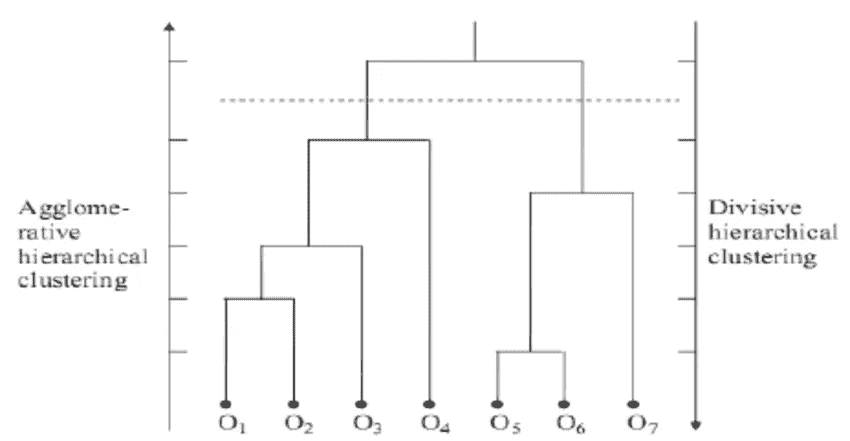
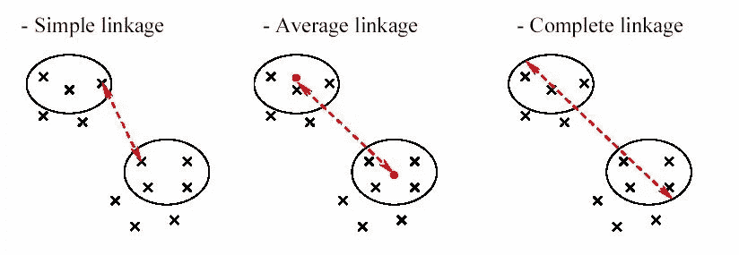

# 分层聚类

> 原文：<https://medium.datadriveninvestor.com/hierarchical-clustering-514b9d1aa2c1?source=collection_archive---------4----------------------->

分层算法基于组合或划分现有组，创建反映组合并或划分顺序的分层结构。

可以使用常见的二叉树术语来解释集群层次结构。根代表要聚类的数据对象集。这是层次结构的顶点。在每个级别，子条目或称为节点被视为整个数据集的子集，对应于聚类。可以通过从当前集群节点到基本单一数据点遍历树来确定每个集群中的条目。层次结构中的每一层都对应于一组集群。层次的基础由所有的单点组成，它们是树的叶子。这种聚类层次结构也称为树状图。为了更容易理解，我们可以说树状图是层次聚类的可视化表示。

 [## 算法诱人的商业逻辑|数据驱动的投资者

### 某些机器行为总是让我感到惊讶。我对他们从自己的成就中学习的能力感到惊讶…

www.datadriveninvestor.com](https://www.datadriveninvestor.com/2019/03/22/the-seductive-business-logic-of-algorithms/) 

根据在一个大的组中合并组或在一个大的组中划分子组所使用的标准，我们可以得出结论，层次方法可以分为凝聚和分裂。

看看下面的图片，我认为它阐明了我上面试图阐述的东西。

[Example of a dendrogram from hierarchical clustering](https://www.researchgate.net/figure/Example-of-a-dendrogram-from-hierarchical-clustering_fig1_48194320)

# 凝聚聚类

基本凝聚聚类的关键操作是计算两个聚类之间的接近度。首先，通过使用接近度来创建相异矩阵，并且所有的数据点都构成在树状图的底部。在每一层合并最近的聚类集，然后更新相异度矩阵。这种合并过程一直持续到最终的集群被创建。

基本凝聚聚类

**1。**如有必要，计算邻近矩阵。
2**。** *重复*
**3** 。合并最近的两个集群。
**4。**更新邻近度矩阵，以反映新聚类和原始聚类之间的邻近度
**5。** *直到*只剩下一个簇

因此，在进行任何聚类之前，我们需要使用距离函数来确定包含每个点之间距离的邻近度。因此，聚类邻近度的定义区分了被称为链接度量的各种聚集层次技术。

## 链接度量

[Linkage metrics](http://compbio.pbworks.com/w/page/16252903/Microarray%20Clustering%20Methods%20and%20Gene%20Ontology)

***单一连锁-*** 将聚类邻近度定义为不同聚类中的两个点之间的最短距离。因此，这种方法更重视聚类最接近的区域。

***完全连锁-*** 将聚类邻近度定义为不同聚类中的两个点之间的最远距离。这种方法考虑了簇的结构，并且通常获得紧凑形状的簇。

***群组平均连锁-*** 将群组邻近度定义为两点之间的平均距离。在不同的星团里。这种方法的计算成本很高，尤其是当数据对象的数量变大时。

# **分裂聚类**

分裂式层次聚类是一种自顶向下的方法。该过程从所有数据点的根开始，然后递归地分割它以构建树状图。

基本分裂聚类

**1。**从包含所有数据点的根开始。
**2。**重复
3。将父节点分成两部分。
**4。**构建树状图。
**5。** *直到*获得单叶。

如果我们将分裂法与凝聚法进行比较，我们可以得出这样的结论:分裂法更有效，特别是当不需要保证一个完整的层次结构直到单个叶子的时候。

使用分层技术开发了许多算法:代表聚类(CURE)、变色龙、平衡迭代归约和分层聚类(BIRCH)。

## 参考

聚类分析:基本概念和算法，第 516 页

数据聚类:算法和应用(查普曼和霍尔/CRC 数据挖掘和知识发现系列，第 101–105 页