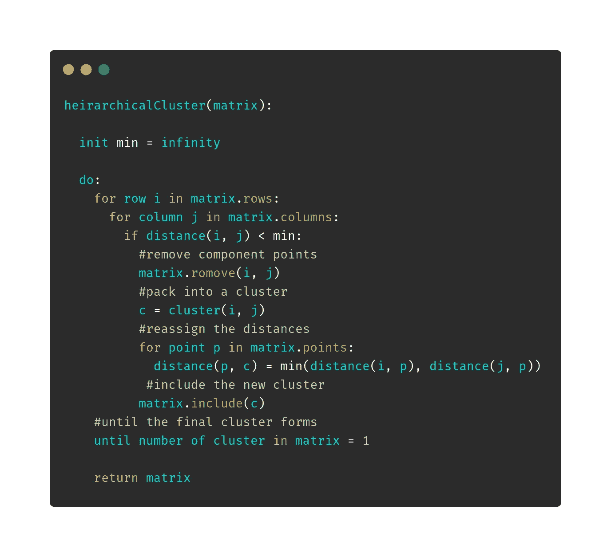
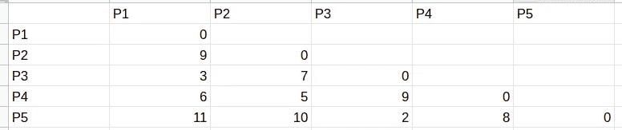
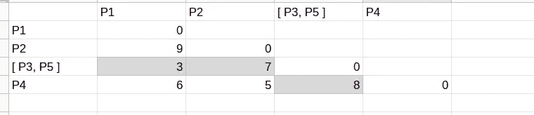
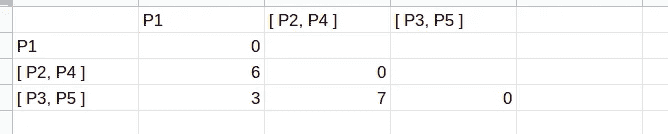

# 层次聚类与算例

> 原文：<https://medium.datadriveninvestor.com/hierarchical-clustering-with-a-work-out-example-b5b0c86f9c53?source=collection_archive---------15----------------------->

Photo by [Amanda Mocci](https://unsplash.com/@amandamocci?utm_source=medium&utm_medium=referral) on [Unsplash](https://unsplash.com?utm_source=medium&utm_medium=referral)

假设您有一堆点(或对象，假设每个点或对象之间有合理的相似性)，现在您想将它们排列成漂亮的小桶，但问题是您不知道要将它们划分成多少个不同的集合。所以你不能使用 k 均值或任何相关的均值(很明显，因为 k 的值是未知的或不可能被猜到的)。你现在能做什么？那我们就分等级吧！

好吧，玩笑归玩笑😉。分层聚类的思想是构建从上到下具有主导顺序的聚类([到这个站点](https://www.kdnuggets.com/2019/09/hierarchical-clustering.html)，非常棒的解释)。在这一集里，我们来看看层次聚类建立的基础，它的分类，算法，以及一如既往的建立牢固概念的例子。

**请注意**这不是介绍性的文章(如果这是你要找的，那么[这里有一篇大师级文章](https://towardsdatascience.com/hierarchical-clustering-explained-e58d2f936323))，所以我假设你已经对层次聚类有了大致的了解。这篇博文的目的是展示算法的内部机制，我的目标是通过解决一个例子来实现。

 [## 什么是数据目录，它如何使机器学习取得成功？数据驱动的投资者

### 数据目录是机器学习和数据分析的燃料。没有它，你将不得不花费很多…

www.datadriveninvestor.com](https://www.datadriveninvestor.com/2020/08/27/what-is-a-data-catalog-and-how-does-it-enable-machine-learning-success/) 

# 为什么要分层聚类

不知道 k 值的事实不够直观。所以我想出了这个例子。比方说，你正在研究地理对文化的影响，假设你从亚洲开始。在亚洲，有受印度文化影响的国家，它们可能形成一个集群(比如集群的名字是印度)，然后有受中国文化影响的国家形成另一个集群(集群中国)，这些是第一级集群。这两个集群将合并成一个更大的集群(比如印度支那)，因为印度和中国文化可能有相似之处，这是第二级集群。假设这个第 2 级集群与另一个第 2 级集群(比如波斯集群)合并，形成第 3 级集群，这就是亚洲本身(为了说明的目的而过于简化)。一开始，每个国家都是一个 0 级的集群。我想解释的是，当除了聚类之外，还需要知道聚类及其组件和聚合之间的关系时，就使用这种聚类技术。希望这个疯狂的例子对读者有所启发。

# 分类。

大致有两种类型。

**agglomerate**:在这个类中，每个迭代步骤中的单个簇合并成一个更大的簇，直到出现一个大簇。一个集群包含所有这些！

**分裂**:顾名思义，它的工作方式正好与凝聚相反，分解较大的集群，直到每个集群都由一个项目组成。我们将主要关注凝聚集群，因为我们相信建设而不是破坏，只是开玩笑😜。

# 该算法

用文字描述，我们得到一个距离矩阵，首先(我们马上会看到它是什么样子)包含点之间的成对距离。我们要做的是把独立的点打包成簇。我们从具有最小距离的两个点开始，并将它们包括在一个聚类中。然后测量重新考虑矩阵，并用当前最小距离打包点，注意，在确定距离时，每个新形成的簇被视为普通点。现在出现的一个大问题是如何计算一个星团和一个点之间的距离？为了客观地看待这个问题，假设我们有一个集群[A，B]和一个独立的点 C，如何计算距离呢？事实证明，有很多方法可以做到这一点。

1.  最小方法:这里的距离是成对距离的最小值，就像上面的例子一样，

> d([A，B]，C) = min(d(A，C)，d(B，C))。

这也称为单联动。

1.  最大接近度:两两距离的最大值。
2.  平均值:两两距离的平均值。喜欢

> d([A，B]，C) = (d(A，C) + d(B，C)) / 2

现在，这些绝不是唯一使用的指标，有相当多的指标，如加权/未加权平均值、沃德距离等。好吧，我听到你在问用哪一个。这取决于您正在处理的数据集、数据的分散程度、您想要从中获得什么以及其他一些因素。根据数据科学家的说法，尝试所有方法，然后决定最好的结果来自哪里，这可能是一个明智的选择。到目前为止，我将在本文的其余部分使用单一链接度量。半正式伪代码可能看起来像这样，

# 小锻炼

在这个例子中，我将使用下面的距离矩阵，

请注意，对角线被置零，矩阵是下三角形，因为从一个点到它自己的距离被认为是 0，距离需要打印一次。

首先，搜索距离最小的一对。也就是 2，点 3 和点 5 之间的距离。所以把它们聚集起来，像这样展示，

有相当多的观察要做。首先，矩阵的维数下降了 1，从 5 x 5 降到 4 x 4。然后重新排列距离(用灰色标记的是感兴趣的距离，其余的只是从以前的状态复制下来的)。

对距离调整的了解不多:

> d([P3，P5]，P1) = min (d(P3，P1)，d(P5，P1)) = min(3，11) = 3
> 
> d([P3，P5]，P2) = min (7，10) = 7
> 
> d([P3，P5]，[P3，P5]) = 0
> 
> d([P3，P5]，P4) = min (8，9) = 8

这是第一次迭代。然后重复相同的计算，直到剩下最后一个集群。这是第二次迭代后矩阵的样子，

我想你已经明白了这个概念，并且可以很好地从这里继续下去。只需选择最短的距离，并将端点打包到一个新的集群中。仅此而已。

希望这能帮助你处理所有的分支。一如既往，保持冷静！

## 访问专家视图— [订阅 DDI 英特尔](https://datadriveninvestor.com/ddi-intel)