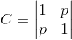
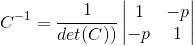
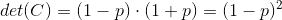
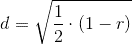
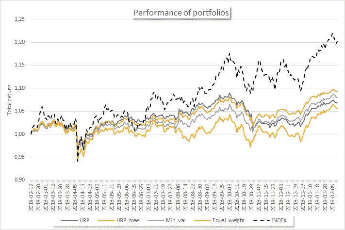
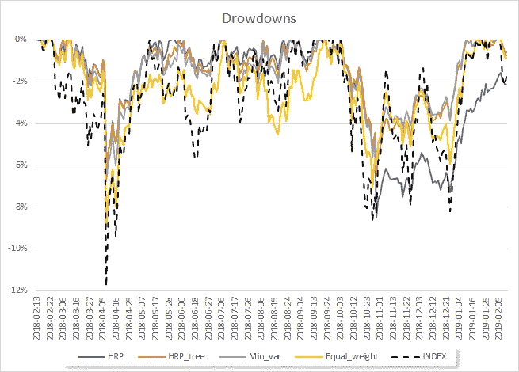
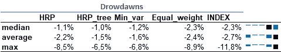
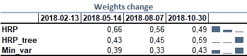
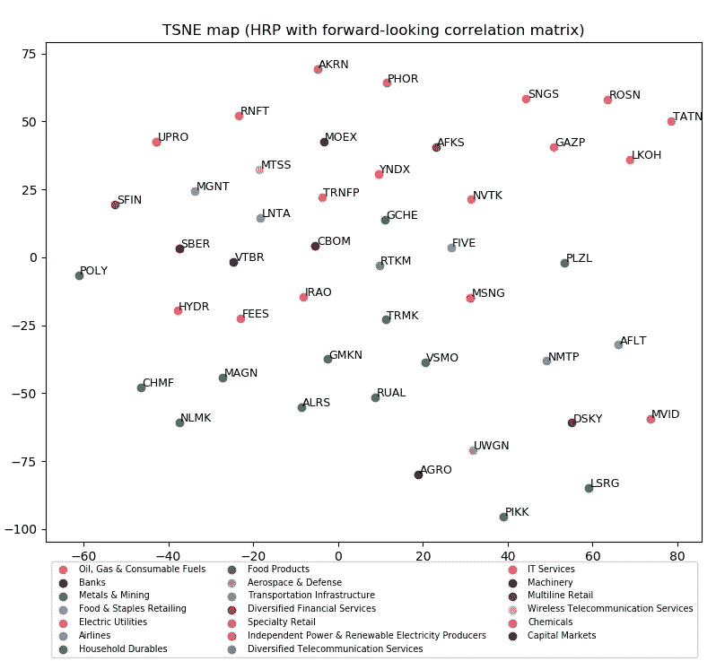

# 投资组合构建中的分级风险平价

> 原文：<https://medium.datadriveninvestor.com/hierarchical-risk-parity-in-portfolio-construction-fc368db18c78?source=collection_archive---------3----------------------->

这是马科斯·洛佩斯·德·普拉多文章( [1](https://www.amazon.com/Machine-Learning-Managers-Elements-Quantitative/dp/1108792898) 和 [2](https://papers.ssrn.com/sol3/papers.cfm?abstract_id=3484152) )在投资组合优化过程中的一个实际应用。更具体地说，我将概述分级风险平价方法( **HRP** ，以及它的一个变体——**理论隐含相关性矩阵方法**。文章中的大部分代码来自 Prado 教授的文章，并根据我的需要进行了调整。

这篇文章有四个部分:

1.  **第一部分:**关于协方差和相关矩阵的一个问题
2.  **第二部分:**HRP 方法的机制讨论
3.  **第三部分:**HRP 与理论隐含聚类树的变异
4.  **第四部分:**方法在俄罗斯股票市场的应用

# 第一部分:马科维茨投资组合有什么问题

Markovitz 问题是一个二次优化问题，其中一组资产被优化以获得最高的风险调整回报。简单地说，我们试图优化预期收益率与预期波动率之比(所谓的夏普比率)。在统计术语中，我们优化投资组合收益分布的一阶(均值)和二阶(波动率)矩的比率。如果资产相对不相关，这种方法就能很好地发挥作用。

Marcos de Prado 给出了一个直观的例子，说明为什么资产之间的高度相关性会导致优化问题的不稳定性。

考虑两个资产的相关矩阵:

然后，C 的倒数由下式给出

det(C)代表行列式

p(相关性)偏离 0 越多，行列式越少，逆矩阵越多。如果你有十几只股票，而且其中至少有一些来自同一个行业，比如说**能源**，不稳定性就成了一个真正的问题。

最近，大量的方法，试图将自己与 Markowitz 方法区分开来。例如:[风险平价组合](https://medium.com/@andreybabynin/portfolio-construction-overview-equal-risk-mean-variance-equal-weight-5efb6f451309)。

 [## 更好的预算，打造更大的|数据驱动型投资者

### 即使是专家也承认它们并不完美。从 1 到 10 的范围内，安东尼·科普曼和德尔…

www.datadriveninvestor.com](https://www.datadriveninvestor.com/2018/11/08/budget-better-to-build-bigger/) 

普拉多教授引入了另一个概念，延续了传统:分级风险平价，或简单地说，多级风险优化。

# 第 2 部分:HRP 方法

这个想法很简单:如果我们有一些股票，它们之间的相关性比其他股票更大，那么让我们首先在它们之间分散权重，然后在这个相关股票组和其他股票组之间分散权重。例如，如果你的投资组合中有可口可乐和百事可乐，首先在它们之间建立权重，比如说 60/40，然后将它们作为一个整体来进一步分散投资。你可能会发现可口可乐和百事可乐加起来占 10%，所以可口可乐和百事可乐分别占 6%和 4%。

嗯，听起来像一个经典的聚类问题，我们应该找到每个股票和其他股票之间的距离。

距离度量

其中 **r** —相关性

这个新的距离度量允许我们测量两列向量之间的距离。

接下来，有几个步骤:

1.  树聚类

2.准对角化

3.递归二分法

顾名思义，树聚类的思想是基于前面给出的距离度量来识别聚类。**准对角化**重组协方差矩阵的行和列，使最大值位于对角线上。**递归二分法**是一种自上而下的方法，根据投资组合总方差的反比在子集之间分割投资组合权重。

# 第 3 部分:知识树和理论隐含相关矩阵

知识树背后的思想与前一部分有关:

> 如果我们有一些基于相关性分析的层次树，我们可以使用其他树来实现这个目的吗？

答案是肯定的，我们可以。一个例子是 [GICS 分类](https://en.wikipedia.org/wiki/Global_Industry_Classification_Standard)，它使用四级系统进行分类(部门—行业组—行业—子行业)。

> 来自相关矩阵的经验树如何与分类表相关联？

好吧，在理想世界中，它们是相似的，但在现实中，它们可能会显著偏离。知识树试图克服相关性的主要缺点——线性特性。因此，这种方法的美妙之处在于，我们可以将自己的观点强加于数据聚类。在市场动荡的情况下，当协方差和相关性可能急剧增加时，这一点尤其重要。

# 第四部分:来自俄罗斯股票市场的证据

我在 2018 年从 MOEX 指数中选取了 46 家公司，并安排每 60 个交易日进行一次重新配置，这大致相当于一个季度。

2018 年有 5 个投资组合:

1.  具有从相关矩阵中导出的聚类树的分级风险平价( **HRP** )
2.  另一个带有 GICS 分类聚类树的 HRP(**HRP _ tree**)
3.  等风险贡献投资组合(你可以在这里阅读)(**Min _ var**)
4.  等权重投资组合
5.  MOEX 指数( [MCFTR](https://www.moex.com/en/index/totalreturn/MCFTR) — Moex 总回报指数)

显然，估计有几个缺点:1)用了一年，2)每次都从一个日期点开始，3)没有尝试使用蒙特卡罗。好吧，在我的辩护中，我可以说我没有试图建立一些投资建议，而是想展示方法本身，而不是比较表现。

除了指数在所有投资组合中产生最大的回报，它也是最不稳定的一个。在风险最小化的投资组合中，引人注目的是 ***HRP_tree*** 第二个跑赢其他人。

Precise statistics about drowdawns

不同寻常的是， **HRP** 和 **HRP_tree** 与等风险投资组合(Min_var)等更简单的方法相比，没有给出任何合理的提款减少。

另一种测试方法是比较体重随时间的变化。我总结了每只股票在不同时期的绝对变化。很明显，对于等权重的投资组合，到处都是 0。

Statsitics about cumulative weights change

这幅图相当令人惊讶:无论是 **HRP** 还是 **HRP_tree** 的权重变化都低于等风险投资组合(Min_var)。

此外，我决定使用 [TSNE 方法](https://en.wikipedia.org/wiki/T-distributed_stochastic_neighbor_embedding)来可视化聚类，看看聚类的可识别性如何。

我不能说集群是容易识别的，但是，有一群俄罗斯的*‘蓝筹股’*:ROS neft(**ROSN**)、Lukoil ( **LKOH** )、Gazprom ( **GAZP** )、Tatneft ( **TATN** )和 Surgutneftegaz ( **SNGS** )与其他公司截然不同。图中间的金属&矿业公司( **NLMK** 、 **ALRS** 、**马格**、 **GMKN** 等)也形成集群。

总之，普拉多教授在档案袋形成领域做出了巨大贡献。我深信 HRP 可以与包括二次优化在内的其他流行方法配合使用。它扩展了可用方法的范围，增加了 ML 概念，如聚类。但是，它不是万能的。

你可以在这里找到所有代码[。你也可以在](https://github.com/andreybabynin/HRP) [Linkedin](http://www.linkedin.com/in/ababynin) 和我联系。