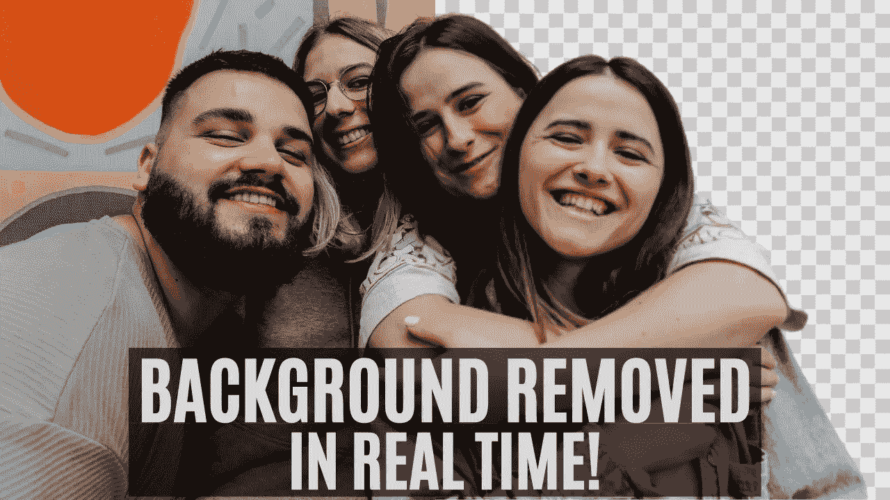
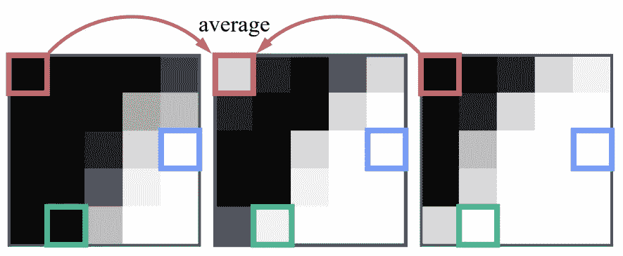

# 没有绿屏的高质量背景消除

> 原文：<https://medium.datadriveninvestor.com/high-quality-background-removal-without-green-screens-8e61c69de63?source=collection_archive---------1----------------------->

## 这种新的背景去除技术可以从单个输入图像中提取一个人，而不需要实时的绿色屏幕！

> 最初发表于 [louisbouchard.ai](https://www.louisbouchard.ai/remove-background/) ，前两天在[我的博客](https://www.louisbouchard.ai/tag/artificial-intelligence/)上读到的！

Image by Author

## 介绍

人体抠图是一项非常有趣的任务，目标是找到照片中的任何人，并从照片中移除背景。由于任务的复杂性，这真的很难实现，必须找到具有完美轮廓的人。在这篇文章中，我回顾了多年来使用的最佳技术和 2020 年 11 月 29 日发表的一种新颖的方法。许多技术正在使用基本的计算机视觉算法来完成这项任务，例如 GrabCut 算法，它速度极快，但不是很精确。

## grab cut[【4】](https://docs.opencv.org/3.4/d8/d83/tutorial_py_grabcut.html)

Image by Author

该 GrabCut 算法基本上使用高斯混合模型来估计前景项目和背景的颜色分布。我们在感兴趣的对象(前景)上绘制一个矩形，并通过绘制算法未能向前景添加像素或从前景中移除一组像素的部分来迭代地尝试改善结果。这就是为什么我们经常使用“绿色屏幕”，帮助算法只移除绿色像素，而将其余的像素留在最终结果中。但是，当我们无法进入这样一个绿色屏幕时，结果就不那么好了。

 [## 医生管理工作量增加时的深度学习|数据驱动的投资者

### 行政工作量是我们这个时代大多数医生所经历的众多负担之一。医生，尤其是…

www.datadriveninvestor.com](https://www.datadriveninvestor.com/2020/11/27/deep-learning-amid-increased-physician-administrative-workload/) 

## 深度图像抠图[【3】](https://sites.google.com/view/deepimagematting)

现代深度学习和我们 GPU 的能力使我们有可能创建更强大的应用程序，但这些应用程序还不完美。这里最好的例子是深度图像抠图，由 Adobe Research 在 2017 年做出。这种模型的一个版本目前在大多数网站上被用来自动移除图片的背景。不幸的是，这种技术需要两个输入:一个图像和它的三分图。三分图基本上是图像在三个层次上的表示:背景、前景和像素被认为是前景和背景的混合的区域。看起来像这样。

A red fox (left) and its trimap (right). Image by Author

为了使用深度图像抠图技术成功地去除背景，我们需要一个强大的网络，能够比较准确地定位这个人。然后，我们产生一个分割，其中相当于人的像素被设置为 1，图像的其余部分被设置为 0。接下来，我们使用基本的计算机视觉转换从这个分割创建三分图。我们首先通过腐蚀来减小分割对象的尺寸，为未知区域留下一点空间，迭代地移除对象轮廓处的一些像素。之后，我们添加第三部分，这是未知区域，通过扩大对象，在轮廓周围添加像素。产生这样的结果。这个三分图是一个发送到深度图像抠图模型与原始图像，你得到你的输出。你可以看到这项技术需要多大的计算能力。使用两个强大的模型，如果你想达到比较准确的结果。

Trimap progression. Segmentation of the object (left), erode the segmentation (middle), add the unknown region with dilations (right). Image by Author.

正如你刚刚在封面图片上看到的，当前最先进的方法非常准确，但它们需要几秒钟，有时甚至几分钟才能找到单幅图像的结果。你可以想象处理整个视频需要多长时间。

## MODNet[【1】](https://arxiv.org/pdf/2011.11961.pdf)

Human Matting framework. “a) We train MODNet on the labeled dataset to learn matting sub-objectives from RGB images. b) To adapt to real-world data, we finetune MODNet on the unlabeled data by using the consistency between sub-objectives. c) In the application of video human matting, our OFD trick can help smooth the predicted alpha mattes of the video sequence.” from [Ke, Z. (2020) [1]](https://arxiv.org/pdf/2011.11961.pdf)

幸运的是，这项新技术可以从单个输入图像中处理人体抠图，而不需要绿色屏幕或三分图，实时速度高达每秒 63 帧！他们称他们的网络为:MODNet。这是一个轻量级的抠图目标分解网络。我们将进一步详述。他们以监督和自我监督的方式训练他们的网络。受监督的方法接受输入，并学习根据相应的基础事实去除背景，就像通常的网络一样。然后，是自我监督的训练过程。这被称为自我监督，因为这个网络不能访问它被训练的视频的基本事实。它使用未标记的数据，并可以访问上一步中找到的信息，这些信息是网络的参数。它基本上采用了第一个网络所学习的内容，并理解了每一帧中对象之间的一致性，以正确地去除背景。这两段训练是在 MODNet 架构上进行的。MODNet 基本上由三个主要分支组成。

MODNet architecture. Image from [Ke, Z. (2020) [1]](https://arxiv.org/pdf/2011.11961.pdf)

有一个低分辨率分支估计人类语义。然后，基于这些结果、原始图像和图像的地面真相，高分辨率分支专注于检测精确的人体边界。最后，添加一个融合分支，也由整个地面真相遮罩监督，以预测阿尔法遮罩的最终结果，该结果将用于移除输入图像的背景。这种网络架构速度更快，因为它首先发现语义估计本身，使用低分辨率分支内的基本解码器，使其处理速度更快。可以看到，网络基本上主要由下采样、卷积和上采样组成。可以使用任意的 CNN 架构，在这种情况下，他们使用 MobileNetV2，因为它是为移动设备设计的。与其他最先进的架构相比，它是一个小型网络，效率极高。如果你不熟悉卷积神经网络，或者 CNN，我邀请你观看我制作的解释它们是什么的视频。

下采样和在高分辨率分支中使用较少的卷积层是为了减少计算时间。这个融合分支只是一个 CNN 模块，用于结合语义和细节，如果我们想要语义周围的精确细节，就必须进行上采样。最后，使用深受深层图像抠图纸启发的损失来测量结果。它计算输入图像和从地面真实前景和地面真实背景获得的合成图像之间的绝对差。现在，这个网络的架构还有最后一步。如果我们回到这里的完整架构，我们可以看到他们应用了所谓的一帧延迟。该方法利用前一帧和后一帧的信息来确定在前景和背景之间徘徊的未知像素。

Image from [Ke, Z. (2020) [1]](https://arxiv.org/pdf/2011.11961.pdf)

在这里，您可以看到一个例子，其中前景在三个连续的帧中稍微向左移动，像素没有对应于它应该对应的像素，红色像素在第二次迭代中闪烁。

然后，你得到了提取前景物体的最终结果，在这个例子中是一个人，你可以添加许多不同的背景。

Results example using MODNet. Image via [MODNet’s GitHub project [2]](https://github.com/ZHKKKe/MODNet).

## 结论

当然，这只是这篇新论文的一个简单概述。我强烈推荐阅读论文[【1】](https://arxiv.org/pdf/2011.11961.pdf)来更深入地了解这项新技术。正如他们在自己的页面上写的那样，代码和预训练的模型也将很快在他们的 Github[【2】](https://github.com/ZHKKKe/MODNet)上可用。两者都在下面的参考文献中链接。

如果你喜欢我的工作并想支持我，我会非常感谢你在我的社交媒体频道上关注我:

*   支持我的最好方式就是跟随我上**。**
*   **订阅我的[YouTube 频道 。](https://www.youtube.com/channel/UCUzGQrN-lyyc0BWTYoJM_Sg)**
*   **在 [**LinkedIn**](https://www.linkedin.com/company/what-is-artificial-intelligence) 上关注我的项目**
*   **一起学习 AI，加入我们的 [**Discord 社区**](https://discord.gg/SVse4Sr) ，*分享你的项目、论文、最佳课程，寻找 Kaggle 队友，等等！***

## **参考**

**[1]柯，z .等人，[实时人体抠图真的需要绿屏吗？(2020)](https://arxiv.org/pdf/2011.11961.pdf) ，
【2】柯，z .， [GitHub for 实时人体抠图真的需要绿屏吗？](https://github.com/ZHKKKe/MODNet)(2020)
【3】徐，n .等人[深度图像抠图— Adobe 研究](https://sites.google.com/view/deepimagematting)(2017)
【4】[GrabCut 算法由 OpenCV](https://docs.opencv.org/3.4/d8/d83/tutorial_py_grabcut.html)**

## **访问专家视图— [订阅 DDI 英特尔](https://datadriveninvestor.com/ddi-intel)**