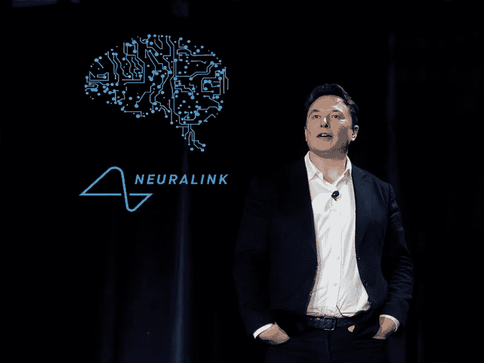
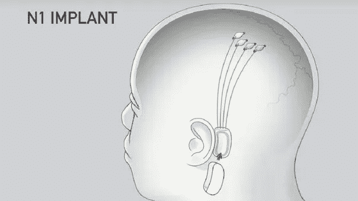
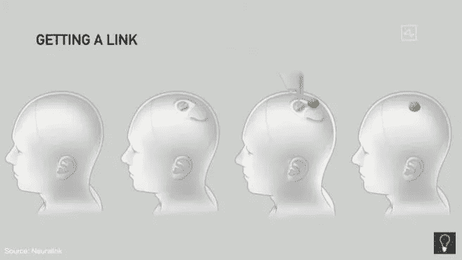
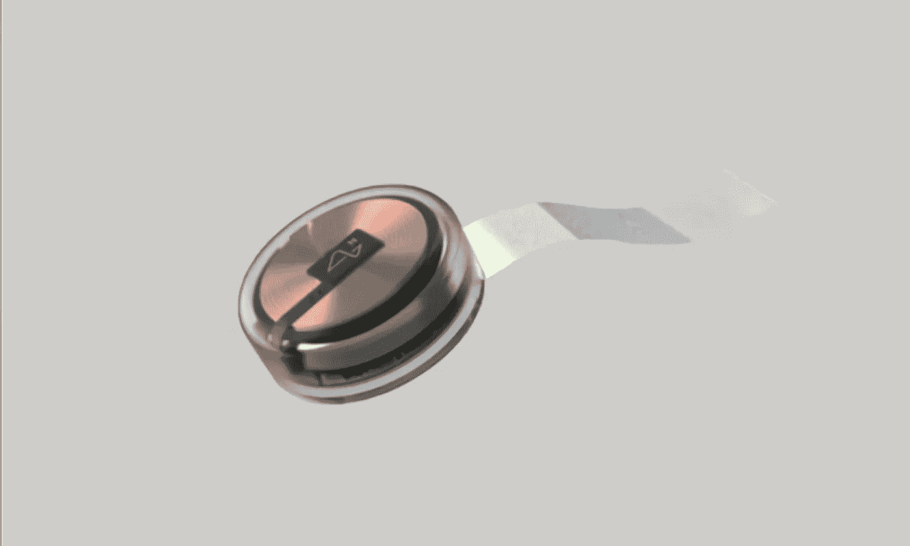

# NeuraLink 演示的亮点

> 原文：<https://medium.datadriveninvestor.com/highlights-of-neuralinks-presentation-ddba1890e37a?source=collection_archive---------1----------------------->

## 埃隆·马斯克又一次冒险的最新进展

昨天，(2020 年 8 月 28 日)埃隆·马斯克对他的大脑植入公司的技术状态进行了一次非常令人期待的更新:**。**

**对于那些不知道的人来说，该公司的目标是**开发神经接口**(电子设备和你的大脑之间的连接)，目标是能够监控你的大脑活动(在演示中我们可以看到它如何精确跟踪猪的关节运动)，最终还能够通过监控和行动来治疗某些疾病。**

****

**2019 version of Neuralink’s Device**

**去年向公众展示的版本看起来像左图所示的设备，其中一些电子设备被放置在你的头骨内，但也必须在你耳朵后面的某个地方部署一个皮肤上的设备。**

**今年的版本名为 ***链接*** ，是 100%在你的脑袋里面，具体替换你头骨的一部分，如下图所示。**

****

**2020 version of Neuralink’s device**

****

**The device: The Link**

**这个设备有一枚大硬币大小，将通过一个完全自动化的程序被放置在你的大脑中，由一个高度精确的机器人在你的头骨上开一个切口，取出硬币大小的一大块，用链接代替，并将微电缆连接到你的大脑。正是通过这些小得令人疯狂的传导，来自你的神经元的信号将被传输到设备。**

****整个安装过程可能需要大约一个小时**，并且不需要任何延迟，所以假设您可以在早上进行手术，下午就可以回家了。此外，不需要全身麻醉，并且如果需要的话，该装置可以在安装后取出，不会有进一步的并发症。**

**最后要知道的是，该设备是无线充电的，每天晚上都需要充电，尽管没有具体说明如何充电。**

**在演示快结束时，马斯克和他的团队回答了一些非常有趣的问题。例如，设备的初始价格是多少，一旦技术普及，最终价格是多少。**

**对我来说，这是一个很有趣的问题。它会是只有富人才有的东西吗？**富人会成为超能力的半机械人吗？****

**在他的回答中，Elon 回避了最初的价格问题，他说一开始肯定会很贵，但目标是设备推出后的最终价格应该在几千美元的范围内。**

**不是贵得离谱，但也不是非常实惠。**

**此外，他们还谈到了像这样的神经接口可能的疾病治疗能力，强调了它如何用于治疗截瘫或脊髓损伤的人，可能会使他们得到治愈。**

** [## 优化业务技术的策略|数据驱动型投资者

### 无论你的行业、产品或服务是什么，技术对公司整体的重要性…

www.datadriveninvestor.com](https://www.datadriveninvestor.com/2020/02/15/strategies-for-optimizing-your-business-technology/) 

最后，一个类似矩阵的时刻到来了，他们谈论像这样的设备如何最终被用于**将你的记忆**下载到另一个身体(可能是机器人)或者甚至将技能上传到你的大脑。

马斯克说，他相信这最终会实现，对我来说，这可能是一个过于强烈的说法，但谁知道呢。

无论如何，像这样的技术的可能的**能力是有希望的**，我们只需要等待看看在人类身上的试验如何进行(目前只在猪身上进行了试验，因为这些动物和人类的大脑有相似之处)，以及其潜力可以被充分开发的实际应用的发展。

在下面的 Youtube 视频中，您可以找到演示的摘要:

*就是它！一如既往，我希望你* ***喜欢这个职位。***

*还有，如果你想了解更多关于机器学习和人工智能的知识* [***关注我上媒***](https://medium.com/@jaimezornoza) *，敬请关注我的下期帖子！此外，您可以查看* [***这个资源库***](https://howtolearnmachinelearning.com/) *以获得更多关于机器学习和人工智能的资源！*

## 访问专家视图— [订阅 DDI 英特尔](https://datadriveninvestor.com/ddi-intel)**