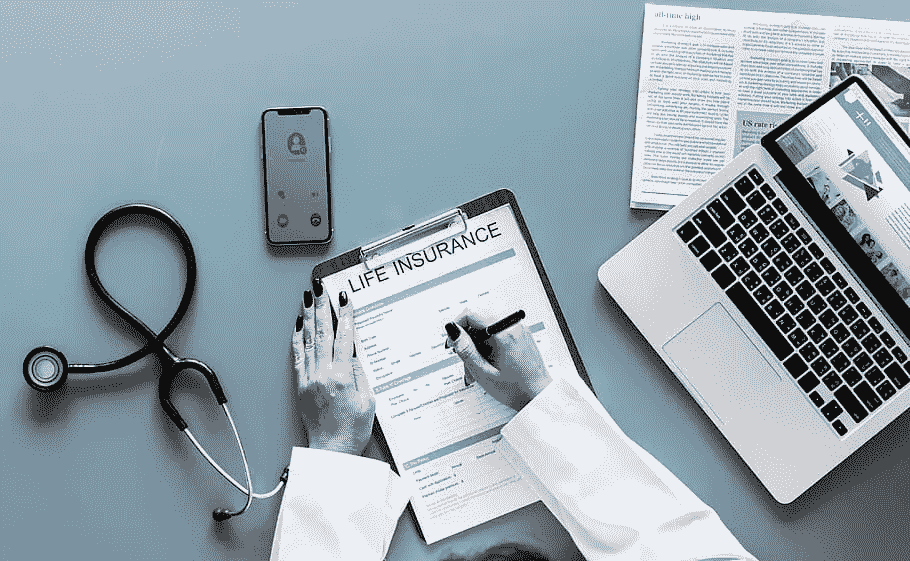

# HIPAA 纪律的 PHI，死亡后，为修改或未经授权的披露

> 原文：<https://medium.datadriveninvestor.com/hipaa-discipline-of-phi-after-death-for-modification-or-unauthorized-disclosure-132cf0f9aba1?source=collection_archive---------11----------------------->

*HIPAA 和 PHI*

PHI 或受保护的健康信息是个人数据，如姓名、出生日期、地址、处理历史、财务信息。PHI 被定义为由 HIPAA 覆盖的实体创建、收集、传输或维护的与个人过去、现在或未来健康状况相关的个人身份信息，与医疗保健服务的提供、支付或医疗保健操作中的使用相关。在医疗行业的组织选择使用哪种技术之前，他们必须确保该技术符合 HIPAA(参见我的[细节](https://medium.com/datadriveninvestor/google-amazon-and-compliance-on-protected-health-information-11fb15dfb1a4))。

*健康保险可移植性和责任法案(HIPAA)* 是 1966 年的一项法律，由时任美国总统的比尔·克林顿颁布，该法律要求使用受保护健康信息的组织采取行政、技术和物理安全措施来保护 PHI。此类实体可能会在没有患者明确书面许可的情况下向某些方披露 PHI，以促进他们的治疗、支付或医疗保健操作，但通常任何其他披露都需要个人的书面许可，并尽合理努力将信息限制在严格必要的范围内。

 [## 人们对隐私的不理解是什么？

### 你知道那种感觉。无论是访问应用程序、订阅还是你最喜欢的运动鞋。你按下…

www.datadriveninvestor.com](https://www.datadriveninvestor.com/2019/04/11/privacy-and-convenience/) 

在像医疗保健这样敏感的领域，管理隐私的规则必须延伸到患者生活之外，以便以适当的方式保护敏感信息。

*φ和宰后处理*

***事实上，HIPAA 将 PHI 的保护期延长至患者死亡后 50 年*** ，采用相同的行为规则，监督活着的患者的相同信息，只是美国卫生与人类服务部(HHS)制定了一些例外，或者更确切地说，一些特殊规则。

在以下情况下，允许披露已故患者的 PHI:

-当怀疑死亡是由犯罪行为造成时，有必要将个人的死亡通知执法部门；

-验尸官或法医和丧葬承办人；

-用于研究；

器官获取组织或参与器官获取、移植或器官捐赠的其他实体；

-个人死亡前参与个人保健或支付保健费用的家庭成员或其他人，除非这与已故个人先前表达的、所涉实体所知的任何偏好不一致。

除了这些明确和详细的情况，只有在授权披露的委托代表事先书面同意的情况下，才允许披露。

然而，在有些情况下，死者也禁止向家庭成员披露健康信息:在这些情况下，除非家庭成员也是遗嘱的执行人，否则卫生部会提供死者健康记录的信息，即使死者并不知道死者的禁令:*在这种情况下， 承保的健康专家可向家属披露与死者相关且受保护的健康信息，且家属有权从死者的病历中获得相关信息的副本，无论死者之前是否反对*。

此外，在以下情况下，所涵盖的实体可以向家庭成员的主治医生披露死者的个人健康保险，即使没有授权:

-信息与照顾幸存亲属有关；

——是代表，比如遗嘱执行人。

根据 HIPAA，指导特定数据处理的规则必须非常灵活，以便在这样一个“至关重要”的领域不损害个人健康，同时尊重关于隐私和数据警戒的规定。

*PHI 和修改*

在立法中，也明确规定了对 PHI 的修改，有时 ***受保实体可以决定拒绝受试者*** 要求的修改，如果受保护的健康信息或文件要求:

-不是由所涵盖的实体创建的(除非请求更改的个人提供合理的依据，认为受保护健康信息的作者不再愿意对所请求的更改采取行动)；

-不是*指定记录集*的一部分；

-根据 HIPAA 隐私规则*不能接受检查；*

-已经准确完整了。

在这种情况下，必须在 60 天的时间间隔内以清楚明白的语言拒绝，在此期间，患者还可以提交一份不同意的说明，该说明必须符合所涉实体提供的规则，并附上拒绝书。

有几点需要澄清:什么是“ ***指定记录集*** ”？

“指定记录集”是指由相关实体或为相关实体管理(即维护、收集、使用或传播)的一组记录，除 PHI 外，还包括:

-由承保医疗保健提供者保管或为其保管的与个人相关的医疗记录和账单文件；

-由医疗保健计划运营或为其运营的登记、支付、索赔和医疗案例或医疗管理文档系统；

-所涉实体用于对个人做出决定的全部或部分其他记录。

什么是 *HIPAA 隐私规则*？

**该权限被称为 HIPAA 访问权限。**

两类信息被明确排除在此访问权之外:

*心理治疗笔记*。心理治疗笔记是心理健康护理提供者的个人笔记，记录或分析咨询会议的内容。这些记录与病人的其他病历分开保存。

事先合理汇编的信息，或用于民事、刑事或行政诉讼或诉讼的信息。

*PHI 和意外泄露*

如果意外地出现了未经授权的 PHI 泄露怎么办？也许是错误地把一个病人的病历发给了另一个同名的病人？在这些情况下(希望很少且有限)，应立即向相关组织的治疗负责人报告，该负责人必须进行适当的 DPIA(意外泄露风险评估):

-确定潜在危险装置是否已经受损；

-所涉患者的风险水平；

-最大限度地降低进一步披露的风险

并建立

-违约的性质

-所涉及的潜在危险装置的类型，以及有多少患者

-向谁披露，如何披露，以及如何降低风险，

与 ***三种异常*** 、

1.意外披露是否由所涵盖实体的经营者或该实体的成员做出，以及由此导致的获取、访问和使用是否是在其权限范围内善意做出的；

2.披露是否在获授权人士之间进行；

3.如果披露是由授权人员向未授权人员进行的，则表明后者无法保留此类信息。

然而，必须在事件发生后 60 天内提交报告，如果确定没有采取最适当的措施保护病人的隐私，将实施处罚。

最后，我以最后一个小时的一个令人震惊的消息作为结束:根据 HIPAA 期刊发表的 2019 年版医疗保健数据泄露报告，与 2018 年相比，患者个人数据恢复违规增加了 196%。这一数字表明迫切需要规范，是的，获取这种信息，但也有一个安全的防御系统和数据保留！不用说，由于这些攻击首先来自电子邮件和网络服务器的入侵，医疗专业人员的网络安全教育也是必不可少的。

版权所有

***拉斐尔·阿格莫，律师***