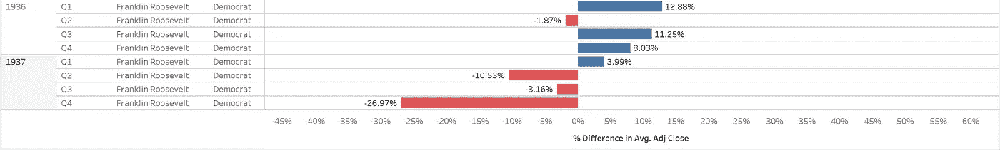

# 股票市场对总统选举的反应(1932-1960)

> 原文：<https://medium.datadriveninvestor.com/historical-stock-market-reactions-to-presidential-elections-1932-1960-d699dff10419?source=collection_archive---------8----------------------->

## 如果你遵循这个简单的投资策略，你在股市的投资将会增长 13 倍以上。

Photo by [John Bakator](https://unsplash.com/@jxb511?utm_source=medium&utm_medium=referral) on [Unsplash](https://unsplash.com?utm_source=medium&utm_medium=referral)

*本文是《如果特朗普输了，股市会崩盘吗？》报道的后续在第二部分，我们将深入研究 1932-1960 年总统选举期间股票市场的表现。我们将考察大选前、大选中和大选后的几个月，而不是评估标普 500 指数调整后的年度平均收盘点位。我们能发现数据中的趋势吗？*

大多数人都会同意一个结论:2020 年是多事之秋。百年一遇的疫情出现了。随之而来的是全国性的关闭。数百万人失去了工作。学校关闭了。这还不是冰山一角。

 [## 区块链会改造股市吗？数据驱动的投资者

### 区块链可以通过降低交易成本和促进交易，使产权和其他资产的转移变得更容易

www.datadriveninvestor.com](https://www.datadriveninvestor.com/2019/04/09/will-blockchain-transform-the-stock-market/) 

成千上万的人生病了。许多人去世了。那些没有立即受到病毒影响的人感到紧张、孤立，并对未来感到担忧。

> 这种情况会持续多久？还需要多长时间才能恢复正常？

在疯狂之中，有一个市场似乎已经复苏并繁荣起来。获得了“有史以来最讨厌的反弹”的绰号，股票市场在世界范围内引起了关注。就连著名的投资者和长期评论员也开始注意到这一点。

> "我无法想象这个市场会如此愚蠢地看涨."——吉姆·克莱姆，《疯狂的金钱》

今年的活动还没有结束！11 月还有总统选举，谁知道会发生什么。许多人现在想知道他们是否应该采取先发制人的行动来保护自己和他们的投资。让我们回顾一下历史。标准普尔 500 在选举前、选举中和选举后的表现如何？

# 标准普尔 500 在总统选举中的表现

*   1932 年:**赫伯特·胡佛(共和党)对富兰克林·罗斯福(民主党)**
*   1936 年:**富兰克林罗斯福(民主党)**对阿尔夫兰登(共和党)
*   1940 年:**富兰克林·罗斯福**对温德尔·威尔基(共和党)
*   1944 年:富兰克林·罗斯福对托马斯·杜威
*   1948 年:哈里·杜鲁门(民主党)对托马斯·杜威(共和党)
*   1952 年:德怀特·艾森豪威尔(右)对阿德莱·史蒂文森二世(右)
*   1956 年:德怀特·艾森豪威尔(共和党)对阿德莱·史蒂文森二世(共和党)
*   1960 年:约翰·肯尼迪(民主党)对理查德·尼克松(共和党)

# 1932 年:赫伯特·胡佛(右)对富兰克林·罗斯福(右)

Data: Yahoo Finance, Chart: KR, % Difference in Adjusted S&P Close

今年美国和世界大事

*   富兰克林·罗斯福击败赫伯特·胡佛，赢得 472 张选举人票对 59 张，赢得 42 个州对 6 个州，并获得 57.4%的普选票数。
*   美国经济仍感受到 1929 年华尔街崩盘的余波——这是由投资者借入过多资金购买股票的投机泡沫造成的。
*   大萧条已经开始，并将持续到 20 世纪 30 年代末。
*   失业率:24.5%
*   对来自世界各地的进口商品征收关税，导致对美国出口商品征收报复性关税。
*   “胡佛村”一词出现，它描述了美国无家可归者用木头、板条箱、纸板和其他材料建造的棚户区。
*   根据图表得出的结论:赫伯特·胡佛(Herbert Hoover)失去连任与标准普尔 500 指数 9.69%的负面影响一致，但仅持续了选举后的三个月。

# 1936 年:**富兰克林·罗斯福(民主党)**对阿尔夫·兰登(共和党)

Data: Yahoo Finance, Chart: KR

今年美国和世界大事

*   富兰克林·罗斯福以压倒性的胜利击败了阿尔夫·兰登，赢得了 523 张选举人票对 8 张选举人票，赢得了 46 个州对 2 张选举人票，并获得了 60.8%的普选票数。
*   罗斯福推出了“新政”——由几个公共项目和金融法规组成，旨在稳定经济。
*   大萧条即将结束，失业率保持在两位数——16.9%。
*   阿道夫·希特勒现在是德国的领导人，并在柏林主办了 1936 年夏季奥运会。
*   西班牙内战在西班牙开始，一直持续到 1939 年。
*   **基于图表的结论:罗斯福的连任对标准普尔 500 指数有 3.99%的正面影响——持续到选举后的三个月。**

# 1940 年:**富兰克林·罗斯福**对温德尔·威尔基(共和党)

Data: Yahoo Finance, Chart: KR

今年美国和世界大事

*   富兰克林·罗斯福击败温德尔·威尔基，赢得 449 张选举人票对 82 张，赢得 38 个州对 10 个州，并获得 54.7%的普选票数。
*   随着德国对欧洲发动进攻，第二次世界大战开始了。
*   法国被德国控制。
*   罗斯福通过签署 1940 年的《选择性训练和服役法案》颁布了该草案——这是美国历史上第一部和平时期的草案。
*   美国还没有进入第二次世界大战，甚至是在 1941 年珍珠港袭击之后。
*   40 小时工作周开始生效。
*   严重的冬季暴风雪导致中西部 100 人死亡，被称为停战日暴风雪。
*   基于图表的结论:罗斯福的再次当选对标准普尔 500 指数是不利的——在选举后持续了六个月。

# 1944 年:富兰克林·罗斯福对托马斯·杜威

Data: Yahoo Finance, Chart: KR

今年美国和世界大事

*   富兰克林·罗斯福击败托马斯·杜威，赢得 432 张选举人票对 99 张选举人票，赢得 36 个州对 12 个州，获得 53.4%的普选票数，史无前例地连任第四任总统。
*   尽管取得了压倒性的胜利，罗斯福还是于 1945 年 4 月 12 日在办公室去世。
*   罗斯福死后，国会通过了第 22 修正案——将总统任期限制为两届。
*   副总统哈里·杜鲁门宣誓就职。
*   盟军在法国诺曼底海滩登陆。
*   美国的食品短缺导致肉类配给和后院菜园。
*   基于图表的判断:罗斯福的连任对标准普尔 500 指数是正面的。选举之后，市场连续四个季度上涨。

# 1948 年:**哈里·楚门(民主党)**对托马斯·杜威(共和党)

Data: Yahoo Finance, Chart: KR

今年美国和世界大事

*   哈里·杜鲁门击败托马斯·杜威赢得选举，赢得 303 张选举人票对 189 张，赢得 28 个州对 16 个州，并获得 49.6%的普选票数。
*   住房短缺在美国和欧洲随处可见。
*   随着二战退伍军人的归来，出现了前所未有的婴儿潮。
*   随着通货膨胀开始加速到 7.7%，有人呼吁控制价格。
*   南非的种族隔离始于 1948 年，并将持续到 20 世纪 90 年代。
*   随着苏联封锁西柏林，冷战发生了侵略性的转变。
*   **根据图表得出的结论:Truman 的连任对标准普尔 500 指数来说是一个负面消息——持续到选举后的六个月。**

# 1952 年:德怀特·艾森豪威尔(右)对阿德莱·史蒂文森二世(右)

Data: Yahoo Finance, Chart: KR

今年美国和世界大事

*   德怀特·艾森豪威尔击败阿德莱·史蒂文森二世，获得 442 张选举人票对 89 张选举人票，赢得 39 个州对 9 个州，并获得 55.2%的普选票数。
*   通货膨胀率降至 2.2%。
*   脊髓灰质炎疫情导致 3300 人死亡，超过 57000 名儿童瘫痪。
*   对日和平条约(旧金山条约)结束了盟军对日本的占领，并为日本的未来设定了条款。
*   由于空气中的污染物，伦敦烟雾导致 4000 人死亡。
*   英国女王伊丽莎白二世成为英格兰女王。
*   基于图表的结论:德怀特·艾森豪威尔的当选对标准普尔 500 指数来说是一个 1.07%的小利好，仅持续了三个月。

# 1956 年:德怀特·艾森豪威尔(共和党)对阿德莱·史蒂文森二世(共和党)

Data: Yahoo Finance, Chart: KR

今年美国和世界大事

*   德怀特·艾森豪威尔再次击败阿德莱·史蒂文森二世，赢得 457 张选举人票对 73 张选举人票，赢得 41 个州对 7 个州，获得 57.4%的普选票数。
*   德怀特·戴维·艾森豪威尔签署联邦援助高速公路法案成为法律——这在美国创造了州际系统。
*   美国最高法院宣布阿拉巴马州的种族隔离法是非法的。
*   申请大学的人数激增——三分之一的高中毕业生申请大学。
*   IBM 制造出第一个计算机硬盘——IBM 305 RAMAC。
*   根据图表得出的结论:德怀特·艾森豪威尔的连任对标准普尔 500 指数来说是一个 3.82%的负数——持续三个月。

# 1960 年:约翰·肯尼迪(民主党)对理查德·尼克松(共和党)

Data: Yahoo Finance, Chart: KR

今年美国和世界大事

*   约翰·肯尼迪击败副总统理查德·尼克松，赢得 303 张选举人票对 219 张，赢得 22 个州对 26 个州，获得 49.72%的普选票数
*   1960 年的民权法案被签署成为法律——填补民权漏洞，纠正歧视性的选民登记法
*   美国派遣 3500 名士兵到越南参加越南战争
*   石油输出国组织(石油输出国组织)成立，其创始成员国包括伊拉克、伊朗、科威特、沙特阿拉伯和委内瑞拉
*   基于图表的结论:标准普尔 500 指数随着约翰·肯尼迪的当选而繁荣。这种上升持续了 12 个月，而且意义重大。

# 亲爱的生命，买入并持有

除了富兰克林·罗斯福的最后一次连任和约翰·肯尼迪的当选，总统选举对标准普尔 500 的影响一直是有限的。在大多数情况下，S&P 会上涨或下跌三到六个月，然后走势会逆转。无论哪个政党获胜，这一趋势都不会改变。

总的来说，把握市场时机是行不通的。相反，如果你买了标准普尔 500 指数，你的投资就会增长 13 倍以上。

**例子场景:1932 年**，你在标准普尔 500 指数上投资了 1 万美元

*   28 年后，你的投资已经增长到 73，186 美元——不包括股息。
*   无股息增长:年复合增长率为 7.3%
*   考虑到每年 2.5%的股息，你的新余额是 137，046 美元(1960 年)
*   包括股息在内，您的初始投资增长了 13.7 倍以上

买入并持有的策略效果很好。你需要做的就是投资 500 强公司，然后忘记你的投资。在经济动荡时期，你不需要紧张或担心。你不需要在选举前后感到任何不安。你会专注于生活，收获复合投资的果实。

然而，还有一个问题:现代政治对股市的影响是否比历史政治更大？

*在“历史股票市场对总统选举的反应”的第三部分中，我们将考察从 1964 年到 1990 年股票市场对选举的反应。*

**阅读更多来自 KR 的文章**

 [## 在 33 分钟内了解经济如何运转

### 你将做的最好的半小时投资！

medium.com](https://medium.com/datadriveninvestor/learn-the-economy-in-33-minutes-67510b3abecf)  [## 如果民主党获胜(1964-1992)，股市会崩盘吗？

### 寻找股票市场崩溃和美国总统政治(1964-1992)之间的相关性的历史。

medium.com](https://medium.com/@kr456/stock-market-reactions-to-presidential-elections-1964-1992-af1fa8fce975) 

**访问专家视图—** [**订阅 DDI 英特尔**](https://datadriveninvestor.com/ddi-intel)