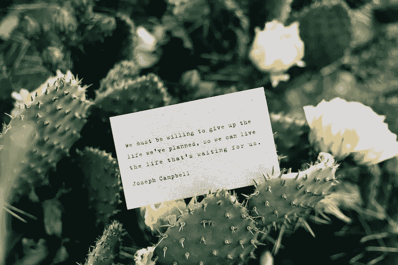

# 点击暂停，投资你！

> 原文：<https://medium.datadriveninvestor.com/hit-pause-and-invest-in-you-e09a5ff06422?source=collection_archive---------22----------------------->

在过去的几个月里，我一直忙于全职在家带孩子(感谢 COVID)、客户工作和发展我的业务。玩这些球给我留下的时间不多了。所以，我决定停下来，花时间投资于我的个人和职业发展。

厌倦了在电脑上花费数小时，我抓住机会参加了一个 5 英亩大的天堂上的个人静修。社交距离的空间很大，但面对面的交流仍然越来越少。

与其他志同道合的女性联系在一起感觉很棒，同时也有了无罪恶感的时间去深入内心，弄清楚我需要做出的转变，以便在不被拉伸的情况下成长。

我想我会分享我在[开拓者静修](https://leapzonestrategies.com/retreats/)时的一些金块，这些金块让我停下来，反思并改变了我的工作方式。

## **怀疑带你出去**

我们成功的最大障碍往往是内在的力量，而不是外在的。每当怀疑爬进我们的脑海，它就增加了另一块砖。随着时间的推移，这些砖块会形成一堵难以逾越的墙。

避免制造障碍的最好方法是在怀疑发生时承认它，并有意识地让它过去。

 [## 领导力。赢得|数据驱动型投资者需要更广阔的视角

### 不管他们愿不愿意，领导者都是快速运转的机器中的齿轮，这就要求他们夹住自己的爪子…

www.datadriveninvestor.com](https://www.datadriveninvestor.com/2020/02/07/leadership-it-takes-a-wider-perspective-to-win/) 

## **20 秒法则**

当你经历怀疑、羞愧、内疚或任何其他负面想法时，不要纠结于它们。如果它们没有在 20 秒内被释放，它们就会占据你的心灵。任何你专注超过 20 秒的事情都是你所显化的。

想想吧。如果你花很多时间思考你缺钱，你会继续吸引同样的人。改变你的心态去思考生活中的富足会带来更多的富足。我们吸引我们放出来的东西。

LeapZone Strategies 的 Isabelle 和 Margarita 分享的一个妙招是在你的办公桌上放一碗鹅卵石和一个罐子。每当一个消极的想法出现在你的脑海中，就在瓶子里放一颗鹅卵石，然后释放这个想法。在一天结束的时候，你可以看到你释放了多少消极的想法。随着时间的推移，当你专注于释放这些想法时，你会发现你的罐子里的鹅卵石变少了。

## **关注什么而不是如何**

这对我来说是一个重大的顿悟时刻。我一直在考虑让更多的人加入我的团队，以便更好地为我的客户服务，避免筋疲力尽。虽然我知道我想做什么，我想和谁一起工作，但我花了太多的时间在如何做上。

住在 how 里会很恐怖。我怎么负担得起？我将如何分配工作？我将如何向客户收费？问题的清单永远不会结束。

随着我们一整天的工作，我越来越清楚，我需要把注意力集中在“谁”和“什么”上，而在“如何”上花费更少的精力。回顾我的一生，有很多次，没有我的帮助，事情就自己解决了。这包括开展咨询业务(我将如何获得客户——客户通过口碑找到我),以及搬到西海岸(我将如何进行转型、结识他人、建立社区——这已经不费吹灰之力地展开了)。

## **你容忍你担心的事情**

是的，在我的生活中，有很多事情占据了我太多的空间。这里的关键是释放你所容忍的，并用好奇心来代替它。从容忍到好奇会引发观念的转变。谁知道这种转变能带来什么感悟和释放？

## **界限带来欢乐**

设定和尊重界限对我们很多人来说都很难，尤其是女性。我们想要取悦，却害怕说不，或者想要被喜欢。

但是缺乏界限也会让人精疲力竭。我们在自己不喜欢的事情上花费了太多的精力，留给自己喜欢的事情的时间和空间更少了。

通过设定界限，我们收回了一些空间。在那个空间里，我们能够专注于带给我们快乐的事情。谁不想在生活中获得更多的快乐呢？

## **求助**

回到我正在杂耍的所有球，我意识到不用担心掉球，我可以把它交给别人。没事的。我不会因为我的杂耍技巧赢得任何奖项。

通过放下我不需要做的事情，我为创造力、反思创造了空间，并且能够迎接更多的快乐进入我的生活。

这些只是我在开拓者工作期间获得的一些小收获。

但是这一天最大的收获是停下来花时间在我身上的重要性。老实说，我不记得什么时候花了一整天关注我的个人和职业发展了。

尽管有 COVID 的疯狂，我认为你找到时间停下来反思比以往任何时候都更重要。现在是时候重新定义你是谁和你如何工作了。

你的新常态是什么？一旦你知道了什么，方法就会展现出来。

这篇文章也出现在 [How to Communications 上。](http://www.howtocommunications.com)

**访问专家视图—** [**订阅 DDI 英特尔**](https://datadriveninvestor.com/ddi-intel)