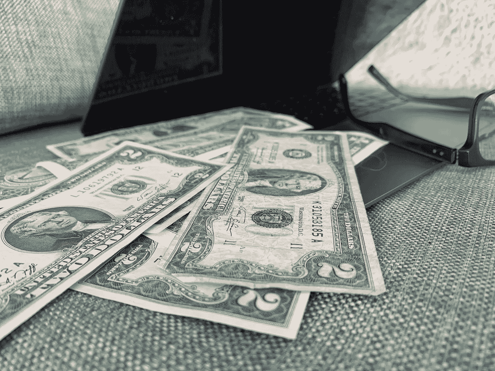
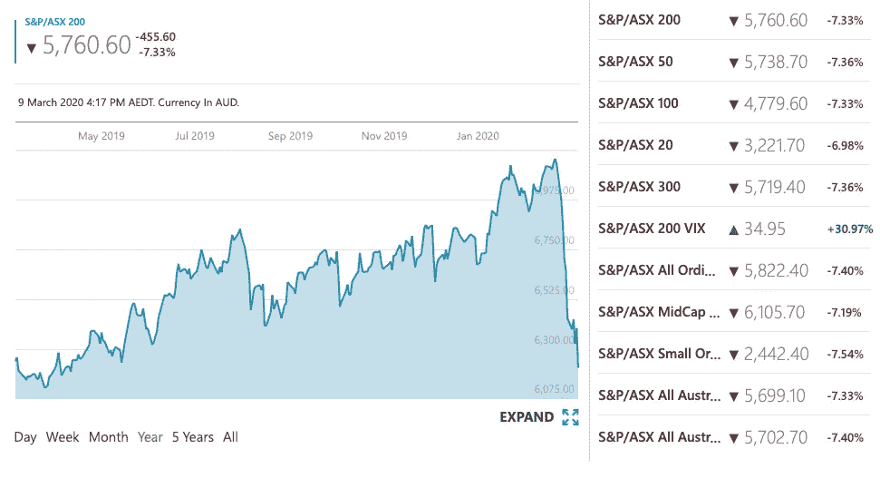

# 囤积现金，而不是卫生纸

> 原文：<https://medium.datadriveninvestor.com/hoard-cash-not-toilet-paper-1c14edfd7636?source=collection_archive---------11----------------------->

我确信澳大利亚人囤积卫生纸的奇怪行为的新闻已经传到了你们地球的角落。作为一名澳大利亚公民，我对大量奎尔顿和增加 T2 新冠肺炎 T3 存活率之间的相关性感到困惑。对我来说，对我们所有人的生存更大的危险是今天股票市场 30%的下跌，这似乎是由对做空卫生纸期货的疯狂恐慌引起的。

我们正处于历史上一个有趣的时期。由于对冠状病毒的担忧，全球市场正在下跌。图表看起来像是 T4 和 GFC 的弟弟们。澳大利亚市场今天损失了 1550 亿美元，经济学家称之为“衰退”——大约是沃伦·巴菲特价值的两倍(*基于 yesreday 的数据)。

我的隔壁邻居，一个 70 多岁的男人，不像是外科医生和律师的结合体，他认为冠状病毒和其他流感很像。在发达国家，医疗保健、反应能力和空气质量都达到了更高的标准，据报道[死亡率](https://www.worldometers.info/coronavirus/coronavirus-death-rate/)约为 0.5%，大多数伤亡发生在已有疾病(糖尿病、长期吸烟、心脏病)的老年患者身上。这并不是要消除受影响者的痛苦——每个生命都是宝贵的——而是要将当前的疫情置于大背景下。

 [## 经济就是包容人|数据驱动的投资者

### 建模，数据，最重要的是，人 Tayo Oyedeji 博士在他的食谱中混合了所有这些成分，为一个…

www.datadriveninvestor.com](https://www.datadriveninvestor.com/2019/03/06/economy-is-all-about-including-people/) 

与我的邻居不同，我既不是外科医生也不是律师。我是一名现代公民，我的才能带来了新技术，赋予人们力量，让生活变得更美好。对于像我这样的人，也许还有你，面对 COV-19，我们能做什么，应该做什么？

# 冠状病毒对科技的影响

任何环境下的紧张都会转化为匮乏。稀缺导致疯狂行为(指囤积卫生纸)，并在短时间内导致资金从股市撤出(指今天的股市表现)。退出股市导致人们保留现金，这意味着人们的钱包更紧、口袋更鼓了。这些情况是我们在过去 8-10 年中没有看到的。

[https://www.msn.com/en-au/money/markets](https://www.msn.com/en-au/money/markets)

那么这对我这样的人来说意味着什么呢？以下是我的六个大胆预测:

1.  **我们将看到资金枯竭**特别是在早期和中期阶段的科技初创企业，它们遵循新的支出模式来占领市场，并希望有一天最终收入大于成本。这些模式的现金流为负值，依赖风险投资/外部资金定期注入运营资金。当音乐停止的时候——就像现在这样，或者就像创业公司资金耗尽的时候——风险投资者不会愿意把手放进口袋，提供更多的资金。如果在那个阶段你的现金流不是正的，你就会死。
2.  **我们将会看到创业公司数量的下降。随着资金枯竭，只有那些收入大于成本的创业公司才能生存下来。如果你的客户是初创企业，你的市场规模将会缩小。**
3.  **我们将在市场上看到优秀的人才**。由于创业公司的关闭，将会有更多的人才可用。对于收入增长的初创公司来说，这将是招聘和扩张的大好时机。
4.  我们将看到对现金流和利润的关注。目前的这种流行病可能会成为停止创业世界郁金香热的导火索。
5.  **我们将看到科技行业的估值下降**。随着现金流为负的好企业被曝光，它们将被寻求合并的大公司收购。他们将在较低的市盈率被吞噬，因为市场上充斥着不良卖家。这些较低的市盈率将影响科技公司的估值方式。
6.  **我们将看到优步等待时间的减少**。将会有更多失业的技术人员驾驶优步。优步等待时间应该会大大减少。

最终，我们不应该恐慌。充满挑战的时代创造了机遇，而机遇正在向那些敢于追求增长、尽快获得正现金流、保持低成本并尽一切可能招募必要员工以促进增长的人敞开。

在中短期内，您如何应对这种新的动态？