# HODL 精英:☑️的赌注阶级

> 原文：<https://medium.datadriveninvestor.com/hodl-elite-the-staker-class-%EF%B8%8F-f69a5d46a2b9?source=collection_archive---------2----------------------->

## 随着 HODL 投资者了解并配置到利益相关者阶层，他们的投资组合正在恢复战斗状态。

# 威士忌+比特币:HODL 诞生了。

**这个术语**[***【HODL】***](https://www.investopedia.com/terms/h/hodl.asp)**最早出现在 2013 年末，不过是** [**比特币**](https://en.wikipedia.org/wiki/Bitcointalk) **论坛上的一个简单的打字错误(显然是在喝了一些体面的威士忌之后——或者可以说是*威士忌，*)。此后不久，从那时起，HODL 在加密货币投资者的词汇中获得了广泛的流行，用来描述“坚持到底”——本质上是一种无论如何都要买入并持有的方法。**

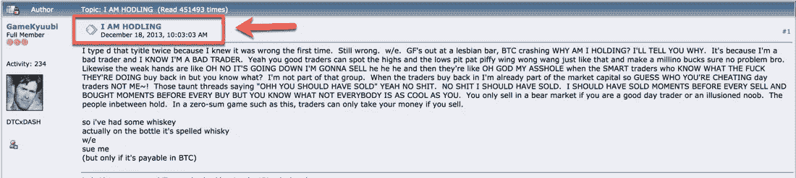

**在日常加密货币的说法中，HODL 也可以用来代替*持有*(例如*“问:*你在出售你的头寸吗？不，我要去 HODL *)* 与流行的衍生词包括*霍德林* (the act of)、*霍德勒* (one who HODLs)等等*。***

> 如果你是加密货币的新手，试着和这个领域的老手一起讨论这个加密术语，你会惊喜地发现自己是多么受欢迎。

# 风险与回报，HODL 的主张

对于 HODL 来说，这是一个高风险的游戏:在比特币(BTC)的情况下，人们必须愿意每隔几年就在投资中承担超过 90%的风险，以在其他年份获得 10-20 倍的回报，但没有什么是确定的。在过去的 10 年里，基本的 HODL 方法已经经历了 5 次这样的缩减。

> 请记住，只有在 1000%(10 倍)的收益之后，90%的亏损才是盈亏平衡的。

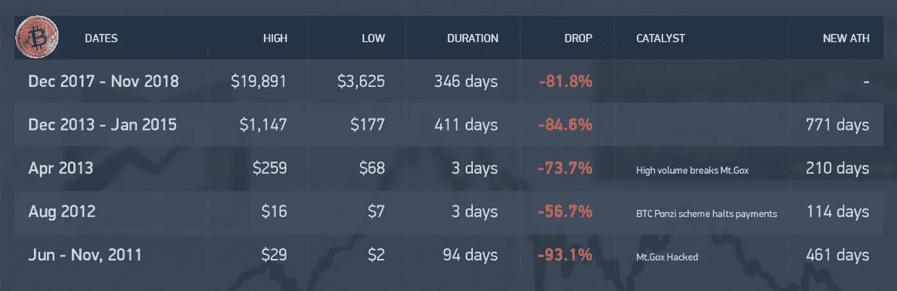

source: coincodex.com

**因此，HODL 命题变成:这项投资可能做 10-20 倍，而且在过去的 10 年里，已经损失了 5 次高达 90%的价值。**

## 但是，如果你可以选择一个让你感到舒适的时间段，并且还能获得很高的利息，那会怎么样呢？这改变了一切…

假设你自豪地拥有 10 个比特币和 1 年的 HODL。从开始到结束，你将永远拥有这 10 个比特币的余额，而且只有 10 个比特币。

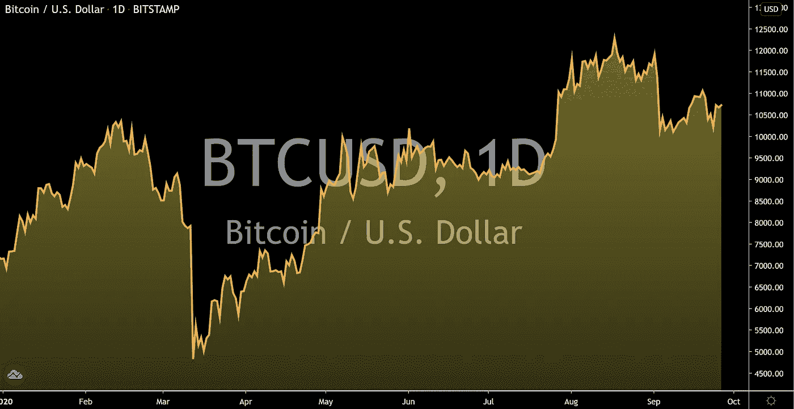

基础价格可能升值或贬值，但你的保证是:

HODL，这一年开始时你有 10 个比特币，年底时你有 10 个比特币。很简单。

> ***但如果存在一个高利率机制，以 25%的可变利率 APY 额外贷记你一个 1 年期 HODL，这看起来会怎样？***

# 进入 HODL 精英:☑️的赌注阶级

## **有保证的—** [**经审计的**](https://medium.com/@tldrtaylor/defis-cream-of-the-crop-blazes-ahead-with-2-000-tps-at-0-01-tx-privacy-100-uptime-audits-e3a0708b498a?source=friends_link&sk=85ab262c22f38942a755fc7fea188fc3) **—除价格波动外的高利息回报使基本的 HODL 方法随着时间的推移回报更高，并降低了长期风险敞口。**

> **随着高利率的增加，HODL 方法的主张对风险厌恶者变得更有吸引力。**

## **在上述假设的例子中，仅仅一年后就支付了额外的 2.5 个比特币，使总余额达到 12.5 个比特币；如果 HODL 承诺的期限仅为 3 年:19.5 比特币——这几乎是比特币数量的两倍，甚至不包括潜在的价格波动。因此，即使比特币的价格在 3 年后下跌了 50%:实际上也不会产生任何损失。**

# HEX 的 Staker 类☑️享受的恰恰是上面的(再加一点点)，比特币的霍德尔们得到的是免费的 HEX。

## 截至本文撰写之时，已有超过 249562 个比特币(BTC)——近 30 亿美元——免费认领了十六进制:所有可在链上验证的(T21)。

[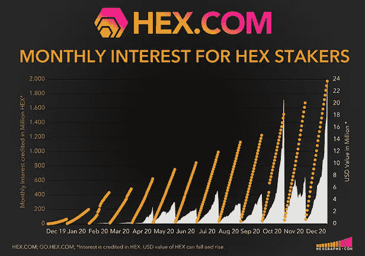](https://hexgraphs.com/performance)[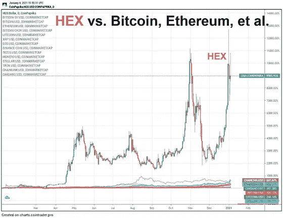](https://uniswap.vision/?ticker=UniswapV2:HEXUSDC&interval=240)

## 此外，chainalysis 透露超过 700，000 ETH 的[以太坊创世纪钱包](https://medium.com/@tldrtaylor/ethereum-genesis-wallets-of-700-000-eth-move-big-blocks-into-defi-staking-product-hex-39107d2c9cc0?source=friends_link&sk=9d94d7dac1513414c3d01e6ae51ec4fd)正在购买大量的 HEX 并下注。事实上，人们对这种创新金融产品的兴趣(请原谅我的双关语)在整个 2020 年都在持续上升，并将继续下去...

## **HEX 是由比特币的早期采用者** [**理查德·哈特**](https://www.forbesindia.com/article/brand-connect/richard-heart-and-the-influence-of-bitcoin-on-the-hex-blueprint/62095/1#:~:text=Richard%20Heart%20is%20one%20of,the%20pockets%20of%20the%20buyer.) **先生发明的，他今天是以太坊的精通支持者，也是各种主题中令人振奋的思想领袖。在早期，Heart 先生似乎在他的 HEX 设计中采纳了类似的精神，在经过全面审计的合同中为比特币(BTC)的持有者建立了一个** [**自由索赔选项。**](https://medium.com/@tldrtaylor/if-you-held-bitcoin-on-december-1st-2019-75d05004c22b?source=friends_link&sk=1e02ff077d3745108e78e82480a2af2f)

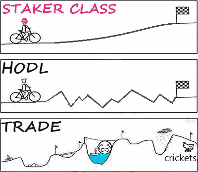

## **在撰写本文时，HEX 的总赌注约为 2.226 亿美元，** [**所有赌注的平均支付额为每天 10，000 美元**](https://twitter.com/HEXcrypto/status/1309607382952144898) **。**

## 如果你看一下 chain，你会清楚地看到，随着越来越多有 HODL 思想的投资者花时间了解这种非凡产品的确切运作方式，并成为 Staker 阶层的一员，人们对 HEX 的兴趣越来越大。

[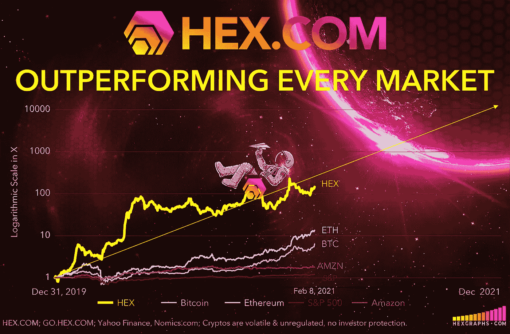](https://hexgraphs.com/performance)

# 成品。全面审计。100%正常运行时间。100%在链上。零管理密钥。零位关闭开关。

[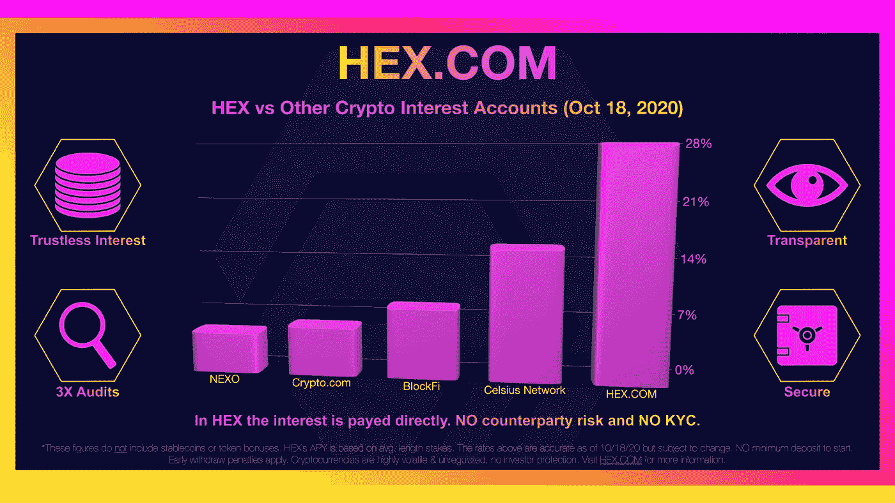](http://www.HEX.com) [## 自白——我绝对不爱比特币|数据驱动投资者

### 这是真的，我已经写了几篇关于比特币和加密货币的文章，它们可能会在明年或…

www.datadriveninvestor.com](https://www.datadriveninvestor.com/2020/09/15/confessions-i-absolutely-dont-love-bitcoin/) 

# HEX 是最纯粹的分散金融形式。

> “如果 HEX.COM 下线了，理查德·哈特死了，魔法还会继续工作。许多项目声称是去中心化的，但实际上依赖于管理员不改变代码。十六进制代码不能更改。~HEX.com

# 赌注十六进制&看它倍增

[桩工。App](https://staker.app/invite/PQn8) 可以让你安全可靠地在网上积累 100%的财富，并实时观察财富的增长:

# 相关文章:

[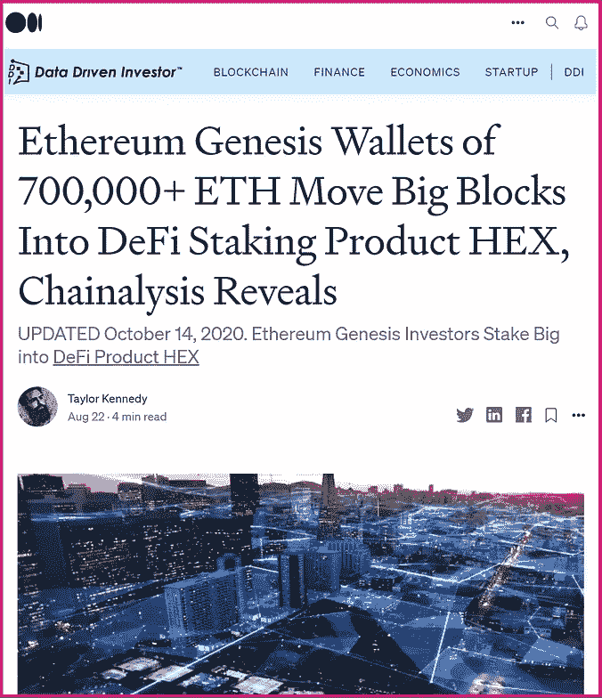](https://medium.com/datadriveninvestor/ethereum-genesis-wallets-of-700-000-eth-move-big-blocks-into-defi-staking-product-hex-39107d2c9cc0)[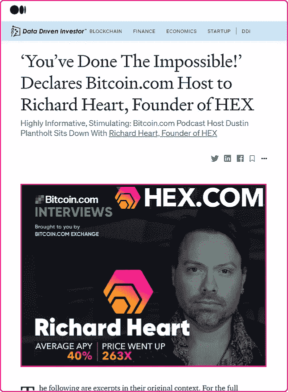](https://medium.com/datadriveninvestor/youve-done-the-impossible-declares-bitcoin-com-host-to-richard-heart-founder-of-hex-dd95a3526063)[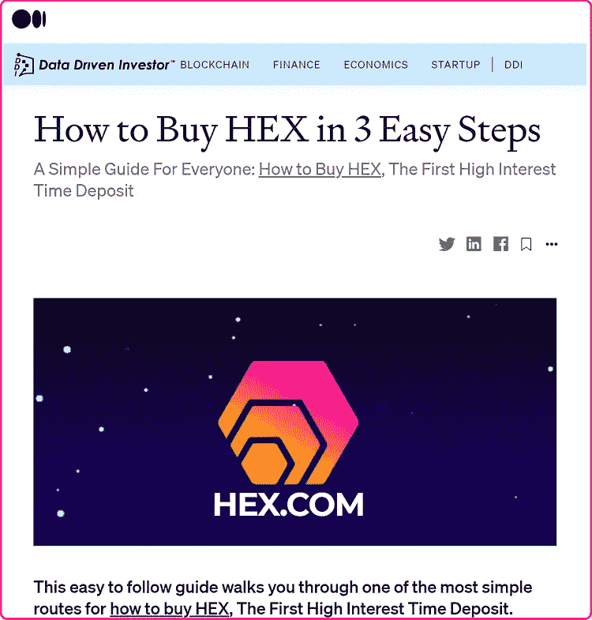](https://medium.com/datadriveninvestor/how-to-buy-hex-in-3-easy-steps-d839204c850e)

更多信息:[HEX.COM](https://hex.com/)

⬣ **新闻和更新:** [关注 Twitter @HEXcrypto](https://twitter.com/hexcrypto)

https://t.me/HEXcrypto

⬣ **每天下午 3:40(太平洋标准时间)在 Twitch 上观看 HEX 每日新闻直播**:[hex ologist](https://www.twitch.tv/thehexologist)

⬣ **每周一、三、五( *The Friday Night Hangout)* 晚上 7:00(PST)在 Twitch 上观看直播《话语辛迪加》** [话语辛迪加](https://www.twitch.tv/discourse__syndicate) ( **话语辛迪加仅面向成熟观众)**