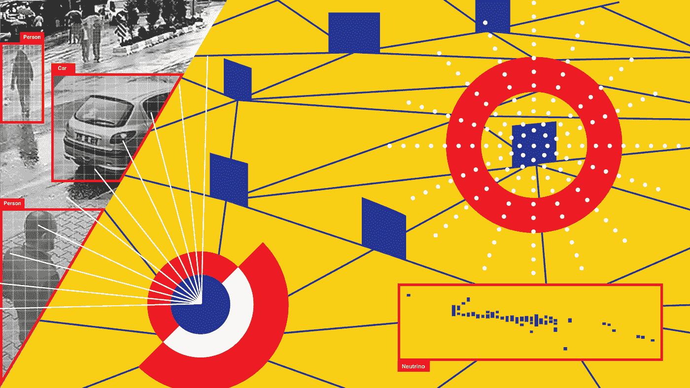

# 【假期提醒】:你可以完成的前 5 名免费数据科学、AI & ML 课程

> 原文：<https://medium.datadriveninvestor.com/holidays-alert-top-5-free-data-science-ai-ml-courses-you-can-finish-8067ecff7c1d?source=collection_archive---------15----------------------->

## 令人惊叹的课程…

Pic credits : Pinterest

作为一名软件工程师/程序员，应该不断学习新技术，了解当前的技术发展。假期是学习新东西、提升你的知识基础和技能的最佳时机。在这篇文章中，我将介绍你可以在假期完成的前 5 个免费数据科学、人工智能和人工智能课程。

# 其他一些最好的系列—

> [**三十天的机器学习 Ops**](https://medium.com/coders-mojo/day-1-of-30-days-of-machine-learning-ops-7c299e4b09be?sk=4ab48350a5c359fc157109e48b1d738f)
> 
> [**30 天自然语言处理(NLP)系列**](https://medium.com/coders-mojo/quick-recap-30-days-of-natural-language-processing-nlp-with-projects-series-ceb674e3c09b?sk=ca09b27b3d5867f23ab4dc367b6c0c32)
> 
> [**30 天数据工程与项目系列**](https://medium.com/coders-mojo/day-1-of-30-days-of-data-engineering-894822fcb128?sk=76ba558bfe2d9f85cbe741e505295531)
> 
> [**数据科学与机器学习研究(论文)简体**](https://medium.com/coders-mojo/day-1-data-science-and-ml-research-papers-simplified-a68b00a3b1c4?sk=56136229ff738bd734f19d2b6953f78c) ******
> 
> [**60 天数据科学与 ML 系列带项目**](https://medium.com/coders-mojo/day-1-day-60-quick-recap-of-60-days-of-data-science-and-ml-6fc021643d1?sk=4e75e043b7630a9f963562ebac94e129)
> 
> [**100 天:你的数据科学与机器学习学位系列与项目**](https://medium.com/coders-mojo/100-days-your-data-science-and-ml-degree-part-3-c621ecfdf711?sk=1a8c7b0c204d73432d56b7d1a3a26474)
> 
> [**你应该知道的 23 个数据科学技巧**](https://ai.plainenglish.io/23-data-science-techniques-you-should-know-61bc2c9d1b3a?sk=1680c36193eb22198974c9008d62a33c)
> 
> [**技术面试系列—编码问题精选清单**](https://medium.com/coders-mojo/mega-post-tech-interview-the-only-list-of-questions-you-need-to-practice-ee349ea197bb?sk=fac3614684daff4b50a70c0a71e4d528)
> 
> [**用最热门的问题系列**](https://medium.com/coders-mojo/system-design-made-easy-quick-recap-of-complete-system-design-34af7e3aedfb?sk=bdd6a19edc1f3ce4a5064923f5b68721) 完成系统设计
> 
> [**完成数据可视化及预处理系列与项目**](https://medium.com/coders-mojo/complete-data-preprocessing-and-data-visualization-with-projects-mega-compilation-part-2-41584ef0920e?sk=842390da51689b8d43148c3980570db0)
> 
> [**完成 Python 系列与项目**](https://medium.com/coders-mojo/complete-python-and-projects-mega-compilation-7ec8f7adfe71?sk=ee0ecf43f23c6dd44dd35d984b3e5df4)
> 
> [**完成高级 Python 系列与项目**](https://medium.com/coders-mojo/complete-advanced-python-with-projects-mega-compilation-part-6-729c1826032b?sk=7faffe20f8039fa57099f7a372b6d665)
> 
> [**Kaggle 最会教你的笔记本**](https://medium.com/coders-mojo/my-list-of-kaggle-best-notebooks-topic-wise-data-science-and-machine-learning-part-2-84772863e9ae?sk=5ed02e419854a6c11add3ddc1e52947f)
> 
> [**Git 开发人员完整指南**](/the-complete-developers-guide-to-git-6a23125996e1?sk=e30479bbe713930ea93018e1a46d9185)
> 
> [**打赏 Github Repos**](https://medium.com/coders-mojo/6-exceptional-github-repos-for-all-developers-part-1-21e8fa04e150?sk=9140b249af6fe73d45717185fad48962)**—Part 1**
> 
> [**打赏 Github Repos**](https://medium.com/coders-mojo/6-exceptional-github-repos-for-all-developers-part-2-3eec9a68c31c?sk=8e31d0eb7eb1d2d0bbbcecaa66bd4e7e) **—第二部**
> 
> [**所有数据科学和机器学习资源**](/best-resources-for-data-science-and-machine-learning-full-list-5ceb9a2791bf?sk=cf85b2cef95560c58509877a794577ff)
> 
> [**210 机器学习项目**](/210-machine-learning-projects-with-source-code-that-you-can-build-today-721b035649e0?sk=da5f593572a0261a6314afad99a0356c)

## 科技时事通讯—

> 如果你感兴趣，你可以加入我的时事通讯，通过它我向超过 30，000 名读者发送技术面试技巧，技术，模式，黑客——软件开发，ML，数据科学，创业公司和技术项目。可以订阅 **Tech Brew :**

 [## 点火器

### 数据科学，人工智能，人工智能和更多…点击阅读由 Naina Chaturvedi 撰写的 Ignito，子堆栈出版物。推出 7 个月…

naina0405.substack.com](https://naina0405.substack.com/) 

## Github —

 [## 编码器-world 04-概述

### 此时您不能执行该操作。您已使用另一个标签页或窗口登录。您已在另一个选项卡中注销，或者…

github.com](https://github.com/Coder-World04) 

让我们开始吧—

# 加州理工学院——从数据中学习

加州理工学院教授亚塞尔·阿布·穆斯塔法

***详情—***

这是一门很棒的 ML 课程，理论和实践练习完美结合，涵盖基础理论、算法和应用。

***涵盖主题—***

*   什么是学习？
*   机器能学习吗？
*   怎么做？
*   怎么做好？
*   带回家的课程

***链接到课程—***

 [## 从数据中学习—在线课程(MOOC)

### 加州理工学院教授亚塞尔·阿布·穆斯塔法教授免费介绍机器学习在线课程(MOOC)

work.caltech.edu](http://work.caltech.edu/telecourse) 

# 2.谷歌教育— Python

*由谷歌*

***详细信息—***

在 Google 内部使用，向只有一点编程经验的人介绍 Python。，对于想入门 Python 的人来说，这是一门很棒的课程。它有书面材料、讲座视频和大量练习 Python 编码的代码练习。

 [## Python 中的统计简介—第 1 部分

### 统计很容易…真的吗？

medium.datadriveninvestor.com](/introduction-to-statistics-in-python-part-1-14e69ef05abe) 

***话题覆盖—***

*   用线串
*   列表
*   整理
*   字典和文件
*   正则表达式
*   公用事业
*   基本练习
*   更多练习/项目

***链接到课程—***

 [## Python 简介| Python 教育| Google 开发者

### 欢迎来到谷歌的 Python 在线教程。它基于内部提供的 Python 入门课程…

developers.google.com](https://developers.google.com/edu/python/introduction) 

# 3.机器学习

*作者吴恩达*

***详细信息—***

一门非常受欢迎的课程，介绍机器学习、数据挖掘和统计模式识别。

***话题覆盖—***

㈠监督学习(参数/非参数算法、支持向量机、内核、神经网络)。㈡无监督学习(聚类、降维、推荐系统、深度学习)。㈢机器学习的最佳做法

*   一元线性回归
*   多元线性回归
*   Octave/Matlab 教程
*   逻辑回归
*   正规化
*   神经网络:表示

***链接到课程—***

 [## 机器学习

### 机器学习是让计算机在没有明确编程的情况下行动的科学。在过去的十年里…

www.coursera.org](https://www.coursera.org/learn/machine-learning#about) 

# 4.具有深度学习的自然语言处理

*作者史丹福*

***详细信息—***

斯坦福大学的一门伟大的课程，它为 NLP 提供了深度学习前沿研究的全面介绍。通过讲座、作业和期末项目，学生将学习设计、实现和理解他们自己的神经网络模型的必要技能。

 [## 一瞬间学会数据科学！？数据驱动的投资者

### 在我之前的职业生涯中，我是一名训练有素的古典钢琴家。还记得那些声称你可以…

www.datadriveninvestor.com](https://www.datadriveninvestor.com/2020/07/23/learn-data-science-in-a-flash/) 

***话题覆盖—***

*   简介和词向量
*   词窗分类、神经网络和 PyTorch
*   矩阵演算和反向传播
*   递归神经网络和语言模型
*   机器翻译，Seq2Seq 和注意
*   消失渐变和花式 rnn
*   自然语言处理的卷积网络
*   自然语言生成
*   语言结构:依存句法分析
*   神经自然语言处理的分析和可解释性

***链接到课程—***

 [## 斯坦福 CS 224N |深度学习的自然语言处理

### 自然语言处理(NLP)是人工智能(AI)的重要组成部分，模拟人们如何分享…

web.stanford.edu](http://web.stanford.edu/class/cs224n/) 

# 5.谷歌机器学习课程

*由谷歌*

***详细信息—***

这是一个很好的课程，可以通过速成课程学习和应用基本的机器学习概念，通过配套的 Kaggle 平台获得真实世界的经验，或者探索 Google AI 上的完整培训资源库。

***涵盖主题—***

*   框架
*   下降到 ML
*   减少损失
*   张量流
*   确认
*   特征交叉
*   正规化
*   神经网络
*   训练神经网络
*   多类神经网络
*   嵌入
*   生产机器学习系统

***链接到课程—***

 [## 机器学习入门|机器学习速成班

### 编辑描述

developers.google.com](https://developers.google.com/machine-learning/crash-course/ml-intro) 

***感谢阅读。不断学习，不断编码。*节日快乐:)**

# 推荐文章—

 [## Stack Overflow 分析了来自 60，000 多名软件开发人员的数据，包括他们的工作时间、语言…

### 以下是他们的发现…

medium.com](https://medium.com/datadriveninvestor/stack-overflow-analyzed-data-from-60-000-software-developers-hours-they-work-languages-they-476ac6ca0197)  [## 黑客地球调查了来自 76 个国家的 16000 名开发者——以下是我的发现

### 惊人的洞察力…

medium.com](https://medium.com/datadriveninvestor/hacker-earth-surveyed-16000-developers-from-76-countries-heres-what-i-found-dbd5d7c422b0)  [## Hacker Rank 分析了来自 10 万多名开发人员和招聘经理的数据——以下是我的发现

### 来自 100，000 多名开发人员和招聘经理的出色分析结果

medium.com](https://medium.com/datadriveninvestor/hacker-rank-analyzed-data-from-100k-developers-and-hiring-managers-here-is-what-i-found-a374b98e937e)  [## 编码原罪:令人捧腹的开发者自白

### “白板”是如何被嘲笑的

medium.com](https://medium.com/datadriveninvestor/coding-sins-hilarious-developer-confessions-f55eb342454e)  [## 编程幽默第 2 部分

### 继续笑，因为太搞笑了…

medium.com](https://medium.com/datadriveninvestor/programming-humor-part-2-f92cf5a26f2b)  [## 10 个让你着迷的诙谐编程笑话

### 这些太搞笑了…

medium.com](https://medium.com/datadriveninvestor/10-witty-programming-jokes-that-will-make-you-go-rofl-a53fbfb91943) 

## 访问专家视图— [订阅 DDI 英特尔](https://datadriveninvestor.com/ddi-intel)