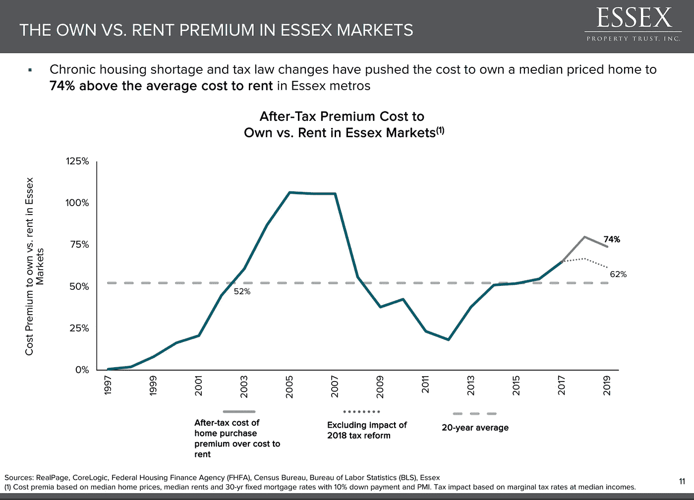
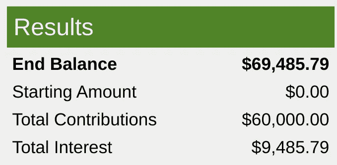

# 拥有住房是个坏主意

> 原文：<https://medium.datadriveninvestor.com/home-ownership-is-a-bad-idea-a097e37c58cc?source=collection_archive---------3----------------------->

## 离家出走的美国梦会毁了你的退休生活

**I’d Rather Sit Under The Tree Than Own The House / Source: Author**

我最近在研究一支股票时，偶然发现了一些有趣的事情。

在昂贵的市场，如旧金山、洛杉矶和西雅图，租房比买房便宜。不意外。我只是不知道租金优势的程度。

我从未相信过拥有住房的神话。

这肯定会让[增加你的支出](https://medium.com/@notascomposedasyouappear/you-can-live-in-los-angeles-on-2-500-a-month-e51bf826f079)，让生活成为一场持续的财务斗争，尤其是在大城市。

此外，除非你有足够的闲钱，否则买房会让你花掉太多的收入，并有可能破坏你的退休生活。对大多数人来说，所谓的美国梦最终是一笔巨大的开支。

如果你是中产阶级或中上阶层，你最好在月底有尽可能多的钱。用它来[支付你的基本开销，然后把剩下的存起来投资](https://medium.com/@notascomposedasyouappear/you-dont-need-a-retirement-plan-27bc19738243)。

> 白天，我们在失控的美国梦的街道上挥汗如雨；晚上，我们乘坐自杀机器穿越荣耀的大厦
> 
> ——布鲁斯·斯普林斯汀，*天生跑*

# 荣耀大厦，自杀机器

想想对许多人来说拥有住房的最大障碍——首付。

根据消费者协会的数据，你必须一年挣 128，444 美元才能在洛杉矶买得起一套 592，800 美元(中位数价格)的房子。这个计算考虑了 10%的首付。

一共是 59280 美元。

这对很多人来说是一大笔钱。要攒够钱买得起位于洛杉矶房地产中心的房子需要很长时间。处于中间位置时，你可能不得不接受一个不是你首选的社区和一栋不是你梦想中的房子。我们看到我们的新房主朋友每天都这样做，搬到一个不太理想的地区，只是为了他们能拥有一个家。

这种常见的方法导致将 60，000 美元投入到一笔每月还款超过 2，500 美元的贷款中。你不在你真正想去的社区或生活空间。

想要升级吗？你正在过着入不敷出的生活，*只是为了能拥有一个家。*

想象一下另一种情况，你投资那 60，000 美元，让它和每月定期投资一起复利*对*一种情况，你开始时什么都没有，每月定期供款。

假设年回报率为 6 %,这是你从零开始，每月投资 1000 美元，五年后的[结果](https://www.calculator.net/investment-calculator.html)。我选择五年内每月 1000 美元，因为这大概是你积累 60000 美元现金的时间。

如果你做了完全相同的事情，**，但是从 60，000 美元开始**，情况会是这样。

仅仅五年后，我宁愿我的投资账户里有额外的 80，293 美元(53 美分),而不是一周中的任何一天都有一栋房子。

我甚至不会考虑你本可以让[在派息股](https://seekingalpha.com/article/4362640-key-to-retirement-investing-live-frugally-live-well)上多投资多少钱，如果运气好的话，在那五年时间框架内每月贡献超过 1000 美元。

# 你的目标是什么？

对于越来越多的 20 多岁、30 多岁和 40 多岁的人来说，他们的目标不是获得物质。

虽然有些人认为房子是一种投资，但它也需要远远超出首付和每月抵押贷款义务的支出。从财产税到定期和意外的维护，你要承担各种相关费用。

就我自己而言，当大多数人声称我想要体验而不是物质时，这已经成为一种居高临下的重复。不要把事情简单化，这样不仅更容易理解，还会被诋毁为某种乌托邦式的现代嬉皮士幻想。

我不仅仅想要经历而不是东西。我想自己做主。我想以我现在和将来想要的方式生活。我想[把我的收入](https://medium.com/@notascomposedasyouappear/you-dont-need-a-million-dollars-to-retire-25f56423e34b)分配到这个目标上——不管非线性退休对我来说是什么样的——而不是什么财产。