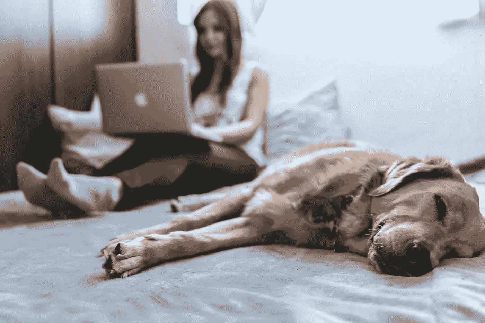
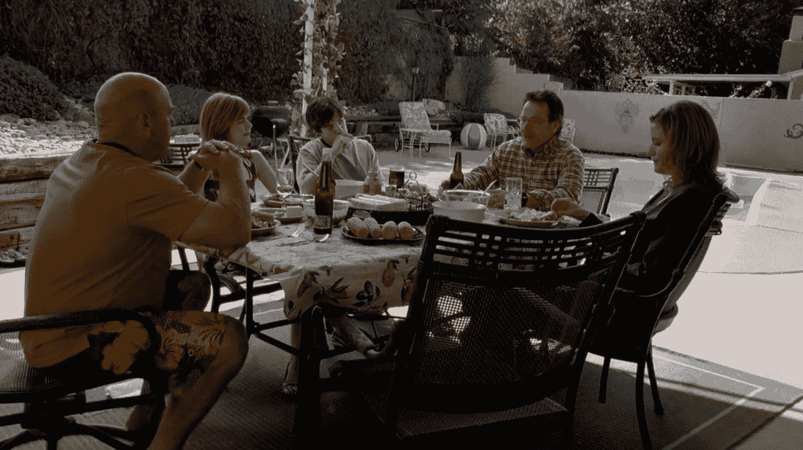
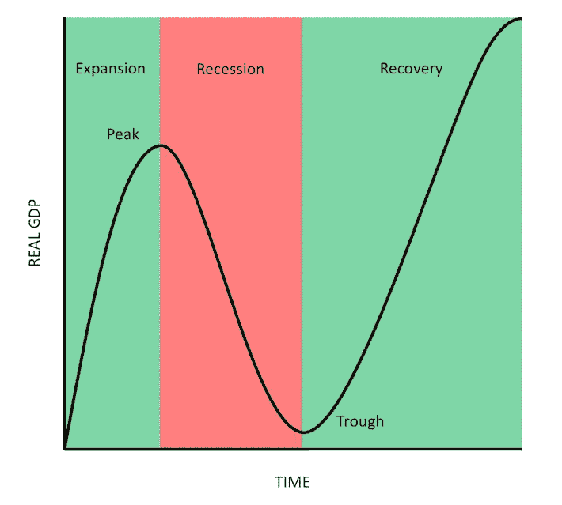

# 以下是如何在冠状病毒封锁期间充分利用在家的时间

> 原文：<https://medium.datadriveninvestor.com/home-producitivty-during-coronavirus-lockdown-f7b628738690?source=collection_archive---------3----------------------->

## 每朵云都有一线希望，所以在“停机时间”释放你未完成的活动

你知道冠状病毒每天传播给**13000**个新的人并且没有减少的迹象吗？

根据数据分析，[估计](https://www.theguardian.com/world/2020/feb/11/coronavirus-expert-warns-infection-could-reach-60-of-worlds-population)全球 **60%** 的人口可能感染冠状病毒。如果你不做出留在室内的明智决定，你将不得不在灾难发生前重新思考。阅读世卫组织[建议](https://www.who.int/emergencies/diseases/novel-coronavirus-2019/advice-for-public)保持安全。

问在家办公还是在家办公？已经第二天了？甚至不知道你将如何度过这 12 天(或者更多)？

> *又到十年一度的时候了……*
> 
> *但是我感觉很忧郁……*
> 
> *那是我们从未见过的时光……*
> 
> *那是一去不复返的时光……*
> 
> *那是不该回来的时光……*

全球各地都在采取预防措施，封锁数百万人，以应对冠状病毒的传播。

 [## 跑步摆脱疯狂:锻炼如何提高你的生产力|数据驱动的投资者

### 没有比锻炼更好的方式来开始一天的工作了。我试着一周至少做四天，在…

www.datadriveninvestor.com](https://www.datadriveninvestor.com/2018/10/23/running-to-get-rid-of-the-crazy-how-working-out-increases-your-productivity/) 

如果你被困在家里，有一种全新的方式来看待一切。没有旅行，没有匆忙-嘘。你可以无所事事，也可以富有成效。让我们不要坐等时间流逝，让我们充分利用现在拥有的时间**。**

****

**work from home**

# ****投资自己****

**首先，你必须适应生活方式的改变。第二，你需要意识到知识的增长不仅有助于你的工作，还能开启你梦寐以求的新机会。**

**生活在一个信息非常丰富、获取知识唾手可得的时代，利用这段时间投资自己吧。**

*   ****养成一个新习惯:**养成一个新习惯需要 21 天。可以使用[动量](https://momentum.cc/)、[生产习惯跟踪器](https://productiveapp.io/)、 [StickK](https://www.stickk.com/) 等 app。来记录你的习惯。**
*   **阅读、阅读、再阅读一点:所有亿万富翁的一个共同习惯是阅读。你可以浏览[古腾堡计划](https://www.gutenberg.org/)的免费书籍，或者在 [Blinkist](https://www.blinkist.com/) 订阅阅读非小说类书籍的摘要。他们还提供每天一本书的免费眨眼服务。**
*   **为了你的职业和个人利益，在线学习一项新技能。你可以从 YouTube 上免费学习其中的大部分。另外，你还可以试试[可汗学院](https://www.khanacademy.org/)、 [Udemy](https://www.udemy.com/) 。**
*   ****学习一门新课程(获得认证)**:你可以参加一门在线认证课程，这有助于你在公司晋升。你可以在 Udemy、 [Coursera](https://www.coursera.org/) 和其他一些[学校学习认证课程。](https://digitaldefynd.com/best-free-certification-course-training-online/)**
*   ****开博客/网站**:你可以谷歌**如何创建博客**并让它上线一个小时后，开始发表你的第一篇文章。除此之外，你还可以使用 Medium、Quora、Tumblr 等平台。分享你的想法。**
*   ****开发新的 app** :如果你是程序员/开发者，可以利用这段时间开发 app/工具。是时候动手为自己打造一些原创的东西了。**
*   **DIY:制作一些 DIY 艺术品，帮助你释放日常工作的压力，找回你的创造力。园艺、绘画等。**

# **探索自我的新维度**

**把你隐藏的宝石拿出来。互联网的世界不仅给了你无限向下滚动的平台，还让你触手可及地向全世界展示你的才华。**

## **成为社交媒体明星**

**孩子们从 YouTube、Instagram 和互联网新玩具抖音这样的平台上赚了数百万。每个社交媒体平台都有不利的一面。不管怎样，对于想要探索那个维度的人来说，有一个正确的方法。**

*   **开一个 YouTube 频道:你可以记录任何事情，比如你的生活方式、旅行经历、烹饪等等。如果你的内容是相关的或高质量的，YouTube 上有巨大的潜力。**
*   ****抖音**——毫无疑问，抖音有一大堆的畏缩。但是，你不应该忘记它光明的一面。对于新的个人资料，在**抖音**的能见度非常高。如果你计划向数百万人展示你的才华，但没有任何用户基础，那么在 Instagram、脸书和其他社交媒体平台出现之前，抖音可能是你开始的地方。**
*   **千禧一代的平均注意力持续时间只有 12 秒。在注意力持续时间缩短的时代，人们更喜欢看视频和听有声读物，播客的需求大幅增加。你可以开始制作自己的播客，并在 iTunes、Spotify 等网站上发布。**

## **成为下一个独角兽**

**激发你的企业家精神。做好基础工作，完善你的想法，完成工作原型(POC)。谁知道衰退结束后，你的想法会成为下一件大事。**

# **加强真实的关系**

***你是否被困在社交媒体上陌生朋友发布的虚假闪亮状态更新的世界里？***

*   **回忆:是时候坐下来，放松一下，带着对童年/大学友谊的怀念，脸上带着微笑。**
*   **家庭优先:每个人都喜欢忙碌。让我们一起做饭，一起吃饭，与家人共度美好时光。如果家里有老的，多陪陪。如果你是双职工父母，花更多的时间和你的孩子在一起。试着给全家人读一个睡前故事。**

****

**Breaking Bad: Walter White having dinner with his family at his home, where Walter confesses about his growing Cancer.**

*   ****久违的朋友:**在社交媒体或 skype 上与老朋友叙旧，进行长达一小时的聊天，以珍惜和重建回忆。**

# **花些时间去创造真正的财富**

**是的，你猜对了。是时候改变你的生活方式，改善你的整体健康状况了。目前，冠状病毒还没有疫苗。估计死亡率为 3%。这意味着，在被疫情病毒感染后，你很有可能会对抗病毒并提高警惕。然而，这一切都归结于你的免疫力。**

> **这是给你的任务！**
> 
> ***常见...站起来，弯曲身体，膝盖伸直，触摸脚趾。成功？***
> 
> **什么事？惊人的工作！**
> 
> ***没有？这就是你使用身体的方式。既然你现在有很多空闲时间，那就每天锻炼吧！没有借口！***

*   ****锻炼**:保持时间短但强度大。是时候让你的身体恢复健康了。[7 大最佳在家健身项目(无需器械)](https://www.nerdfitness.com/blog/the-7-best-at-home-workout-routines-the-ultimate-guide-for-training-without-a-gym/)。**
*   ****冥想:**在过去的十年里，心理健康已经成为人们讨论的核心话题。练习冥想的学生在 GRE 考试中的分数从 460 分增加到了 520 分。难怪我们需要在关注身体健康的同时更加关注心理健康。要开始冥想，你可以参考伊莎的 [Zenhabits](https://zenhabits.net/meditation-guide/) 、 [Shambhavi](https://www.youtube.com/watch?v=C_xsXnRd_uc) ，以及像 [Headspace](https://www.headspace.com/) 这样的应用。**
*   ****正确饮食**:是时候减少快餐和网上食品订单了。根据研究，很明显，在家吃饭的人比在外面吃饭的人健康 60%。一定要检查 iPhone 的[食物感应](https://apps.apple.com/us/app/food-sense-guide/id1457896728)应用程序，它使用你的手机传感器，在你吃完东西后扫描你的身体，这样你就可以识别并消除有问题的食物，以充分发挥你的潜力。**
*   **学习烹饪:自己做饭不仅有助于你健康饮食，还能省下一大笔钱。**
*   **健康的头脑需要健康的身体。提高免疫力的唯一自然方法是睡眠(除了食物和运动)。为了监控和改善你的睡眠质量，你可以使用像 [Flux](https://justgetflux.com/) 、 [Pziz](https://pzizz.com/) 和 [Sleepcycle](https://www.sleepcycle.com/) 这样的应用程序。**

# **娱乐活动**

## **选择一个棋盘游戏**

**你多久没玩桌游了？**

*   **玩游戏，如国际象棋，carrom，ludo，大富翁，真心话大冒险，一分钟就赢，等等。**
*   **你也可以开始玩 Playstation、Xbox 和其他视频游戏。**

## **疯狂观看**

**尽管疯狂观看并不是最明智的做法，但你可以利用这段空闲时间来观看你一直想看完的网络连续剧和电影。**

*   **你可以跳过网飞、亚马逊 Prime、Hulu 等网站的免费试用版。观看你最喜欢的网络连续剧。你还可以在 [YouTube Originals](https://www.youtube.com/channel/UCqVDpXKLmKeBU_yyt_QkItQ) 上观看一些很棒的内容。**
*   ****清理家居:**可能会重新布置一下你的家，检查一下你的花园和那些你已经忘记的东西。**
*   **是时候解决无限期拖延的**待办事项**清单了。**

# **以 30-50%的价格购买你想要的任何东西**

**你是投资者还是坐拥大量现金，正在寻找合适的机会？这是前所未有的时刻，十年难得一遇。**

> **在别人贪婪的时候恐惧，在别人恐惧的时候贪婪~沃伦巴菲特。**

**整个股市和经济正处于自由落体状态，没有复苏的迹象。你可以半价购买/投资任何你想要的东西。可能是公司、网站、股票、土地、房产，也可能是有争议的比特币(我买了一些👻).**

****

**What goes up must come down and vice-versa.**

**随着时间的推移，市场反弹是不可避免的。当尘埃落定，你会看到自己在巅峰。**

## **最后的话:**

**为自己投入时间来获取知识和技能，优先考虑重要的事情，也为你爱的人留出时间，而不是无意识地滚动/滑动和观看社交媒体上的状态列车。**

**一位智者曾经说过:**

> **今天是艰难的，明天会更糟，但后天会是阳光灿烂的——马云。**