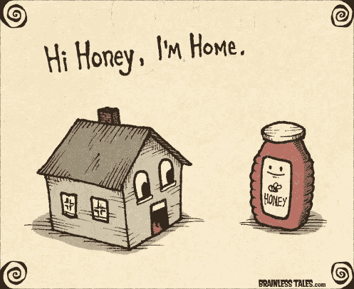

# 小心，是糖蜜！！

> 原文：<https://medium.datadriveninvestor.com/honey-whats-wrong-with-the-honey-2227c0af1339?source=collection_archive---------10----------------------->

在 Covid 时代，蜂蜜掺杂中国糖使食品欺诈再次成为焦点。

Brainless tales

蜂蜜，一种由勤奋的蜜蜂利用开花植物的花蜜创造的辉煌的半流体，正被不那么勤奋的人为了金钱利益而掺杂，但更令人震惊的是，这种掺杂对于现有的检查来说变得越来越邪恶和复杂。所以让我们更深入地透露一下这种掺假的手法。

蜂蜜是世界上第三大假冒食品，鉴于蜂蜜的药用特性，其消费量在 Covid 封锁期间飙升，为了平衡需求和供应，掺假业务不断发展，以绕过现有的测试。一些公司回应称这些仅仅是指控和政治，而一些公司尚未回应，但事实仍然是，食品欺诈对当地生产者和消费者的伤害最大。

2013 年 2 月，美国的“蜂蜜门”骗局将食品骗局引入全球舞台。

2019 年 7 月，近 12，800 公斤掺假蜂蜜被**加拿大食品检验局(CFIA)**截获进入加拿大市场，该机构一直通过其有针对性的监测技术瞄准假蜂蜜。

2020 年 12 月 3 日，在印度，科学与环境中心(CSE)指控印度主要品牌正在销售掺有中国糖的蜂蜜，这些糖在程序测试中无法检测出来。

 [## 如何通过使用 SCENARIO | Data Driven Investor 实现数字化，在新冠肺炎经济衰退中茁壮成长

### 如果数字化是避免新冠肺炎破产的解药会怎样？一百万人死亡，三十八…

www.datadriveninvestor.com](https://www.datadriveninvestor.com/2020/11/13/how-to-thrive-in-the-covid-19-recession-by-going-digital-using-scenario/) 

那么这是一种模式吗？几乎每一个主要的蜂蜜市场都受到了这种中国糖的困扰。你说这是什么糖？这是一种果糖糖浆，在规定的测试程序中会给出假阴性结果，并被伪装成油漆颜料从中国大量出口。那么它是不可探测的吗？不会。它可以由专业实验室使用核磁共振(NMR)测试来检测。那么，是什么让这种掺假变得特别呢？

蜂蜜碰巧被广泛消费，为了获得轻松的利润，缺乏专门测试的重大掺假使其成为真正的产品，这意味着你为掺假的产品而不是真正的产品付费。有必要恐慌吗？有什么缓解计划？

虽然食品假冒可能未能保护消费者免受欺骗，保护公司免受不公平竞争，但严格法律的形成并没有，例如，加拿大政府在 2019 年预算中推出了加拿大食品政策，其中向 CFIA 拨款 2440 万美元，以打击食品欺诈。

此外，照顾你们的幸福并不仅仅是政府的责任，主动一点怎么样？还记得当我们看小熊维尼的时候，我们的祖父母是如何从当地养蜂人那里带来纯蜂蜜的吗？为什么不恢复这种做法，购买当地产品并加强我们的社区呢？好吧，那由你来决定。我要去拿些蜂蜜！！

## 访问专家视图— [订阅 DDI 英特尔](https://datadriveninvestor.com/ddi-intel)