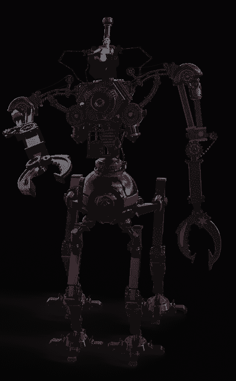

# 热辣椒——股票交易机器人

> 原文：<https://medium.datadriveninvestor.com/hot-chili-a-stock-trading-bot-58d03534c016?source=collection_archive---------15----------------------->

我们创造的不亚于一个“交易机器人”。所有的艰苦工作已经为你完成了，剩下你要做的就是创建你自己的交易系统。

框架已经准备好了——使用 Zipline(一个强大的回溯测试和实时交易引擎),你可以根据过去的数据对你的策略进行回溯测试，看看它们的表现如何。然后让机器人在市场上交易你的想法。

你可以在云端拥有自己的虚拟电脑，里面装载了创建强大交易策略所需的一切。

更好的是，连接到代理 API 的真正艰苦工作已经为您完成了。你可以让你的机器人立即运行，通过交互式经纪人为你执行自动交易。连接已经完成，代码就在那里。给它上发条，告诉它该做什么，让它为你交易。

所以，如果你正在寻找一个交易机器人，它就在这里。与市场上的许多产品不同，它不是一个单一的系统产品。它不“只是”贸易趋势或“只是”寻找缺口。它会做你让它做的任何事情——只要把它编码好，然后让它去做。

您可以使用任何您想要的 IDE——您不再局限于竞争对手提供的微弱的在线 IDE。您可以进入系统的核心，通过 Zipline 代码一行一行地跟踪它的执行。

而且它运行在云中——不用担心在国内服务器上托管软件，也不希望网络连接中断。AWS 服务器上运行的红辣椒盒继续运行。不管发生什么。

当然会有小故障，当然系统和它运行的基础设施会有小故障，所以检查一下，看看一切都在按计划运行。但这一切都是为你准备的，都设置在云中。一切准备就绪。

请注意，我们不受监管，也不提供金融建议或基金管理服务。我们为你提供软件去做你的事情。光滑的云为基础的软件，为您编程自己的交易机器人。

长寿繁荣。