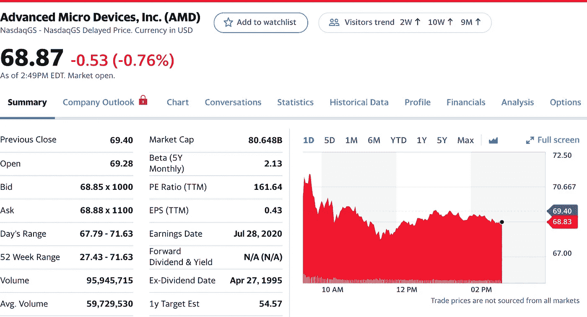

# 2020 年 8 月热门股票

> 原文：<https://medium.datadriveninvestor.com/hot-stocks-for-august-2020-c0616292ed36?source=collection_archive---------4----------------------->

## 5 要密切关注

Photo by [NeONBRAND](https://unsplash.com/@neonbrand?utm_source=unsplash&utm_medium=referral&utm_content=creditCopyText) on [Unsplash](https://unsplash.com/s/photos/5?utm_source=unsplash&utm_medium=referral&utm_content=creditCopyText)

我希望每个人最近在股市都有好运，不管你是交易员还是投资者。对于任何在这个疯狂时期将资金投入市场的人来说，他们应该对自己的所作所为感觉良好。

你在为自己更好的未来做准备，如果你把所有的钱都存起来，你会有更多的钱。自从疫情开始以来，我经历了一个不稳定的连胜，并决定购买更多的股息股票，这样我就可以在大多数情况下“设置它并忘记它”。

自从我和 [Haikhuu](https://haikhuu.com/) 一起加入股票交易社区以来，我的投资组合增长了 40%，他们给我的指导让我非常高兴。如果你还没有导师，我强烈建议你去找一些。

**我想给你们介绍的两位优秀的 YouTubers 视频作者是格雷厄姆·斯蒂芬和安德烈·吉克。它们都是股市建议的可靠资源，也是我获得大量金钱哲学的来源。**

**现在，让我们进入我的 2020 年 8 月前 5 只股票吧！**

# 1.Shift4 付款(四次)

Yahoo Finance

自从疫情爆发以来，越来越多的人用卡支付，进行无现金交易。这是有道理的，因为细菌的传播和可能的感染要低得多。

 [## 投资区块链前要问的三个简单问题(也是一个困难的问题)|数据…

### 现在是了解区块链的最佳时机。不同货币之间的增长率，比如…

www.datadriveninvestor.com](https://www.datadriveninvestor.com/2020/03/12/three-simple-questions-and-one-difficult-one-to-ask-before-investing-in-a-blockchain/) 

Shift4 Payments 是[支付](https://www.shift4.com/)处理的领导者，并帮助推动许多行业，如酒店、零售、电子商务、住宿、游戏等等。

他们似乎是 Paypal 和 Square 的主要候选人。这只股票没有股息。

**现价**:35.40 美元

**冕前病毒**:不存在(2020 年 6 月 5 日发布)

**52 周低点**:30.00 美元

**52 周高点:** $47.95

# 2.辉瑞制药公司(PFE)

Yahoo Finance

辉瑞是一家制药公司，最近获得了 19.5 亿美元的拨款，用于在年底前生产冠状病毒疫苗(纽约时报)。

我们已经看到一些股票，如 Moderna 和 Novavax，在获得尝试和制造疫苗所需的资金后，随着时间的推移，价格惊人地上涨。购买像辉瑞这样的领跑者股票有很多好处。

这支股票没有股息，但如果他们成功研制出疫苗，它很有可能会翻倍。

**现价**:37.25 美元

冠状病毒前期:32.30 美元

52 周低点:27.88 美元

52 周高点: $43.17

# 3.景顺抵押资本(IVR)

Yahoo Finance

Invesco Mortgage Capital Inc .是一家控股公司，从事投资、融资和管理住宅和商业抵押贷款支持证券和抵押贷款(Robinhood)。

我认为这只股票很有价值，因为他们的五年报告从未跌破 10.85 美元，直到疫情席卷全球。我喜欢这只股票的上涨，它也是 Robinhood 最受欢迎的 100 只股票之一。

IVR 有 40.82%的分红。

**现价**:3.36 美元

**电晕前病毒**:17.05 美元

52 周低点:1.82 美元

52 周高点: $18.30

# 4.联合航空公司(UAL)

Yahoo Finance

联合航空公司已经成为航空运输的主要领导者之一。他们的品牌在全世界都非常有名，其股票目前处于折价状态。

当然，航空业现在不景气，但不会永远如此。旅游市场将会复苏，自疫情事件影响全球以来，该股已经下跌了 65 %,是一只值得买入的股票。

联合航空公司没有股息

**现价**:33.00 美元

冠状病毒前期:80.24 美元

52 周低点:17.80 美元

**52 周高点:** $95.16

# 5.AMD —高级微设备公司(AMD)

Yahoo Finance

我和我的许多技术伙伴都在寻找可以成为伟大的长期投资的顶级股票，AMD 名列榜首。虽然它们不提供股息，但我相信它们会膨胀。

我不认为 AMD 可以快速获利，而是在显卡、处理器和任何与计算机相关的领域——这是一个不断增长的行业——成为一个强大的竞争对手。这就是为什么我是 AMD 的终身从业者。

在持有了近五个月之后，我终于看到了股票的增长。他们发布了下一代芯片的消息，仅仅一周时间就把价格从 50 多英镑提高到 60 多英镑。

我打算终身持有这只股票，祈祷它能像英伟达 406 美元的股票一样大。

AMD 没有分红。

**现价**:69.42 美元

冠状病毒前期:56.89 美元

52 周低点:27.43 美元

52 周高点: $69.94

# 最后的想法

玩波动游戏，在这里赚钱，有很多乐趣，但我的风险承受能力最近变低了，我更喜欢设置它，然后忘记它。

我计划现在看看高价值的股票，并在未来许多年里投资这些股票。对所有日内交易者，我祝你好运，希望你赚很多钱！

希望这些股票选择能帮助你在这段时间里获利。

[*乔丹门迪奥拉*](https://medium.com/@jordanmendiola) *是一位顶尖的媒体投资作家，也是美国军队中的一名士兵。他最近结束了海外之旅，正在承担他的新角色，在* [*YouTube*](https://www.youtube.com/channel/UCzGx6WdEjMg5exOJIqpeF1Q?view_as=subscriber) *上从事社交媒体、营销和视频制作工作。他出现在几个社交媒体频道上，你可以在 Twitter*[*@ Jordan mendiola 3*](https://twitter.com/JordanMendiola3)*和 insta gram*[*@ Jordan 上找到他。*](https://www.instagram.com/jordan.the.mendiola/?hl=en) *.门迪奥拉。*

**访问专家视图—** [**订阅 DDI 英特尔**](https://datadriveninvestor.com/ddi-intel)