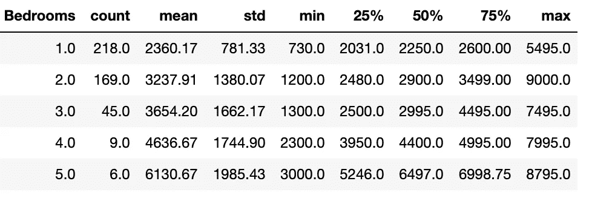
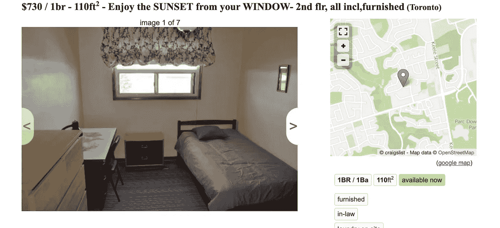
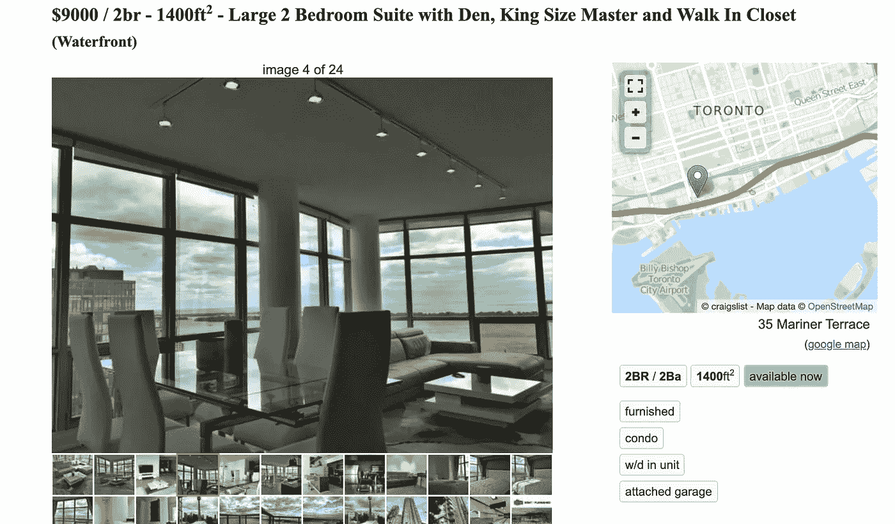
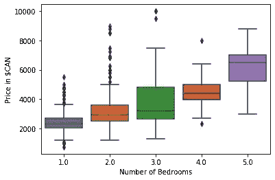
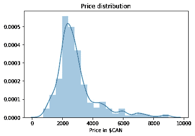
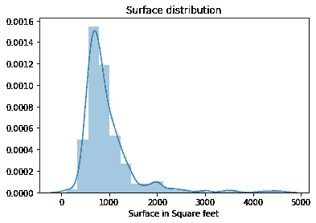
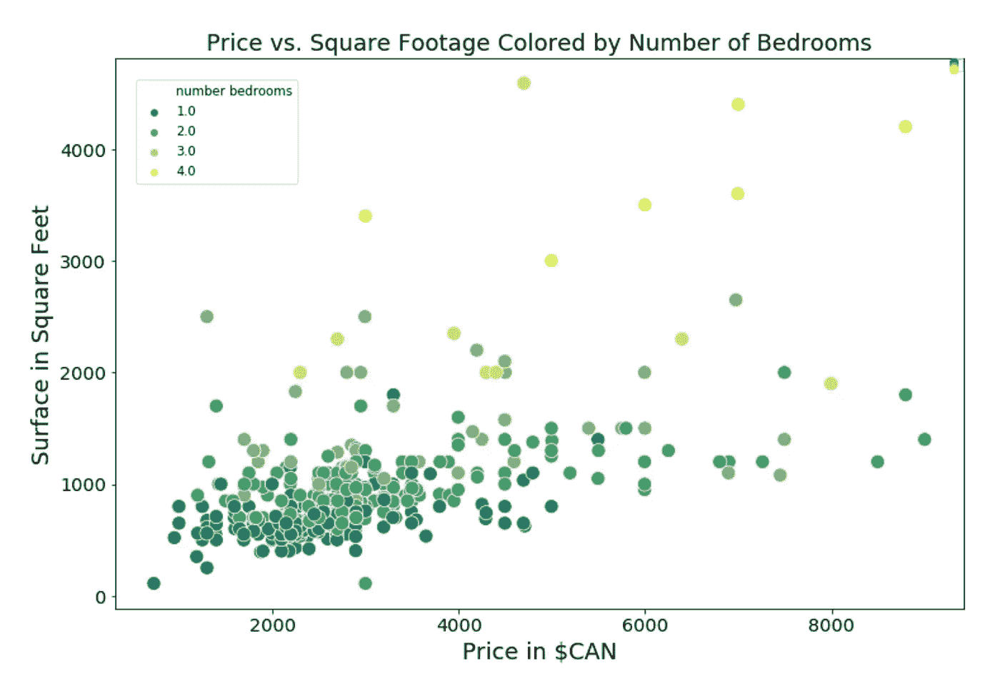
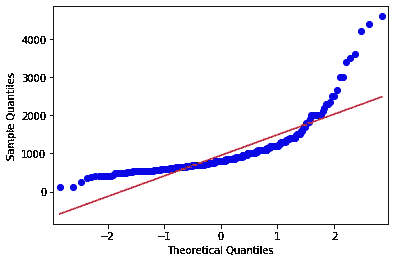
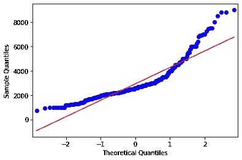
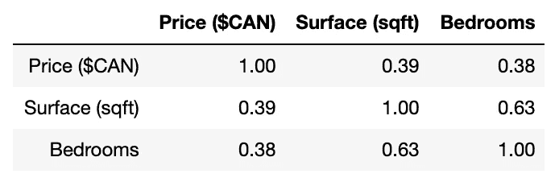

# 多伦多住宅市场的探索性数据分析及相关性

> 原文：<https://medium.datadriveninvestor.com/house-pricing-in-toronto-exploratory-data-analysis-and-correlations-45d2f11475f4?source=collection_archive---------4----------------------->

Toronto by night taken by Alexandre Risser [https://www.alexandrerisser.com](https://www.alexandrerisser.com/)

在谷歌上搜索“如何在多伦多找到一套公寓”会得到几十页的建议，这是一个很好的指标，表明寻找公寓是一个痛苦的过程。

作为一名数据科学家实习生，我确信我可以稍微减轻这种痛苦，简化人们寻找居住地的方式。我想出的这个项目旨在找出大多伦多地区(GTA)公寓价格、位置、表面和卧室数量之间的关系。这个项目的商业理念是帮助公寓寻找者在 GTA 的不同社区找到最好的交易。

在开始分析数据之前，我需要导入所有需要的包。对于这个项目，我导入了以下 Python 包 *Seaborn* 和 *Matlpot* 来可视化数据。

 [## 2019 年最值得学习的编码语言|数据驱动的投资者

### 在我读大学的那几年，我跳过了很多次夜游去学习 Java，希望有一天它能帮助我在…

www.datadriveninvestor.com](https://www.datadriveninvestor.com/2019/02/21/best-coding-languages-to-learn-in-2019/) 

现在我们来看数据！

但之前有些笔记。出于我不明白的原因，我每次查询只能提取大约 50–60 条记录，因此，为了增加我的样本量，我运行了几天脚本，直到达到 400 条记录。

在查看数据时，我注意到了另一个问题:“邻居”列是一个自由文本字段，因此同一区域内很少有公寓可以有非常不同的邻居名称。此外，有时描述是苍白无力的；我有几张唱片只有“多伦多”、“北约克”、“马卡姆”。这些名字不是街区，而是城市。因为这两个问题，这个专栏很模糊。因此，我不能在我的分析中使用这一列，所以我推进了剩下的三个变量:价格、卧室数量和表面。

# 探索性分析

经典的第一步是看变量的分布。根据下表，我注意到我有 447 条记录:

*   一居室公寓的 218 项记录
*   两居室公寓的 169 项记录
*   三居室公寓的 45 项记录
*   四或五居室公寓的 15 个记录

我观察到多伦多的大多数公寓都属于一居室或两居室的类型；这并不意外。我决定，由于四居室和五居室公寓的记录数量较少，我不会过多讨论它们，而是将以下分析集中在一居室、两居室和三居室类别上。

Summary table of all bedroom categories, source: Author

根据我的数据，如果你正在寻找一居室公寓，2020 年 2 月的平均价格是 2360 美元，两居室公寓是 3237 美元，所以差价是 877 美元。一居室公寓的中位数价格是 2250 美元，两居室公寓的中位数价格是 2900 美元，差价是 650 美元。相比之下，两居室和三居室公寓之间的中位数差异不到 100 美元，平均差异为 417 美元，这可能给我们一个提示，即价格不会随着卧室数量的增加而线性增加。

我从 Craiglist 上获取数据时，最便宜的公寓价格是 730 美元。如果你好奇的话，这里有这个公寓的链接:[链接](https://toronto.craigslist.org/yrk/apa/d/north-york-enjoy-the-sunset-from-your/7066398010.html)。在这种类型的网站上发现假房源并不罕见，所以下面是这个公寓的截图，看起来是合法的(以防你怀疑)。然而，我仍然不确定它是否确实是一居室。好像是合租公寓的卧室。

Craiglist, source:Author

在我的数据集中，最贵的公寓是 9000 美元，令人惊讶的是，这是一套靠近著名的加拿大国家电视塔的两居室公寓。这里有一个[链接](https://toronto.craigslist.org/tor/apa/d/toronto-large-2-bedroom-suite-with-den/7053754803.html)(如果你买得起的话)。

Most expensive appartment, source:Author

接下来，我根据卧室的数量绘制了价格的箱线图。每个箱线图是不同分位数的图形表示，方框内的水平线代表价格的中位数。

我注意到两居室和三居室公寓的箱线图有重叠。因此，根据我的数据，用两居室的预算，一个潜在的租房者可以在多伦多买一套三居室。

关于数据的分散性，两居室公寓类别的方差高于一居室，有许多价格在 6000 美元至 9000 美元之间的异常值。

Price per number of bedrooms, source: Author

然后我检查了所有卧室类别的两个变量的分布:价格和表面。

Price Distribution, source: Author

我从价格分布开始。我注意到很多价格在 2100 美元左右的公寓，价格在 9000 美元之前有一条长长的尾巴。分布似乎是右偏的。

Surface distribution, source: Author

关于面积分布，许多公寓的面积在 900 到 1，000 平方英尺之间(对于非帝国读者来说是 92 平方米)。它还有一条向右倾斜的长尾巴，长达 5000 平方英尺(约。465 m)。

继续，下面是一个散点图，卧室的数量给点着色。这显示了一个清晰的、可理解的和预期的分层:围绕特定价格和平方英尺聚集的点的层，随着价格和平方英尺的增加，卧室的数量也增加。

Price vs Square Footage Colored by Number of Bedrooms, source: Author

# 相关性检验

接下来，我想测试价格和表面之间的相关性。为了做到这一点，我需要研究我可以使用的测试。上面的两个直方图已经可以让我们了解不遵循正态分布的数据。我在下面做了 Q-Q 图进一步验证了这一点。

QQ plot — Surface, source: Author

QQ plot — Price, source: Author

如果数据大致沿着红线，那么数据应该是正态分布的。此外，我之前展示了数据的分布是右偏的。这是由于大量公寓处于相同的价格范围内，每月 2000 美元至 3000 美元之间。因此，我无法对它进行参数测试。相反，为了显示我的三个变量之间的相关性，我使用“Kendall”方法进行了相关性测试。这种方法是一种完全非参数的线性回归方法，其中有一个自变量和一个因变量。它对因变量中的异常值是稳健的。结果如下表所示，从中我得出了几点结论。

Correlation score, source: Author

正如所料，卧室数量和公寓面积之间的相关性相对较强，为 0.63。这在逻辑上是可以预料的，因为一个公寓的卧室越多，它们所占的面积就越大。

此外，价格和卧室数量之间的相关性较低(0.38)也不足为奇。同样，价格和表面的相关性是 0.39。在我看来，公寓的价格首先会受到城市位置的影响，然后可能会随着面积和/或卧室数量的增加而增加。例如，位于市中心附近的公寓可能会比远离市中心的公寓更贵，如果两者的表面相同的话。

我想深入挖掘多伦多的住房数据，以便能够将位置(例如，街区)作为另一个变量包括在内。但是，为了做到这一点，我需要改变数据的来源。所以，我对改善结果，获得合理结论的建议是，下一次，我会选择更有价值的网站去刮，以便获得更有价值的数据。

无论如何，我希望你欣赏这些见解，并随时给我一些反馈=)。

我在 Github 上的[回购](https://github.com/walkyrie67/House_pricing_in_Toronto)。

Toronto from Gardiner Expressway by Alexandre Risser [https://www.alexandrerisser.com](https://www.alexandrerisser.com/)