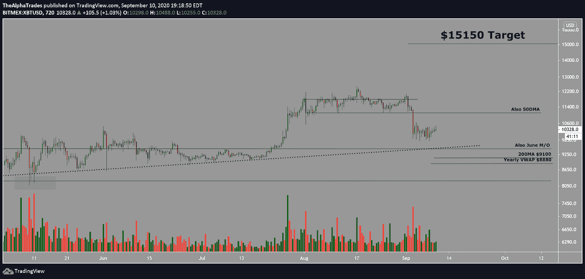
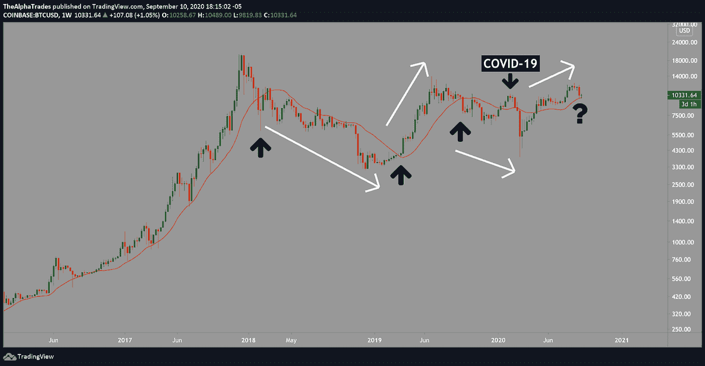
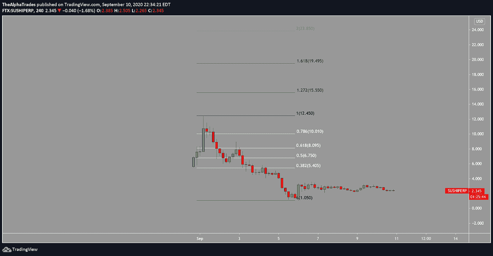
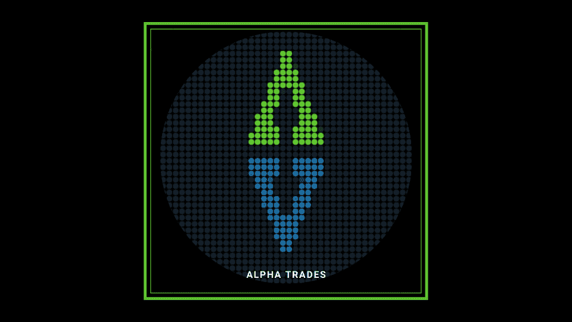

# 3 个技巧、2 条黄金法则和 1 个简单策略如何帮助你今天交易比特币

> 原文：<https://medium.datadriveninvestor.com/how-3-tips-2-golden-rules-and-1-simple-strategy-help-you-trade-bitcoin-today-9694eea52e6f?source=collection_archive---------11----------------------->

## 阿尔法交易市场分析。

Bitcoin levels to watch; Source: Alpha Trades

# 比特币(BTC)的关注级别

*   六月月度开放:9450 美元
*   每年的 VWAP:8880 美元
*   200 毫安:9100 美元

我将向你们展示我是如何开始几乎所有的分析的，不管图表上的资产是什么。我们将根据以下视频来学习本课:

[BTC Can Move to $11k, But is that Bullish? | Why SushiSwap will be Bigger than Uniswap!](https://youtu.be/QX7j76beaWI)

# 两条黄金法则适用于交易游戏。

交易不一定要枯燥，但是没有潜伏在终端后面的隐形老虎，我们也可以。

这就是为什么遵循这两条黄金法则至关重要。

第一，不惜一切代价保护你的资本。如果市场一片欢腾，请保持谨慎。第二，让你的钱增值。按照这个顺序。我在下面的文章中解释了这些黄金法则和另外八条。

 [## 如何以交易为生|数据驱动的投资者

### 不管你是刚开始交易，还是已经开始了职业生涯，有一件事是…

www.datadriveninvestor.com](https://www.datadriveninvestor.com/2020/08/17/how-to-trade-for-a-living/) 

## 从更高的时间框架开始，然后放大。

总是从更高的时间框架开始[。这一步会让你对整个市场有更好的了解，并对特定资产的关键价格水平有更好的观察。](https://www.investopedia.com/articles/trading/07/timeframes.asp#:~:text=A%20general%20rule%20is%20that,of%20whatever%20they%20are%20trading.)

有一个原因可以解释为什么拥有几米的高地可以让对手在战场上获得关键的优势。这就是为什么猛禽能在高空发现猎物。像老鹰一样从上面发现机会。

你永远不要从较低的时间段开始，因为噪音会分散你对全局的注意力。防止混淆信号的最好方法是从 10，000 英尺的高度开始分析，甚至高达每月的时间框架。

## 接下来，检查给定资产的价格范围。

知道你给定资产的[价格区间](https://www.investopedia.com/terms/r/range.asp)，特别是在更高的时间框架内，给你一个交易该资产的波动性和风险的体面衡量。

一个明确定义的交易区间也包括容易识别的支撑位和阻力位，或“SR 水平”我们在分析中谈了很多关于锶水平的问题。有些交易者什么都不用。原因是，它们非常重要。SR 水平告诉你市场中较大的玩家在哪里陷入了僵局。还有很多其他因素，比如[价格发现](https://www.investopedia.com/terms/p/pricediscovery.asp)和经济环境的根本转变。但是我们现在不讨论这个。

 [## 稳定币会危及比特币在加密领域的地位吗？数据驱动的投资者

### Stablecoin 是一种加密货币，主要用于维持稳定的市场价值。它可以通过…

www.datadriveninvestor.com](https://www.datadriveninvestor.com/2020/06/08/can-a-stablecoin-jeopardize-the-position-of-bitcoin-in-the-crypto-space/) 

## 跟踪相关性。

2020 年 9 月 11 日更新

 [## 破解比特币与美元的关联密码

### 如何在你的交易策略中使用 DXY-SPX-BTC 相关性

medium.com](https://medium.com/datadriveninvestor/es-breaking-the-code-of-bitcoins-correlation-with-the-greenback-e2f55cb88477) 

DXY 是世界经济大方向的一个强有力的指示器。不管你喜不喜欢，美元仍然是货币之王。亿万富翁对冲基金经理雷伊·达里奥[解释了为什么](https://www.linkedin.com/pulse/changing-world-order-ray-dalio-1f/)。这是一个地狱的阅读。你可能想倒一杯酒，找一张沙发来放这个。

时间紧迫？这一统计数据说明了一点:截至 2019 年 4 月，在外汇市场的所有交易中，美元是[的一方。](https://www.bis.org/statistics/rpfx19_fx.pdf)

当美元走强时，[市场往往会回调。](https://www.investopedia.com/articles/forex/051415/pros-cons-strong-dollar.asp)

## 在这种环境下交易比特币的简单策略

我创造了一个简单的策略，使用更长的时间框架和 20 点均线。看看这个:

 [## 完美的加密交易策略|数据驱动的投资者

### 如果你在交易游戏中已经有一段时间了，你可能听说过“支点”和“VWAP”前者听起来像…

www.datadriveninvestor.com](https://www.datadriveninvestor.com/2020/08/31/the-perfect-crypto-trading-strategy/) 

还有一个视频:

[完美的加密交易策略——YouTube](https://www.youtube.com/watch?v=msaG_wjX6p4)

当比特币突破其 20 周移动平均线时，它往往会在突破方向上深入延伸。

Bitcoin 20-period moving average strategy; Source: Alpha Trades

# 额外的想法:寿司(寿司)

声明:当我写这篇文章的时候，我看多了$SUSHI，并且处于一个小的多头位置，当你读这篇文章的时候，这可能会改变。全是我的意见，不是理财建议。

如果你需要一个疯狂的总结，看看我们发表的文章，

 [## SushiSwap，一个令人讨厌的故事

### 苏珊·沃普的突然起伏

medium.com](https://medium.com/datadriveninvestor/sushiswap-an-unsavory-tale-4b6ea11d1e1b) 

这篇文章对 SushiSwap 项目提出了批评，但它也会给你这个项目的梗概。为了简洁起见，SushiSwap 是 Uniswap 的一个分支，它提供了后者所没有的东西，即治理令牌。社区控制——现在在 DeFi 很流行。另外，这个项目[最近移交给了好帮手，FTX 加密资产交易所的首席执行官萨姆·班克曼-弗里德。](https://news.bitcoin.com/defis-raw-deal-sushiswap-creator-transfers-multi-sig-control-to-ftx-ceo/)

这篇文章出版时将会是旧闻，但是把它当作一篇教育文章。当您看到一个协议上的 70%的资产在大约 48 小时内迁移到另一个特定的项目时，您就把这个标记放到了您的观察列表中。在这种情况下，这就是 SushiSwap 从 Uniswap 吸走超过 20 亿美元流动性的原因。

Big kudos to Alex for keeping us in the loop.

到目前为止，1.618 美元的寿司价格波动的[斐波那契扩展](https://www.investopedia.com/terms/f/fibonacciretracement.asp)为 19.49 美元。2.0 扩展为 23.85 美元。不能保证它会实现，但管理层的变化和大量的实际资金流入让我对这个项目的少量股份感到满意。

SushiSwap Fibonacci levels to watch; Source: Alpha Trades

# 观看表演

[Alpha Trades](https://twitter.com/the_alphatrades) 的团队本周深入研究市场、密码和经济。当谈到抛出一些图表和提供交易者心理服务时，我们无愧于“阿尔法”这个绰号**找到你的优势**最新剧集:

[BTC 可以移动到 11，000 美元，但这是乐观的吗？|为什么 SushiSwap 会比 Uniswap 大！](https://youtu.be/QX7j76beaWI)

[如何为比特币准备一个血腥的九月|十月 Alt Szn 会跟进吗？——YouTube](https://www.youtube.com/watch?v=6pWe2JWZ9gg&t=16s)

# 当我们在这里的时候，

Join the Alpha Trades Discord community for top-tier market analysis.

我们有一个活跃的不和谐频道，有来自世界各地的数百名成员。无论我们是交易 DeFi、石器时代(2017)的 alt-coins，还是比特币，都有你的一席之地。我们准备回答你所有的问题。

# 放弃

Alpha Trades，LLC 提供的信息不用于制定任何财务决策，也不是购买、持有和/或出售特定证券或金融工具的请求或建议。

访问 Alpha Trades 的完整服务条款:[https://bit.ly/3faVeeV](https://bit.ly/3faVeeV)

**访问专家视图—** [**订阅 DDI 英特尔**](https://datadriveninvestor.com/ddi-intel)