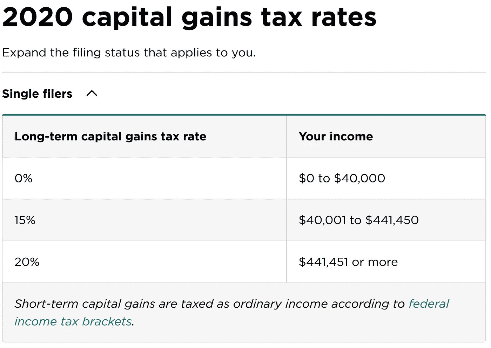
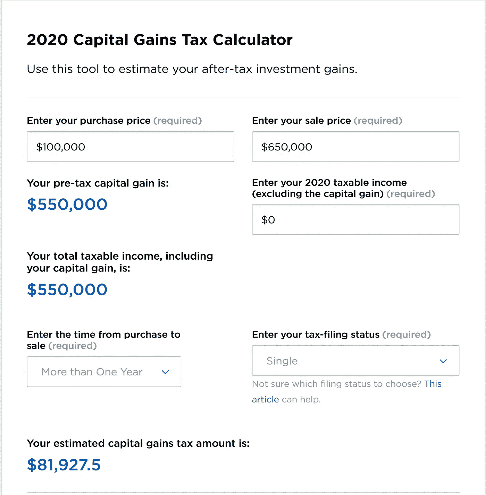
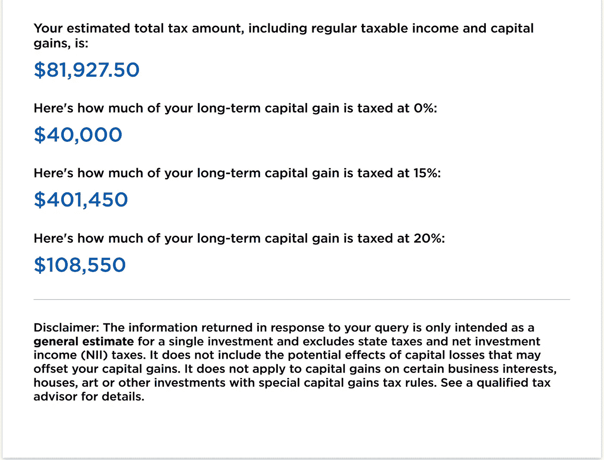

# 亿万富翁如何缴纳 0 美元的联邦所得税

> 原文：<https://medium.datadriveninvestor.com/how-a-billionaire-pays-0-in-federal-income-tax-1c0551e6d552?source=collection_archive---------10----------------------->

## 一位亿万富翁寻求消除数亿美元纳税义务的调查

Photo by [Markus Winkler](https://unsplash.com/@markuswinkler?utm_source=medium&utm_medium=referral) on [Unsplash](https://unsplash.com?utm_source=medium&utm_medium=referral) | $0 in Federal Income Tax

很少有头条新闻比金融文章更能吸引全国的注意力——突出报道富人如何设法缴纳 0 美元的联邦所得税。在这些税收异常中，更有趣的是会计师如何通过税法达到税收贡献的绝对谷值——这让许多人感到好奇:

国税局怎么会允许这样？

有哪些税收漏洞被利用？

**为什么我在 H & R 街区的朋友不帮我做同样的事情？？！**

无论如何，如果你同意/不同意这种道德观，这篇文章将探索使 0 美元的联邦所得税税收胜利的法律。发现一个真实的例子，一个亿万富翁如何设法支付最低联邦所得税。

*注:根据真实故事改编。为了保护无辜，名字被改了。*

# 基于真实事件

这个案例研究涉及一位亿万富翁房地产开发商——他多年来几乎没有缴纳任何联邦所得税。每一部分都将强调一个适用的税法，使他们的纳税义务最小化。

在我们的场景中，

*   开发商从多种收入来源获得收入，包括租金、资产出售、电视节目和电影的版税、商标使用费等。
*   他们的大部分收入来自房地产交易。
*   他们是个体经营者。
*   他们负债累累——他们认为这是件好事。
*   他们是名人，从代言交易中获得收入。
*   多年来，他们缴纳的联邦所得税不到 1000 美元。
*   美国国税局正在对其进行审计，重点是由不准确的损失报告导致的约 8000 万美元的退税。如果审计失败，房地产开发商将欠美国国税局:最初的 8000 万美元+大约 2000 万美元的罚款和利息。

请继续阅读，了解亿万富翁的纳税义务是如何从 1 亿美元变成 0 美元的。

# 第一步:资本收益与普通收入

从一开始，房地产专业人士就受益于税收减免——这是他们行业特有的。我们的亿万富翁明白资本收益的好处，并选择给自己支付 0 美元的年薪，以避免普通收入——按最高税率纳税。

在许多情况下，与普通所得税纳税人相比，资本收益纳税人支付相同金额的一半税率。

例如，一名医生年收入 550，000 美元，最终处于最高普通所得税等级，支付高达 37%的联邦所得税。在应用标准扣除后，我们的单身医生支付了 163，339 美元的普通所得税，剩下 386，661 美元。

*此外，医生还需支付 8，537 美元的社会保障费、7，975 美元的医疗保健费，以及任何适用的城市和州税。这一数额不包括在我们的计算中，因为我们只评估联邦所得税。*

如果我们的亿万富翁房地产专业人士赚同样多的钱——每年 55 万美元，但将他们的利润作为资本利得申报，他们将支付 0-20%的税。

为什么会这样？

国税局考虑出售财产、股票、黄金等资产。作为*资本收益*。这些收入的征税不同于工作所得(普通收入)。

当申报资本利得时，个人不会为他们的利润支付超过 20%的税，即使他们申报数十亿的资本利得。

“2020 Capital Gains Tax Rates — and How to Calculate Your Bill” | Tina Orem | NerdWallet

回到房地产专业人士与医生的例子，当我们计算房地产开发商 550，000 美元资本收益的总所得税时，我们发现**惊人的税收差异**:

“2020 Capital Gains Tax Rates — and How to Calculate Your Bill” | by: Tina Orem | NerdWallet

*注意:在这个例子中，房地产专业人士以 100，000 美元购买了一处房产，一年后以 650，000 美元出售。作为单身申报人，他们申报的资本收益为 55 万美元，普通收入为 0 美元。*

税收计算器说明了房地产专业人士相对于医生享有的显著优势。在某一点之后，医生赚了太多的钱，并对所有后续收入征收 37%的税率。然而，房地产专业人士的税收上限为 20%。

这种税收优势就是为什么许多首席执行官可以接受零美元年薪的原因。相反，他们选择了数百万的股票奖励——一年后，这些股票被指定为资本收益，有资格享受较低的税率。

 [## 如何在不牺牲孩子或财务的情况下安全理智地离婚|数据驱动…

### 在美国，七月是以孩子为中心的离婚月。作为 cdfaⓡ的专业人士，我可以向你保证，从长远来看…

www.datadriveninvestor.com](https://www.datadriveninvestor.com/2020/07/28/how-to-divorce-safely-and-sanely-without-sacrificing-your-children-or-your-finances/) 

**第 1 节概述**

与普通所得税纳税人相比，房地产专业人士受益于优惠条款，因为资本利得的税率较低。在我们上面的例子中，医生支付的所得税是我们的亿万富翁的两倍。

总体而言，当缩小你的纳税义务时，从 20%的税率而不是 37%的税率开始会有所帮助。

# 第二步:1031 交换

在不太可能的情况下，我们的亿万富翁出售了一项资产；根据被称为 1031 交换的税收条款，他们仍然可以支付 0 美元的联邦所得税。

**在这个世界上，什么是 1031 交换？**

> “在房地产领域，1031 交易是一种投资性房地产与另一种投资性房地产的互换，允许资本利得税延期缴纳。投资媒体

通过交换类似的财产，房地产专业人士可以交换他们的资产，并支付 0 美元的联邦所得税。美国国税局将这一过程称为同类交换，并延期纳税，从而节省了一大笔税款。

此外，美国国税局不限制 1031 交换，所以理论上，房地产专业人士可以无限期地交换财产，并避免纳税。

# 第三步:房地产折旧

除了购买/销售，我们友好的亿万富翁还利用了一种被称为折旧的标准年度扣除。

> “折旧是资产价值随着时间的推移而下降……税法允许资产所有者扣除建筑物的折旧。”——托马斯·布莱克在《福布斯》

无论财产的折旧是实际的还是感觉到的，行业专业人士每年都会利用它来降低纳税义务。

它是如何工作的？

当租赁一处房产时，会发生假定的磨损——需要主动维护，如更换地毯。地毯的贬值被认为是对整体财产价值的贬值，它占了一个经常性的年度税收减免。

但是，当折旧不像地毯腐蚀那样容易识别时，会发生什么呢？

美国国税局(IRS)仍然允许房地产专业人士根据*感知的*价值损失，对他们的财产申请折旧。

但是，等等，还有更好的…

如果一项财产在评估中升值(价值增加)，它不会抵消折旧。在纳税申报单上，房产可以同时升值和贬值。

对于我们的亿万富翁房地产开发商，他们利用其所有财产的折旧税收优势来减少他们的联邦所得税负担。

# 第四步:以升值为抵押借款

在房产大幅升值后，银行会神奇地提高房主的信用额度。这个过程类似于房屋净值信用额度。

两笔贷款的区别在于，后者增加了原始贷款。

例如，一名房地产专业人士购买了一套价值 10，000 美元的房产，并获得了 7，000 美元的贷款。十年后，房产升值到 20，000 美元，但仍有 4，000 美元的原始贷款债务。银行允许房地产专业人士从房产净值中贷款 16，000 美元，从而从升值中获益。

现在，我知道你在想什么…

从银行借更多的钱会导致更多的债务，更高的月供，以及支付给银行更多的利息。这有什么好处？！

较高的贷款额由利息组成，可以用作税收减免，从而减少未来的纳税义务。

**这就像在选项 A 和选项 B 之间做选择:**

**选项 A:** 房地产专业人士以 20，000 美元的价格出售他们的房产，赚取 10，000 美元的利润。他们按净利润向美国国税局支付一笔总额(资本利得)，交易就此结束。

**选项 B:** 房地产专业人士保留他们的财产，但以该财产的价值为抵押进行借贷。这种策略有助于他们避免向美国国税局支付一笔总额。此外，未来利息支付的利息将用于未来的税收减免。而且，他们保留着房产，可能会从随后的房产升值中获益。

总的来说，选项 B 有风险，但可以为我们的亿万富翁带来大量的免税现金。*以资产增值为抵押贷款的情况比人们想象的要频繁得多！*

# 第五步:在失败的投资中损失数十亿

如果由于过度支出或彻底的商业失败而损失了大量的金钱，国税局允许你通过税收损失结转来弥补损失。

什么是税损结转？

> **“税收损失结转(或结转)是一项规定，允许纳税人将税收损失结转到未来几年，以抵消利润。个人或企业可以申请税款损失结转，以减少未来的任何税款支付。”——Investopedia**

结转减少了未来的所得税负债——直到损失已经耗尽。换句话说，如果你损失了数十亿美元，你将有几十年的税收减免来申报。

为什么会存在税损结转？

帮助企业家从投资失误中恢复过来。许多投资者在他们的职业生涯中都会犯错，这项税收条款有助于恢复过程。

在我们的亿万富翁房地产专业人士的例子中，他们遭受了多个失败的赌场——总计数十亿美元的损失。这些损失提供了数十年的税收损失结转。

# 概观

亿万富翁怎么比秘书少缴税？

*   永远不要支付超过 20%的所得税(资本收益)。
*   利用 1031 交易所完全避税。
*   每年对财产进行折旧。
*   以你的财产为抵押借款，而不是出售。
*   如果你在生意中亏损，利用税收损失结转，直到亏损已经耗尽。

有了如此多样的税收优势，富裕的个人往往竞相缴纳最少的税。

无论你认为缴纳 0 美元的联邦所得税是否道德，归根结底就是一点:

每年的纳税季，我们都在做同样的事情——寻找降低税单的方法。为了这个目标，我们团结一致。

*本文仅供参考，无意用作财务或税务建议。在做任何财务决定之前，请咨询财务和税务专家。*

**多看 KR 富兰克林的中型文章**

 [## 800+信用评分的 6 个因素

### 阻碍你获得 800+信用分数的六个因素。了解如何最大限度地提高您在每项中的分数…

medium.com](https://medium.com/datadriveninvestor/6-factors-to-an-800-credit-score-bade2a978357)  [## “疫情期间 60%的企业被永久关闭”——Yelp

### 美国的小企业支柱正在崩溃。成千上万的企业正在倒闭。什么……

medium.com](https://medium.com/an-idea/41-of-all-business-closures-since-march-are-permanent-yelp-90e6da3f12e0)  [## “我最关心的是通货膨胀”——艾伦·格林斯潘

### 艾伦·格林斯潘说通货膨胀是一个问题。杰罗姆·鲍威尔说通货膨胀太低了。你应该担心吗？

medium.com](https://medium.com/an-idea/my-major-concern-is-inflation-alan-greenspan-f6a1b068811d) 

## 访问专家视图— [订阅 DDI 英特尔](https://datadriveninvestor.com/ddi-intel)