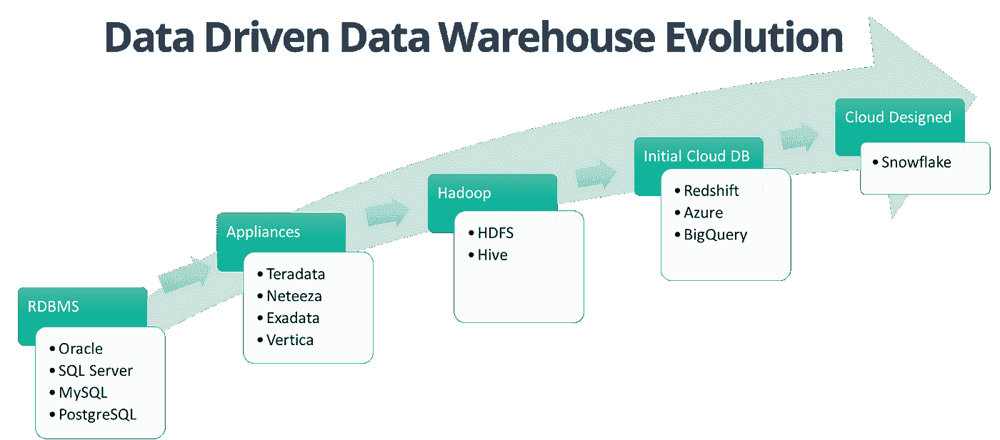

# 面向企业的云托管数据仓库如何工作

> 原文：<https://medium.datadriveninvestor.com/how-a-cloud-hosted-data-warehouse-for-an-enterprises-works-74a534ed3699?source=collection_archive---------2----------------------->

简而言之，数据仓库是一个从多个来源收集和分析数据的过程。随着大量业务数据的可用性，数据仓库的重要性得到了提高，这些数据现在可用于业务用户之间的分析和报告。

然而，数据仓库并不是最近才发展起来的，它从 20 世纪 80 年代末就开始酝酿了。在云技术发展之前，传统的数据仓库是在更昂贵的内部基础设施上运行的。

此外，这些数据仓库包含来自选定来源的数据，包括关系数据库表和数据文件。如今，数据仓库包括这些数据源和其他来源，包括 CRM 和 ERP 系统、社交媒体平台、物联网设备、大数据等等。

 [## 信息图:云之旅|数据驱动的投资者

### 聪明的企业领导者了解利用云的价值。随着数据存储需求的增长，他们已经…

www.datadriveninvestor.com](https://www.datadriveninvestor.com/2018/09/22/infographic-journey-to-the-clouds/) 

那么，自 80 年代以来，企业的数据仓库是如何发展的呢？云上的数据仓库与传统模型相比如何？让我们在接下来的章节中对此进行研究。

# 什么是企业数据仓库？

企业数据仓库(或 EDW)是一个集中式数据库(或数据库集合)，它存储来自多个数据源的业务数据。然后，这些业务数据可用于数据分析和获得有价值的见解。

在当今的大数据时代，企业仓库是从多个来源收集数据的中央存储库(如图所示)。这包括结构化、非结构化和部分结构化的数据，这些数据在存储到数据仓库之前要经过一个 [ETL](https://www.countants.com/blogs/how-to-automate-the-etl-process-for-data-from-magento-google-analytics/) (提取、转换和加载)过程。

根据 Oracle 的说法，企业数据仓库是一个数据管理系统，旨在执行商业智能或 BI。

随着所有业务数据在一个中央仓库中的可用性，现在可以使用数据分析或 BI 工具来分析数据，以获得更准确的见解。例如，航空公司的数据仓库可用于确定当前的机组人员分配、常旅客计划和航线分析。

近年来，公司已经将其企业数据仓库架构从传统的内部仓库转移到基于云的架构。与传统的仓储模式相比，企业云数据仓库提供了以下业务优势:

*   消除了为数据仓库购买任何内部硬件的需要。
*   与传统仓库相比，前期成本更低。
*   随着可用数据的增加，它提供了更高的可扩展性。
*   由于其大规模并行处理(MPP)能力，可以更快地处理分析和查询。

接下来，我们将讨论企业数据仓库架构及其关键组件。

# 企业数据仓库—架构和关键组件

首先，我们将讨论企业数据仓库架构的关键组件。

通常，三层企业数据仓库体系结构由以下组件组成，即:

*   存储业务数据的数据源或数据库。
*   提取、转换、加载(ETL)或提取、加载、转换(ELT)，是指用于数据提取、转换和加载到 EDW 的 ETL 或 ELT 工具。ETL 和 ELT 的主要区别在于，ETL 过程包括一个执行数据转换的暂存区。
*   仅在部署 ETL 工具时包含的临时区域组件。这是在将提取的数据存储到数据仓库之前加载和转换数据的组件。
*   数据仓库数据库，将提取的数据加载并转换(仅在 ELT 的情况下)到存储空间。
*   用于数据在线分析处理的 OLAP 服务器组件。该组件允许业务用户对生成的数据进行切片和切块，以编制业务报告。
*   为用户提供 BI 界面的报告组件或工具，用于可视化数据和报告生成。

作为一项技术创新，企业数据仓库可以支持任何商业企业中的许多工作负载，包括制造、财务报告、供应链和客户满意度分析。

将数据企业迁移到云的主要原因之一是，随着组织不断增加新的或更复杂的工作负载，数据可扩展性可能会成为一项重大挑战。这种增长会产生多种工作负载，包括分析和操作工作负载。

为了进行适当的规划，企业必须考虑以下主要类别的 EDW 工作负载:

*   可审计的工作负载，包括任何公司的业务法律要求和运营。这些工作负载包括业务合规性、风险和政府法规方面的数据。
*   持续工作负载，通常由管理团队用来检查关键指标，如客户满意度、CRM 和其他业务驱动指标。
*   可变工作负载，包括任何不连续使用 EDW 的财务和运营报告数据。这些工作负载非常适合云驱动的 EDW，用于销售规划和薪酬。
*   组织报告工作负载，由衡量业务绩效的指标和 KPI 组成。这种工作负载非常适合云平台中的企业数据仓库。
*   特定于业务部门的工作负载，即特定于部门的数据，属于可以安全迁移到云的第一批工作负载。

现在，我们已经了解了 EDW 组件和工作负载类别，让我们继续在云平台上实施 EDW 的流程。

# 如何在云上实现 EDW

随着云计算技术的出现，商业企业正在云平台上实现(或迁移)他们的企业数据仓库。基于云的数据仓库服务在 Amazon Redshift、Google BigQuery 和 IBM DB2 等技术上提供。

在将您的 EDW 迁移到云平台之前，任何企业都必须评估一些迁移注意事项。这对于确保基于云的数据仓库工作负载与内部工作负载无缝集成至关重要，从而最大限度地减少停机时间。

以下每个考虑事项都可以用来确定要迁移到云的工作负载的优先级:

## 定义所需的数据集和数据量

对于大数据量，将数据仓库从本地迁移到云可能是一个漫长而耗时的过程。因此，您必须在流程的早期定义数据集。这确保了数据移动的顺畅连接，并为有时间限制的数据迁移流程设计了项目时间表。

## 评估您的云操作 ETL 工具

云驱动的 EDW 要求所有的 ETL 过程和数据都能够超越内部仓库。作为一个考虑因素，评估您现有的 ETL 工具对于云操作是否有效，是否可以与基于云的 EDW 技术集成。

## 评估您的开发团队在云技术方面的专业知识

云驱动的 EDWs 提供的功能对于习惯于在内部仓库中工作的开发人员来说是一个挑战。通过适当的培训和学习，确保您的项目开发人员获得采用云 EDW 所需的专业知识和资源。

## 估计数据移动的总体成本

如果迁移过程效率低下，将数据从内部仓库迁移到云中的业务成本可能会过高。作为一家企业，在进行迁移之前，请评估迁移的总体成本。

在云上为企业实施数据仓库需要一个分阶段的过程，包括新的部署以及现有工作负载向云的迁移。

让我们详细讨论其中的每个阶段:

这是初始阶段，您可以在此阶段定义用于衡量 EDW 项目可交付成果的业务指标和 KPI。为了定义目标工作负载，与您的团队成员(包括业务分析师、BI 程序员和数据库管理员)一起参与并进行头脑风暴。您还可以确定云驱动 EDW 的使用案例。

在评估阶段，列出工作负载并将其映射到数据集、数据库表和其他结构。为了更好地治理和遵从，定义必要的安全控制。此外，您可以定义最小可行云(MVC)的路线图，以及执行 MVC 构建和其他 EDW 操作的人员配备。

在第三阶段，设计和实现 MVC 构建，包括连接、路由、访问控制和其他部署工具等元素。此外，您应该为开发、测试和生产活动配置单独的环境。在构建数据库实例的同时，您可以为数据复制和转换配置登台环境。

最后，我们进入迁移阶段，您可以将数据集迁移到云 EDW 平台。此外，您可以在此阶段实施 ETL 流程，以确保内部和云内部工作负载之间的完整性。识别单个工作负载(用于开发、测试和生产)，并将其与数据工作流一起迁移。最后，重新配置您的数据分析模型，以便在云上执行。

最后一个阶段是操作阶段，用于对任何系统事件执行可操作的自动响应。在此阶段，确定运行团队人员，如有必要，培训他们识别和响应系统事件。

通过这种分阶段的实现，您可以完成 EDW 系统向云的迁移。接下来，我们将看看云驱动的企业数据仓库如何让任何组织受益。

# 云上 EDW 的业务优势

面向企业的云托管数据仓库提供了多种业务优势，包括:

## 降低运营成本

任何内部基础架构都涉及多种成本途径，包括许可证成本、硬件、人力，甚至部署和维护相关成本。对于云驱动的 EDW，你只需为你消费的东西付费。此外，云平台释放了您的内部资源，用于其他工作，否则这些资源将被分配用于管理您的数据仓库活动。

## 更高的业务敏捷性

像有效的数据分析和商业智能这样的功能不再仅仅是 IT 领域的事情，现在已经被业务用户和部门所使用。在这种环境下，业务部门等待 it 人员为他们建立数据仓库不再可行。

另一方面，云部署为企业和商业用户提供了更快、更灵活的数据仓库优势。

## 增强的安全性和保护

云部署通常会引发企业对数据安全性和隐私的担忧。微软 Azure 和谷歌云存储等云工具已经解决了这一问题，这些工具高度重视其安全措施。例如，谷歌云平台上的数据加密等措施提高了数据安全性。

# 结论

对于任何行业或业务领域，企业的数据仓库都有其优势和挑战。为了简化决策，您必须首先了解您的数据相关需求以及将您的数据仓库迁移到云的可行性。

凭借其在[云工程](https://www.countants.com/services/cloud-engineering/?utm_medium=social&utm_source=Medium&utm_campaign=traffic)和分析方面的定制服务，Countants 已帮助其全球客户迁移至云平台并降低其运营成本。

想要从我们的 BI 和云计算服务中利用您的业务吗？[立即联系](https://www.countants.com/contact-us/?utm_medium=social&utm_source=Medium&utm_campaign=traffic)了解您的业务疑问和需求。

*原载于 2020 年 1 月 18 日 https://www.countants.com***。**