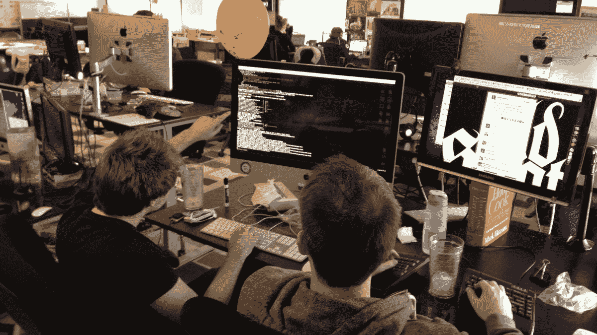

# 意大利开发者大会如何将 COVID19 的挑战转化为机遇

> 原文：<https://medium.datadriveninvestor.com/how-a-developer-turned-the-challenges-of-covid19-into-an-opportunity-1a686b6f88c0?source=collection_archive---------18----------------------->

想象一下。你在意大利管理着一个欧洲开发者社区，主要围绕五个年度会议——米兰、罗马、阿姆斯特丹、柏林和马德里。你已经为 2020 年安排了一系列活动，包括即将在罗马举行的活动。大多数组织者都在意大利，并且正在努力工作。然后新冠肺炎出手了。会议被无限期推迟，团队成员被迫呆在家里远程工作，应对工作、伙伴和孩子的挑战。

幸运的是，Codemotion 不仅在 COVID19 中幸存下来，而且还在蓬勃发展，最近宣布了 600 万欧元的投资者资金——这是一系列与投资者的数字会议和合同数字标牌的高潮。

 [## 冠状病毒；惊慌失措；字里行间的 z |数据驱动的投资者

### 围绕冠状病毒的话题；更准确地说，新冠肺炎几乎占据了整个新闻预报的头条…

www.datadriveninvestor.com](https://www.datadriveninvestor.com/2020/03/23/coronavirus-a-to-panic-z-between-the-lines/) 

随着组织者转向数字活动，活动每天都在被取消和推迟，我们相信，科技大会可以将新冠肺炎不仅作为一个挑战，也是一个机遇。这是一个建立品牌意识、创造宝贵资源、联系和支持欧洲开发者社区的机会。我们正在分享我们的努力，以帮助和支持其他同样面临这些挑战的技术会议组织者。

# 确定社区的需求

在新冠肺炎的早期，Codemotion 接触了他们的开发人员社区，以深入了解他们的体验——它如何影响他们的工作场所和现有工作，就业市场的总体情况以及技术行业。2020 年 3 月 12 日至 27 日，来自 30 多个欧洲国家(主要来自意大利、西班牙和德国)的 2000 多名商业开发人员(85%)和自由职业者(14%)参与了调查。

这项调查揭示了一些有趣的见解。大多数人认为远程工作是一种新常态，是加速组织数字化转型的机会，非常适合开发团队已经非常敏捷和动态的工作实践。也许最令人惊讶的是，很少有人看到他们的工作有什么变化——69%的人报告工作流程保持不变，21%的人报告工作量减少，而 10%的人报告工作量增加。这些数字和其他调查受访者的见解一致显示了开发人员作为一个群体的弹性水平，以及开发人员作为一个可靠的全天候职业选择的作用。

# 帮助帮助者

调查还显示，95%的被调查者表示愿意利用他们的专业知识来开发旨在帮助应对新冠肺炎危机的项目，特别是在他们自己的国家。不出所料，医疗保健(21%)、教育(20%)和研究与创新(20%)是大多数受访者认为他们可能有用的领域，社会影响紧随其后，为 17%。

作为回应，Codemotion 一直在支持 IBM 的代码号召，并为其他[黑客马拉松](https://www.codemotion.com/magazine/articles/stories/covid-19-hackathon/)和其他[项目](https://www.codemotion.com/magazine/articles/stories/developers-can-help-fight-the-coronavirus/)提供持续的资源，开发者可以在这些项目中有所作为。

# 用数字技术快速取代物理技术

Codemotion 成立于 2013 年，是意大利最大的科技会议，也是欧洲最重要的会议之一，拥有超过 30 万名开发者。Codemotion 每年都会在意大利、德国、阿姆斯特丹和西班牙举办很多人参加的会议，其中包括鼓舞人心的技术领袖和国际演讲人。每个会议都包含黑客马拉松、编码挑战、供应商和其他参展商。Codemotion 还主持专门面向首席技术官、首席信息官和 IT 经理的首席技术官会议。

他们知道建立一个虚拟会议需要一段时间，但他们依靠丰富的英语、西班牙语和意大利语网络研讨会经验。他们推出了 Codemotion the Devs 午餐盒，这是一个工作日午餐时间网络研讨会，由我们社区的一名成员举办，主题广泛，包括代码审查、大数据、Devs 安全性、微前端和量子计算。该组织还举办了许多有趣的活动，比如针对包括编程历史和开发人员文化在内的一系列主题的[开发人员测验](https://community.codemotion.com/codemotion-italy/meetups/meetup-tech-quiz-con-codemotion)。

# 支持和资源社区会议

Codemotion 是社区管理者的伟大拥护者。他们推出了一个新平台,供社区组织者运营和推广他们自己的聚会。引入在线聚会是为了让社区可以无缝地继续分享他们的知识和想法。该组织还在我们的编辑内容中关注社区管理，包括 Codemotion 自己的社区经理写的[日记](https://www.codemotion.com/magazine/dev-hub/community-manager/covid-19-emergency-a-community-managers-diary/)。

# 不要急于创建虚拟会议

对于会议组织者来说，争先恐后地将他们现有的实体会议虚拟化，拥有同样丰富的主题、演讲者和(希望如此)与会者阵容，这很有诱惑力。对于是否推迟或取消现有的现场活动，全球组织者意见不一。如何以及是否给数字会议定价也不明确。可以理解的是，一些人向与会者收费，希望以此来弥补他们的一些损失。

也不清楚那些已经在努力应对呆在家里的挑战的人是否会接受为期两天的虚拟 Codemotion 会议，因此该公司正在推出一个远程会议，这是一系列会议的第一场。最近举行了第一次关于深度学习的在线活动，有 4k 人注册，2500 人参加。

# 继续为你的社区做贡献

通过提供大量资源来保持相关性。Codemotion 每天发布文章和新的主页视频，在演讲者的支持下涵盖了几个技术主题。视频也在脸书和 YouTube 上直播。

Codemotion 培训计划的数字访问权限被授予需要培训其 IT 员工的公司，使他们不仅可以参加虚拟课程，还可以在实际操作代码课程中与教师互动。

还有 [Codemotion Kids](https://codemotionkids.com/) ，这是一所技术和创意学校，致力于让孩子们学习技术。家长、学生甚至老师都参与了新的在线活动。其中一个面向儿童的项目是“创造力实验室”,这是一个门户网站，儿童可以在这里与父母一起开展活动，也可以在老师的监督下开展活动。Codemotion 提供了关于编码的视频和教程，更多的材料将很快上传！在亚马逊的帮助下，还为教师发布了一个免费的网络研讨会，以帮助远程教学。

对于大多数人来说，这是一个艰难的时期，因为我们要经历一段不确定的时期。你能做的最好的事情就是公开透明，认识到有些人正在挣扎，需要额外的支持，并利用这个机会支持你的团队和你的社区。