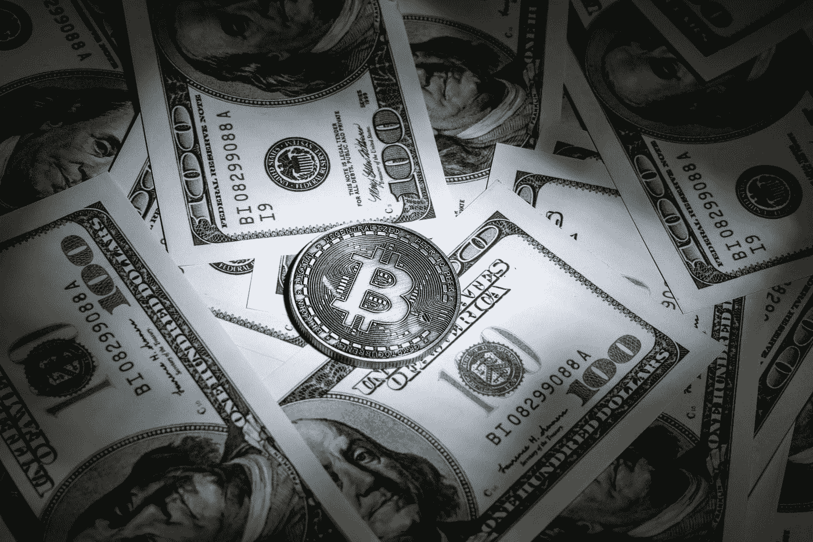

# 脆弱的货币体系将如何在未来几个月影响比特币

> 原文：<https://medium.datadriveninvestor.com/how-a-fragile-monetary-system-could-affect-bitcoin-in-the-coming-months-1fdbdf5959b6?source=collection_archive---------16----------------------->

2020 年的经济事件帮助比特币巩固了其作为货币和价值储存手段的地位。在持续的疫情造成的巨大经济动荡的影响下，世界各地的中央银行以前所未有的速度印刷钞票。

Photo by [金 运](https://unsplash.com/@jinyun?utm_source=medium&utm_medium=referral) on [Unsplash](https://unsplash.com?utm_source=medium&utm_medium=referral)

这使得许多法定货币处于岌岌可危的境地，因为它们对美元的汇率大幅下跌，也容易受到大幅贬值的影响。一位分析师现在指出，这种“脆弱”的货币体系可能会在未来几个月和几年对比特币产生重大影响。

> 这将在加密货币市场上点燃“焰火”。

货币贬值导致疲软，这将给全球货币体系带来压力。

 [## 投资的神奇三角洲

### 魔术三角是一个很好的方向来优先考虑你的目标

medium.com](https://medium.com/datadriveninvestor/the-magic-delta-of-investments-1d07a9b8fb7) 

为资助世界各国的几个刺激方案而过度印钞，导致了数万亿美元的额外全球债务。

这种红利也是以牺牲许多法定货币的价值为代价的。在比特币基地从事机构保护工作的马克斯·布朗斯坦(Max Bronstein)在最近的一条推文中谈到了全球货币体系的现状，并解释说，许多法定货币可能会在未来几个月和几年内贬值。

> “全球货币体系在危机开始时就已经很脆弱，特别是由于美元的强势和美元债务的高水平。经过几个月的危机，许多货币现在很容易贬值”

这一趋势可能会导致比特币和加密市场的高度波动。通货膨胀和法定货币贬值确实增强了比特币的价值。布朗斯坦指出，他还预计这一趋势将导致货币市场的波动性增加。

> “随着全球货币波动性触及历史低点，大量新债发行，外汇市场即将上演一场焰火表演。”

由于比特币的波动性目前处于一年多来的最低水平，这也意味着一项重大举措可能即将到来。

 [## 通货膨胀——以及如何抵御通货膨胀！

### 究竟什么是通货膨胀，它是如何发生的，你能保护自己免受其害吗？

medium.com](https://medium.com/datadriveninvestor/inflation-and-how-you-protect-yourself-against-it-f0f23d0feb83)  [## 对有商业头脑的投资者有用的行为经济学概念|数据驱动的投资者

### 在美国企业界，高斯统计，对我们周围世界的确定性解释，以及理性…

www.datadriveninvestor.com](https://www.datadriveninvestor.com/2020/07/09/helpful-behavioral-economics-concepts-for-the-business-minded/) 

我在每月一期的 [**简讯中分享了更多私密的想法，你可以在这里**](https://mailchi.mp/bf8f8e8ed697/keep-in-touch-with-lukas) 查看。请在评论中告诉我，并在各种社交媒体平台上加入我:

[**推特**](https://twitter.com/WiesfleckerL)●[**insta gram**](https://www.instagram.com/lukaswiesflecker/)●[**脸书**](https://www.facebook.com/lukaswiesfleckerr)●[**Snapchat**](https://www.snapchat.com/add/luggooo)**●[**LinkedIn**](https://www.linkedin.com/in/lukas-wiesflecker-1b11251a5/)**

**无论你做什么，都要带着爱和激情去做！**

****访问专家视图—** [**订阅 DDI 英特尔**](https://datadriveninvestor.com/ddi-intel)**