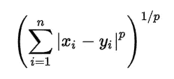
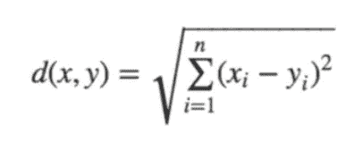

# “懒惰的学习者”对你有什么用？

> 原文：<https://medium.datadriveninvestor.com/how-a-lazy-learner-be-useful-to-you-dad50a7710e3?source=collection_archive---------9----------------------->


([Source](https://pixabay.com/photos/fox-sleeping-resting-relaxing-red-1284512/))

简而言之 KNN

k-最近邻(或简称为 KNN)是一种用于分类和回归问题的监督机器学习算法。这里是最近邻居的数量。

[](https://www.datadriveninvestor.com/2020/02/19/five-data-science-and-machine-learning-trends-that-will-define-job-prospects-in-2020/) [## 将定义 2020 年就业前景的五大数据科学和机器学习趋势|数据驱动…

### 数据科学和 ML 是 2019 年最受关注的趋势之一，毫无疑问，它们将继续发展…

www.datadriveninvestor.com](https://www.datadriveninvestor.com/2020/02/19/five-data-science-and-machine-learning-trends-that-will-define-job-prospects-in-2020/) 

KNN 被称为**懒惰学习者(Instance-based learning)** 为它在训练阶段学不到多少东西。它不会从训练数据中导出任何判别函数。它存储训练数据集，并仅在进行实时预测时从中学习。

在这篇文章中，让我们了解 KNN 是如何工作的，如何使用数据集实现 KNN，以及如何提高 KNN 的性能。

1.  KNN 是如何工作的？
2.  如何实现 KNN？
3.  如何提高 KNN？
4.  KNN 的利与弊

# KNN 是如何工作的？

让我们考虑分类的机器学习问题，其中我们必须将一个新的数据点分类，比如说，将 X 分类到一个类中。这个分类问题是用 KNN 分两步完成的。

1.  找出 X 的 K 个最近邻
2.  应用多数表决

## 第一步:找出 X 的 K 个最近邻居

为了找到 X 的 k 个最近邻，我们找到从 X 到这些点的距离。该距离可以通过以下方式计算:

1.  闵可夫斯基距离
2.  曼哈顿距离
3.  欧几里得距离
4.  汉明距离
5.  余弦距离

***闵可夫斯基距离*** 是一种广义的距离度量。我们可以通过替换“p”来操纵下面的公式，从而以不同的方式计算两个数据点之间的距离，



***曼哈顿距离*** 是沿直角轴测量的两点之间的距离，由下式给出:


***欧氏距离*** 是两点间的直线距离，由下式给出，



***汉明距离*** 是两个二进制字符串之间不同的位数。
对于 A = " 1 0 1 1 0 0 1 0 1 1 "和 B = " 1 0 0 1 0 1 0 1 0 1 0 "
由于位置 3 和 1 0 的值不相似，A、B 之间的汉明距离为 2。

***余弦距离*** 和余弦相似性度量主要用于寻找两个数据点之间的相似性。余弦相似度由‘Cosθ’给出，余弦距离为(1- Cos θ)。点越靠近，余弦相似度越高，余弦距离越低。

在使用上面讨论的任何方法找到 X 与邻居的距离之后，让我们考虑与 X 最近的前 K 个邻居。

## 第二步:实行多数投票制

从 K 个最近的邻居中，我们对类别标签进行多数投票以估计 x 的类别。为了更精确，可以考虑这些邻居的权重，使得更近的点获得更重的权重。

# 如何实现 KNN？

让我们用 Kaggle 的[葡萄酒分类器](https://www.kaggle.com/brynja/wineuci)问题来说明 KNN 分类。

## 关于数据集:

这些数据是对生长在意大利同一地区但来自三个不同品种的葡萄酒进行化学分析的结果。这项分析确定了三种葡萄酒中 13 种成分的含量。

每个葡萄酒类别的实例数量

*   1 级–59 级
*   2 级–71 级
*   3 级–48 级

特点:

酒精、苹果酸、灰分、灰分碱度、镁、总酚、类黄酮、非类黄酮酚、原花色素、颜色强度、色调、稀释葡萄酒的 OD280/OD315、脯氨酸

现在让我们实现 KNN 分类器，

```
import pandas as pd
features = ['class','alcohol', 'malic_acid', 'ash', 'alcalinity_of_ash', 'magnesium', 'total_phenols', 'flavanoids', 'nonflavanoid_phenols', 'proanthocyanins', 'color_intensity', 'hue', 'od280/od315_of_diluted_wines', 'proline']wine_data = pd.read_csv("wine_class.csv",names=features)
```

*使用 pandas 将*CSV(逗号分隔值)数据加载到数据帧中。

```
wine_data.head()
```

输出:


Head()给出了数据帧中的前 5 个数据点。

```
wine_data.shape
```

输出:(178，14)

这意味着葡萄酒数据有 178 个数据点和 14 个特征，包括类。

```
wine_target = wine_data['class']
wine_features = wine_data.drop(['class'],axis=1)
```

*将独立特征*与从属特征分离。

```
from sklearn.model_selection import train_test_splitX_train, X_test, y_train, y_test = train_test_split(wine_features, wine_target, test_size=0.3,random_state=0)
```

*将数据*拆分为训练数据和测试数据，其中测试数据占总数据的 30%，训练数据占总数据的 70%。

```
#Import knearest neighbors Classifier model 
from sklearn.neighbors import KNeighborsClassifier#Create KNN Classifier 
knn = KNeighborsClassifier(n_neighbors=7)#Train the model using the training sets 
knn.fit(X_train, y_train)
```

是的，不管数据大小如何，实现 KNN 分类器只需要 3 行代码。

既然我们已经*生成了模型，*让我们来看看模型的准确性。

```
#Predict the response for test dataset 
y_pred = knn.predict(X_test)#Import scikit-learn metrics module for accuracy calculation 
from sklearn import metrics# Model Accuracy, how often is the classifier correct? print("Accuracy:",metrics.accuracy_score(y_test, y_pred))
```

输出:
精度:0.77777777

我们已经实现了一个大约 77%精度的 K 最近邻分类器模型。

# 如何提高 KNN？

为了获得更好的性能，可以从以下几个方面改进 KNN。

*   建议对数据进行标准化(范围为 0-1)并处理缺失值，因为它对噪声很敏感
*   使用加权距离代替非加权距离进行多数表决可以提高精确度
*   降维更适合于高维数据，因为它最适合于低维数据

# 优点:

1.  KNN 易于理解、实施和解释
2.  通过对模型进行微小的修改，KNN 可用于分类和回归问题
3.  不管数据的线性如何，KNN 都是有用的
4.  由于其基于实例的学习，KNN 在训练阶段比其他算法工作得更快

# 缺点:

1.  在测试阶段，KNN 比许多其他算法都要慢
2.  KNN 在更高维度上工作效率不高
3.  由于时间和空间复杂度较高，KNN 不适合处理海量数据
4.  KNN 对异常值和噪音很敏感

因此，KNN 对于具有较小数据点的低维数据可能是有效的。在这篇文章之后，我将使用各种数据集为您的 KNN 模型确定最佳“K”。

谢谢你的阅读。以后我会写更多初学者友好的帖子。请在[媒体](https://medium.com/@ramyavidiyala)上关注我，以便了解他们。我欢迎反馈，可以通过 Twitter [ramya_vidiyala](https://twitter.com/ramya_vidiyala) 和 LinkedIn [RamyaVidiyala](https://www.linkedin.com/in/ramya-vidiyala-308ba6139/) 联系我。快乐学习！