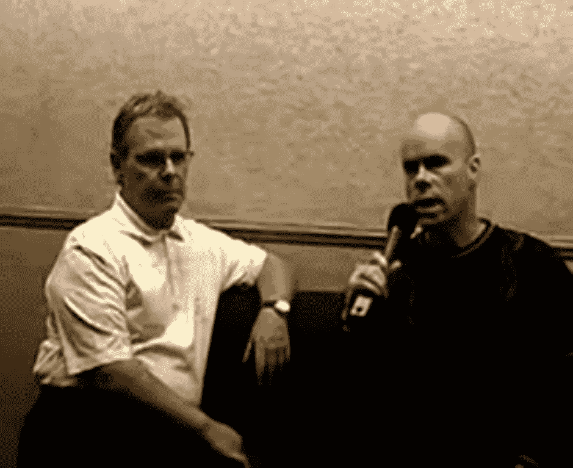

# 泳池承包商如何在两年内将 10，775 美元变成 4，200 万美元

> 原文：<https://medium.datadriveninvestor.com/how-a-pool-contractor-turned-10-775-into-42-million-in-2-years-ec53aa14d874?source=collection_archive---------0----------------------->

## 世界纪录交易员丹·赞格的职业生涯内幕

Screenshot from “[Dan Zanger Master’s of Trading](https://www.youtube.com/watch?v=Y4D9IpKJMLo&ab_channel=DanZanger)”

在投资界，丹·赞格被认为是有史以来最伟大的交易者之一。原因显而易见:藏格曾在短短 23 个月内在股市取得了惊天动地的 *3，896，911%* 的涨幅。

他在 1998 年 6 月至 1999 年 12 月期间将 10，775 美元变成了 1，800 万美元，这一点已被 [*《财富》*](https://money.cnn.com/magazines/fortune/fortune_archive/2000/12/18/293117/index.htm) 杂志和资产管理公司 [Effron Enterprises Inc.](http://chartpattern.com/articles/effron.pdf) 独立证实；第二步，他据称在 2020 年 5 月前将同样的 1，800 万美元变成了 4，200 万美元，这一点尚未经过审计，但仍被著名的[行业](http://traders.com/Documentation/FEEDbk_docs/2003/08/Abstracts_new/Interview/interview.html) [来源](https://www.yumpu.com/en/document/view/38118727/letter-from-the-editor-perseverance-definedthe-story-of-dan-zanger)认为是有效的。

赞格目前还保持着股票市场最大单年回报的世界纪录。在一封承认其记录的信中，Effron Enterprises Inc .指出，不可能将他的回报与标准股票市场指数放在同一页上，因为它们太大了。

听起来好得难以置信？如果没有独立审计，大多数人会把这个故事当成一个童话。但这仅仅是冰山一角，当你了解到赞格在他传奇般的跑步之前的职业生涯时，事情会变得更加疯狂。

# 卑微的出身

当你想到“世界纪录交易员”时，你会想到什么？也许是数学神童，或者统计奇才。也许是一位最近离开一家著名公司的投资银行分析师。

赞格不在其中。事实上，在成为交易员之前，他花了 20 年时间为贝弗利山庄的富人建造游泳池，在那里他的工资从未超过 5 万美元。在从事建筑行业之前，他是一名大学辍学生，靠做低薪工作来维持生计。

那么像赞格这样的蓝领是怎么进入炒股的呢？虽然他传奇般的运行直到 1998 年才发生，但他第一次对市场感兴趣是在 70 年代，当时他在电视上看到一个当地商业频道报道股票模式。最终，这种兴趣演变成了一种激情。除了狼吞虎咽地读书和参加研讨会，赞格还花了“工作日 3 小时，周末 15 小时”研究图表模式，正如 [*交易员月刊*](http://www.chartpattern.com/articles/tradermonthly100.pdf) 所报道的。

他的早期职业生涯以“[【巨额】亏损](https://twitter.com/DanZanger/status/1026893007403053056)”为标志，因为他与市场调整的浪潮作斗争。但是几年后，他开始找到自己的位置。在接受 [*交易员月刊*](http://www.chartpattern.com/articles/tradermonthly100.pdf) 的采访时，他认为成功发现 1997 年石油指数的反转模式给了他深入投资所需的信心。

1998 年，在 45 岁的成熟年龄，赞格卖掉了他的保时捷，筹集了声名狼藉的 10，775 美元，这标志着他的职业生涯。在网络泡沫的鼓舞下，他在接下来的两年里疯狂投资，获得了巨额回报。在他最伟大的交易之一中，他在 1999 年 1 月买入了$CMGI 的股票，然后仅仅 4 天后就卖出了，获得了 210%的收益。这一举措被载入了*交易员月刊*的[有史以来 40 大交易排行榜](http://www.chartpattern.com/articles/40greatest-trades-article.pdf?_ga=2.266294543.1230671037.1606245000-942529761.1606245000&_gac=1.223637353.1606349293.CjwKCAiAnvj9BRA4EiwAuUMDf3jCr1UW0fR3dCoZI8Zt1J32nsrl489U_XDbQO-RdzKbQnLFLNzq5RoC-xYQAvD_BwE)。

 [## 商务沟通不畅是网络安全问题的 5 个原因|数据驱动型投资者

### 沟通是商业的命脉。没有协作就不会有想法，没有合作就不会有交易

www.datadriveninvestor.com](https://www.datadriveninvestor.com/2020/09/01/5-reasons-why-poor-business-communication-is-a-cybersecurity-issue/) 

# 行之有效的策略

赞格的成功不是运气。这是他花了几年时间学习一种叫做成长型投资的哲学的结果——具体来说，是一种被称为 CAN SLIM 的策略。由著名交易者威廉·奥尼尔首创的 CAN SLIM 可以识别出有很高暴涨可能性的股票。

这里有一些基本原则的大图概述。

*(注:***)不要根据我下面写的进行交易。这是一个概括性的总结，并不提供成功所需的具体细节。关于详细的纲要，先从威廉·奥尼尔的《如何在股票中赚钱》开始，赞格对此深信不疑。)**

## *1.寻找强劲的基本面*

*谈到财务报表，斯利姆能偏爱具有三个主要特征的股票吗:*

*   *与上一年相比，季度每股收益增长超过 20%,比上一季度增长超过 20%*
*   *上一季度销售额增长超过 20%*
*   *每股收益年增长率超过 20%*

*这些是大型机构投资者(即对冲基金和投资银行)喜欢的统计数据。因此，购买具有这些特征的股票有助于你与机构投资者的选择一致，增加你成功的几率。*

*与关注市盈率等指标的价值投资不同，CAN SLIM 只关注每股收益和销售增长。极高的市盈率不是问题。事实上，成长型投资者经常购买市盈率处于历史高点的股票。*

## *2.将损失限制在 5%或更少*

*这意味着，如果一只股票的价格比你的买入价低 5%，无论如何你都必须卖出。奥尼尔的原著将这个数字设定为 7-8%，但大多数现代投资者建议 5%(有些人甚至低至 1%)。*

*这是一条重要的规则，因为当股票下跌时，你不知道它会跌到多低。投资者经常陷入一个陷阱，他们认为“好吧，价格会回升——我会等着它，”却只能看着价格暴跌(有时甚至到零)。*

*为了防止这种情况发生，CAN SLIM 设置了一个最大损失规则。因为这个数字限制在你投资组合的 5%,你可能只需要一次成功的交易就能获利。*

## *3.识别高概率模式*

*斯利姆指出，只有当看涨形态被明显打破，交易量显著增加时，你才应该交易。这意味着你在寻找杯子和把手，平底，旗帜和三角旗，通道，三角形，和其他成熟的图表信号。*

*阅读模式是赞格最大的优势之一。“股票是我的好朋友，”他告诉《财富》杂志。“我知道他们什么时候感觉好，什么时候感觉不好。”他对模式的识别能力了如指掌，这使他能够发现成功概率很高的设置。*

*有利可图的交易需要对图表模式有深刻的理解。获得这种能力需要多年的认真学习。*

## *简而言之可以瘦身*

*结合以上三个原则，你最终会得到一个对你有利的策略。斯利姆能识别出那些在限制损失的同时又能卖出更高的股票。由此产生的框架给了你很多机会去发现获胜的股票。*

*警告:CAN SLIM 在牛市中效果最好，在熊市中可能根本不起作用。在开始之前，学会如何阅读潜在的市场方向是很重要的——这一点我在这里还没有讲清楚。同样，你可以在威廉·奥尼尔的书《如何在股票中赚钱》中找到更多的细节。*

*赞格利用他个人的 CAN SLIM 实现了疯狂的回报，并一直沿用至今。*

# *心态决定一切*

*在他的职业生涯中，赞格最大的单日收益是令人瞠目结舌的 520 万美元。但他也承受了相当大的损失。在接受 [*交易员*](http://chartpattern.com/articles/tradermag.pdf)*采访时，他透露自己曾在交易期间损失了 75%的投资组合。一般来说，严格遵守 CAN SLIM 规则可以防止这种情况，但股票总是有“跳空下跌”的风险，或者下跌得太快以至于你无法在止损时卖出。**

**在这样的困难时期，是什么让赞格坚持下来的？他告诉**“坚持”。“我总是回到图表前，盯着它们看几个小时，试图找出我在哪里以及如何出错了...随着时间的推移，有了足够的坚持和渴望，事情将开始出现，往往可以预测股票或市场的突破。我花了六年多的时间研究图表，每周至少 30 个小时，才把这些都整理好。”****

**无论你选择哪种策略，炒股都是一个脑力游戏。培养适应风暴的能力是成功的最低要求，坚持不懈地研究图表也是如此。最终，是激情让赞格在这个行业继续茁壮成长。除非你真的热爱这项运动，否则你将很难从跌宕起伏中幸存下来。**

**最后，我要说的是:对于一个直到 40 多岁才大展拳脚的人来说(他曾经注定要在职业生涯的剩余时间里建造游泳池)，赞格展示了执着的努力可以取得什么样的成就。他的生活是一个真正的失败者的故事，值得它的启发。**

## **访问专家视图— [订阅 DDI 英特尔](https://datadriveninvestor.com/ddi-intel)**