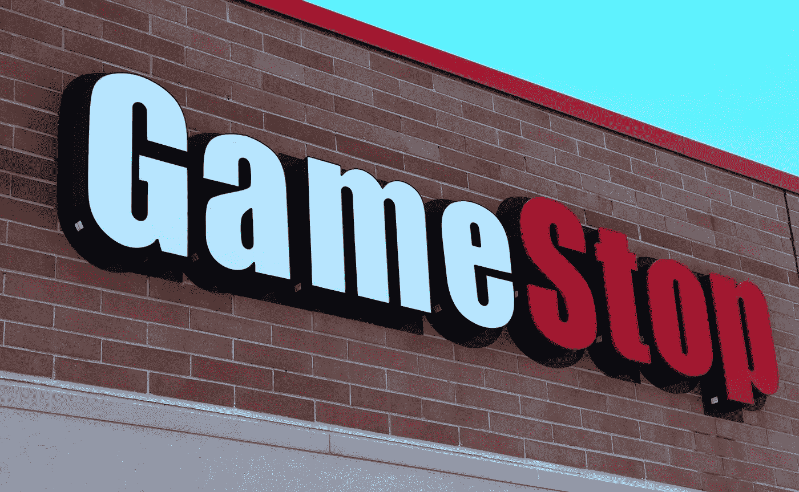
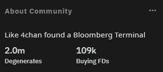
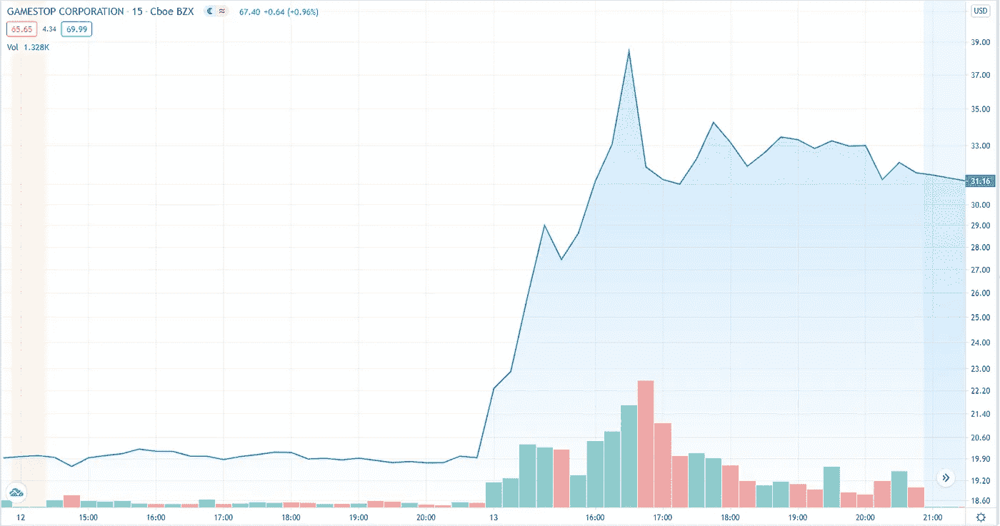
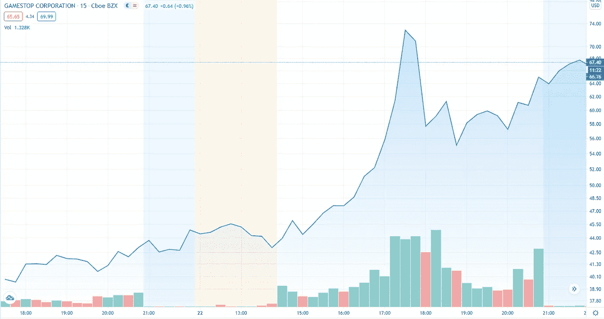

# Reddit 论坛如何导致 GameStop 的股价飙升

> 原文：<https://medium.datadriveninvestor.com/how-a-reddit-forum-caused-gamestops-stock-price-to-triple-831d7d9e01a5?source=collection_archive---------4----------------------->

r/WallStreetBets 在 GameStop (GME)下注背后的空头挤压

GameStop Logo — From [SchoolPhotoProject](https://www.schoolphotoproject.com/)

GameStop 的股票在去年的大部分时间里都处于低谷，每股大约 5 美元。1 月初，它们的价值约为 20 美元。现在，仅仅几个星期后，他们奇迹般地创下了 76 美元的历史新高。

对于一家以缓慢接受不断增长的数字市场而闻名的公司来说，这是一个惊人的价值增长。

一个超过 200 万用户的 Reddit 论坛真的有可能如此大幅度地操纵一只股票的价格吗？

# 华尔街赌注登记公司

对于那些不知道的人来说， **r/WallStreetBets** (WSB)是一个投机各种股票价格的子网站。

Screenshot — From [Reddit](https://www.reddit.com/r/wallstreetbets/)

通常，一些人会将他们的大部分储蓄投资于股票，伴随着“YOLO ”,然后等待其他 200 万论坛成员加入这一潮流。

> GME 到月球，YOLO！！！🚀 🚀 🌕 🌕 🌈 🌈

火箭船、月亮和彩虹表情符号越多，股票越有可能上涨——“记住，股票总是会上涨的！”。至少，这似乎是 WSB 的共识。

GameSpot (GME)就是这样一只股票。散户投资者不断增长的需求可能至少在一定程度上归因于这一群体。

# 瑞安·科恩

瑞安·科恩(Ryan Cohen)是网上宠物食品零售店 Chewy 的创始人，后来他以 33.5 亿美元的价格将其出售给了亚马逊。

科恩在 2020 年 8 月购买了[大约 900 万股](https://markets.businessinsider.com/news/stocks/activist-investor-chewy-cofounder-ryan-cohen-gamestop-stock-percent-gain-2021-1-1029980159)GameStop 股票(相当于公司 10%的股份)。科恩和两位前高管在 GameStop 的董事会中占有一席之地。

在 11 月提交给 SEC 的文件中，科恩毫不避讳地批评了 GameStop 在拥抱数字经济方面的犹豫不决。

> “GAMESTOP 的领导层必须迅速从实体思维转向技术驱动的愿景”——Ryan Cohen

科恩迫切希望将公司引向更加数字化的商业产品，这可能增强了投资者对 GameStop 的信心。特别是 r/WallStreetBets 的成员们确信，他就是那个能够扭转乾坤、将 GameStop 变成赚钱机器的人。

然而，许多人怀疑科恩在销售宠物食品方面的成功能否转化为数字游戏市场。向一个需求不断增长的市场销售宠物食品等商品，与数字游戏行业不太一样。

# 大空头

一段时间以来，GameStop 一直是一个受欢迎的空头头寸，在 12 月底，其 138%的股票被卖空。

显而易见的是，当游戏可以以数字方式发行时，为什么几乎不需要实体店，而成本只是它的一小部分。

这一点，加上他们高水平的 T2 债务，使他们成为卖空的热门股票。毕竟，[百视达](https://en.wikipedia.org/wiki/Blockbuster_LLC)没能将他们的业务转移到网上，看看他们得到了什么。GameStop 会走向同一个方向吗？

## 什么是短路？

做空一只股票是“我打赌这只股票的价格会下跌”的另一种说法。

让我们看看一个成功的股票卖空是如何进行的。

1.  我从我的经纪人那里借了 100 股股票，每股 10 美元。
2.  我在市场上卖掉这些股票，赚了 1000 美元。
3.  后来，价格已跌至每股 9 美元。我从市场上买回全部 100 股，总共 900 美元。
4.  我把借来的股票还给我的经纪人，并保留 100 美元的利润。

## 短时间挤压

如果价格上涨，那么这对任何持有空头头寸的人来说都是坏消息。他们可以等待股票价格再次下跌，然后回购他们持有的股票。但是，不知道什么时候，甚至不知道这种情况是否会发生，可能是一个巨大的风险，特别是如果股票价格继续上涨。

这种压力往往导致投资者清算他们的空头头寸，以尽量减少他们在股价继续上涨时可能遭受的损失。

如果许多投资者持有空头头寸，那么当他们都试图同时回购借入的股票时，这将导致需求急剧增加。

这种需求的增加推动股价进一步上涨，从而导致更多卖空者平仓。这种循环越来越糟糕，并推动股价快速上涨。

# GameStop 达到 76 美元

WSB 的会员继续买入 GameStop 的股票，决心向卖空者施压，迫使他们平仓。最终，随着卖空者涌入市场，购买股票来填补他们的空头，这正是所发生的事情。

您可以看到交易的股票数量，由图表底部的条形表示，折线图表示价格。1 月 13 日和 22 日，卖空者涌入市场，与价格飙升相对应的是交易量的大幅飙升(约为正常水平的 5-6 倍)。

GameStop stock chart on 13th Jan — From [TradingView](https://tradingview.com/)

GameStop stock chart on 22th Jan — From [TradingView](https://tradingview.com/)

# GameStop 到底值多少钱？

GameStop 目前的价格是否是对该业务的公平估价？

现在，可能不会。

这种价值飙升似乎是由充斥市场的卖空者推动的，而不是对 GameStop 基本商业战略的信心。

我不建议把 r/WallStreetBets 作为你投资的灵感来源，但追随那些这样做的人肯定很有趣。

如果你喜欢这篇文章，并且愿意支持我成为一名作家，考虑注册[成为一名媒体成员](https://adam-galtrey.medium.com/membership)。每月只需 5 美元，你就可以无限制地阅读 Medium 上的所有文章。如果你[用我的链接](https://adam-galtrey.medium.com/membership)注册，我也会赚一小笔佣金。