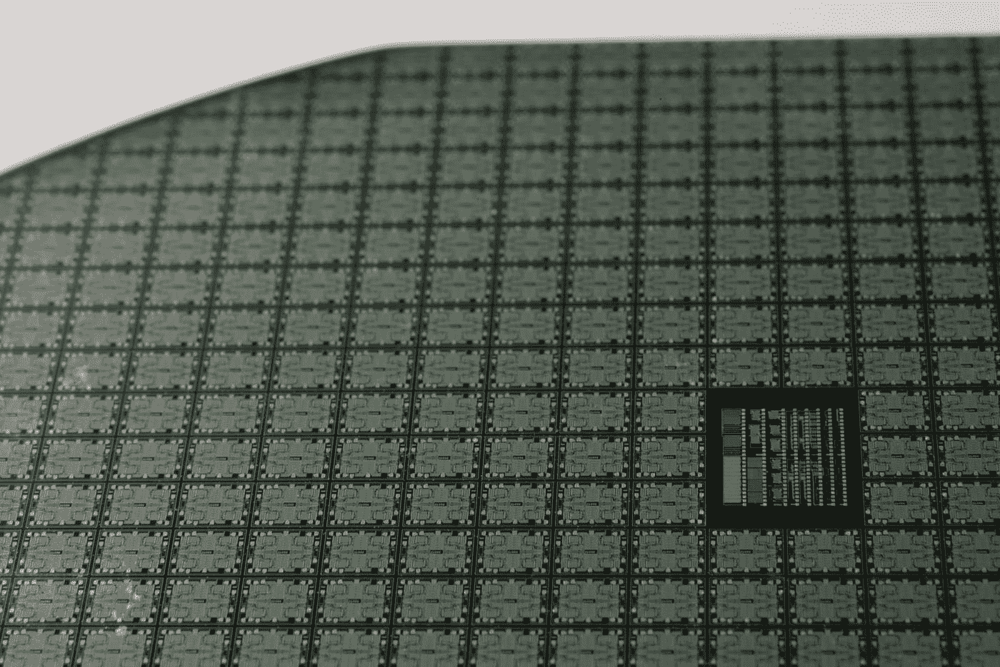

# 一位科技联合创始人的预测 55 年来是正确的？

> 原文：<https://medium.datadriveninvestor.com/how-a-tech-co-founders-prediction-turned-out-to-be-right-for-55-years-d95a610aeaca?source=collection_archive---------11----------------------->

## 你能从中学到什么？

Photo by [Laura Ockel](https://unsplash.com/@viazavier?utm_source=medium&utm_medium=referral) on [Unsplash](https://unsplash.com?utm_source=medium&utm_medium=referral)

> 对技术趋势的正确判断可能会保留价值数十亿美元的机会。

在当今的科技世界里，你可以围绕一个准确的预测建立一个科技帝国。你也可以加入一个有着共同目标的团队，去创造真正的改变，或者把你的钱投资给合适的创始人，以利用共同的愿景。

在所有这些方面，即使只有一次是正确的，也可能创造一个改变一生的机会。

现在想象一下连续 55 年都是对的！

英特尔的联合创始人戈登·摩尔不仅是对的，而且他也把他的金钱和努力用在了他所说的地方。

# 关于戈登·摩尔的一点点

[**摩尔是一个非凡的人**](https://www.sciencehistory.org/historical-profile/gordon-e-moore#:~:text=Gordon%20E.-,Moore,silicon%20microchips%20in%20the%20world.) **甚至在共同创立英特尔之前。**

他在加州大学伯克利分校获得学士学位。1954 年，他在加州理工学院获得了物理化学博士学位。

摩尔在马里兰州约翰·霍普金斯大学应用物理实验室获得博士学位后，立即进入了半导体行业。

先是在肖克利半导体，然后在飞兆半导体，为行业做出了卓越的贡献。

# 摩尔定律

早在 1965 年，戈登·摩尔就预测计算机芯片上的晶体管数量将每年翻一番。它最初发表在电子杂志上。

最初，当半导体业务正孕育着光明的未来时，他预测的增长率对他很有帮助。他只修改了一次他的假设，1975 年，他将预期增长率修改为每两年翻一番，这在很长一段时间内都是相当准确的。

摩尔定律的另一个方面是，微处理器的增长是指数级的，这也被证明是一个相当准确的预测。

# 行业的标杆

戈登·摩尔不仅做出了准确的预测，还为这个行业创造了一个自我实现的预言。

每两年将晶体管数量增加一倍的标准为公司制定了一个基准，以此为目标规划未来的创新。

尤其是英特尔一直以来都像圣经中的诗句一样遵循这一目标。

# 摩尔定律还有效吗？

晶体管的高温是制造更小电路的障碍。所以，在某个时间点之后，保持摩尔预测的速率是不可能的。

尽管一些业内人士仍然相信摩尔定律仍然有效，但反对这一说法的声音一天比一天大。

2019 年，英伟达 CEO [黄仁勋宣布摩尔定律已死](https://www.techrepublic.com/article/moores-law-turns-55-is-it-still-relevant/#:~:text=Now%2C%20some%20industry%20experts%20believe,%22It's%20over.&text=In%202019%2C%20Nvidia%20CEO%20Jensen,transistors%20driving%20the%20processing%20power.)。

当直接观察[今天在电脑、平板电脑和智能手机芯片中晶体管数量的增长率时，他可能是对的。](https://www.androidauthority.com/moores-law-smartphones-1088760/)

甚至[英特尔首席执行官布莱恩·科兹安尼克宣布](https://www.wsj.com/articles/BL-DGB-42647)2015 年翻倍率下降到每两年半一次。

然而，反对的观点相信[量子计算的未来影响](https://www.techrepublic.com/article/moores-law-turns-55-is-it-still-relevant/#:~:text=Now%2C%20some%20industry%20experts%20believe,%22It's%20over.&text=In%202019%2C%20Nvidia%20CEO%20Jensen,transistors%20driving%20the%20processing%20power.)可能会打开新的大门，让步伐回来。

# 为什么今天的预言不会长久？

现在已经不是 1965 年了。科技行业的指数增长大大缩短了准确预测的寿命。

每年都有前所未有的突破性创新浮出水面，宣告范式的转变。在接下来的几年里，另一个人继承了王位，并宣布过去的统治者无关紧要。

如果我们具体谈半导体行业，量子计算、生物工程等方面的突破。极大地丰富了加工的可能性；一个新的预测能存活五年都是幸运的，更不用说半个世纪了。

其他技术驱动型行业也不例外。随着激动人心的科技潮流，如[物联网](https://www.ibm.com/blogs/internet-of-things/what-is-the-iot/)、[区块链](https://blockgeeks.com/guides/what-is-blockchain-technology/)、 [Crispr](https://www.sciencealert.com/crispr-gene-editing) 、[纳米材料](https://www.twi-global.com/technical-knowledge/faqs/what-is-a-nanomaterial)、[固态电池、](https://www.futurebridge.com/blog/solid-state-batteries/)等。世界变得相当复杂。我们甚至依靠另一种技术趋势，[人工智能(AI)，](https://plato.stanford.edu/entries/artificial-intelligence/)来预测未来的方向。

尽管预测的寿命变短了，但达到天文数字投资回报的时间也变短了。每一次技术革命都比前一次更快地到达大众手中。

互联网和社交平台的沟通速度加快了联系全球人民的速度。

# 如何从可靠的预测中获益？

当戈登·摩尔做出他的预测时(他当时没有称之为摩尔定律)，他通过共同创立英特尔并确保他的处理器每两年将英特尔芯片中的晶体管数量增加一倍来实现他的愿景。他为自己的想法投入了时间和精力。

除非付诸实施，否则想法本身一文不值。

这并不意味着“想到什么就创业”。然而，如果你对一个革命性的想法有信心，或者你有一个大胆的预测，某个行业将在建设我们的未来中发挥重要作用，不要害怕建立在你的想法上。

有些人认为新思想更好；另一个人可能有一定的技能去开始新的东西。另一个人可能是将一个想法从初创/扩大到全球现象的最佳高管。

协作、贡献、投入时间和金钱。

# 外卖食品

戈登·摩尔是一个聪明的人，他能够利用自己在半导体行业的知识做出持续了半个多世纪的预测。他也足够勇敢，以他的想法为基础，在他的想法上投入时间和金钱，在某种程度上塑造了半导体行业和整个技术世界的未来。

在当今世界，技术领域变化如此之快，即使是几年的准确预测也能提供重要的杠杆作用。然而，与 1965 年相比，押注于正确的想法能更快获得回报。

从准确的预测中获益有不同的方式。

*   其中之一是根据你的想法建立一个企业并生产一个产品。
*   第二个是通过成为团队、公司、组织的一员，为打造符合你期望的产品做出直接贡献，从而扩大你的影响力和曝光度。
*   另一个方法是投资一个初创企业的创始人，他将分享你的愿景，并有望执行得很好。

我们世界的变化速度仍在呈指数级加速。成为另一个范式转变的一部分永远不会晚。

如果你相信某件事会改变世界，不要害怕做出改变，并付诸行动！

同样来自作者:

 [## 为什么一家分析公司通过购买比特币来对冲风险

### 这家商业分析巨头通过价值 2.5 亿美元的比特币实现投资组合多元化，开创了一项新战略。

medium.com](https://medium.com/swlh/why-one-analytics-company-is-hedging-their-bets-by-buying-bitcoin-c9167ba98cba) 

[订阅](https://furkansaatcioglu.com/bitsandchips)我的时事通讯[比特&芯片](https://furkansaatcioglu.com/bitsandchips)在你的邮箱里获得未来的文章！