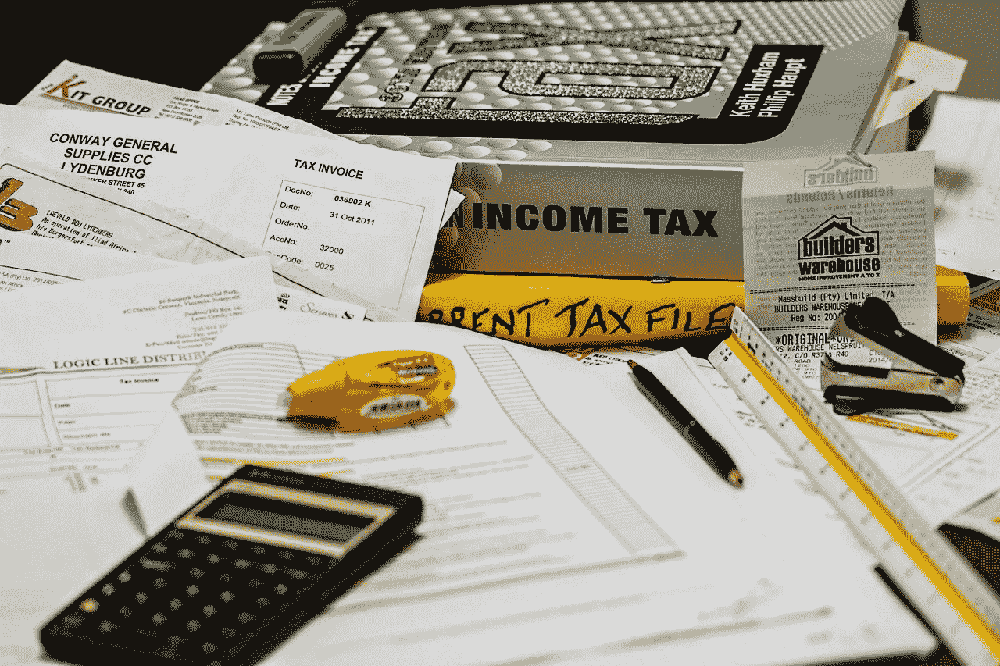

# 会计师如何帮助你的创业公司增加收入

> 原文：<https://medium.datadriveninvestor.com/how-accountants-can-help-your-startup-with-revenue-c2f512282ca8?source=collection_archive---------28----------------------->

*由 Adnan Akhand，会计服务合伙人，*[*BX3*](https://bx3.io)

*一般来说，企业家创办企业的目标是让企业在某个时候扭亏为盈。尽管如此，尽管对任何初创公司来说，实现收入正增长都是一个重要的里程碑，但是一旦你的公司有了钱，要想知道如何处理这笔钱可能会有点令人生畏。*

*输入会计以扭转局面。虽然我们在我们的行业中知道我们的地位是商业瑞士军刀，但那些首次涉足商业管理的创始人可能对会计师可以帮助建立商店的无数方式有点一无所知。一点点数字，一点点监管专家，一点点治疗师:正如初创公司的早期雇员经常发现自己身兼数职，现代会计师多方面的财务管理方法可以在许多层面和跨问题上帮助指导初创公司。尽管企业家和会计师都不能肯定地说资产负债表未来会是什么样子，但会计师可以帮助创始人为即将到来的一切做好准备。*

**

# *认识你的创业公司的未来收入*

*在一家初创公司能够采取措施为实现正收入做准备之前，企业需要能够知道这一点何时会发生。对于给客户开发票的公司来说，[销售数字不一定等于现金流](https://medium.com/@bx3capital/cash-flow-statements-the-true-hollywood-story-of-accounting-c2ae2c4ea75)。会计师可以指导小企业主制定支付条款，既提供足够的余地来发展和保留客户群，又为公司的金库提供稳定的资金流。按照这些思路，制定一个流程来跟进未清发票可以帮助确保现金确实流入，以确保您的其他业务费用得到支付。*

*办公空间或仓储成本可能是一个主要的现金流问题，这是正常时期的一个主要问题，也是许多企业在疫情推动在家工作的过程中可能会消耗的一项费用，尤其是对于即将实现正收入的企业而言。许多商业租赁期限为 5 至 10 年，通常在最初几个月会有几个月的租金减免，租金每年都会上涨几个百分点。许多新企业家可能没有意识到 [GAAP 合规性](https://www.fasb.org/jsp/FASB/Page/LandingPage&cid=1175805317350)要求制定一份租赁计划，计算出每月到期的总额，并将其摊销到一条直线上，甚至整个租赁期的费用。*

**

# *预测现在和将来的启动收入和支出*

*说到房产租赁，当收入为正数时，初创公司必须采取措施来确保他们的投资。其中一部分是支付商业保险，如[一般责任险和业主保险](https://www.valuewalk.com/2020/03/outsourced-c-suite-investments/)。这些费用中的大部分都是预付或按月支付的，但你必须在保单有效期内分期偿还。一家新公司的会计师需要建立账簿，这样公司的损益表就不会在一个月内损失掉一整年的保险金额。*

*还有一些业务费用只是预测不可预测性的一种练习。假设你刚开了一家新的 Etsy 商店。你的现金流量表上有一些行是有意义的，但在经营一家新企业的压力和兴奋中，企业家可能会忽略，比如办公用品或你物品的原材料。但是根据你的销售量，你的运费可能会上升或下降，这取决于你可以协商的数量。你最初认为可能需要 8 美元的运费，实际上可能需要 22 美元。*

*对于大多数企业来说，材料成本项目的这种变化可以决定盈利或盈亏平衡——如果不亏本的话。由于这种类型的信息往往隐藏在数字中，会计师可以发现这种差异，并将其作为削减成本的地方。一个苦恼的新企业主可能甚至没有意识到他们可以使用的杠杆。与一次性上门客户相比，大多数供应商更愿意与长期批量客户达成交易。*

*在运输过程中，接受退货和更换的成本会不断增加:突然之间，收入又流了出去。在您不得不发送替换产品后，该损坏的产品突然变成了负收益。这些费用需要一个会计师能做出的最好的估计。然而，通常到了第二年或第三年，模式开始出现，对这种商业趋势的规划变得容易得多。通常，您可以使用历史年度退货和更换百分比乘以未来几年的预计收入。*

**

# *确定你的企业所在的州(或直辖市)*

*虽然这看起来很明显，但初创企业需要确保它们在经营所在的州注册。例如，许多企业家听说[在特拉华州](https://www.natlawreview.com/article/why-you-should-consider-incorporating-your-start-delaware)成立公司，尽管生活和主要经营在纽约，但可能会享受税收优惠。然而，相关的文书工作并不一定意味着这一举措最有意义。在这种情况下，企业需要在其主要经营地纽约州注册为外国实体。此外，它还需要遵守两个司法管辖区的任何年度备案要求。更多的注册随之而来:销售应税商品的企业需要销售税授权和账号，以及任何适用的营业执照。一个会计师可以马上提供建议，告诉你在文书工作和税收优惠方面最有效的行动方案。*

*一旦生意开始运转，销售税的小问题就来了。对于销售应税消费品或服务的创收型小企业来说，这可能是最大的税务问题。如果你不申报销售税或不付款，通常会受到相当重的处罚，审计，并被当地/州销售税部门盯上。*

*一个小企业主可以花几个小时通读规则，但仍然会错过一些细微差别；或者，他们可以省去一些麻烦，找一个税务会计师来了解所在城市和州的规定，以及任何目的地州的运输税。新的小企业主可能没有意识到或者忘记，销售税规则和税率不仅在州与州之间，而且在城市与城市之间都有很大的不同。在[纽约市的五个行政区内，销售税为 8.875%](https://www1.nyc.gov/site/finance/taxes/business-nys-sales-tax.page)；在该州的其他地方，利率可能低至 4%。在芝加哥，[的销售税率是 10.25%，尽管伊利诺伊州的销售税率是 6.25%。各州甚至可能在销售税上互惠互利；在任何情况下，这意味着文书工作，会计师可以处理的专业知识。](https://www2.illinois.gov/rev/research/taxinformation/sales/Pages/rot.aspx)*

*也就是说，州和地方税务当局可以为新企业提供很大的帮助，比如免除企业第一年的所得税。咨询当地的小企业或经济发展办公室，看看提供了什么项目:针对某些市政当局的税收优惠和招聘门槛比比皆是，以及针对企业家和新创业公司的资助项目。许多州和城市为企业提供税收抵免，如果创业公司预计在一段时间内增长到一定的人数。有些甚至会提供贷款，一旦你达到商定的发展里程碑，这些贷款就会被免除。一个有着丰富创业经验的会计师，很可能会熟悉这个领域常用的程序。所以问一个！*

**

# *会计师:创业收入的街头智慧*

*此外，熟悉一般城市或地区运作的会计师将熟悉当地的现行费用率，如资本、财产和供应商——以及利润率，例如，熟悉纽约的会计师将能够告诉潜在的精品店老板，每平方英尺 50 美元的预计销售额很可能低于曼哈顿商业租金每平方英尺 75 美元以上的平均成本。会计师可以建议在地板上放什么物品和多少存货，物品的价格点，或者寻找潜在的租金较低的商店位置。*

*同样，一名了解当地情况的会计师可以在善意但或许幼稚的企业家面临被敲竹杠的风险时，为他们提供建议，包括审查合同。我经常开玩笑说，会计师可以做很多和律师一样的工作，尽管更便宜。*

*就这一点而言，问题难道不应该是一家新的创业公司是否请得起会计师吗？考虑到文书工作、簿记和价格比较所涉及的时间，会计应该是新企业家的首要项目。*

**原载于 2020 年 9 月 23 日*[*【https://www.valuewalk.com】*](https://www.valuewalk.com/2020/09/accountants-startup-revenue/)*。**