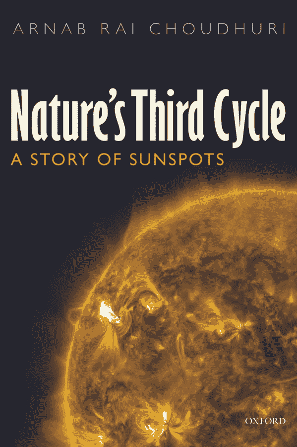

# 太阳活动如何改变经济

> 原文：<https://medium.datadriveninvestor.com/how-activity-on-the-sun-could-change-the-economy-a37f913f8457?source=collection_archive---------20----------------------->

Copyright: Oxford University Press

从前，人们会把太阳当作神来崇拜。他们这样做是有充分理由的，因为太阳提供了我们这个小星球上维持生命的大部分东西，温暖和丰富的收成。如果太阳不再照耀我们，我们将如何生存？这是一种真正的恐惧。

然后是科学和工业化。随着新时代的到来，我们大多忘记了太阳及其对我们生存的重要性。(当然，大多数人偶尔也会抱怨，要么太阳光，要么不够阳光。)

但是仅仅因为我们停止密切关注并不意味着它对我们的世界失去了任何重要性。太阳的生命远比许多人意识到的要复杂，这一事实也是如此。事实上，如果我们相信专家的话，太阳的行为即将发生变化，这可能会对我们吃的食物和更广泛的经济产生巨大的影响。

这就是为什么关于这个问题的一本重要的书最近以平装本出版是相当方便的。自然的第三个周期:太阳黑子的故事。

第三个周期是太阳和出现在太阳表面的暗点的周期。前两个周期是白天对夜晚和季节变换。

Choudhuri 向我们简要介绍了过去几个世纪对太阳和太阳黑子的研究历史，追溯到伽利略·盖利埃，他发现太阳的 27 天自转标志着太阳物理学的正式开始。

这个引人注目的故事包括熟练的业余爱好者和专业学者，主要参与者之间的竞争，以及可能的夫妻谋杀-自杀混合在一起。是的，在研究太阳的故事中有很多内容，作者做了大量的工作，使它成为一部引人入胜的读物。当许多科学书籍更多的是迷惑读者而不是启发读者时，这并不算太寒酸。

可能熟悉的名字包括:空间观测先驱乔治·埃勒里·海耳；天王星的发现者威廉·赫歇尔；天文学家爱德华·蒙德。最后一批人确定了大约从 1640 年到 1715 年太阳黑子消失的时间。通常，太阳表面暗斑的数量倾向于以某种可预测的 11 年为一个周期上升和下降。

黑子消失的时期，即所谓的大太阳活动极小期，也与一种微型冰川期相吻合，这个时期冬季寒冷，夏季短暂凉爽。它以研究它的人的名字命名为蒙德极小期。

当然，地球的温度可能会被太阳表面神秘的黑色波动图案所改变，这种想法毫无争议。但这并不意味着这不是真的，正如作者所说:

> 当太阳黑子消失时，地球确实变得更冷。这究竟是如何发生的仍然是一个问题，专家们对此似乎有着非常不同的看法，而且在不久的将来也不太可能得到明确的解决。

Choudhuri 不厌其烦地补充说，这些都不能否认工业化对气候变化的影响。他们都是关键因素。

然而，当世界在 20 世纪变暖时，太阳黑子的数量超过了平均数量，这一事实使整个事情变得复杂了。记住，在其他条件相同的情况下，更多的斑点意味着地球温度更高。

当这本书在 2015 年以精装本出版时，作者不愿意预测当前太阳黑子周期的可能结果。

但是，根据美国国家航空航天局最近的研究，更明显的是，我们现在正处于一个很少或没有太阳黑子的时期。这与我们正在经历的严冬不谋而合。

问题是我们是否会进入另一个像蒙德极小期那样的大太阳极小期，如果历史是一个指南，这将意味着一个冬天和夏天天气更冷的时期。我经常与之交谈的不少专家认为，我们将进入这样一个巨大的极小期，随之而来的是刺骨的寒冷天气。

如果这种情况发生，那么将会对经济产生深远的影响，包括可能的农作物歉收以及家庭和工作场所取暖能源使用的增加。或者换句话说，预计食品和能源的账单会更高。在一段时间后，这两者的供应越来越丰富，那么这种变化可能会令许多人感到震惊，也可能会影响更广泛的全球经济。

值得指出的是，这本书的作者是印度科学研究所的物理学教授，他对太阳物理学领域的大量未知事物毫不隐瞒。与数千年前的数学不同，太阳科学是一个相对较新的领域，甚至不到 500 年的历史。所有这些都意味着我们都需要保持警惕，研究这个问题，看看接下来会发生什么。

这是 2018 年 3 月 13 日首次在 Forbes.com 上发表的一篇报道的编辑版本。