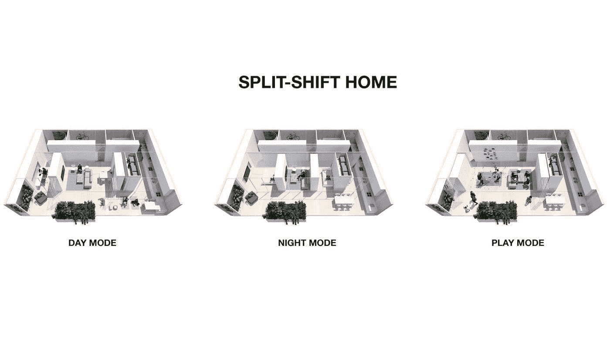

# AD-APT 如何为设计带来自由和灵活性

> 原文：<https://medium.datadriveninvestor.com/how-ad-apt-brings-freedom-and-flexibility-to-design-50042fea9dbb?source=collection_archive---------17----------------------->

现代性的一个典型特征是动态的、不断加快的生活节奏，这主要与科学和技术进步有关，它要求包括建筑在内的所有人类活动领域不断发生变化。努力满足时代的要求，架构变得可移动、灵活、自适应。原因是生活方式的改变和社会发生的变化。城市中的人口密度在增加，住房在减少，微观生活趋势正在形成。另一方面，劳动的性质正在发生变化——工作场所正在从办公室转移到家中。这样一系列的事件需要对住宅及其家具的概念进行全面的重新思考。

 [## 设计隐私|数据驱动的投资者

### 我们生活在一个由技术进步和数字创新主导的时代。关于数据，这些…

www.datadriveninvestor.com](https://www.datadriveninvestor.com/2020/05/18/on-privacy-by-design/) 

# 可互换架构

不言而喻，我们的环境将会发生相应的变化。这让我们看到了布局、空间和建筑，它们的每一部分都可以改变，都是灵活的，可以以不同的方式组合。因此，将灵活性与更广泛的文化力量相结合，灵活的住宅成为设计和建筑中一种新的社会需求。

几千年来，人们在一个能够应对生活方式固有变化的环境中塑造自己。移动和适应性强的住宅很好地证明了这一点。适应性住宅代表一种建筑空间，它能够适应居民不断变化的需求以及环境条件，以保持或实现与居民的最佳一致。住宅的空间应该符合其居民的通常行为，确保生活的舒适和效率。

适应可以作为一种工具的个性化的住宅的大规模发展，其适应变化的需求，以及生活方式的居民与最低限度的劳动力成本。面对环境和经济标准的变化，改变建筑功能的需要和适应性可以提高其单个住宅的运行效率。为了使住宅能够为居住者的生活提供连续的变化，通过建筑设计过程对住宅的操作过程进行直接和反馈是合适的。这个过程促进了更新和发展。正如你可以在任何一个现代建筑/设计博客中发现的那样，通过不断改变建筑的功能、升级和发展来创造一个家是当今这个领域的一个重要趋势。

# 用 AD-APT 建模移动居住环境

我们时代的一个显著特征是社会日益活跃，伴随着新技术的高速发展、人们活动范围的扩大、移民和人口流动的增加等等。由于冠状病毒隔离，我们现在面临着对灵活改造生活空间以在家工作的需求增加。

[澳大利亚建筑事务所 Woods Bagot](https://www.woodsbagot.com/projects/ad-apt/) 创造了一个模块化方案，可以定制房屋，以维持白天所有必要的活动。 [AD-APT](https://www.dezeen.com/2020/04/13/woods-bagots-modular-ad-apt-apartments-working-from-home/) 由许多可移动的墙壁和屏风组成，可用于将住宅分割成不同的房间。借助这种新颖的解决方案，您可以创建各种空间，如办公室、健身房、娱乐区和睡眠区。

合适的草图解释了解决方案的工作原理:

Source: dezeen

AD-APT 旨在在白天进行修改，以满足居民在家工作、娱乐和学习的需求。这个创新项目是根据两种预先定义的工作方式创建和调整的。第一个名为 ***分班回家*** ，是为有孩子的家庭创建的，提出了一种模式，根据这种模式，父母中的一方在上午完成工作任务。与此同时，另一个父母照顾他们的后代。第二种方式是 ***双台家用*** 。这种方法可以被使用临时桌子的工作伙伴或室友利用，而一个人被迫为自己寻找另一个工作场所。

整个晚上，灵活的能力可以将住所分成三个房间。由于 AD-APT 可以重新配置，以适应居民的舒适，该项目引入了一个样本模式，以展示家庭如何运作。根据计划，入口大厅提供存储空间。同时，住宅的其余部分由两个移动小屋和一个固定浴室组成。该项目还包括储物空间解决方案，例如由墙壁组成的家具。附加功能包括用于培育和种植食物的雾培系统。

# 摘要

在[现代建筑](https://en.wikipedia.org/wiki/Modern_architecture#:~:text=Modern%20architecture%2C%20or%20modernist%20architecture,and%20a%20rejection%20of%20ornament.)中，快节奏的生活、节约资源的需要、不断增长的社会需求和商业表现要求采用不同的方法来设计物品。由于外部环境(气候和生态)和社会文化因素(美学相关性、功能相关性、经济收益性)的因素，这些物品的道德和功能老化的时间会缩短，因此这些物品应该具有适应性。从这个角度来看，建筑适应性成为了建立一个灵活的建筑环境的主要动机。架构适应性是建模一个灵活的架构系统的功能性和建设性原则之一。这解释了建造适应性住宅和室内元素的增长趋势，允许随时修改生活空间。

**访问专家视图—** [**订阅 DDI 英特尔**](https://datadriveninvestor.com/ddi-intel)