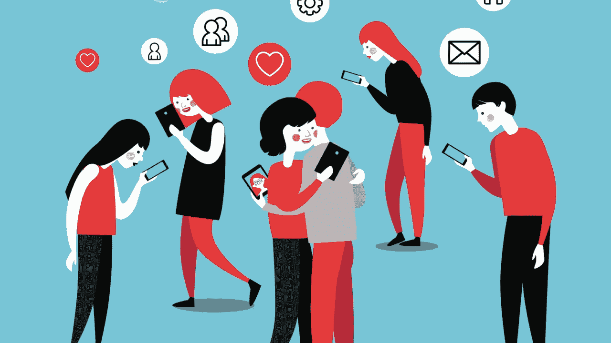
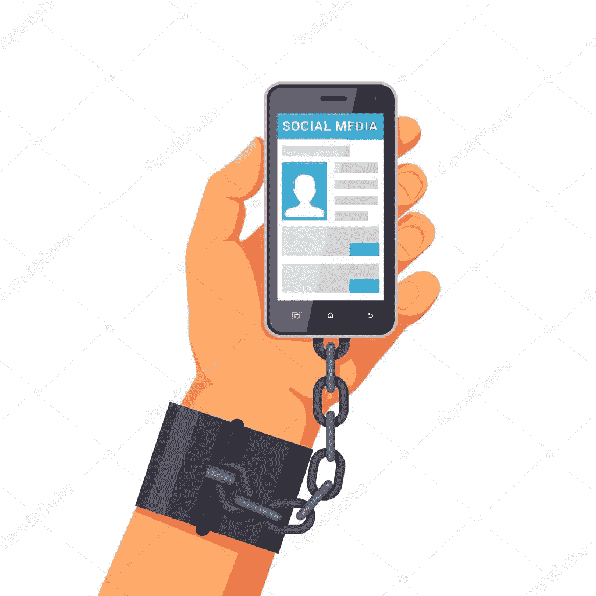

# 你有多沉迷于手机和社交媒体？

> 原文：<https://medium.datadriveninvestor.com/how-addicted-are-you-to-your-phone-and-social-media-4240659e988c?source=collection_archive---------11----------------------->

## 知道自己的瘾是走向胜利的一步。

Photo source- [Raconteur.net](https://www.raconteur.net/smartphone-addiction-in-5-charts/)

## 背景故事。

就像每个不知不觉对某种物质上瘾的人一样，直到你被迫放弃它，你才知道它的严重性。

在这个延长的“冠状病毒假期”的一天早上，我的父母出去了，每个人都刚刚准备好早餐。我们大多是青少年，所以我们都自己做早餐。我尝试了这个著名的鸡蛋三明治食谱，多亏了 YouTube *大学*，我找到了这个食谱。你应该看到我试图拍摄视频和记录时刻，特别是因为它不是一个失败。

关于食物的话题我已经扯得太远了。当我完成我的视频拍摄时，已经是准备后将近 20 分钟了，我还没有吃饭，因为我正在寻找一种方法将视频上传到我的 Instagram story。

一号红旗。对我来说，这不仅仅是早餐食谱的问题，而是我满足自己的需求时手机的感觉(可怜的胃在乞求怜悯)。

然后到了下午。这一天不像前一天那么阴郁，所以我对此很乐观。就在那时，我叔叔来了。他来拿一些文件。追到手后，我以为我的工作是带文件，还文件。笑话我。他要求我指引他的司机去影印店。

这没什么大不了的，因为地方很近。真正令人失望的是文件的数量。“当然，随着过程的进行，我会摆弄我的手机”，我想。我换上一件“适合户外”的衣服，出门了。这时我突然想到——我把手机忘在床上了。

想想你脑子里能想到的所有感叹号。在我们要离开房子之前，我意识到了，但我脑海中的大男子主义者就像这样，“不管怎样，要花多长时间？”

如果你计算我们离开家的时间，得到影印机的回复和影印的实际过程，结果差不多是 2 个小时。我真的失业了。我叔叔正忙着指挥复印机，没有注意到我闷闷不乐的样子。

*1，2，3…* 我正在数经过商店的蜥蜴的数量。

*红色。蓝色。黑色…* 过往车辆的颜色。任何能让我忙起来的事情。

 [## 在家工作如何提高我的工作效率|数据驱动型投资者

### 在家工作确实激发了我最大的潜能，让我更有效率。因为在家工作给了我…

www.datadriveninvestor.com](https://www.datadriveninvestor.com/2020/07/29/how-working-from-home-increased-my-productivity/) 

我一直在寻找一个时钟，因为它感觉像永远。我想到了如果我的手机在身边，我会做的所有看似有效率的事情。好吧，我是在欺骗自己，因为那时我只想滚远一点。

如果你看过这张照片，一个男人被铁链锁在手机上，那么这个场景并不新鲜。

Photo source- [Depositphotos.com](https://www.google.com/url?sa=i&url=https%3A%2F%2Fdepositphotos.com%2F88738704%2Fstock-illustration-internet-and-social-networks-addiction.html&psig=AOvVaw0BrOKDxYSJ4d-lgcUtWHlf&ust=1602108666777000&source=images&cd=vfe&ved=0CAMQjB1qFwoTCOjcxoH-oOwCFQAAAAAdAAAAABAF)

## **上瘾问题。**

你被手机上的闹钟叫醒。作为一名企业家，你的电子商店交易都在你的手机上。如今它甚至是我们的赚钱机器。我们几乎用手机做任何事情。从状态更新，到捕捉记忆，到拍摄视频，再到促进销售，应有尽有。

每次握着手机时，你都会感受到持续的兴奋，这是很难忽视的。我有一个朋友，他总是说他认为我是多么沉迷于社交媒体。h*ello*T2【千禧一代】T3。我一直觉得他在夸大其词，但随着年龄的增长，我明白了。胜利的第一步是承认它。

## **你怎么知道自己上瘾了。**

你早上检查的第一件事是什么？我不是说关掉你的闹钟，而是查看电子邮件、WhatsApp 或 Instagram。

连续滚动几个小时怎么样？和我一起想想。即使在你应该工作的时候，你也在不停地使用它。对于那些有真正原因使用手机工作的人，例如社交媒体经理，你会以此为借口花 3 到 4 个小时盯着屏幕吗？把它用于工作和上瘾之间只有一线之隔。

当没有数据或光线时，你会发疯。当我的数据耗尽时，我是唯一知道该做什么有成效的事情的人吗？想象一下我的大脑如此厚颜无耻。当这些东西可用时，我突然想起我保存在 Pinterest 上的发型。

你知道自己可能上瘾的另一种方式是对离线事物的注意力持续时间减少。这是如此微妙的症状。我记不清有多少次，因为我一直盯着手机，我错过了一场讨论或一种瞬间的感觉。

不是说你应该数所有的蜥蜴或路过的汽车，这样你就不会用手机来打发时间，只是不要因为通过手机对虚拟世界的迷恋而错过了你面前的世界。

## 在现实世界中，承认可能是什么样子

定期关机。

偶尔从手机的嗡嗡声中休息一下。远离社交媒体。我不会停止成为一名传教士，因为我看到它对我有多大的帮助，我知道这样做有潜力。一段时间后，或者一天后，或者一周后，或者一个月后，我们会鼓吹从某些食物中排毒，那么为什么我们的手机或社交媒体就不行呢？

我认识一位女士，她会在一天结束后删除自己的应用程序。大多数时候，我在周末做，尤其是 Instagram，因为我在那里更活跃。这不是每个人都必须做的。我主张找到一种有助于你个人情况的方法。

我的一些朋友关闭通知来减少分心。有些人喜欢开着手机，但只有完成工作后才会回复。无论什么对你有用，只要有意识就好。

你有没有注意到，与你工作和离线时相比，滚动屏幕的时间似乎过得很慢？这就是出发的好处。

这是[精神疾病宣传周](https://en.wikipedia.org/wiki/Mental_Illness_Awareness_Week)和一个及时的提醒，以保护你的思想，特别是从兔子洞社交媒体可以让路。

> PS-纪律需要一段时间，所以不要因为在有意限制你的社交媒体成瘾的第一天没有感觉到它而自杀。

## 总结。

我们都是手机和社交媒体应用的瘾君子。*呀呀。*

承认上瘾其实是走向胜利的第一步。

对我们的手机上瘾以各种方式表现出来，例如不停或无意识的滚动，害怕错过，数蜥蜴或当你把手机留在家里时移动汽车。

没有一种适合所有人的方法可以让你放下手机休息一下。注意你的独特之处，并有意识地使用它。

如果你读到这里，我非常激动，希望它值得你花时间。现在离开你的手机屏幕，享受你剩下的一天。

## 获得专家观点— [订阅 DDI 英特尔](https://datadriveninvestor.com/ddi-intel)