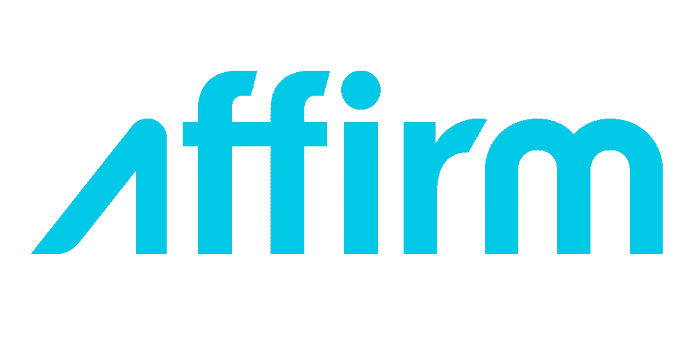

# Affirm 的首次公开募股真的会有所不同吗

> 原文：<https://medium.datadriveninvestor.com/how-affirm-could-have-really-made-a-difference-with-its-ipo-2620e99baccc?source=collection_archive---------22----------------------->

## 我是早期采用者，我只收到了首席执行官的一封电子邮件

**Source:** [**Max Levchin**](https://commons.wikimedia.org/w/index.php?curid=48732849) **— Public Domain**

现在太晚了。

Affirm 是一家让你分期付款购物(通常是零利息)的公司，于周三上市。股票已经飙升了。

我最终会找到一篇文章，详细介绍我为什么喜欢 Affirm 以及其他类似的融资平台。我会让今天的即兴重复简短而甜蜜。

我认为我是 Affirm 的早期用户。所以，今天早上，我收到了首席执行官麦克斯·拉夫琴的电子邮件。它的部分内容是:

> 在 Affirm，我们建立诚实的金融产品来改善生活…
> 
> 今天，Affirm 通过成为一家上市公司，在我们的旅程中向前迈出了一步，没有你们，我们无法迈出这一步。
> 
> 虽然这是一个重要的时刻，我们想与您、[我们的商业伙伴](http://www.affirm.com/shopping)和我们的团队一起庆祝，但我们的工作还远远没有完成…
> 
> 感谢您的信任和合作。

听起来不错。但这是相当空洞的说辞。

与传统信贷一样，Affirm 让你的个人财务状况有些不稳定。当你在结账时选择分期付款时，即使是无息的，你也是在走钢丝。

首先，你花的是你可能没有或不会轻易放弃的钱——至少目前是这样。第二，如果你和我一样，肯定会让你觉得花更多的钱没有问题。

如果你能很好地管理与 Affirm 的关系，它比信用卡强多了。Affirm 可以作为一个很好的工具，帮助你负责任地、有效地管理你的钱。这些好处(以及其他好处)超过了我的担忧。虽然[我提倡不带信用卡](https://medium.com/makingofamillionaire/take-mark-cubans-advice-on-credit-cards-b6dec02553d0)，但我也支持 Affirm。

我认为这家公司的用心是对的。

这封邮件让我笑了。它造成了虚假的授权和圆滑的营销。多花钱，承担这些月供，我们一起可以改善你的生活！

我们应该在几个月前就收到这封电子邮件，里面有以发行价购买该公司股票的链接。这是对我们早期“信任和伙伴关系”的合理补偿对于许多被 Affirm 等服务吸引的消费者来说，这将“改善”甚至很可能改变他们的生活。