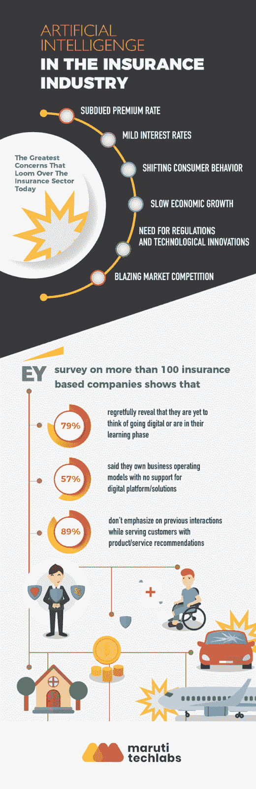
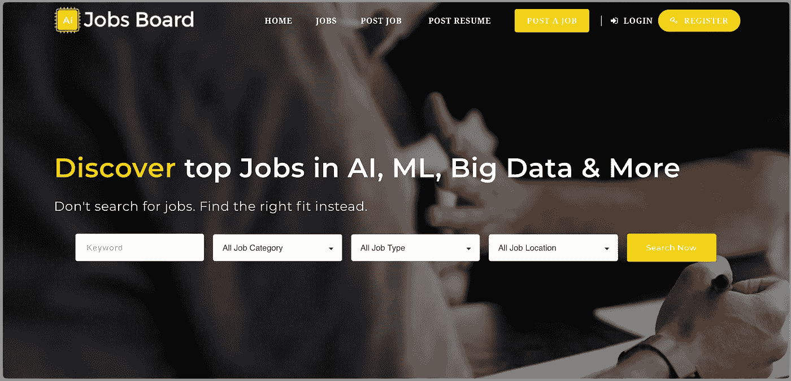
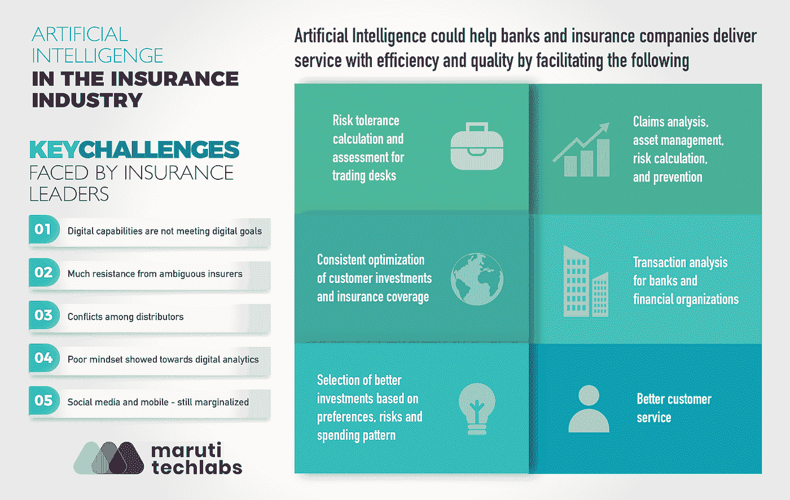

# 保险业的人工智能如何将挑战转化为机遇

> 原文：<https://medium.datadriveninvestor.com/how-ai-in-insurance-is-converting-challenges-into-opportunities-82919ff0b0ce?source=collection_archive---------16----------------------->

谈到数字化，保险领域在技术创新方面并没有特别领先。这是公平的，因为大量的法规加上成千上万用户的敏感信息，使得保险业在采用新技术时非常谨慎。但是，事情正在逐渐改变！

根据 Genpact 的 [AI 360 报告](https://www.genpact.com/instinctive-enterprise/ai-360-research)，保险行业对[人工智能](https://becominghuman.ai/top-100-medium-com-c2695ab3270c)的采用正在迅速增加，87%的保险公司每年在人工智能相关技术上的投资超过 500 万美元。数字革命无处不在，越来越多地改变传统的商业模式，并采用数字解决方案。

作为来自保险行业的人，对在保险业采用[人工智能](https://becominghuman.ai/work-on-artificial-intelligence-projects-65ea39a42106)仍然持观望态度是很自然的。为了减轻你的恐惧，我们的人工智能专家解决了房间里的大象——在保险业引入[人工智能](https://becominghuman.ai/the-ai-job-wars-episode-i-c18e932ff225)将如何影响当前的遗留流程。

# 保险公司的当前情况

根据全球保险领导者 EY[对 100 多家公司进行的调查——](http://www.ey.com/gl/en/industries/financial-services/insurance/insurance-in-a-digital-world--the-time-is-now)

*   79%的人遗憾地表示，他们尚未考虑数字化或正处于学习阶段
*   57%的受访者表示，他们拥有不支持数字平台/解决方案的业务运营模式
*   89%的人在为顾客提供产品/服务建议时不强调之前的互动

这表明保险业正在努力理解和利用数字化进步。该调查还揭示了这些保险业领导者面临的一些关键挑战。其中一些是:

Big Data Jobs

## 1.数字能力没有达到数字目标

在全球数字领导的舞台上，渴望体验其数字目标潜在改善的公司未能实现预期结果。他们中的一些人承认接近了目标，然而，那些吹嘘数字转换的人只有 10%。

## 2.来自含糊不清的保险公司的强烈抵制

阻碍所有数字化事物整合的一些负面因素是遗留的流程、简单的技术力量、非创新的方法、缓慢的交付和其他内部限制。公司仍需克服对数字智能的模糊和犹豫，以发现未来的商业机会和持续增长的独特潜力。

## 3.经销商之间的冲突

阻碍保险业数字化实施的另一个因素是来自代理渠道和分销商的阻力。这就是为什么必须消除对数字运动投资的抑制和疑虑。提出诚实的价值主张来改善客户体验有助于缓解紧张。

# 热门人工智能文章:

> [1。为大重置和新常态下的未来工作做准备](https://becominghuman.ai/preparing-for-the-great-reset-and-the-future-of-work-in-the-new-normal-a3c195b7eccf)
> 
> [2。机器学习中的特征缩放](https://becominghuman.ai/feature-scaling-in-machine-learning-20dd93bb1bcb)
> 
> [3。理解混乱矩阵](https://becominghuman.ai/understanding-confusion-matrix-eb6f0f662c3a)
> 
> [4。关于人工智能在工作场所的 8 个神话](https://becominghuman.ai/8-myths-about-ai-in-the-workplace-83011619f6f)

## 4.对数字分析表现出的不良心态

客户细分、行为分析和预测建模是智能数据驱动技术推动营销潜力的现代驱动因素。如果没有强大的分析功能，从数字化战略的实施中获取最大价值是不切实际的。

## 5.社交媒体和手机——仍然被边缘化

在数字设备不可或缺的时代，忽视在移动设备上开展保险业务以及通过无数社交媒体平台与最大潜在客户保持联系的力量是不合理的。由于社交媒体有助于使你的营销工作更有效，并吸引懂数字的受众，它应该是数字化战略不可或缺的一部分。

## 6.成本、竞争和消费者期望的巨大压力

尽管保险公司的首席执行官们已经意识到数字颠覆正在席卷整个行业，但要跟上这些革命性的变化，并超越现代技术的简单整合，将是一个全新的挑战。智能解决方案必须具有足够的创新性，以培养更好的客户关系和交付客户体验的方式，在初始市场预期和成本优化之间激发急需的平衡。

> 另请阅读[人工智能和人工智能在金融领域的 12 个用例](https://marutitech.com/ai-and-ml-in-finance/)

除此之外，另一个压力点来自新兴的保险技术进入者，他们通过创造负担得起的解决方案来接触和服务客户，从而引发了激烈的竞争。令人放松的是，为了超越这一挑战，行业领导者准备拥抱新的创新可能性，并欣赏创造力在发展过程中的作用，并成为金融市场中受欢迎的品牌。

# 人工智能在保险中的应用

在过去的两年里，我们已经看到人工智能在多个行业的广泛出现和采用(无论是[酒店业](https://marutitech.com/ebooks/artificial-intelligence-in-hotels/)还是[医疗业](https://chatbotsmagazine.com/is-conversational-ai-the-future-of-healthcare-658a3d8e9dd5))。数字技术统治金融市场的想法并不新鲜，因为纳斯达克(Nasdaq)在早期建立了一个交易台安全连接网络，用于整合客户数据记录。当时，许多全球金融公司和银行依赖穿孔卡和基本计算系统来监控客户活动。因此，保险业中分析数据、预测结果和帮助决策的人工智能概念毕竟不是那么遥不可及。

人工智能可以帮助银行和保险机构高效、优质地提供服务，就像它为酒店、医疗保健和客户服务流程等其他行业的主要领导者所做的那样。采用人工智能有助于:

*   突发灾害造成的损失分析
*   交易台的风险承受能力计算和评估
*   银行和金融机构的交易分析
*   根据偏好、风险和支出模式选择更好的投资
*   客户投资和保险范围的一致优化
*   索赔分析、资产管理、风险计算和防范

由于其不断发展的预测能力，人工智能可以与自动取款机、移动支付和在线索赔处理无缝合作。它通过提高数据解释的透明度，帮助数字连接的个人做出更快、更明智的决策。

例如，在退休阶段对财务安全怀有主要担忧的家庭可以选择像 401(k)计划这样的投资决策，以确保巨大的安全性。AI 强大的分析脑力工作可以指导客户做出明智的投资决策，通过建议改善他们的每周或每月支出，将他们的最大风险潜力、保费偏好和 401(k)资金来源的维护纳入其中。人工智能解决方案还可以帮助客户的非退休投资决策和保险覆盖范围。

# 人工智能驱动的保险机会

尽管很难预测人工智能在保险业和业务流程自动化中的应用的充分利用，但市场领导者对收获其带来的好处持乐观态度和信心。埃森哲(Accenture)和前沿经济(Frontier Economics)的一项前景看好的研究声称，到 2035 年，人工智能将在 11 个西方工业化国家和日本提高 10-40%的劳动生产率。如果这个乐观的预测是真的，到 2035 年，经济增长可能会翻一番。

考虑到目前的情况，基于人工智能的产品将包括智能无人驾驶汽车、智能传感器和工厂以及网络犯罪损害的保险范围。此外，人工智能还将为索赔分析、资产管理、风险计算和预防等重要流程提供支持。例如，财产损失分析可以通过保险业中人工智能的图像处理部分进行。同一台机器可以根据智能算法做出明智的投资决策。

由于金融部门充斥着前所未有的金融、保险和投资数据，将人工智能集成到保险行业的需求可以推动该行业的全新增长。人工智能强大的数据管理工具可以帮助人们评估和浏览金字塔数据，同时帮助企业创造直观和交互式的客户体验。

简而言之，这里有几个很好的目标领域，人工智能可以在这些领域取得重大影响，并为整个保险行业带来变革

*   **成本和客户亲密度**

采用这些以技术和流程为导向的变革不仅仅是引入新技术那么简单明了，它还关乎如何创新地实现增强客户亲密度的理念，以满足快速变化的市场预期并调整与成本相关的限制。谈到[人工智能客服](https://marutitech.com/artificial-intelligence-for-customer-service-2/)，我们已经看到了无数的成功故事。

*   **市场竞争和压力**

由于来自精益和敏捷保险技术进入者的更大压力和周围的市场竞争，老牌企业必须准备好一决雌雄，并改善他们接近客户的方法，同时有效地削减整体运营成本。

*   **创新、挑战和未来的可能性**

随着市场被数字化破坏，在实现更好的增长和收入时，很难仅仅利用基础创新和成本优化的共同利润。然而，保险公司正在积极迎接挑战，因为 67%的行业领导者(根据[普华永道的报告](https://www.pwc.com/gx/en/ceo-survey/2017/industries/pwc-ceo-20th-survey-report-2017-insurance.pdf))乐于接受人工智能驱动的新可能性，并发现创造力和创新对他们的组织增长至关重要。

# 更好的人机同步

保险公司的首席执行官(近 61%)也在通过在共同的劳动力中应用人类和机器的联合努力，从人类和机器的同步运作中获得竞争优势。这些新时代的进步和人工智能能力有望重振我们现在看到的保险业的正统元素，并培养一个组织良好、智能和自信的“增长加速平台”，它远远超出了成本、竞争和客户满意度的前沿。

在马鲁蒂技术实验室，我们致力于在保险领域的多个领域实施人工智能技术，以实现更快的索赔分析、[使用图像识别的自动化损害分析](https://marutitech.com/computer-vision-services/)、自动化自助服务指导、标准化记录保存、降低成本、消除错误等等。

多年来，运营效率在客户满意度中的重要性变得更加突出。没有比[抓住](https://marutitech.com/contact-us/) [**人工智能在保险**](https://marutitech.com/ai-in-the-insurance-industry/) 带来的机遇更好的时机了。

# 别忘了给我们你的👏！

