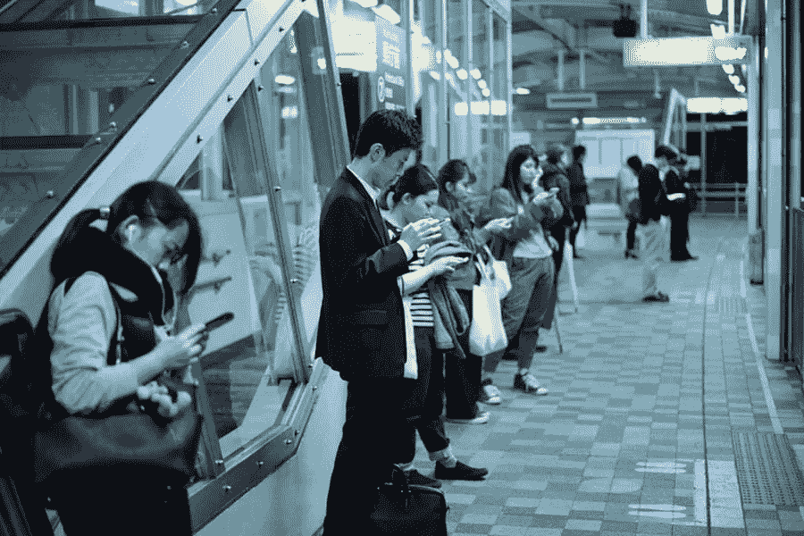

# 人工智能如何被用于对抗冠状病毒

> 原文：<https://medium.datadriveninvestor.com/how-ai-is-being-used-in-the-fight-against-coronavirus-4fd7a3ef936?source=collection_archive---------16----------------------->

世界正在与冠状病毒作战。正在调用所有工具、手段和可用知识来应对疫情。信息的传递对于监视疫情至关重要。冠状病毒的爆发在这个意义上是独一无二的；这是第一个人工智能技术如此发达和先进的疫情。

围绕人工智能的辩论，以及它是对人类的威胁还是提升我们生活质量的宝贵机会，可能会有一个新的层面，因为各国别无选择，只能尽一切努力对付这种病毒。

# 全球已有超过 120，000 人被疫情感染，伤亡人数超过 4，300 人。在中国和美国，使用人工智能是有效和快速处理海量数据以达到两个目标的唯一方法，即跟踪病毒的传播和协助医院治疗病人。

2018 年，中国政府开始大力投资人工智能研究，希望成为“世界主要的人工智能创新中心”。中国的早期投资，特别是对人工智能潜在的医疗保健相关应用的投资，使诊断病人变得更容易。

例如，中国人工智能初创企业易图科技(Shanghai Technology)提供基于人工智能的服务，分析医院、医疗中心和诊所用于诊断疑似携带新冠肺炎病毒患者的扫描结果。这些发展伴随着在线医疗咨询的引入，也得到人工智能技术的帮助，促进了与中国公共卫生当局的更密切协调。

火车站和机场用于识别高体温人群的热扫描仪也被证明有助于检测和追踪病毒携带者。易图科技公司还致力于将热扫描与面部识别和双重传感结合起来。

中国也在使用人工智能作为监控工具。通过分析短信来解读个人的旅行历史，然后在社交媒体上分享，中国人可以知道他们是否接触过冠状病毒携带者。

发布的高度详细的信息也被用来创建一个名为“密切接触检测器”的强制性移动应用程序，该应用程序为每个人生成一个二维码，使他们能够确保他们没有接触过冠状病毒携带者。其他预测性人工智能模型已经被开发出来，以帮助预测未来的疾病爆发。

在美国，研究人员正试图找到解决方案，以帮助应对传染病。例如，在波士顿，波士顿儿童医院(Boston Children's Hospital)使用机器学习，通过社交媒体和官方公共卫生渠道的数据，在中国以外梳理病毒迹象的过程中发挥了宝贵的作用。

约翰·霍普斯金大学成立了一个冠状病毒资源中心，该中心通过数据挖掘和人工智能开发了一个地理信息系统，使人们更容易跟踪当地和全球的疫情，无论他们在哪里。

出于所有这些原因，创造性地使用人工智能和其他技术已经成为解决疫情问题不可或缺的一部分，并已经产生了重大影响。然而，世界仍在试验如何在更广泛的公共卫生战略背景下有效地管理和实施这一战略。