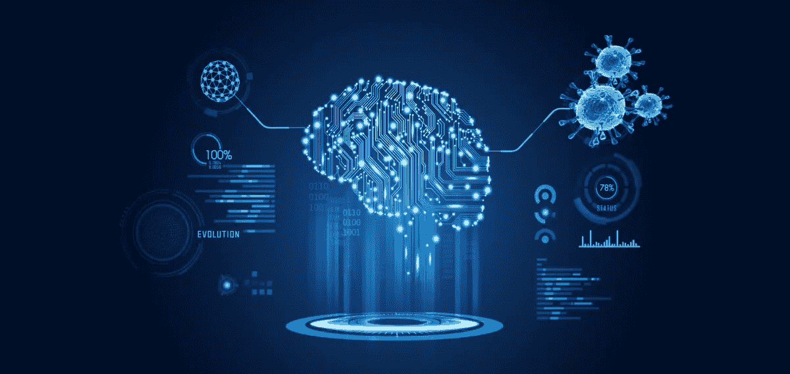

# 人工智能如何帮助对抗新冠肺炎？

> 原文：<https://medium.datadriveninvestor.com/how-ai-is-helping-to-battle-covid-19-9cd4a981f7a7?source=collection_archive---------25----------------------->

随着冠状病毒疫情近乎指数级的升级，世界陷入了停滞。根据世界卫生组织，冠状病毒病(新冠肺炎)是一种由新型冠状病毒病毒引起的传染病。2019 年 12 月 31 日在中国首次报道，对新冠肺炎的恐惧迅速蔓延到全球。截至目前，全球新冠肺炎感染总人数已超过 100 万，其中 5.1 万人死亡，21 万人康复。随着人数呈指数增长，世界各国领导人已经关闭了他们的国家，并要求他们的公民呆在家里。事实上，所有的大城市都进入了冬眠状态，因为公共空间依然荒芜。教室、地标、酒吧、商店、俱乐部和餐馆仍然关闭，而火车轨道、机场和道路显得出奇的空。尽管医疗专家建议保持社交距离和个人卫生以远离疫情，但这不能被视为解决目前情况的永久解决方案。我们需要的是依靠人工智能(AI)、大数据和基因技术的进步来跟踪和抗击这种疫情。

# 预测病毒的传播

人工智能可以警告我们即将到来的流行病，以及它将如何在时间和空间上传播。机器学习是人工智能最令人兴奋的子集之一，它使人类能够通过处理海量数据、发现数据中的模式并使用这些模式进行预测来“教”机器。事实上，全球人工智能数据库公司 BlueDot 已经警告其客户避免使用武汉，甚至美国疾病控制和预防中心(CDC)和世界卫生组织(世卫组织)也发出了公开警告。这个基于人工智能的系统使用自然语言处理和机器学习从成千上万的来源中提取数据，如外国新闻报道、官方公共卫生组织的声明、全球机票数据、牲畜健康报告和人口统计数据，以跟踪、定位和概念化传染病传播。

未来，人工智能和大数据将被用于从社交媒体平台收集数据，以了解人们如何在网上谈论这些问题，并跟踪受影响者的旅行历史。

# 药物发现和开发

人工智能将对医疗保健产生变革性影响，其应用范围从药物输送到诊断、消费者健康等。利用深度学习、机器学习和自然语言处理的力量，促进医疗保健行业成功预防、诊断和治疗疾病。人工智能在最短时间内处理大量复杂信息(如病理数据)的能力，证明有利于加快诊断过程和随后的治疗。人工智能技术更熟练和更准确的水平有助于识别深层模式，这可能是确定患者治疗计划的关键点。

例如，长寿愿景基金的投资组合公司 Insilico Medicine 使用其人工智能系统在短短四天内识别了数千种可能用于治疗新冠肺炎的分子。此外，该公司公开发表了其最新研究结果，以便世界各地的所有研究人员都能获得这些研究结果，并为有效防治疫情做出贡献。

 [## AI 将军是否已经超过了人类的智力容量？数据驱动的投资者

### 不仅在游戏中，而且在劳动力市场上，机器都比人类聪明。在今天的许多领域，使用…

www.datadriveninvestor.com](https://www.datadriveninvestor.com/2020/02/12/has-general-ai-exceeded-the-intellectual-capacity-of-humans/) 

人工智能系统提供的速度、可扩展性和准确性有助于扫描现有药物，并检查它是否可以重新用于治疗冠状病毒感染。它还准备帮助快速设计和开发新冠肺炎的抗体和疫苗，从而对抗当前和未来的疫情。

# 无人驾驶飞机和机器人提供帮助

在这场危机中，人工智能可以通过提供帮助，让我们的生活变得更加轻松。众所周知，社会距离是一种非药物感染预防和控制方法，以保持安全远离新冠肺炎。在可怕的危机期间，基于人工智能技术的无人机和机器人被用来在没有人类干预的情况下完成许多任务。无人机被用来在公共场所巡逻，以确保人们采取适当的预防措施，并遵守检疫规定。为了让人们远离危险，无人机被部署来进行热成像，调度医疗用品，并在医院和疾病控制中心之间运输医疗样本。

另一方面，机器人被用来清洁和消毒一些区域。对 UVD 机器人消毒病房的需求激增。总部位于丹麦的 UVD 机器人公司制造了一种自主移动机器人，它可以进入房间，用 UV-C 光消毒，而不会让员工暴露在潜在的有害辐射中。这是几家提供应对新型冠状病毒的消毒系统的公司之一。部署这样的自动化系统有助于减少人与人之间的接触，也有助于加强对疫情的有效监测。

新冠肺炎的威胁正在席卷全球，给人们带来恐惧和焦虑。然而，人工智能和大数据等突破性技术的发展，以及医疗保健领导者、科学家和研究人员的交叉合作，给我们带来了检测、了解和阻止新冠肺炎传播的一线希望。

*最初发表于*[*【https://www.logiticks.com】*](https://www.logiticks.com/blog/how-ai-is-helping-to-battle-covid-19/)*。*