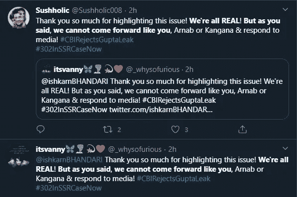
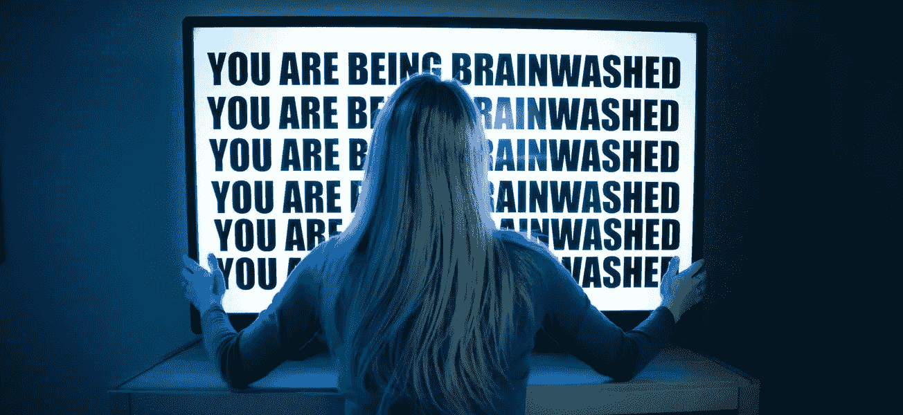
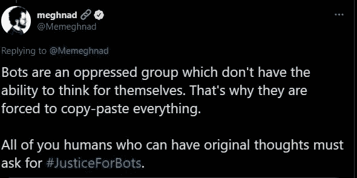

# 人工智能驱动的工具如何被武器化来操纵社会？

> 原文：<https://medium.datadriveninvestor.com/how-ai-powered-tools-could-be-weaponized-to-manipulate-society-9d6d36e29c1e?source=collection_archive---------32----------------------->

2020 年，演员苏尚特·辛格·拉吉普特死后，8 万个机器人被创造出来，目的是反对孟买警方和马哈拉施特拉邦政府。

这些机器人上传的虚假信息似乎很有说服力。孟买警方 IT 部门发现这些内容是从意大利、日本、泰国、斯洛文尼亚、罗马尼亚和法国等国家上传的。

这些机器人在几个社交媒体平台上发布内容，标签为 **#Justice4SSR** 、 **#Memepolice** 。他们的帖子似乎是真实的。人们无法识别这些帖子是由机器人还是正版上传的。

**什么是机器人？**

机器人不是物理实体。它们是由一个使用编程语言的人专门开发的。它们包括代码，仅此而已。机器人根据固定的计算机算法来执行基本的人类任务。

他们的目的是在社交媒体平台上模仿人类。因为他们研究特定的算法，所以他们对几乎所有事情的反应都是一样的。

随着人工智能的出现，这些机器人正在学习根据情况做出反应。

人工智能使机器人能够理解人类在社交媒体上的行为，这有助于他们构建虚假信息。例如，Twitter 上的一个 bot 帐户可以沉迷于多个对话，这让你感觉这些都是真实的人。

Twitter 机器人是社交媒体中最聪明的机器人。他们被编程来回答用户提出的问题，这提高了他们账户的可信度。

**Bot 账号如何传播假新闻？**

*   通过多个账号反复使用相同的内容、关键词来放大宣传。
*   同一时间关于同一话题的过多推文。
*   一个人的追随者很多，但帖子的参与度却很低。

**人工智能造成威胁**

世界首富埃隆·马斯克说:“谷歌的联合创始人兼首席执行官拉里·佩奇很可能一直在开发一批人工智能增强的机器人，这些机器人能够毁灭人类。”尽管他和佩奇是密友，但他知道佩奇是一个善意的人，而不是邪恶博士。尽管如此，他还是担心地说:“他可能会意外地产生一些邪恶的东西。”

世界各地的政府当局都在努力应对假新闻，误导煽动暴力的社交媒体帖子。人工智能的工具变得更加强大，专家担心人工智能的假新闻扩散可能会造成难以克服的麻烦。

两个最重要的人工智能实验室- OpenAI 和艾伦人工智能研究所，已经开发了这项技术的强大工具。他们没有推出它，因为这些工具对社会是危险的。

OpenAI 的一名研究人员亚历克·拉德福德**，**表示，这项技术可以帮助政党、社区有效地传播假新闻、公共仇恨和宣传。他们不需要雇佣人类。他们可以完全依靠机器来大规模传播他们的信息。

专家们已经推出了一项技术，可以生成不存在的人的照片。www.thispersondoesnotexist.com 的[就是一个例子。](http://thispersondoesnotexist.com)几个月前，一家加拿大公司的技术专家开发了一种可以模仿乔·罗根声音的产品。你不会相信这听起来完全像他，模仿是该死的准确。

现在，公司正在寻求开发能够像人类一样书写的文本生成工具。随着技术的不断发展，这是一个我们都应该关注的真正威胁。

**前进的道路是什么？**

以下是几种打击假新闻的方法:

**奖励众包事实核查网站**

目前，事实核查网站正在利用社交媒体平台本身的用户基础。当机器人传播虚假信息时，用户通常会在评论区分享正确信息的链接，包括真实网站的链接。让用户自己参与到打击假新闻的斗争中来，将有助于我们走得更远，并将使情况变得更好。

**真实新闻的放大**

假新闻的治疗方法是传播真实的新闻。这就是可信的新闻机构发挥作用的地方。因为这些新闻分享平台有现场记者和团队，他们可以评估正在进行的社交媒体趋势，他们可以通过他们的平台分享实际的新闻。这种方法有双重好处，因为它推翻了假新闻，让人们参与到真实新闻中来。有几种方法可以放大真实的新闻(社交媒体简介、网站等)。)

新闻洗衣店的一名记者， **Meghnad** 曾在推特上写道“ ***机器人是一个受压迫的群体，他们没有独立思考的能力。这就是为什么他们被迫复制粘贴一切*** 。”