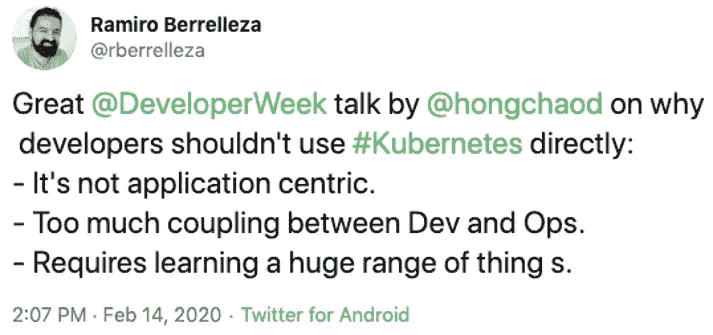
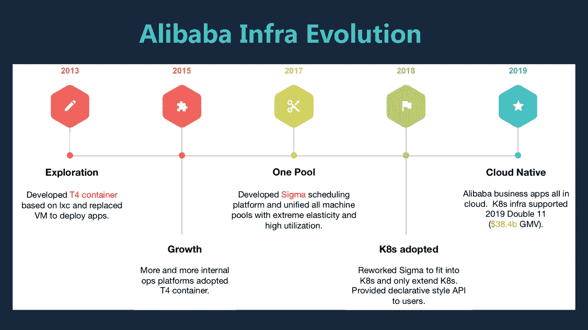
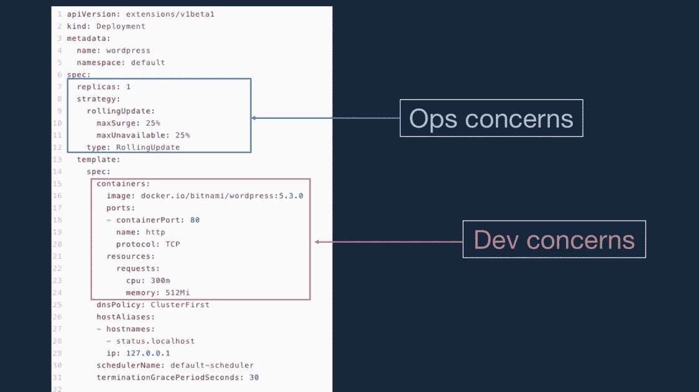
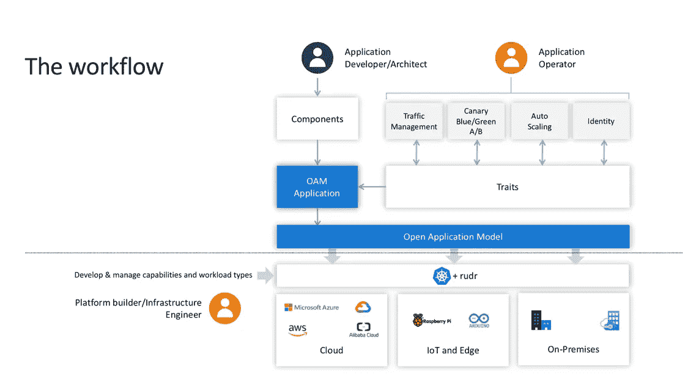

# 阿里巴巴如何改善 K8s 上的开发者体验

> 原文：<https://medium.datadriveninvestor.com/how-alibaba-improves-developer-experience-on-k8s-35c687a02275?source=collection_archive---------6----------------------->

如今，[阿里巴巴在云规模运行 Kubernetes](https://www.alibabacloud.com/product/kubernetesk8s_595874?spm=a2c41.14019725.0.0) (缩写 k8s)。阿里巴巴不仅在云上管理 10，000 个 k8s 集群，还运行 10，000 个节点规模的集群，以支持电子商务业务运营。

我们的集装箱化之旅始于 2013 年。在 Docker 诞生之前，有一个叫做 T4 的东西，这是一个基于 lxc 的容器引擎，由阿里巴巴开发，用于部署位于裸机上的应用程序。2017 年，类似于 k8s 的容器编排引擎适马被开发为统一层，以管理平均利用率为 40%的内部机器池。2018 年，适马被重新制作并迁移到 k8s 兼容。我们的工程师编写定制控制器和调度算法，并向用户公开声明式 API。到 2019 年底，阿里巴巴的大多数应用程序都在 k8s 上运行，数十个框架建立在 k8s 生态系统之上。2019 年的双 11 活动不仅是商业上的成功，也是 k8s 可以在这样的规模上支持基础设施的技术证明。

 [## 信息图:云之旅

### 聪明的企业领导者了解利用云的价值。随着数据存储需求的增长，他们已经…

www.datadriveninvestor.com](https://www.datadriveninvestor.com/2018/09/22/infographic-journey-to-the-clouds/) 

在我们解决了 k8s 中的可扩展性和稳定性问题之后，我们面临着另一个巨大的挑战——k8s API 对于开发人员来说太复杂太难学了。为什么？我来澄清三大原因:

首先，k8s 资源模型不是以应用为中心的。k8s 中没有“应用程序”的概念，只是松散耦合的底层资源。部署应用程序需要编写基础设施资源，如 Pod 或网络或存储，它们是松散耦合的，因为没有中心点。对于开发者来说，他们不想指定这么低级的细节；他们希望指定高级应用程序规范，例如具有自动伸缩、监控、VPC 等功能的无状态服务组件。我们需要提供高级应用规范和以应用为中心的资源模型，以弥合部署应用和配置基础架构之间的差距。

其次，k8s API 中没有关注点分离。从上图我们可以看出，k8s 将所有属于不同角色的字段封装在一个 API 中。例如，开发人员将只指定容器映像、端口和健康检查；操作员负责指定副本大小、滚动更新策略、卷访问模式等。k8s API 没毛病。K8s 旨在公开基础设施功能，并用于构建其他平台。因此，它需要包含一切，并提供一体化的 API。但是我们发现一体化 API 并不适合终端用户应用。在 k8s API 之上，我们需要分离开发人员和操作人员的角色和关注点。

第三，k8s 上没有可移植的应用抽象。K8s 定义了消耗基础设施资源的标准方式。但是如上所述，部署应用程序需要入口、监控等。我们需要标准化这些应用程序操作接口，并拥有跨平台的可移植应用程序抽象。

这可以归结为我今天要介绍的一个新东西，叫做开放应用模型(OAM)。它是一个标准规范，定义了模块化、可扩展、可移植的应用模型，用于构建和交付云原生应用。让我们深入了解一下 OAM，看看它是如何解决上述问题的。

从上图我们可以看到，开发者定义了*组件*来描述服务单元。然后，操作员定义操作*特性*并将其附加到*应用配置*中的*组件*上，这就是最终的 OAM 交付。底层基础设施资源将由 OAM 平台呈现。OAM 隐藏了底层细节，如基础架构是云还是物联网，并从以应用程序为中心的角度标准化了部署模式。

OAM 将包含一组工作负载/特征/范围类型的核心定义为应用交付平台的基石。它们是构建部署管道的最小功能集。一个名为 Rudr 的开源实现已经实现了核心规范。

此外，Rudr 提供了让用户扩展其功能的机制。例如，Rudr core 提供服务器工作负载来运行容器中的应用程序并管理应用程序的生命周期。我可以添加更多的工作负载，比如运行无服务器功能的 FaaS，或者定义 CronJob 风格的 HPA 策略的 CronHPA。OAM 以标准的声明方式在单个平台中管理这些功能及其关系。

到目前为止，我们已经讨论了 OAM 的动机和架构细节。值得注意的是，OAM 项目是厂商中立的，并且是社区驱动的。该规范和实现得到了包括阿里巴巴、微软、Upbound 在内的开放社区的支持。它欢迎更多的人参与进来，共同构建应用交付的未来。您可以:

促成回购:

*   [https://github.com/oam-dev/spec](https://github.com/oam-dev/speck8s_595874?spm=a2c41.14019725.0.0)
*   [https://github.com/oam-dev/rudr](https://github.com/oam-dev/rudrk8s_595874?spm=a2c41.14019725.0.0)

加入邮件列表:[https://groups.google.com/forum/#!forum/oam-dev](https://groups.google.com/forum/k8s_595874?spm=a2c41.14019725.0.0#!forum/oam-dev)

加入社区电话:[每两周一次，太平洋标准时间周二上午 10:30](https://calendar.google.com/calendark8s_595874?spm=a2c41.14019725.0.0&cid=dDk5YThyNGIwOWJyYTJxajNlbWI0a2FvdGtAZ3JvdXAuY2FsZW5kYXIuZ29vZ2xlLmNvbQ)

【阿里巴巴云原生应用团队邓

*这是洪超·邓在 2020 年开发者周上的一次演讲的摘录。*

# 原始来源:

 [## 阿里巴巴如何改善 K8s 上的开发者体验

### 阿里巴巴开发者 2020 年 2 月 21 日 14 阿里巴巴云原生应用团队邓

www.alibabacloud.com](https://www.alibabacloud.com/blog/how-alibaba-improves-developer-experience-on-k8s_595874?spm=a2c41.14019725.0.0)