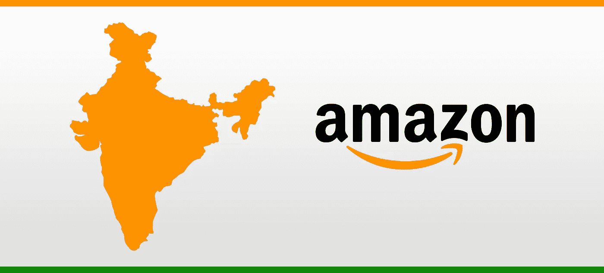
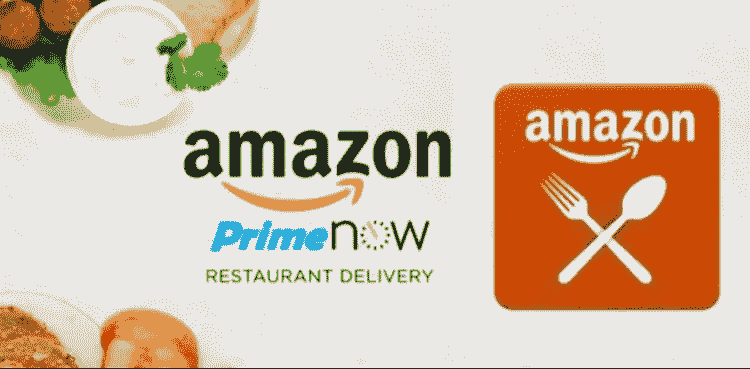
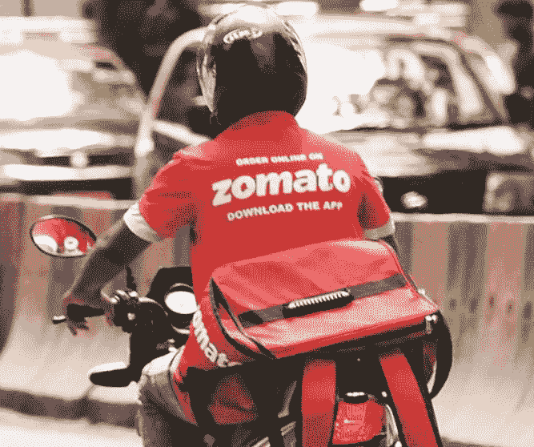
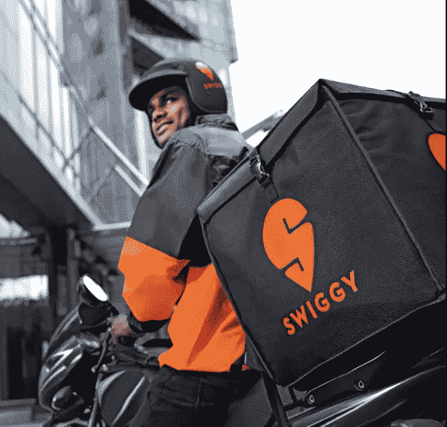
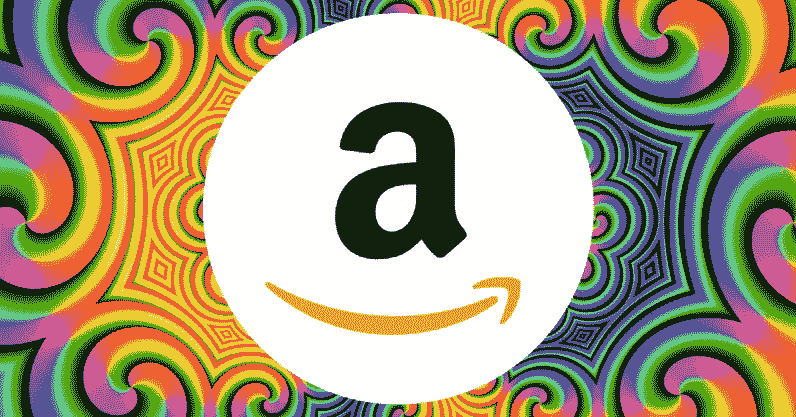

# 亚马逊计划如何在印度挑战 Swiggy 和 Zomato

> 原文：<https://medium.datadriveninvestor.com/how-amazon-plans-to-take-on-swiggy-and-zomato-in-india-f8001d9918ee?source=collection_archive---------16----------------------->

## 亚马逊的新食品配送平台正在印度五个高密度地区进行试点

***由*** [***约翰·哈伍德***](https://www.anthonyblumberg.com/)

在印度竞争激烈的食品配送领域，目前由老牌企业 Swiggy 和 Zomato 主导，市场上出现了一个新的巨人——亚马逊。

凭借其在两小时送货供应链上的现有巨额投资，这家美国电子商务巨头现在正在试行其备受期待的项目，即将食品配送到印度的五个选定地点。

 [## 幸福的算法？数据驱动的投资者

### 从一开始，我们就认为技术正在使我们的生活变得更好、更快、更容易和更实用。社交媒体…

www.datadriveninvestor.com](https://www.datadriveninvestor.com/2019/03/08/an-algorithm-for-happiness/) 

这发生在 Swiggy 和 Zomato 削减折扣和收紧成本结构的时候，打车公司优步完全退出了印度的食品配送业务，上个月将 UberEats India 出售给 Zomato，换取了 10%的股份，勉强维持了他们的业务。

*A Zomato restaurant delivery in Mumbai*

亚马逊进军食品配送的大胆举措是一个更大计划的一部分，该计划旨在为其亚马逊 Prime 订阅客户建立一个全面的产品组合——从杂货和食品到电子产品和家居产品。

> 对创业公司感兴趣？看看这些初创企业……[融资数十亿，然后裁员数千人](https://www.anthonyblumberg.com/blog/these-startups-raised-billions-and-then-laid-off-thousands)

“亚马逊是如此强大的一股力量，以至于他们可以最后进入市场，并最终胜出”

安东尼·布隆伯格在印度和海外都是备受尊敬的国际投资者。

“在这个国家的任何消费技术产品中，食品配送获得了最大的吸引力，其次是杂货、快速消费品和普通电子商务，”布隆伯格说。“亚马逊的目的是捕捉高价值消费者消费的所有最大最有意义的类别，并使重复购买变得方便、实惠和无缝，特别是在顶级城市，”布隆伯格补充道。

截至目前，亚马逊的试点食品交付平台规模有限，但预计一旦最初的问题得到解决，该平台将迅速扩大。

两家主要餐饮连锁店的高管证实，Infosys 和亚马逊印度公司的合资企业 Prione Business Services 一直在积极与多个品牌签署合同，以在亚马逊上市，并提供 10%至 15%的佣金。佣金大约是 Swiggy 和 Zomato 向其合作餐馆收取的一半。

*A Swiggy food delivery in Hyderabad*

“亚马逊的送餐业务定于 3 月下旬推出，这项服务将在 Prime Now 应用程序上推出，”一位了解该计划的高管最近被引述说。

“主要目标是推出独家品牌，与提供多种本地和国际特色美食的多元化餐厅合作，”他说。

“为了成功地正面应对 Swiggy 和 Zomato，亚马逊正在物流、整个餐厅生态系统方面进行重大的明智投资，所有这些都由一个强大的技术平台支持，并专业地营销这一切，”全球投资者安东尼·布隆伯格补充道。

上周，Swiggy 筹集了 3.5 亿美元。

“重点是登上印度的顶级餐厅，优先考虑全国食品链，”一位消息人士说。其中包括肯德基、必胜客、Rebel Foods 以及已经与亚马逊签约的区域顶级连锁酒店，如港铁和帝国酒店。

“去年，亚马逊关闭了在美国已有四年历史的亚马逊餐厅送货服务，同时投资了欧洲的食品配送平台 Deliveroo，这表明了在可行单位经济学中运营这项业务的复杂性，”布隆伯格解释道。

“在印度，与直接购买或投资技术优先的问题相比，尝试建立业务是值得的，”一位亚马逊高管最近被引述说。

# 这一切意味着什么？

印度竞争激烈的食品和餐馆外卖业务变得更加竞争激烈。

本文[最初发表于](http://www.anthonyblumberg.com/blog/how-amazon-plans-to-take-on-swiggy-and-zomato-in-india)我的博客:【anthonyblumberg.com】T2。查看更多关于金融和投资的独家文章！如果你喜欢这篇文章，请留下一些关于你希望在下面看到的主题的反馈和一些掌声…

## 阅读更多信息:

[**> >白宫双打艾&量子 R & D 支出**](https://www.anthonyblumberg.com/blog/white-house-doubles-ai-amp-quantum-rampd-spending)

[**> >三星掀掉苹果**](https://www.anthonyblumberg.com/blog/samsung-flips-off-apple)