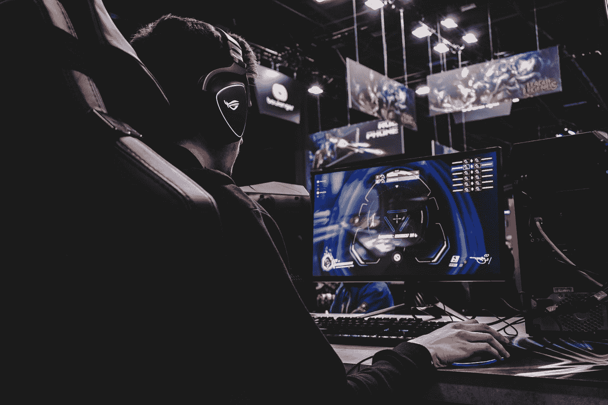

# 如何以及在哪里可以获得免费游戏

> 原文：<https://medium.datadriveninvestor.com/how-and-where-you-can-get-free-games-6e833ecb699e?source=collection_archive---------34----------------------->

近年来，游戏已经成为我们生活中如此重要的一部分，尤其是在去年，因为疫情。也正因为如此，人们购买游戏变得很难。这里我们将讨论从哪里获得免费游戏，但不是永远免费的游戏，而是在有限的时间内变得免费的游戏。

Photo by [Florian Olivo](https://unsplash.com/@florianolv?utm_source=medium&utm_medium=referral) on [Unsplash](https://unsplash.com?utm_source=medium&utm_medium=referral)

## Epic 游戏商店

堡垒之夜背后的公司在 2018 年 12 月推出了自己的发射器。据此，他们创建了一个名为“每周获得一个免费游戏”的项目直到今天，他们还在继续这样做。他们给了很多很棒的游戏，包括 GTA V，蝙蝠侠:阿卡姆合集，刺客信条辛迪加，文明 6，方舟:生存进化等等。每个星期四，你都会有新游戏，有时只有一个，有时有多个。这是获得这些游戏的最好方法之一。尽管它们可能不是最好的游戏，没有最好的画面，也不是最新的游戏，但它们仍然是好游戏，而且是免费的。

 [## 吸引我还是激怒我:游戏化将主宰世界|数据驱动的投资者

### 不要只想着游戏。想想我们整个生活世界的游戏化。网飞已经认为游戏是一个更大的…

www.datadriveninvestor.com](https://www.datadriveninvestor.com/2020/10/01/engage-me-or-enrage-me-gamification-will-run-the-world/) 

## Reddit

这可能看起来很奇怪，但我并不是说 Reddit 作为一家公司在提供免费游戏。有专门的子编辑，专门分享免费游戏；这些子条目分别是[r/免费游戏发现](https://www.reddit.com/r/FreeGameFindings/)、[r/免费游戏团队](https://www.reddit.com/r/FreeGamesOnSteam/)、[r/免费游戏交易](https://www.reddit.com/r/GameDealsFree/)。每天都有人发布暂时免费的游戏。即使他们中的大多数可能不是伟大的游戏，他们仍然是免费的，如果你喜欢他们，你可以得到他们。

## 顶级游戏

以前被称为 Twitch Prime，这在技术上不是免费的，因为你必须每月支付少量费用。但是我不能告诉你有多少次我遇到了一些人，他们不知道他们也可以通过这个订阅获得免费游戏。另外，你可以用它得到一些其他的好东西，这样它可能是值得的。

## 赠品

赠品也不太符合清单，但它们仍然算数。你可以很容易地在不同的子目录中找到它们。你可能没有机会得到它们，但你仍然可以尝试。

## 其他方式

有更多的方法可以让你得到免费游戏，其中之一就是 Humble Bundle。即使他们不经常这样做，他们有时也会放弃游戏；他们给的最后一场比赛是 8 月初的 F1 2018。另一种方法是再次使用 Reddit，在这种情况下，一个特定的 sub，也就是那里的 [r/GiftofGames](https://www.reddit.com/r/GiftofGames/) ，你可以请求人们给你游戏。有些人可能不喜欢这样，但如果你想要一个游戏，你可以试试；在那个地区，人们非常慷慨。

有很多方法可以获得免费游戏；最可靠的是史诗游戏商店游戏，因为他们是一致的。Reddit 是另一条路，因为这里提到的大多数方法都包含这个平台。通过进入我提到的潜艇，你几乎每天都可以找到新的游戏或化妆品。我还可以说，公司往往会在特殊场合赠送游戏，所以在这些时候，要小心。除此之外，享受这些方法带来的游戏吧。

## 获得专家视图— [订阅 DDI 英特尔](https://datadriveninvestor.com/ddi-intel)